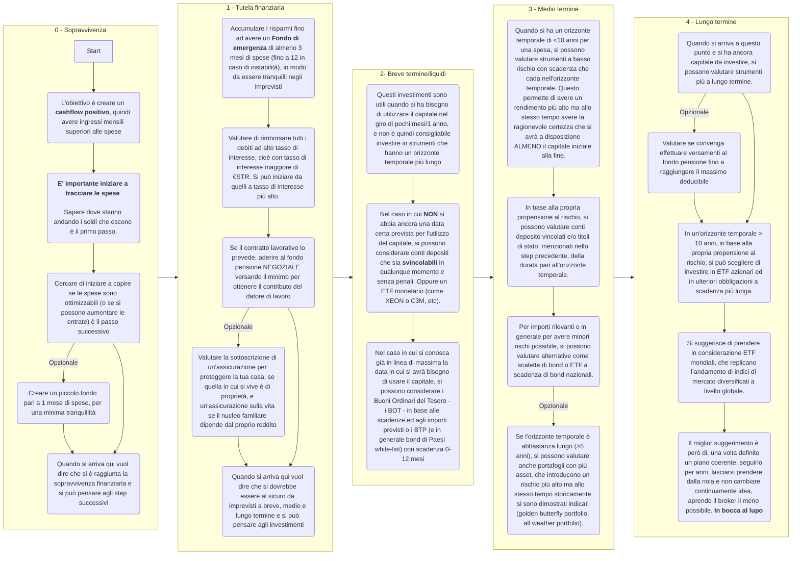

# Italia Personal Finance - Full Content

Generated on: 2026-03-11T14:36:29.751Z


--- FILE: src/data/blog/new-wiki.mdx ---

---
title: Wiki IPF Reddit
pubDate: 2023-11-15 16:42
author: 'u/emish89'
tags:
  - Wiki IPF
  - Investimenti
imgUrl: '../../assets/ipf.jpg'
description: Wiki della community italiana di Italia Personal Finance su Reddit. Informazioni e link utili per il mondo degli investimenti e della personal finance.
slug: wiki
lastReviewer: 'u/lucaosti00'
---
# Wiki di Italia Personal Finance

## Introduzione

- [Guida Base per il primo investimento](/blog/guida-primo-investimento)
- [I prodotti di investimento per piccoli risparmiatori](/blog/prodotti-di-investimento)

## Investimenti

- [Strumenti per investimenti liquidi - Fondo Emergenza](/blog/investimenti-liquidi)
- [PIC vs PAC](/blog/pic-vs-pac)
- [I Fondi comuni di investimento](/blog/fondi-comuni-investimento)
- [Gli index funds](/blog/index-funds)
- [Gli ETF](/blog/etf)
- [Le obbligazioni - wiki](/blog/obbligazioni)
- [Rapporto tassi/prezzi delle obbligazioni](/blog/tassi-e-prezzi-obbligazioni)
- [La duration delle obbligazioni](/blog/duration-obbligazioni)
- [Le criptovalute](/blog/crypto)
- [ETF Monetari](/blog/etf-monetari)
- [Le Strategie di investimento](/blog/strategie-investimento)
- [ETF a Leva](/blog/etf-a-leva)
- [Investimenti Privati](/blog/investimenti-privati)

## Finanza Personale

- [Tasse e lavoro](/blog/tasse-e-lavoro)
- [Tassazione investimenti](/blog/tassazione-investimenti)
- [Recupero minusvalenze](/blog/mini-guida-al-recupero-delle-minusvalenze)
- [I Mutui e i prestiti - Guida](/blog/mutui-prestiti)
- [Conto titoli e broker](/blog/conto-titoli-broker)
- [Come scoprire il proprio merito creditizio](/blog/referenze-creditizie)
- [Riscatto laurea agevolato](/blog/riscatto-laurea-agevolato)
- [La successione ereditaria](/blog/successione)

## Assicurazioni e Previdenza

- [Assicurazioni - Wiki](/blog/assicurazioni)
- [Fondi Pensione](/blog/fondi-pensione)

## Risorse Utili

- [Piramide dei bisogni finanziari](/blog/piramide-bisogni-finanziari)
- [Guida su acquisto casa](/blog/scegliere-casa)
- [Fare impresa in Italia](/blog/impresa-in-italia)
- [Strumenti bancari](/blog/strumenti-bancari)
- [I Buoni Fruttiferi Postali (BFP)](/blog/buoni-fruttiferi-postali)
- [La Finanza Pubblica](/blog/finanza-pubblica)
- [Consigli pratici per risparmiare](/blog/consigli-risparmio)
- [Consulenti finanziari](/blog/consulenti-finanziari)
- [Le Gestioni Patrimoniali](/blog/gestioni-patrimoniali)
- [Lista Bonus statali](/blog/lista-bonus)
- [Formule Excel utili per la personal finance](/blog/formule-utili-excel)
- [Link Utili](/blog/links-utili)
- [Libri utili alla finanza personale](/blog/libri-utili)

## Le FAQ

Su suggerimento dei nostri utenti, qui il file alle FAQ e le domande tipiche che vengono poste su questo subreddit. 
Se volete aggiungere delle domande, scrivetele nel file e cercheremo di aggiungere le risposte quanto prima!

[**LINK ALLE FAQ**](https://docs.google.com/spreadsheets/d/1zrO4wkzBpjXsJ_Pd5NwqlEfgcx9hE1uoRn7dLlUaEBA/edit#gid=0)


--- FILE: src/content/charts/flowchart.mermaid ---




--- FILE: src/data/blog/bank-investments.mdx ---

---
title: Valutazione portafogli e gestioni patrimoniali
pubDate: 2024-03-15 19:32
author: 'u/emish89'
tags:
  - Wiki IPF
  - Risorse Utili
  - Investimenti
imgUrl: '../../assets/banks.jpg'
description: Come valutare i portafogli e le gestioni patrimoniali fatte tramite banche ed assicurazioni
slug: gestioni-patrimoniali
lastReviewer: 'u/emish89'
---


# **Valutazione portafogli e gestioni patrimoniali**

## Cosa sono le gestioni patrimoniali

La “gestione patrimoniale” consiste in un mandato conferito ad un intermediario finanziario abilitato a gestire, in maniera discrezionale, 
le somme conferite investendo e disinvestendo in valori mobiliari.

Il risparmiatore affida ad una banca (o società di gestione del risparmio) il suo patrimonio affinchè questa lo gestisca.

Il funzionamento è molto simile a quello descritto nella nostra 
<a href='/blog/guida-primo-investimento'>
          <button className='brutal-btn p-4 sanchez' name='button'>
              <span>wiki per il "fai da te" </span>
              </button>
          </a>

ma tutto viene gestito da un iscritto all'albo degli intermediari finanziari e non direttamente dal risparmiatore.

<a href='/blog/consulenti-finanziari'>
       <button className='brutal-btn p-4 sanchez' name='button'>
              <span>Qui una panoramica sui consulenti finanziari</span>
              </button>
          </a>

Gli step da affrontare sono sempre quelli tipici per una gestione portafoglio:

- Definizione degli obiettivi
- Definizione del profilo di rischio
- Scelta degli strumenti finanziari e l'intermediario crea il portafoglio
- Continuo monitoraggio ed eventuali ribilanciamenti/cambi di strategia


## Qual è il guadagno di una società che fa gestioni patrimoniali?

Cercare di capire come stiano in piedi e guadagnino le società di gestione patrimoniale è molto importante per capire se è conveniente o meno affidarsi ad un intermediario.
E' fondamentale dire che ne esistono 2 tipi:

- guadagno a percentuale sul capitale investito (esempio: 1% del capitale ogni anno è il costo di gestione) o flat fee (esempio: 1000 euro all'anno)

- guadagno dato dalle commissioni sugli strumenti che vengono 'venduti' al cliente

Alcune banche stanno iniziando a considerare forme "ibride" dei 2 modelli proposti sopra, però possiamo dire che, oggi, il 95% ricade nel secondo caso.

Cosa vuol dire questo? Che i prodotti consigliati e fatti acquistare sono prodotti che danno una commissione all'intermediario che li ha venduti.

Per sapere se un intermediario prende commissioni dai prodotti venduti, è sufficiente capire se sia o meno un **CONSULENTE FINANZIARI ABILITATI OFFERTA FUORI SEDE**.

Potete controllarlo da [Albo dei Promotori Finanziari OCF](https://www.organismocf.it/portal/web/portale-ocf/ricerca-nelle-sezioni-dell-albo)


Questo è un problema? 
Non necessariamente, ma è importante che il cliente sia consapevole di questo fatto e che sia consapevole che il consulente 
potrebbe essere spinto a vendere prodotti che non sono i migliori per il cliente, ma che sono quelli che danno più commissione.

E' facile però vedere il **conflitto di interesse**, dato che il prodotto che fa "guadagnare di più" il consulente che gestisce il portafoglio 
potrebbe non essere quello che fa guadagnare di più il risparmiatore.

Come tutti i contratti la gestione del risparmio si basa sulla **fiducia**: 
il rapporto che si crea tra chi offre consulenza e gestione e chi affida a quest'ultimo i propri risparmi è di delega.


## Come valutare le gestioni patrimoniali

Una domanda leggiamo spesso è "come faccio a capire se la gestione patrimoniale che mi è stata proposta è 'buona'?".

Nella maggior parte dei casi, qualsiasi sia la banca o il gestore, se utilizzano la remunerazione a commissioni sui prodotti beh, la risposta è semplice: 
**Puoi trovare dei prodotti equivalenti che costano molto meno in commissioni, però dovresti gestire in autonomia il tuo portafoglio**.

La gestione patrimoniale è un servizio che si paga tramite i prodotti che vi verranno venduti, e di certo non saranno ETF (perchè su quelli gli intermediari non prendono commissioni).

Vi verranno proposti, a seconda della banca o società di investimento scelta:
- fondi di vario tipo con costi medi dal 1.5% al 3% annuo (circa 10 volte i costi di un ETF) con potenziali costi anche di ingresso e uscita
- polizze unit linked (che sono fondi assicurativi con costi molto alti)
- certificati, dove una cifra tra il 5 e il 10% del capitale investito va in commissioni il primo giorno di negoziazione dello strumento
- obbligazioni o azioni specifiche della banca o su cui la banca può ottenere vantaggi (esempio: azioni di una società di cui la banca è azionista)
- altri prodotti strutturati che possono avere costi molto alti

Tutto questo perchè la banca e il consulente abilitato all'offerta fuori sede si deve far 'pagare la prestazione' per la gestione, e lo fa tramite le commissioni sui prodotti che vi vende.


## Conclusioni

Non vogliamo dare l'idea che le gestioni patrimoniali siano negative, ma è importante che il cliente sia consapevole di come funzionano e che non sono gratuite.

In questa wiki ci sono molte risorse che possono aiutare a comprendere gli strumenti che le gestioni patrimoniali vi propongono e quanto "spread" sia richiesto rispetto
al fai da te. 

Ci sono anche risorse che vi aiuteranno, nel caso foste interessi, a fare da soli. Potete partire da qui:

<a href='/blog/guida-primo-investimento'>
          <button className='brutal-btn p-4 sanchez' name='button'>
              <span>Guida per il primo investimento </span>
              </button>
          </a>


--- FILE: src/data/blog/bank-terms.mdx ---

---
title: Strumenti bancari
pubDate: 2023-11-15 21:32
author: 'u/emish89'
tags:
  - Wiki IPF
  - Primi Passi
  - Risorse Utili
imgUrl: '../../assets/banks.jpg'
description: I vari strumenti finanziari. Descrizione base con link informativi
slug: strumenti-bancari
lastReviewer: 'u/emish89'
---


# **Strumenti bancari**

## Link utili a comprendere meglio gli strumenti bancari

_Per approfondimenti semplici, premete sui link_

- [Apertura di credito in Conto Corrente](http://www.quellocheconta.gov.it/it/strumenti/bancari-finanziari/apertura_di_credito_in_conto_corrente)

- [Addebito Diretto](http://www.quellocheconta.gov.it/it/strumenti/bancari-finanziari/addebito-diretto)

- [Assegno Bancario](http://www.quellocheconta.gov.it/it/strumenti/bancari-finanziari/assegno_bancario)

- [Bonifico SEPA](http://www.quellocheconta.gov.it/it/strumenti/bancari-finanziari/bonifico-SEPA)

- [Carta di credito](http://www.quellocheconta.gov.it/it/strumenti/bancari-finanziari/carta-di-credito)

- [Carta di debito](http://www.quellocheconta.gov.it/it/strumenti/bancari-finanziari/carta-di-debito)

- [Carta prepagata](http://www.quellocheconta.gov.it/it/strumenti/bancari-finanziari/carta-prepagata)

- [Cessione del quinto](http://www.quellocheconta.gov.it/it/strumenti/bancari-finanziari/cessione-del-quinto)

- [Conto corrente bancario](http://www.quellocheconta.gov.it/it/strumenti/bancari-finanziari/conto-corrente-bancario)

[Scegli quello migliore per te nel google sheet](https://docs.google.com/spreadsheets/d/12rjbcnFhTphgyWf-F5MfDZUCpZcURmJfGnHap9Rf5rU/edit#gid=0)

- [Denaro contante](http://www.quellocheconta.gov.it/it/strumenti/bancari-finanziari/denaro-contante)

- [Conto deposito a risparmio bancario](http://www.quellocheconta.gov.it/it/strumenti/bancari-finanziari/deposito-risparmio-bancario)

- [Strumenti di risparmio postale](http://www.quellocheconta.gov.it/it/strumenti/bancari-finanziari/deposito-risparmio-postale)

- [Rimessa di denaro](http://www.quellocheconta.gov.it/it/strumenti/bancari-finanziari/rimessa-di-denaro)

- [Fintech](https://www.bancaditalia.it/compiti/sispaga-mercati/fintech/index.html)


## Assegno circolare

Gli assegni circolari (in inglese cashier's checks) sono uno strumento bancario diverso dai classici libretti di assegni. 
Sono emessi direttamente dalla banca, e sono più sicuri per chi li riceve perché hanno garanzia di copertura. 
Sono comunemente usati per grosse transazioni come comprare una casa o una macchina.

### Pagare con un assegno circolare
Per emettere un assegno circolare, vai presso la banca in cui sei correntista, e comunica loro intestatario e importo. 
Al momento dell'emissione, la banca riserva immediatamente la somma necessaria scalandola dal tuo conto corrente, 
in modo che sia garantita la copertura economica (a differenza di un normale assegno bancario emesso da te con un libretto, che può essere scoperto).

Il cassiere ti consegnerà l'assegno circolare, che è un foglio di carta stampato con delle filigrane e misure di sicurezza 
per renderne difficile la falsificazione (come le banconote e gli assegni).

Alcune banche online emettono assegni circolari pur senza avere sportelli fisici, spedendoli direttamente a casa. 
In alternativa, per piccole somme, è anche possibile andare da una banca fisica di cui non sei correntista, 
consegnare loro contanti e farsi emettere un assegno circolare per lo stesso importo (meno qualche euro di commissioni).

### Incassare un assegno circolare.
Gli assegni circolari non sono trasferibili. Per incassare un assegno circolare, puoi recarti presso una filiale della tua banca, 
oppure una filiale della banca che lo ha emesso. Dovrai esibire un documento.

Quando ricevi un assegno circolare, c'è comunque il rischio che il foglio filigranato che ti viene consegnato sia un falso: 
se gli importi sono elevati, è buona norma verificarne l'autenticità chiedendo alla tua banca o a quella che ha emesso l'assegno 
(di persona o al telefono, per esempio). In particolare, la banca emittente può rilasciare una cosiddetta certificazione di bene emissione.


--- FILE: src/data/blog/bond-duration-1.mdx ---

---
title: La relazione tra i tassi e i prezzi dei bond
pubDate: 2023-12-28 18:45
author: 'u/Ab-Urbe-Condita'
tags:
  - Wiki IPF
  - Investimenti
imgUrl: '../../assets/bond-2.jpg'
description: Come cambia il rendimento di un bond al variare dei tassi? Cos'è la duration? Scopriamolo insieme
slug: tassi-e-prezzi-obbligazioni
lastReviewer: 'u/emish89'
---

# La relazione tra i tassi e i prezzi dei bond

## INTRODUZIONE
Direttamente da [qui](http://reddit.com/r/ItaliaPersonalFinance/comments/18pd37t/molti_hanno_frainteso_cosa_sia_la_duration_di_un/)


Leggo spesso sul sub discussioni sulla duration delle obbligazioni e sull’effetto che causa sulle oscillazioni di prezzo dei bond, 
soprattutto su quelli ultralunghi come i famosi Austria 2120 e 2117.

Questo post cercherà di chiarire un aspetto fondamentale sulla duration che noto che molti non hanno capito.

## COS’È LA DURATION?

La *duration* è la sensibilità di un bond rispetto al suo **RENDIMENTO**, non rispetto ai tassi della Banca Centrale.

La formula ***Variazione di prezzo bond = Duration \* Variazione tassi BCE/FED*** è quasi sempre **ERRATA**. 

Usando un esempio, dire che il bond Austria 2120 (con duration oggi 50) aumenterà di 50 di prezzo quando la BCE abbasserà i tassi dell’1% è una balla clamorosa.

Per chiarire meglio:
L’andamento del rendimento di un bond ha proprietà molto diverse a seconda se parliamo di bond a breve o a lungo termine. 

Si parla infatti di **curva dei rendimenti** per visualizzare in modo molto comodo tutti i rendimenti alle varie scadenze in un unico grafico, 
mettendo sull’asse y i rendimenti e sull’asse x le diverse scadenze \[Figura 1\]. 
La parte sinistra e destra della curva dei rendimenti sono influenzate da fattori macroeconomici molto diversi.


**PARTE SINISTRA:** è influenzata pesantemente dai tassi fissati dalla banca centrale. 
Le banche centrali fissano il tasso di interesse a cui le banche commerciali si scambiano denaro tra loro a brevissimo termine, tipicamente per un solo giorno. 
Fissando il prezzo di un prestito giornaliero, le banche centrali influenzano direttamente i rendimenti risk-free a breve e brevissimo termine. 
I bond investment grade che hanno durata tra 1 giorno e 2 anni circa hanno rendimenti pari o molto vicini al tasso fissato dalla banca centrale.

**PARTE DESTRA:** è influenzata quasi esclusivamente dalle aspettative di inflazione e crescita economica di lungo termine. 
Acquistare un bond a lungo termine assicura un cash flow per molti anni 
e deve dunque scontare quello che il mercato si aspetta in termini di inflazione e sviluppo economico. 
Le banche centrali **NON** possono manipolare questi rendimenti di lungo termine con metodi convenzionali come la variazione dei tassi. 
L'unico modo che avrebbero è acquistare/vendere volontariamente bond sul mercato per aumentare/diminuire il prezzo dei titoli 
e quindi il loro rendimento (Quantitative Easing e Quantitative Tightening).

Per calare questi concetti nella pratica, vediamo un breve riassunto degli ultimi anni di politica monetaria USA.

Prima del COVID la curva dei rendimenti aveva più o meno una pendenza positiva \[Figura 2\]. 
I rendimenti a lungo termine erano più alti di quelli a breve, una cosa intuitiva in condizioni di mercato normali: 
se blocco soldi per più tempo voglio un rendimento annuo più elevato.


Scoppiata la crisi pandemica, la Federal Reserve ha portato a zero il tasso di sconto e ha, come abbiamo ora capito, 
trascinato verso il basso i rendimenti di breve termine. 
I rendimenti di lungo termine sono scesi anch'essi per via delle aspettative di inflazione bassissime, 
per i massicci programmi di acquisto della FED (Quantitative Easing) e per la seguente recessione che ha incentivato l’acquisto di asset sicuri come i titoli di Stato.
\[Figura 3\]. 


Le politiche fiscali espansive, i tassi a zero, il risparmio privato accumulato, 
le catene di approvvigionamento distrutte e poi la crisi energetica hanno innescato nel 2021 e 2022 una veloce pressione inflazionistica. 
Le banche centrali hanno dovuto rispondere innalzando nuovamente i tassi di interesse per rallentare la domanda e la salita dei prezzi. 
Effetto? I rendimenti di breve termine sono risaliti di pari passo mentre quelli di lungo termine sono saliti un po' meno, 
causando quella che viene chiamata curva dei rendimenti piatta o addirittura invertita \[Figura 4\], in cui la parte sinistra rende di più della destra.

È in questa fase che i prezzi dei bond in dollari ed in euro, diventati elevatissimi nel 2021, sono crollati.


Ed ecco che arriviamo ad oggi.

Nella seconda metà del 2023 l'inflazione ha mostrato chiari segni di discesa e le banche centrali cominciano a discutere i piani di riduzione dei tassi, 
che se lasciati alti per troppo tempo rischierebbero di danneggiare troppo l'economia.

In questi mesi di ottimismo i mercati hanno prezzato già i primi tagli dei tassi per l’anno prossimo 
e già da qualche tempo abbiamo visto una discesa dei rendimenti sia a breve che a lungo termine. Nel 2024 e 2025, a meno di disastri improvvisi,
dovremmo avere una curva di forma più normalizzata e con una pendenza nuovamente positiva \[Figura 5\].


E nel mentre vediamo anche troppi utenti che hanno investito in bond a lungo termine che credono a una qualche relazione matematica certa 
che li farà diventare ricchi non appena Powell o Lagarde pronunceranno la frase “cut rates”.

\--> **La duration non vi darà alcuna indicazione di quanti soldi farete. 
La duration semplicemente indica quanto, a partire dal prezzo attuale, il bond guadagnerà a seguito della variazione dell’1% del SUO RENDIMENTO, 
non a seguito di dove andranno i tassi.**

## CONCLUSIONI
Riassumendo, i takeaways di questo post sono:

* I tassi di interesse della banca centrale **NON** impattano direttamente i prezzi dei bond a lungo termine.

* Non c'è alcuna formula matematica che possa prevedere quanto un bond a 20-30-100 anni guadagnerà a seguito di cosa diranno Powell e Lagarde. 

* La relazione **ΔPrezzo = Duration \* ΔTassi BC** è valida **SOLO** per i bond a brevissima scadenza. 
Questo perché, come abbiamo visto, nei bond a breve termine i tassi delle banca centrale e i rendimenti coincidono, 
quindi possiamo sostituire nella formula al posto dello Yield il tasso BCE/FED senza commettere grossi errori. Nei bond lunghi questa regola salta completamente.

* I bond a lunga scadenza sono in totale balia di quanta inflazione si aspettano gli investitori nei prossimi anni 
e per quanto a lungo dureranno le politiche restrittive delle banche centrali. 
Possiamo certamente dire che una banca centrale che abbassa i tassi lo fa perché l’inflazione sta scendendo e che quindi anche i bond lunghi ne beneficiano, 
ma sono movimenti indipendenti e non prevedibili a priori.

* I bond austriaci che tutti noi abbiamo in portafoglio sono una totale lotteria. 
Impossibile fare previsioni sui loro movimenti e anche uno starnuto sui mercati li può fare schizzare in alto o in basso di prezzo.

* La duration è solo accrocchio matematico approssimativo, utile solo per prevedere i movimenti di prezzo dei bond brevissimi. 
Con i bond a lungo termine e vi farà fare previsioni sbagliate se non la sapete usare.


Se volete leggere la mini guida sulle obbligazioni:
<a href='/blog/obbligazioni'>
    <button className='brutal-btn p-4 sanchez' name='button'>
          <span>Le obbligazioni</span>
    </button>
</a>

Se invece volete approfondire cosa sia la duration, lo trovate qui:
<a href='/blog/duration-obbligazioni'>
    <button className='brutal-btn p-4 sanchez' name='button'>
          <span>Duration delle obbligazioni</span>
    </button>
</a>

--- FILE: src/data/blog/bond-duration-2.mdx ---

---
title: La duration e la convessità delle obbligazioni
pubDate: 2023-12-28 18:52
author: 'u/Ab-Urbe-Condita'
tags:
  - Wiki IPF
  - Investimenti
imgUrl: '../../assets/bond-3.jpg'
description: Come funziona la duration di una obbligazione? La convessità? Come influenzano il prezzo? Lo scopriamo in questo articolo.
slug: duration-obbligazioni
lastReviewer: 'u/emish89'
---

# La duration delle obbligazioni

## INTRODUZIONE

Direttamente da [qui](https://www.reddit.com/r/ItaliaPersonalFinance/comments/18ql3eh/ipf_educational_la_duration_e_la_convessit%C3%A0_di_un/)


Proseguiamo la nostra serie sui bond spiegando bene come si comporta veramente il prezzo di un bond al variare del suo rendimento. 
Se vi siete persi il post di ieri dove vediamo il corretto uso della duration potete recuperarlo 
[**QUI**](https://www.reddit.com/r/ItaliaPersonalFinance/comments/18pd37t/molti_hanno_frainteso_cosa_sia_la_duration_di_un/).

Abbiamo ormai capito che il prezzo e il rendimento di un bond sono inversamente proporzionali: 
se il prezzo di un bond a tasso fisso sale vuol dire che il suo rendimento scende, e viceversa.

## Come varia realmente il prezzo di un bond al variare del suo rendimento?

Prezzo e rendimento sono due grandezze inversamente proporzionali. 
Quindi la relazione grafica tra prezzo e rendimento sarà un retta come quella sotto, corretto? \[Figura 1\]


No, la relazione tra prezzo e rendimento NON è lineare. Il comportamento di un bond è in realtà ***convesso***. 
Questo significa che il prezzo si sposta a velocità diverse a seconda della direzione del movimento del rendimento \[Figura 2\]. 
In un bond a tasso fisso, man mano che il rendimento sale il prezzo scende sempre più lentamente, 
man mano che il rendimento scende il prezzo sale sempre più velocemente.


Per aiutarci con la stima di quanto si muoverà un bond al variare del suo rendimento possiamo usare la cosiddetta *duration*. 
La duration è un numero che essenzialmente indica il tempo che il bond impiegherà a ripagare, attraverso le sue cedole, 
il capitale investito inizialmente (il principal del bond). 
La duration **inoltre indica quanto il prezzo del bond si muoverà a seguito della variazione di un punto percentuale del suo rendimento.**

La duration, fissato un certo rendimento, non è altro che la **retta tangente** alla curva di prezzo ad uno specifico rendimento. 
Per chi ha fatto almeno la quinta superiore, possiamo anche dire che la duration è la derivata prima della curva di prezzo. \[Figura 3\]

La duration è dunque una relazione che non è valida ovunque sulla curva, ma solo *localmente* per ogni specifico livello di rendimento. 
In *Figura 3* è visualizzato questo fenomeno: usando la semplice duration (la retta arancione tangente alla curva), 
notiamo che si ha una buona approssimazione della variazione di prezzo solo per piccoli movimenti del rendimento. 
Tuttavia, più ci si sposta a destra o a sinistra, più la stima data dalla duration diventa errata. 
Più precisamente, **più i rendimenti scendono più la duration sottostima la risalita di prezzo, più i rendimenti salgono più la duration sovrastima la perdita.**


La convessità di un bond ci insegna quindi che la duration ha una abilità limitata nel fare previsioni di prezzo accurate 
ed è un fattore spesso trascurato ma in alcuni casi molto impattante, come vediamo di seguito.

La convessità, infatti, causa sempre **asimmetria nel movimento del prezzo** del bond, 
traducendosi in una minore sensibilità al prezzo in caso di rendimenti al rialzo, e in una maggiore sensibilità in caso di tassi al ribasso. 
In altre parole, possiamo dire che la duration si accorcia sempre di più via via che il prezzo del bond scende. Quindi tutti i bond a tasso fisso, 
oltre un certo rendimento, raggiungono un plateau di prezzo che è tanto più resistente quanto più il rendimento sale.

Questa caratteristica è sfruttabile a proprio favore in alcuni particolari casi, come nel caso dei bond a lunghissima scadenza.

## Il crollo storico dei bond ultra lunghi

La convessità di un bond aumenta con l'aumentare della sua maturity, 
poiché i cashflow che il titolo promette sono dilazionati su un tempo più lungo 
e di conseguenza la variazione di prezzo è accentuata anche per piccoli movimenti del rendimento. 
La convessità aumenta inoltre con la diminuzione della cedola, 
poiché in un bond a cedola bassa il rimborso del capitale a scadenza pesa maggiormente sul ritorno totale 
e influenza maggiormente il movimento del prezzo del titolo a seguito di un cambio delle condizioni di mercato.

L’elevata convessità dei bond ultralunghi a cedola bassa, unita allo storico inasprimento monetario dello scorso anno, 
hanno causato perdite enormi a questi titoli. 
Uno dei casi più eclatanti è quello dei *centenari austriaci™* come *Austria 2117 2.1%* \- 
un bond sovrano centenario che ha perso il 74% dai massimi del 2020 \[*Figura 4*\].


Sempre prendendo come esempio il centenario austriaco, in *Figura 5* è mostrata la sua completa curva prezzo-rendimento 
unita al potenziale gain o perdita rispetto ai prezzi che aveva a inizio Novembre, usando livelli di rendimento fissi (da 0% a 8%). 
Notate subito come l’elevata convessità implichi un **movimento di prezzo fortemente asimmetrico**, 
marcatamente più elevato in caso di discesa del rendimento piuttosto che in una sua risalita.


Questa caratteristica è stata di grande interesse per quegli investitori che, 
alla luce di una normalizzazione dell’inflazione e della fine del generale pessimismo sui titoli a lunga scadenza, 
volevano speculare su una futura discesa dei rendimenti della parte lunga della curva. 
Un trade che ha offerto una certa protezione da ulteriori ribassi di prezzo e una sorta di “effetto leva” al rialzo.

Ora che abbiamo imparato cosa sia la convessità, la community si merita un regalo:

A questo [**LINK**](https://mega.nz/file/hZpm1BhT#tbhxataSSi5SUXkiHQgPdzT4tRAYo1kmjGu89wygDrg) 
potete scaricare un file Excel che vi permette di visualizzare la curva prezzo-rendimento e la convessità di qualsiasi bond a tasso fisso. 
È sufficiente inserire il dati essenziali del bond nel foglio Emissioni e il prezzo e la data di acquisto nel foglio Simulatore. 
Il foglio calcolerà automaticamente la curva e simulerà quanto guadagnerete/perderete a seguito di una certa variazione del rendimento.


È un file che ha origine da un simulatore di BTP dei ragazzi del Forum di Finanza Online, a cui ho aggiunto il simulatore della convessità. 
Un grazie a chi ha gentilmente offerto il foglio originale, senza il quale tutto il resto non sarebbe stato possibile.


## CONCLUSIONI

Se volete leggere la mini guida sulle obbligazioni:
<a href='/blog/obbligazioni'>
    <button className='brutal-btn p-4 sanchez' name='button'>
          <span>Le obbligazioni</span>
    </button>
</a>

Se invece volete approfondire il rapporto prezzi e tassi delle obbligazioni, lo trovate qui:
<a href='/blog/tassi-e-prezzi-obbligazioni'>
    <button className='brutal-btn p-4 sanchez' name='button'>
          <span>Tassi e prezzi delle obbligazioni</span>
    </button>
</a>


--- FILE: src/data/blog/bond.mdx ---

---
title: Mini guida alle obbligazioni
pubDate: 2023-11-20 22:37
author: 'u/Drarak0702'
tags:
  - Wiki IPF
  - Investimenti
imgUrl: '../../assets/bond.jpg'
description: Come funzionano le obbligazioni? Nella guida proviamo a spiegare il funzionamento, i calcoli, le cedole e tutti i segreti.
slug: obbligazioni
lastReviewer: 'u/emish89'
---


# **Le Obbligazioni**

## PREMESSA

Con questa mini guida cercherò di coprire il maggior numero possibile di argomenti "essenziali"; lo farò ovviamente in maniera semplificata, sia per permettere al maggior numero di persone di comprendere il più possibile, sia perché una trattazione approfondita su tutti gli argomenti collegati occuperebbe centinaia di pagine. Questo comporterà alcune *imprecisioni*, non me ne vogliate, ma non sono riuscito a fare di meglio in così poco tempo e spazio.

Se qualcuno di voi ha domande, dubbi o gradisce semplicemente qualche approfondimento, sarò ben lieto di rispondervi. In tal senso mi permetto di specificare che, essendo l'obiettivo della presente guida essenzialmente divulgativo ed educativo, non risponderò a post polemici (neanche se dovessi condividere i pensieri espressi polemicamente).

Graditi infine sono i commenti, i consigli e le critiche.

Grazie a tutti.

Qui dei link al sito della Banca d'Italia che parlano di [Obbligazioni](https://economiapertutti.bancaditalia.it/aree-tematiche/risparmio-e-investimenti/le-obbligazioni/index.html) e [Titoli di Stato](https://economiapertutti.bancaditalia.it/aree-tematiche/risparmio-e-investimenti/i-titoli-di-stato/index.html).


## COSA SONO LE OBBLIGAZIONI

Le *obbligazioni* (*bond* in inglese, *bund* in tedesco) sono *titoli di debito*, ossia qualcuno (l’emittente) le emette perché ha bisogno di soldi ed invece di contrarre un prestito con una banca o con un’istituzione preferisce, per sua convenienza o perché altrimenti impossibilitato, contrarre il debito con il pubblico.

Questo va sempre ricordato ed è il primo dato necessario alla loro valutazione.

Quando comprate un’obbligazione in emissione state prestando soldi a qualcuno.

Quando comprate un’obbligazione sul mercato sostituite qualcuno in quel prestito.

L’emittente si obbliga (da cui il nome di obbligazione appunto) a restituire il prestito entro una certa data (scadenza) e dietro una certa remunerazione (interessi); se questa remunerazione è programmata a date prefissate (ad es. ogni 3, 6 o 12 mesi) si parla di *cedole* (in inglese *coupon*), se invece il compenso è tutto alla fine si parla di *titoli zero coupon*.

Quando l’emittente è uno stato si parla di *obbligazioni governative*, quando invece l’emittente è un'azienda si parla di *obbligazioni societarie* (in inglese *corporate*); per le obbligazioni emesse da banche, ancorché societarie, in considerazione della particolare natura dell’emittente, si fa riferimento invece all’apposita categoria di *obbligazioni bancarie* (la richiesta di finanziamenti al pubblico rientra nella normale attività degli istituti di credito).

## PRINCIPALI CARATTERISTICHE

Le due principali caratteristiche di un’obbligazione, come sopra accennato, sono la *durata*, indicata dalla scadenza, ed il *tasso*.

La prima indica quando l’emittente si impegna a restituire i soldi a chi gliel’ha prestati ed il secondo quanto intende pagare a chi si assume il rischio di prestargli i soldi.

La durata può essere cortissima (ad es. BOT a 3 mesi) o lunghissima (30 o 40 anni ad es.) o addirittura indeterminata (vedi sotto obbligazioni perpetue).

Il tasso, che di solito è lo strumento usato per la remunerazione del rischio, può essere il più disparato, si determina all’inizio e quello rimane per la durata del titolo; ecco i principali tipi di tasso:

- **tasso fisso** – un semplice valore percentuale (ad es. 2%, 0,65% o 8,5%, ecc.)

- **tasso variabile** – si decide all’inizio come determinarlo e poi si applica la formula alla varie date di stacco cedola; il riferimento su cui calcolarla prende il nome di *sottostante*, l’aggiunta di valore espressa in termini di “un tot in più” rispetto al sottostante prende invece il nome di *spread* (ad es. tasso EURIBOR a 6 mesi più uno spread del 2% oppure altro tasso variabile potrebbe essere la differenza positiva dell’andamento di un’azione tra due date o l’inflazione senza tabacco, ecc.)

- **tasso misto** – una qualsiasi formula che preveda l’utilizzo del tasso fisso e del tasso variabile (ad es. primi due anni tasso fisso al 3% dal terzo al quinto l’EURIBOR 12 mesi + 3%)

- **step up/step down** - tassi fissi che cambiano con un sistema a gradini crescenti/decrescenti per la durata del titolo (ad es. 2% i primi due anni, 3% per il terzo ed il quarto anno, 4% per il quinto ed il sesto anno)

- **zero coupon** - come detto non vi è una cedola, ma una remunerazione alla scadenza data dalla differenza tra il prezzo di rimborso, di solito pari al nominale (o semplicemente “alla pari”), e il prezzo di acquisto, di solito sotto la pari, ossia sotto il valore nominale (ad es. compro uno Zero Coupon di nominali 10.000 euro con scadenza 20/05/2020 e lo pago 97,35 ossia esborso 9.735 euro più spese alla fine fra 3 anni incasserò 10.000 meno le tasse)

## PRINCIPALI RISCHI

È importante capire che non esistono, e non possono esistere, obbligazioni prive di rischio. Il rischio massimo è il default dell'emittente con la perdita totale del capitale, ma esistono dinamiche che possono erodere il capitale investito anche qualora il titolo venga regolarmente rimborsato.

È altrettanto importante conoscere e imparare a valutare i rischi per capire quali siamo disposti a sopportare e quali no, ed in via marginale per capire se un’obbligazione è davvero interessante.

Generalmente più alto è il rischio, più alta è la remunerazione (che il mercato pretende); e qualsiasi rischio, anche se in misure diverse, influisce sulla generazione del prezzo.

Attenzione che i rischi non sono statici, ma dinamici (ad es. l’Italia ha peggiorato il proprio rischio emittente negli ultimi anni), per cui il primo fattore di rischio di un’obbligazione è la sua durata: più lunga è più sono esposto ad incognite ed a possibili cambiamenti negativi, quindi a parità di altre condizioni, maggiore è la durata, maggiore sarà la remunerazione.

Altro rischio importante è il rischio emittente; come abbiamo detto prima, quando compriamo un’obbligazione stiamo prestando soldi; le domande che dobbiamo farci sono “A chi sto prestando soldi? Sarà in grado di restituirmeli?”. L’Italia è considerata più rischiosa della Germania, per cui a parità di condizioni di emissione, l’Italia dovrà offrire un rendimento più alto.

Come faccio a capire la qualità di un emittente? Posso avvalermi del cosiddetto *rating*, ossia una vera e propria valutazione che società specifiche fanno ad ogni emittente (il rating va chiesto dietro compenso).

Poi ci sono tutta una serie di rischi, alcuni ovvi e altri meno, che di solito non vengono presi in considerazione da chi compra obbligazioni perché le considera un prodotto sicuro; vi faccio un breve elenco dei principali di essi (ma ve ne sono tanti altri anche se di solito minori):

- **rischio di cambio o rischio valuta** – se l’obbligazione è emessa in valuta diversa dall’euro (in terminologia finanziaria si dice ”denominata” ad es. denominata in euro o denominata in dollari) vi è l’ovvio rischio di vedersi mangiati la remunerazione e il capitale a scadenza da un rapporto sfavorevole di cambio (può essere anche un’opportunità di guadagno maggiore, ma va considerato come un rischio, soprattutto nel lungo periodo) ad es. compro un’obbligazione in dollari tasso fisso 2% col cambio euro dollaro 1/1 e la pago 9.500 euro (9.500 dollari), dopo tre anni c’è il rimborso del capitale, ma il dollaro si è deprezzato ed il cambio è sceso a 0.8 euro per dollaro, l’obbligazione rimborsa 10.000 dollari che vengono trasformati in 8.000 euro con una notevole perdita in conto capitale che si è mangiata anche il flusso cedolare!

- **rischio di tasso o rischio di interesse** – è il rischio a cui ci si espone comprando un tasso oggi che potrebbe non essere più considerato sufficientemente remunerativo nel futuro causando un conseguente deprezzamento del valore del mio titolo nel tempo. Ad es. poniamo che oggi il BTP a 10 anni paga l’1% e a 5 anni lo 0,5%, decido di sottoscrivere un bel BTP a 10 e diciamo che lo pago 100, fra 5 anni ho bisogno di soldi e decido di vendere il titolo, guardo le condizioni di mercato e vedo che il BTP a 5 anni (la durata residua del mio titolo) paga adesso il 3%. Chi mai potrà essere interessato a comprare il mio che paga l’1%? Nessuno! A meno che io non aggiusti il prezzo, rendendolo ugualmente conveniente, devo cioè offrire io ai compratori il rendimento mancante abbassando il prezzo, e quindi lo vendo a 92, perdendo un bel 8% in conto capitale; facendo un conto _della serva_ (guardando solo i flussi di cassa, senza i relativi tassi di sconto): ho incassato 5 cedole da 1% per cui in totale perdo un bel 3% ( -100 + 5*1 +92 = -3 ).

Nello specifico più è lungo il titolo, più questo rischio può avere effetti dirompenti (si parla di volatilità del titolo, più è alta maggiore saranno le oscillazioni del prezzo).

Da notare che anche il tasso variabile risente, anche se in misura più contenuta, di questo effetto; faccio un esempio: adesso un tasso variabile paga EUR6 mesi + 1 di spread, fra 5 anni il mercato sarà con il variabile EUR6 mesi +3 di spread; chi lo vuole il mio +1 di spread? Nessuno! Devo abbassare il prezzo!

- **rischio di liquidità** – il rischio che sul mercato non ci sia richiesta di scambio ad una particolare data per il titolo da me posseduto e che ho necessità di vendere. Questo può comportare notevoli abbassamenti di prezzo per invogliare qualcuno ad acquistare.

Specialmente sul MOT (Mercato Obbligazionario Telematico), un BTP avrà sempre più scambi di un'obbligazione societaria, se voglio vendere 100.000 euro di BTP sarà più probabile che io ci riesca piuttosto che se provassi a vendere 100.000 euro di un’obbligazione della società ScarpeVecchie SpA.

## PREZZO E RENDIMENTO

Il prezzo viene determinato dal mercato. In parole semplici significa che il mercato (l’insieme dei vari operatori che lavorano con strumenti finanziari sui vari mercati regolamentati) automaticamente e quasi istantaneamente aggiusta i prezzi delle obbligazioni (e dei prodotti in generale) rendendoli allineati al loro rapporto di rischio attuale / rendimento attuale.

Non cercate l’obbligazione magica che qualcuno non ha visto e che vi fa guadagnare il 3% quando tutte le altre simili fanno guadagnare il 2%! Se ci fosse sarebbe già stata oggetto di scambi ed il prezzo si sarebbe allineato a quello delle altre. Se trovate un’obbligazione che secondo voi paga più delle sue simili, vuol dire semplicemente che la state confrontando con obbligazioni sbagliate e che ha un rischio maggiore di quello che pensate, dovuto forse a qualcosa che voi probabilmente non sapete!

Detto questo il prezzo è determinato da tre fattori: durata, remunerazione e rischi.

- **durata** – considerando che sto prestando soldi, è più rischioso prestarli a breve termine o a lungo termine? Ovviamente a lungo; ho meno possibilità infatti di prevedere eventuali cambiamenti negativi in capo all’emittente e cioè a chi mi dovrà pagare. La società BenzinaBio SpA adesso è solida e potenzialmente in grado di rimborsare i 3 milioni di euro di prestito obbligazionario che ha emesso due anni fa. Ma fra 8 anni? Ci sarà ancora bisogno di benzina? Ci sarà ancora questa società?

- **remunerazione**  - se il mercato paga il 2% sui BTP a 10 anni e io ne voglio vendere uno con cedola del 4% il suo prezzo sarà di sicuro sopra la pari perché sto offrendo molto più del mercato e posso chiedere un extra prezzo fino ad offrire un rendimento finale del 2% (in realtà, ma è un po’ complicato, posso addirittura offrire un rendimento finale minore del 2%!). Così a naso direi che potrei vendere la mia obbligazione a un po’ più di 120.

- **rischio** - un’obbligazione di un emittente rischioso avrà un prezzo minore di una pari condizioni di un emittente meno rischioso; a parità di rendimento perché mai dovrei volere il titolo più rischioso? Potrei farci un pensierino se il prezzo fosse migliore (e cioè quindi se il rendimento finale fosse maggiore).

Vi è infine un ultimo elemento che determina quanto effettivamente pago un titolo obbligazionario.

Il prezzo che vediamo online sui vari book del nostro titolo è il prezzo di mercato, cosiddetto *corso secco*, ossia è quello che viene usato come base per i calcoli. Ma vi faccio un esempio, diciamo che io ho un titolo che paga cedola del 5% il 30 giugno e che devo venderlo e che oggi è il 30 maggio. Chi incassa la cedola? Il detentore del titolo al momento dello stacco. Cioè se vendo oggi perdo la cedola! Ma non è giusto! Il Titolo e quindi il rischio li ho tenuti io per quasi tutto l’anno! Allora mi faccio pagare dal compratore la quota (rateo) di 11 mesi della cedola. Se sommo al corso secco il rateo della cedola che mi spetta, ottengo il *tel quel*; questo è il prezzo effettivo di scambio; quindi fate attenzione! Se volete comprare un’obbligazione sappiate che oltre al prezzo che vedete (corso secco) dovrete pagare al venditore la sua quota di cedola! Contrariamente se lo vendete avete diritto come detto a portare a casa la vostra quota di cedola.

*N.B. tutti i ratei (cedola, di tassazione, ecc.) vengono calcolati sui giorni effettivi e non a mesi come nel mio esempio!*

## TASSAZIONE
<a href='/blog/tassazione-investimenti'>
    <button className='brutal-btn p-4 sanchez' name='button'>
          <span>Tassazione Investimenti</span>
    </button>
</a>
Qua un breve recap specifico per le obbligazioni:

Innanzitutto ci sono quattro cose principali da sapere, come detto io semplificherò al massimo:

1. **Tassazione sui redditi da capitali**: è la tassazione, effettuata di solito in automatico dall’emittente, che vi paga quindi il netto, sui guadagni derivanti dal fatto che avete investito in quella specifica obbligazione e ne ricevete i frutti (cedole, differenza tra acquisto e rimborso – N.B. rimborso, cioè a scadenza). Non concorre alla compensazione fra minus e plus.

2. **Tassazione sulle rendite finanziarie (c.d. capital gain)**: è la tassazione effettuata di solito per vostro conto (addebitandovi il conto per capirci) dalla banca depositaria sui guadagni derivanti da operazioni di acquisto e vendita di titoli (N.B. vendita e quindi prima della scadenza). Questa concorre alla compensazione fra minus e plus.

3. **Tassazione ordinaria al 26%**: colpisce tutti i guadagni, sia da capitali che finanziari, a meno che il titolo non sia a tassazione agevolata.

4. **Tassazione agevolata al 12,50%**: colpisce tutti i guadagni, sia da capitali che finanziari, derivanti da titoli di stato, sovranazionali, “white list” e altri speciali. Attenzione che in realtà non è al 12,50% ma al 26% su una quota pari al 48,08% dell’ “imponibile” (mi si passi il termine). Questo è importante per riuscire ad incrociare le minus e le plus fra tassazione ordinaria e agevolata.

Detto questo, su cosa pago le tasse? Semplicemente su tutto quello che effettivamente guadagno.

Faccio un esempio:

- Compro nominali 10.000 euro di un BTP in emissione a 97, questo titolo paga cedola del 3% annua e dura 4 anni, lo vendo dopo 3 anni a 101. Io detengo inoltre una minus di 100 euro.

Quali e quante tasse pago?

- In emissione non pago tasse (attenzione che in fase di acquisto potrei pagare ratei di tasse!) e di solito non ho spese, ma giusto per il calcolo diciamo che invece pago lo 0,5 di commissioni, per cui pago 10.000 * 97% + 10.000 * 0,5% = 9.700 + 50 = 9.750 euro (il mio prezzo di carico fiscale sarà 97,5 e non 97!)

- Le cedole mi arrivano nette sul nominale di 10.000 euro, quindi incasso 10.000 * 3% = 300 euro da cui togliere il 12,5% di tasse per cui ricevo netti 262,50 euro all’anno. Le tasse sono applicate alla fonte e non posso compensare con la mia minus.

- Alla vendita però genero una rendita finanziaria, per cui posso compensare; vendo a 101 e diciamo che ho sempre 0.5% di spese, incasso quindi 10.000 * 101% - 10.000 * 0.5% = 10.100 – 50 = 10.050 euro.

- Pago le tasse su 50 euro di guadagno sui 10.000? No! Perché il mio vero guadagno è 10.050 (quello che incasso) – 9.750 (quello che ho pagato) ossia 300 euro.

- Ma io ho una minus di 100 euro, posso compensarla? Sì, ma come? Io devo pagare, come accennato sopra, non il 12.50% sui 300 ma il 26% sul 48.08% di questi 300, ossia devo pagare il 26% su 144,24, ora scalo da questi la mia minus di 100 e ottengo che devo pagare il 26% su 44,24 euro ossia la banca mi addebiterà in conto 10,50 euro di tasse.

Attenzione, non è proprio così, ma spero il discorso sia stato chiaro.

Ma perché non è così? Non è così perché ad esempio (non esaustivo) non vi ho parlato del disaggio (con due G! Non è un errore).
Cos’è il disaggio? E’ la differenza dalla pari che l’emittente offre a vantaggio del compratore per invogliarlo a comprare il titolo (il contrario è l’aggio). Ossia emetto il titolo sotto la pari (ad es. 95 o 98) e/o lo rimborso sopra la pari (ad es. 105 o 110).

Questa differenza si traduce in un maggior guadagno per l’acquirente rispetto al solo flusso cedolare.

La particolarità del disaggio è che lo paga tutto chi riceve il rimborso del titolo a scadenza.

Ma perché mai chi incassa il rimborso deve pagare le tasse per tutti quelli che si sono nel frattempo scambiati il titolo e che hanno beneficiato in termini di prezzi del disaggio? E infatti è vero sì che l’ultimo paga per tutti ma in fase di compravendite precedenti ognuno ha pagato in termini di prezzo la propria quota (rateo) del disaggio.

Quindi attenzione, la compravendita di un titolo con un forte disaggio potrebbe tradursi in un prezzo maggiore o minore di quello che si pensava.

## TIPOLOGIE VARIE

In realtà non vi è limite alla tipologia di obbligazioni, purché specificato e quindi purché il compratore sia a conoscenza dei termini, tutto è accettabile (se mi sentissero alla Consob mi fucilerebbero! … e a ragione!).

Potrei emettere un obbligazione del genere: la emetto a 102 durata 5 anni con rimborso a 98, ogni anno pago le seguenti “cedole”: al primo il controvalore di un grammo d’oro ogni 1.000 euro, al secondo il controvalore di 2 azioni della società BucoNero SpA ogni 1.000 euro, al terzo la variazione positiva tra la data di stacco cedola e la data di stacco cedola precedente dell’indice IRS a 20 diminuito del EUR 6 mesi + il 30% dell’ inflazione, al quarto TF 2% e all’ultimo una percentuale se positiva della variazione del dollaro sull’euro con un max del 3%. Un bel po’ complicata! (Questa sicuramente non otterrebbe mai le autorizzazioni alla vendita al pubblico).

Capite allora quanto sia importante conoscere bene oltre all’emittente anche il prodotto ed infatti oltre al ben più noto rating emittente esiste un rating specifico per ogni singola obbligazione (non per tutte, va richiesto e a pagamento, quindi alcuni enti per risparmiare non lo chiedono).

In ogni caso cercherò di illustrarvi, fra le obbligazioni più “esotiche”, quelle più frequenti.

**Perpetue** – le obbligazioni perpetue (anche dette vitalizie) sono obbligazioni che non prevedono una data di scadenza (l’emittente spesso si riserva la facoltà di rimborsare a suo piacere – vedi callable dopo) e pagano un flusso cedolare di solito abbastanza alto; sono strumenti non adatti all’investimento ed infatti molte banche non permettono ai loro clienti di acquistarle.

**Callable** – sono obbligazioni dove l’emittente si riserva di chiudere il titolo anticipatamente (call) rispetto alla scadenza naturale. Un esempio se le obbligazioni variabili sono legate ad indici di borsa (il primo anno se l’indice è positivo ti pago il 2% e chiudo l’obbligazione , se negativo non ti pago e va avanti, il secondo anno se positivo ti do il 4% e chiudo altrimenti vado avanti, e così via)

**Subordinate** – le famigerate obbligazioni subordinate sono in realtà strumenti finanziari molto interessanti (come detto sopra l’importante è capire se si è disposti a sopportare il rischio). Cosa sono le subordinate? In caso di fallimento dell’emittente, i detentori di obbligazioni “normali” hanno diritto in via prioritaria ad ottenere soldi dalla procedura di fallimento (difficilmente vedranno tutti i soldi ma verosimilmente ne riceveranno una buona parte); gli azionisti invece non ricevono un bel nulla; i detentori delle obbligazioni subordinate, a fronte di interessi maggiori, si pongono al fondo della lista di quelli che devono ricevere soldi, giusto prima degli azionisti e verosimilmente non vedranno nulla. Quindi il rischio della subordinata è: se l’emittente fallisce non vedo niente. Ora se la società SoldiAPalate SpA ha un bisogno improvviso di liquidità e non ha tempo di star li a spiegare come e cosa e perché, emette un prestito obbligazionario subordinato, invogliando così col maggior tasso i compratori a finanziarla. Se io compratore valuto che difficilmente la società SoldiAPalate fallirà entro la scadenza del titolo, beh allora l’obbligazione subordinata mi potrebbe anche piacere. (ATTENZIONE: non prendetelo assolutamente come un consiglio all’acquisto di obbligazioni subordinate, che sono e rimangono comunque prodotti rischiosi!).

## NOTE, COMMENTI ED ALTRO

- Le obbligazioni le ho sentite chiamare titoli di credito; anche se tecnicamente vero perché il possessore di un’obbligazione vanta un credito, questa definizione distoglie dalla vera natura dell’obbligazione: è l’emittente che ha bisogno di soldi, non il compratore che ha necessità di prestarli. La cosa sembra una sottigliezza ma è invece un aspetto fondamentale di questo tipo di titoli. Siamo noi che dobbiamo chiederci perché ha bisogno di soldi e come farà a pagarci.

- Lo spread a cui ho accennato sopra in teoria può essere anche negativo. Poi visto che siamo in argomento “spread”, lo spread di cui si è tanto sentito parlare nei mesi passati (e di cui si sentirà di nuovo parlare fra qualche mese secondo me) era lo spread inteso come differenziale fra rendimenti pari periodo (nello specifico 10 anni) fra il bund e il nostro BTP. Lo stato che paga di più è più rischioso e la Germania è considerato lo stato europeo più virtuoso, quindi per sapere quanto è rischiosa l’Italia un buon indice (ma spesso fallace) è appunto lo spread fra i titoli di debito.

- Interessi semplici ed interessi composti. La faccio semplice. Gli interessi semplici sono le cedole: ogni x mesi ti do y. Dieci anni di interessi semplici al 2% su 10.000 euro mi danno 12.000 euro totali. Gli interessi composti invece si calcolano come interessi su interessi. Dieci anni di interessi composti al 2% su 10.000 euro mi danno 12.190 euro.

- Titoli non quotati – attenzione ai titoli non quotati sui mercati regolamentati. Alcune banche o alcuni stati emettono titoli e non li quotano sui mercati. Ad esempio piccole banche locali o obbligazioni per istituzionali. A volte possono sembrare molto vantaggiosi, il problema è che non essendo quotati, la vendita in caso di necessità potrebbe essere molto svantaggiosa o addirittura impossibile.

- Attenzione, gli stati non falliscono, quindi niente procedura fallimentare. Un default su uno stato è una cosa molto più fastidiosa da subire.

## CONCLUSIONI

Se volete approfondire il legame tra tassi di interesse e prezzi delle obbligazioni:
<a href='/blog/tassi-e-prezzi-obbligazioni'>
    <button className='brutal-btn p-4 sanchez' name='button'>
          <span>Tassi e prezzi delle obbligazioni</span>
    </button>
</a>

Se invece volete approfondire cosa sia la duration, lo trovate qui:
<a href='/blog/duration-obbligazioni'>
    <button className='brutal-btn p-4 sanchez' name='button'>
          <span>Duration delle obbligazioni</span>
    </button>
</a>


--- FILE: src/data/blog/bonus-list.mdx ---

---
title: Lista Bonus statali
pubDate: 2023-11-17 21:10
author: 'u/emish89'
tags:
  - Wiki IPF
  - Tasse & Fisco
  - Risorse Utili
imgUrl: '../../assets/bonus.jpg'
description: Lista dei vari bonus statali. Tutto ciò a cui i cittadini possono accedere in termini di agevolazioni dallo Stato. 
slug: lista-bonus
lastReviewer: 'u/emish89'
---


# **Lista bonus**

**[Pagina ufficiale bonus ](https://www.agenziaentrate.gov.it/portale/web/guest/cittadini/agevolazioni)**


## Acquisto prima casa
L’agevolazione per l’acquisto della “prima casa” consente di pagare imposte ridotte sull’atto di acquisto di un’abitazione in presenza di determinate condizioni.

Chi acquista da un privato (o da un’azienda che vende in esenzione Iva) deve versare un’imposta di registro del 2%, anziché del 9%, sul valore catastale dell’immobile, mentre le imposte ipotecaria e catastale si versano ognuna nella misura fissa di 50 euro.

Se invece il venditore è un’impresa con vendita soggetta a Iva, l’acquirente dovrà versare l’imposta sul valore aggiunto, calcolata sul prezzo della cessione, pari al 4% anziché al 10%. In questo caso le imposte di registro, catastale e ipotecaria si pagano nella misura fissa di 200 euro ciascuna.

In ogni caso, l’imposta di registro proporzionale (2%) non può essere di importo inferiore a 1.000 euro. Tuttavia, l’importo effettivamente da versare potrebbe risultare inferiore per effetto dello scomputo dell’imposta proporzionale già versata sulla caparra (quando è stato registrato il contratto preliminare) o per effetto del credito d’imposta per l’acquisto della “prima casa”.

## Acquisto prima casa under 36
Per i giovani con meno di 36 anni, e con un valore dell’Isee (indicatore della situazione economica equivalente) non superiore a 40mila euro annui, il Decreto Sostegni bis ha previsto una nuova agevolazione per l’acquisto della prima casa: l’esenzione dall’imposta di registro, ipotecaria e catastale. In caso di acquisto soggetto a Iva, è riconosciuto anche un credito d’imposta di ammontare pari al tributo corrisposto in relazione all’acquisto. È prevista, inoltre, l’esenzione dall’imposta sostitutiva per i finanziamenti erogati per l’acquisto, la costruzione e la ristrutturazione di immobili ad uso abitativo.

Queste agevolazioni si applicano agli atti stipulati tra il 26 maggio 2021 e il 31 dicembre 2023. La legge di bilancio 2023, infatti, ha prorogato di un anno l'agevolazione prevista dal decreto “Sostegni bis”.

## Agevolazioni per persone con disabilità
Per le persone con disabilità e i loro familiari sono previste numerose agevolazioni fiscali.

Tra queste, quelle relative all’acquisto di veicoli, la detrazione delle spese sostenute per gli addetti all’assistenza o per l’eliminazione delle barriere architettoniche, le agevolazioni per i non vedenti e per i sordi, quelle sugli acquisti degli ausili tecnici e informatici.

Per approfondire consulta la Guida alle agevolazioni fiscali per persone con disabilità

## Assegno unico e universale (AUU)
L’Assegno Unico e Universale (AUU) per i figli, istituito dal decreto legislativo n. 230 del 21 dicembre 2021, a decorrere dal 1° marzo 2022:

è una prestazione erogata mensilmente dall’INPS a tutti i nuclei familiari per ogni figlio minorenne a carico e, in presenza di determinati requisiti, per ciascun figlio maggiorenne a carico fino al compimento dei 21 anni. Inoltre, è riconosciuto anche per ogni figlio a carico con disabilità, senza limiti di età;
spetta a tutti i nuclei familiari indipendentemente dalla condizione lavorativa dei genitori (non occupati, disoccupati, percettori di reddito di cittadinanza, lavoratori dipendenti, lavoratori autonomi e pensionati) e senza limiti di reddito;
ha un importo commisurato all’ISEE; tuttavia nel caso in cui non si volesse presentare un ISEE, è comunque possibile fare domanda e ottenere l’importo minimo per ciascun figlio.
La legge di bilancio 2023, articolo 1, commi 357 e 358, ha incrementato del 50% gli importi vigenti per ciascun figlio di età inferiore a un anno e per ciascun figlio fino ai tre anni purché, in quest'ultimo caso, appartenente a nuclei familiari con tre o più figli e con ISEE non superiore a 40mila euro. Incrementata del 50% anche la maggiorazione forfetaria per i nuclei familiari in cui sono presenti quattro o più figli, che passa quindi da 100 a 150 euro. Vanno a regime, inoltre, le disposizioni particolari per i figli con disabilità che la norma originaria limitava all'anno 2022.

## Bonus acqua potabile
Per razionalizzare l’uso dell’acqua e ridurre il consumo di contenitori di plastica, è previsto un credito d'imposta del 50% delle spese sostenute per l'acquisto e l'installazione di sistemi di

filtraggio
mineralizzazione
raffreddamento e/o addizione di anidride carbonica alimentare
finalizzati al miglioramento qualitativo delle acque per il consumo umano erogate da acquedotti.

L’importo massimo delle spese su cui calcolare l’agevolazione è fissato a

1.000 euro per ciascun immobile, per le persone fisiche
5.000 euro per ogni immobile adibito all’attività commerciale o istituzionale, per gli esercenti attività d’impresa, arti e professioni e gli enti non commerciali.
Le informazioni sugli interventi andranno trasmesse in via telematica all’Enea, con tempi e modalità che saranno indicate sul sito internet dell’Enea

La Legge di Bilancio 2022 ha prorogato al 2023 questa agevolazione inizialmente introdotta per il biennio 2021-2022.

## Bonus decoder “a casa”
Fino al 31 dicembre 2023 i cittadini di età pari o superiore ai settanta anni, titolari di un trattamento pensionistico non superiore a 20 mila euro annui, possono richiedere la consegna gratuita, direttamente a casa, di un decoder di nuova generazione (c.d. bonus decoder “a casa”).

Non possono beneficiare dell’agevolazione i cittadini che abbiano già fruito del bonus tv-decoder. L’agevolazione è invece cumulabile con il bonus rottamazione tv.

Per maggiori informazioni è possibile consultare il sito internet, dedicato alla nuova tv digitale, del Ministero delle Imprese e del Made in Italy.

## Bonus facciate
L'agevolazione consiste in una detrazione d’imposta, da ripartire in 10 quote annuali costanti, pari al 90% delle spese sostenute nel 2020 e nel 2021, e del 60% delle spese sostenute nel 2022, per interventi finalizzati al recupero o restauro della facciata esterna degli edifici esistenti ubicati in determinate zone.

La Legge di Bilancio 2022, infatti, ha esteso questa detrazione fino al 31 dicembre 2022, con aliquota ridotta al 60 per cento.

Sono ammessi al beneficio gli interventi:

di sola pulitura o tinteggiatura esterna sulle strutture opache della facciata,
su balconi ornamenti e fregi, inclusi quelli di sola pulitura o tinteggiatura
sulle strutture opache verticali della facciata influenti dal punto di vista termico o che interessino oltre il 10% dell’intonaco della superficie disperdente lorda complessiva dell’edificio.
Il bonus facciate non spetta, invece, per gli interventi effettuati durante la fase di costruzione dell’immobile e per quelli realizzati mediante demolizione e ricostruzione (compresi gli interventi che rientrano nella categoria degli interventi di “ristrutturazione edilizia”).

Condizione importante è che gli immobili si trovino nelle zone A e B (indicate nel decreto ministeriale n. 1444/1968) o in zone a queste assimilabili in base alla normativa regionale e ai regolamenti edilizi comunali.

I lavori di rifacimento della facciata, non di sola pulitura o tinteggiatura esterna, che influiscono dal punto di vista termico o interessano oltre il 10% dell’intonaco della superficie disperdente lorda complessiva dell’edificio, devono soddisfare i “requisiti minimi” previsti dal decreto Mise 26 giugno 2015 (“Linee guida nazionali per la certificazione energetica degli edifici”) e rispettare i valori di trasmittanza termica.

Per gli altri adempimenti si applicano le disposizioni del decreto Mef n. 41/1998, ossia il regolamento in materia di detrazioni per le spese di ristrutturazione edilizia.

## Bonus mobili
Si può usufruire di una detrazione Irpef del 50% per l'acquisto di mobili e di grandi elettrodomestici di classe non inferiore classe A per i forni, alla classe E per le lavatrici, le lavasciugatrici e le lavastoviglie, alla classe F per i frigoriferi e i congelatori destinati ad arredare un immobile oggetto di ristrutturazione. L'agevolazione spetta per gli acquisti effettuati entro il 31 dicembre 2024 e può essere richiesta solo da chi realizza un intervento di ristrutturazione edilizia iniziato a partire dal 1° gennaio dell’anno precedente a quello dell’acquisto dei beni.

La detrazione va ripartita tra gli aventi diritto in 10 quote annuali di pari importo ed è calcolata su un ammontare complessivo non superiore a 8.000 euro per l’anno 2023 e a 5.000 euro per il 2024. Per il 2021 il tetto di spesa su cui calcolare la detrazione era pari a 16.000 euro, mentre per l’anno 2022 era pari a 10.000 euro.

Per usufruire dell’agevolazione è necessario che la data di inizio lavori sia anteriore a quella in cui sono sostenute le spese per l’acquisto di mobili e di grandi elettrodomestici. La data di avvio potrà essere provata dalle eventuali abilitazioni amministrative o comunicazioni richieste dalle norme edilizie, dalla comunicazione preventiva all’Asl (indicante la data di inizio dei lavori), se obbligatoria, oppure, per lavori per i quali non siano necessarie comunicazioni o titoli abitativi, da una dichiarazione sostitutiva di atto di notorietà (articolo 47 del Dpr 445/2000), come prescritto dal provvedimento del direttore dell’Agenzia delle Entrate del 2 novembre 2011. - pdf

Il contribuente che esegue lavori di ristrutturazione su più unità immobiliari avrà diritto al beneficio più volte. L’importo massimo di spesa va, infatti, riferito a ciascuna unità abitativa oggetto di ristrutturazione.

Per quali acquisti
La detrazione spetta per l’acquisto di

mobili nuovi
grandi elettrodomestici nuovi di classe energetica non inferiore classe A per i forni, alla classe E per le lavatrici, le lavasciugatrici e le lavastoviglie, alla classe F per i frigoriferi e i congelatori, per le apparecchiature per le quali sia prevista l’etichetta energetica.
A titolo esemplificativo, rientrano tra i mobili agevolabili letti, armadi, cassettiere, librerie, scrivanie, tavoli, sedie, comodini, divani, poltrone, credenze, nonché i materassi e gli apparecchi di illuminazione che costituiscono un necessario completamento dell’arredo dell’immobile oggetto di ristrutturazione.

Non sono agevolabili, invece, gli acquisti di porte, di pavimentazioni (per esempio, il parquet), di tende e tendaggi, nonché di altri complementi di arredo.

Per quel che riguarda i grandi elettrodomestici, la norma limita il beneficio all’acquisto delle tipologie dotate di etichetta energetica di classe , non inferiore alla classe A per i forni, alla classe E per le lavatrici, le lavasciugatrici e le lavastoviglie, alla classe F per i frigoriferi e i congelatori, se per quelle tipologie è obbligatoria l’etichetta energetica. L’acquisto di grandi elettrodomestici sprovvisti di etichetta energetica è agevolabile solo se per quella tipologia non sia ancora previsto l’obbligo di etichetta energetica. Rientrano, per esempio, fra i grandi elettrodomestici: frigoriferi, congelatori, lavatrici, lavasciuga, asciugatrici, lavastoviglie, apparecchi di cottura, stufe elettriche, piastre riscaldanti elettriche, forni a microonde, apparecchi elettrici di riscaldamento, radiatori elettrici, ventilatori elettrici, apparecchi per il condizionamento.

Nell’importo delle spese sostenute per l’acquisto di mobili e grandi elettrodomestici possono essere considerate anche le spese di trasporto e di montaggio dei beni acquistati, purché le spese stesse siano state sostenute con le modalità di pagamento richieste per fruire della detrazione (bonifico, carte di credito o di debito).

La realizzazione di lavori di ristrutturazione sulle parti comuni condominiali consente ai singoli condòmini (che usufruiscono pro quota della relativa detrazione) di detrarre le spese sostenute per acquistare gli arredi delle parti comuni, come guardiole oppure l’appartamento del portiere, ma non consente loro di detrarre le spese per l’acquisto di mobili e grandi elettrodomestici per la propria unità immobiliare.

L’acquisto di mobili o di grandi elettrodomestici è agevolabile anche se i beni sono destinati ad arredare un ambiente diverso dello stesso immobile oggetto di intervento edilizio.

Adempimenti
Per avere la detrazione occorre effettuare i pagamenti con bonifico o carta di debito o credito. Non è consentito, invece, pagare con assegni bancari, contanti o altri mezzi di pagamento. Se il pagamento è disposto con bonifico bancario o postale, non è necessario utilizzare quello (soggetto a ritenuta) appositamente predisposto da banche e Poste S.p.a. per le spese di ristrutturazione edilizia.

La detrazione è ammessa anche se i beni sono stati acquistati con un finanziamento a rate, a condizione che la società che eroga il finanziamento paghi il corrispettivo con le stesse modalità prima indicate e il contribuente abbia una copia della ricevuta del pagamento.

I documenti da conservare sono:

l’attestazione del pagamento (ricevuta del bonifico, ricevuta di avvenuta transazione, per i pagamenti con carta di credito o di debito, documentazione di addebito sul conto corrente)
le fatture di acquisto dei beni, riportanti la natura, la qualità e la quantità dei beni e dei servizi acquisiti.
Lo scontrino che riporta il codice fiscale dell’acquirente, insieme all’indicazione della natura, della qualità e della quantità dei beni acquistati, è equivalente alla fattura.

Rispettando tutte queste prescrizioni, la detrazione può essere fruita anche nel caso di mobili e grandi elettrodomestici acquistati all’estero.

## Bonus verde per i cittadini
Il bonus verde consiste  in una detrazione Irpef del 36% sulle spese sostenute per i seguenti interventi:

sistemazione a verde di aree scoperte private di edifici esistenti, unità immobiliari, pertinenze o recinzioni, impianti di irrigazione e realizzazione pozzi
realizzazione di coperture a verde e di giardini pensili.
Danno diritto all’agevolazione anche le spese di progettazione e manutenzione se connesse all'esecuzione di questi interventi.

La detrazione va ripartita in dieci quote annuali di pari importo e va calcolata su un importo massimo di 5.000 euro per unità immobiliare a uso abitativo. Pertanto,  la detrazione massima è di 1.800 euro (36% di 5.000) per immobile.
Il pagamento delle spese deve avvenire attraverso strumenti che ne consentano la tracciabilità (per esempio, bonifico bancario o postale).

Hanno diritto all’agevolazione i contribuenti che possiedono o detengono, sulla base di un titolo idoneo, l’immobile sul quale sono effettuati gli interventi e che hanno sostenuto le relative spese. Anche i familiari conviventi di chi possiede o detiene l’immobile possono accedere al bonus verde, se ne sostengono le spese e le fatture e i bonifici sono intestati a questi soggetti.
Sono agevolabili anche le spese sostenute per interventi eseguiti sulle parti comuni esterne degli edifici condominiali, fino a un importo massimo complessivo di 5.000 euro per unità immobiliare a uso abitativo.
In questo caso, ha diritto alla detrazione il singolo condomino nel limite della quota a lui imputabile a condizione che la stessa sia stata effettivamente versata al condominio entro i termini di presentazione della dichiarazione dei redditi.

La detrazione non spetta, invece, per le spese sostenute per:

la manutenzione ordinaria periodica dei giardini preesistenti non connessa ad un intervento innovativo o modificativo nei termini sopra indicati
i lavori in economia.
La Legge di Bilancio 2022 ha prorogato questa agevolazione fino al 2024.

Per gli interventi di importo complessivo superiore a 70.000 euro, avviati dal 28 maggio 2022, per richiedere la detrazione è necessario che essi siano eseguiti da datori di lavoro che applicano i contratti collettivi del settore edile, nazionale e territoriali, stipulati dalle associazioni datoriali e sindacali comparativamente più rappresentative sul piano nazionale (articolo 1, comma 43-bis della legge di bilancio 2022). Il contratto collettivo applicato deve essere indicato nell’atto di affidamento dei lavori (stipulato a partire dal 27 maggio 2022) e nelle fatture emesse in relazione all’esecuzione dei lavori.

## Canone tv - Casi di esonero
In casi particolari il contribuente può presentare una dichiarazione sostitutiva ai sensi del D.P.R. n. 455/2000 per evitare l'addebito del canone nella fattura elettrica o per comunicare di aver diritto all'esenzione dal pagamento del canone.

## Credito d’imposta per le spese di installazione di sistemi di accumulo dell’energia collegati ad impianti alimentati da fonti rinnovabili
La legge di Bilancio 2022 (Legge n. 234/2021) ha previsto un’ agevolazione per le spese sostenute nel 2022 per l’installazione di sistemi di accumulo dell’energia collegati ad impianti alimentati da fonti rinnovabili, come i pannelli fotovoltaici.
Possono beneficiare del credito d’imposta le persone fisiche che, dal 1° gennaio al 31 dicembre 2022, sostengono spese documentate relative all’installazione di sistemi di accumulo integrati in impianti di produzione elettrica alimentati da fonti rinnovabili, anche se già esistenti e beneficiari degli incentivi per lo scambio sul posto (Dl n. 91/2014).
L’istanza per ottenere il beneficio va compilata e inviata dal 1° marzo al 30 marzo 2023 esclusivamente con modalità telematiche, utilizzando il servizio web disponibile nell’area riservata (sezione Servizi - categoria Agevolazioni) direttamente dal contribuente o tramite un intermediario. Entro 5 giorni dall’invio viene rilasciata una ricevuta che attesta la presa in carico della domanda (o lo scarto, con le relative motivazioni).
Il credito è utilizzabile nella dichiarazione dei redditi relativa al periodo d’imposta 2022, in diminuzione delle imposte dovute e l’eventuale ammontare non utilizzato potrà essere fruito negli anni successivi.

Questo credito d'imposta non è cumulabile con altre agevolazioni di natura fiscale aventi ad oggetto le medesime spese.

## Credito d’imposta per l’attività fisica adattata (Afa)
La legge di Bilancio 2022 (Legge n. 234/2021) ha introdotto un credito d’imposta per le spese documentate sostenute dal 1°gennaio al 31 dicembre 2022 per lo svolgimento di attività fisica adattata (Afa). Per attività fisica adattata si intendono gli esercizi fisici prescritti per situazioni specifiche, come patologie croniche o disabilità fisiche, svolte, anche in gruppo, sotto la supervisione di un professionista competente e in luoghi e strutture non sanitarie (come le “palestre della salute”), con lo scopo di migliorare il livello di attività fisica, il benessere e la qualità della vita delle persone.

La domanda per ottenere il riconoscimento del credito va compilata e  inviata dal 15 febbraio 2023 al 15 marzo 2023, direttamente dal contribuente o tramite un intermediario, attraverso il servizio web disponibile nell’area riservata (sezione Servizi - categoria Agevolazioni). Dopo la presentazione della richiesta viene rilasciata una ricevuta che ne attesta la presa in carico (o lo scarto con le relative motivazioni).

Il credito è utilizzabile nella dichiarazione dei redditi relativa al periodo d’imposta 2022, in diminuzione delle imposte dovute. L’eventuale ammontare non utilizzato potrà essere fruito negli anni successivi.

## Docenti e ricercatori rientrati in Italia
È un regime di tassazione agevolata temporaneo, riconosciuto ai docenti e ai ricercatori che trasferiscono la residenza fiscale in Italia per esercitarvi la propria attività lavorativa (articolo 44, Dl n. 78/2010).

Nel periodo d’imposta in cui la residenza viene trasferita e nei successivi 5, gli emolumenti percepiti concorrono alla formazione del reddito di lavoro dipendente o autonomo nella misura del 10% del loro ammontare e sono esclusi dal valore della produzione netta ai fini dell’Irap (riguardo ai lavoratori dipendenti, l’agevolazione Irap spetta ai sostituti d’imposta che erogano le retribuzioni).

Per i docenti e i ricercatori trasferiti in Italia a partire dal 2020, la detassazione è estesa:

a 8 periodi d’imposta, in caso di contribuenti con un figlio minorenne o a carico oppure divenuti proprietari di almeno un’unità immobiliare residenziale in Italia dopo il trasferimento o nei 12 mesi precedenti
a 11 periodi d’imposta, in caso di contribuenti con almeno due figli minorenni o a carico
a 13 periodi d’imposta, in caso di contribuenti con almeno tre figli minorenni o a carico
Può accedere al regime agevolato chi svolge attività di docenza e ricerca in Italia e possiede i seguenti requisiti:

ha un titolo di studio universitario o a esso equiparato
è stato residente all’estero non in maniera occasionale
ha svolto all’estero documentata attività di ricerca o docenza per almeno due anni continuativi, presso centri di ricerca pubblici o privati oppure università
acquisisce la residenza fiscale in Italia, mantenendola per tutto il periodo di fruizione dell’agevolazione (in caso di ritrasferimento all’estero, il beneficio viene meno dal periodo d’imposta in cui si perde la residenza fiscale in Italia).
Possono accedere al regime agevolato anche i cittadini italiani non iscritti all’Anagrafe degli italiani residenti all’estero (AIRE) purché, nei due periodi d’imposta precedenti il trasferimento, abbiano risieduto in un altro Stato ai sensi di una convenzione contro le doppie imposizioni sui redditi.

La legge di Bilancio 2022 ha introdotto la possibilità per i docenti e ricercatori di beneficiare, a determinate condizioni, del regime agevolativo loro riservato per ulteriori periodi d’imposta. I docenti e i ricercatori iscritti all’Aire o i cittadini Ue, che hanno trasferito in Italia la residenza prima del 2020 e che, al 31 dicembre 2019, risultavano già beneficiari del regime agevolativo, possono prolungare l’applicazione del regime fino a otto, undici o tredici periodi di imposta complessivi. I contribuenti devono essere diventati proprietari di un’abitazione in Italia successivamente al trasferimento, nei dodici mesi precedenti oppure entro diciotto mesi dalla data di esercizio dell’opzione e/o avere da uno a tre figli minorenni.

## Imposta sostitutiva sui compensi delle ripetizioni e lezioni private
I compensi derivanti dall’attività di lezioni private e ripetizioni, svolta dai docenti titolari di cattedre nelle scuole di ogni ordine e grado, sono assoggettati a un’imposta sostitutiva dell’Irpef e delle relative addizionali regionali e comunali con l’aliquota del 15%.

L’imposta sostitutiva deve essere versata, in acconto e a saldo, seguendo le disposizioni stabilite per il pagamento in acconto e a saldo dell’imposta sul reddito delle persone fisiche, alla cui disciplina occorre fare riferimento anche per quanto concerne la liquidazione, l’accertamento, la riscossione, i rimborsi, le sanzioni, gli interessi e il contenzioso riguardanti la medesima imposizione sostitutiva.

Questi i codici tributo da utilizzare nel modello F24:

1854 – acconto prima rata
1855 – acconto seconda rata o unica soluzione
1856 – saldo.
Le somme tassate con l’imposta sostitutiva vanno indicate nel quadro RM del modello Redditi Persone fisiche e non concorrono alla formazione del reddito complessivo né rilevano ai fini del riconoscimento e della determinazione di detrazioni, deduzioni e altre agevolazioni fiscali.

Rilevano, invece, ai fini della determinazione dell’indicatore della situazione economica equivalente (ISEE).

È comunque possibile scegliere l’applicazione dell’imposta sul reddito nei modi ordinari, facendo concorrere i compensi percepiti per lezioni private e ripetizioni alla formazione del reddito complessivo.

## Lavoratori impatriati
***In via di modifica nella DEF 2023***

## Neo residenti
Coloro che trasferiscono la residenza fiscale in Italia possono beneficiare di una imposta sostitutiva sui redditi prodotti all’estero. L’opzione, introdotta con la Legge di bilancio 2017 (Legge 232/2016), prevede il pagamento di un’imposta forfettaria di 100mila euro per ciascun periodo d’imposta per cui viene esercitata.

L’adesione al regime avviene al momento della presentazione della dichiarazione dei redditi, riferita al periodo d’imposta in cui è stata trasferita la residenza fiscale in Italia o in quello immediatamente successivo. È consentito, inoltre, presentare una specifica istanza preventiva di interpello alla Divisione Contribuenti dell’Agenzia delle Entrate.

La richiesta può essere consegnata a mano, tramite raccomandata con avviso di ricevimento oppure telematicamente, utilizzando la posta elettronica certificata. Nell’istanza il contribuente dovrà indicare:

i dati anagrafici e, se già attribuito, il codice fiscale, oltre al relativo indirizzo di residenza in Italia, se già residente;
lo status di non residente in Italia per un tempo almeno pari a nove periodi di imposta nel corso dei dieci precedenti l’inizio di validità dell’opzione;
la giurisdizione o le giurisdizioni in cui ha avuto l’ultima residenza fiscale prima dell’esercizio di validità dell’opzione;
gli Stati o territori esteri per i quali intende esercitare la facoltà di non avvalersi dell’applicazione dell’imposta sostitutiva.
È necessario indicare la sussistenza degli elementi necessari per l’accesso al regime, compilando l’apposita check list e presentando, eventualmente, la relativa documentazione a supporto.

Il regime forfettario può essere esteso anche ad uno o più familiari in possesso dei requisiti, attraverso una specifica indicazione nella dichiarazione dei redditi riferita al periodo d’imposta in cui il familiare trasferisce la residenza fiscale in Italia o in quella successiva. In questo caso, l’imposta sostitutiva è pari a 25mila euro per ciascuno dei familiari ai quali sono estesi gli effetti della stessa opzione.

L’opzione si intende tacitamente rinnovata di anno in anno, mentre gli effetti cessano, in ogni caso, decorsi quindici anni dal primo periodo d’imposta di validità.

Il versamento dell’imposta sostitutiva, nella misura di 100mila euro, deve essere effettuato in un’unica soluzione, per ciascun periodo di imposta di efficacia del regime, entro la data prevista per il versamento del saldo delle imposte sui redditi.

## Regime opzionale per i pensionati esteri
Le persone fisiche titolari di redditi da pensione erogati da soggetti esteri che trasferiscono la residenza fiscale in Italia, in uno dei comuni appartenenti al territorio delle regioni Sicilia, Calabria, Sardegna, Campania, Basilicata, Abruzzo, Molise e Puglia, con popolazione non superiore a 20mila abitanti, possono beneficiare di un regime fiscale opzionale, che prevede l’applicazione di un’imposta sostitutiva dell’Irpef con aliquota al 7% a qualsiasi categoria di reddito prodotto all’estero, per ciascuno dei nove periodi d’imposta di validità dell’opzione (articolo 24-ter del Tuir, introdotto dall’articolo 1, comma 273, della legge n. 145/2018).

Il decreto Sostegni Ter (Dl 4/2022) ha ampliato la platea dei beneficiari del regime di favore: possono beneficiarne anche i pensionati esteri che trasferiscono la residenza nei comuni coinvolti nel terremoto dell’Aquila del 6 aprile 2009. Inoltre, il limite di 20mila abitanti, prima stabilito per i soli comuni appartenenti alle regioni del Mezzogiorno, viene esteso a tutti i comuni “agevolabili”, quindi anche a quelli interessati dagli eventi sismici, precedentemente vincolati al tetto di 3mila abitanti. Rientrano così nel perimetro di applicazione della disposizione di favore una serie di realtà prima escluse, come ad esempio Camerino, Matelica, Tolentino e Norcia.

Per individuare la popolazione residente nel comune in cui ci si trasferisce, si considera il dato risultante dalla “Rilevazione comunale annuale del movimento e calcolo della popolazione” pubblicata sul sito dell’Istat riferito al 1° gennaio dell’anno precedente il primo periodo di validità dell’opzione. Tale dato rileva per tutta la durata di validità dell’opzione, sempre che il contribuente non trasferisca la residenza in altro comune.

L’opzione rimane efficace anche se, a partire dal secondo periodo di imposta di validità, il contribuente si trasferisce in un altro comune “agevolabile”, per il quale va considerato il dato della popolazione risultante al 1° gennaio dell’anno antecedente a quello di trasferimento della residenza.

## Riqualificazione energetica
L’agevolazione fiscale per gli interventi che aumentano il livello di efficienza energetica degli edifici (“ecobonus”), introdotta dalla legge finanziaria 2007 (articolo 1, commi da 344 a 349, della legge 296/2006), è attualmente disciplinata dall’articolo 14 del decreto legge 63/2013.

Il beneficio consiste in una detrazione dall’IRPEF o dall’IRES, da ripartire in 10 rate annuali di pari importo, la cui entità varia a seconda che l’intervento riguardi la singola unità immobiliare o gli edifici condominiali e dell’anno in cui lo stesso è stato effettuato.

Condizione indispensabile per fruirne è che gli interventi siano eseguiti su unità immobiliari e su edifici (o su parti di edifici) esistenti, censiti o per i quali è stato chiesto l’accatastamento, di qualunque categoria catastale, anche se rurali, compresi quelli strumentali per l’attività d’impresa o professionale, merce o patrimoniali.

L’agevolazione può essere richiesta per le spese sostenute entro il 31 dicembre 2024.

Per la maggior parte degli interventi la detrazione è pari al 65%, per altri spetta nella misura del 50%. Rientrano nella seconda categoria:

l’acquisto e posa in opera di finestre comprensive di infissi
l’acquisto e posa in opera di schermature solari
l’acquisto e posa in opera di impianti di climatizzazione invernale dotati di generatori di calore alimentati da biomasse combustibili
la sostituzione di impianti di climatizzazione invernale con impianti dotati di caldaie a condensazione con efficienza almeno pari alla classe A o con impianti dotati di generatori di calore alimentati da biomasse combustibili (spetta, invece, la maggiore detrazione del 65% se le caldaie, oltre a essere almeno in classe A, sono anche dotate di sistemi di termoregolazione evoluti).
Interventi condominiali

Per gli interventi effettuati sulle parti comuni degli edifici condominiali o che interessano tutte le unità immobiliari di cui si compone il singolo condominio, sono previste regole e misure diverse.

Quando si conseguono determinati indici di prestazione energetica, si può usufruire di detrazioni più elevate (al 70% o al 75%), da calcolare su un ammontare complessivo non superiore a 40.000 euro moltiplicato per il numero delle unità immobiliari che compongono l’edificio.

Per gli interventi sulle parti comuni degli edifici condominiali che si trovano nelle zone sismiche 1, 2 e 3, finalizzati congiuntamente alla riduzione del rischio sismico e alla riqualificazione energetica, è prevista una detrazione ancora più alta, pari all’80%, se i lavori determinano il passaggio a una classe di rischio inferiore, ovvero all’85%, se gli interventi determinano il passaggio a due classi di rischio inferiori.

Il beneficio, in questi casi, dev’essere calcolato su un ammontare delle spese non superiore a 136.000 euro moltiplicato per il numero delle unità immobiliari che compongono l’edificio.

Alternative alla detrazione: sconto in fattura o cessione del credito

Se la normativa in vigore ancora lo consente (articolo 121, Dl 34/2020; Dl 11/2023), gli aventi diritto all’agevolazione possono optare, in alternativa all’utilizzo diretto della detrazione:

per un contributo sotto forma di sconto sul corrispettivo dovuto, fino a un importo massimo pari al corrispettivo stesso, anticipato dal fornitore che ha effettuato gli interventi (cosiddetto “sconto in fattura”) e da quest’ultimo recuperato sotto forma di credito d’imposta
per la cessione di un credito d’imposta ad altri soggetti corrispondente alla detrazione spettante.
Sono possibili tre ulteriori cessioni del credito, esclusivamente però se effettuate a favore di:

banche e intermediari finanziari iscritti all’albo
società appartenenti a un gruppo bancario iscritto all’albo
imprese di assicurazione autorizzate a operare in Italia.
Banche e società appartenenti a un gruppo bancario iscritto all’albo possono sempre effettuare la cessione a favore di soggetti diversi dai consumatori o utenti (cioè, diversi dalle persone fisiche che agiscono per scopi estranei all’attività imprenditoriale, commerciale, artigianale o professionale eventualmente svolta), che hanno stipulato un contratto di conto corrente con la banca stessa o con la capogruppo; al cessionario correntista non è consentito effettuare, a sua volta, un’ulteriore cessione.

Dal 17 febbraio 2023, data di entrata in vigore del “decreto Cessioni”, per gli interventi di efficienza energetica previsti dall’articolo 14 del Dl 63/2013, non è più possibile optare per lo “sconto in fattura” o per la cessione del credito d’imposta corrispondente alla detrazione spettante.

Il divieto non si applica in determinati casi particolari (articolo 2, Dl 11/2023).

## Ristrutturazioni edilizie
L’agevolazione fiscale sugli interventi di recupero del patrimonio edilizio è disciplinata dall’articolo 16-bis del Dpr 917/86 (Testo unico delle imposte sui redditi - TUIR).

Consiste in una detrazione dall’IRPEF, da ripartire in 10 quote annuali di pari importo, del 36% delle spese sostenute, fino a un ammontare complessivo non superiore a 48.000 euro per ciascuna unità immobiliare.

Tuttavia, per quelle sostenute dal 26 giugno 2012 al 31 dicembre 2024, il beneficio è elevato al 50% e il limite massimo di spesa è innalzato a 96.000 euro per unità immobiliare.

La stessa detrazione è prevista anche per chi acquista immobili a uso abitativo facenti parte di edifici interamente ristrutturati. Spetta nel caso di interventi di restauro e risanamento conservativo e di ristrutturazione edilizia eseguiti da imprese di costruzione o ristrutturazione immobiliare e da cooperative edilizie, che entro 18 mesi dal termine dei lavori vendono o assegnano l’immobile.

Indipendentemente dal valore degli interventi eseguiti, l’acquirente o l’assegnatario dell’immobile deve calcolare la detrazione su un importo forfetario, pari al 25% del prezzo di vendita o di assegnazione dell’abitazione, comprensivo di Iva.

Alternative alla detrazione: sconto in fattura o cessione del credito

Se la normativa in vigore ancora lo consente (articolo 121 del Dl 34/2020; Dl 11/2023), i beneficiari della detrazione possono optare, in alternativa all’utilizzo diretto della detrazione:

per un contributo sotto forma di sconto sul corrispettivo dovuto, fino a un importo massimo pari al corrispettivo stesso, anticipato dal fornitore che ha effettuato gli interventi (cosiddetto “sconto in fattura”) e da quest’ultimo recuperato sotto forma di credito d’imposta
per la cessione di un credito d’imposta ad altri soggetti corrispondente alla detrazione spettante.
Sono possibili tre ulteriori cessioni del credito, esclusivamente però se effettuate a favore di:

banche e intermediari finanziari iscritti all’albo
società appartenenti a un gruppo bancario iscritto all’albo
imprese di assicurazione autorizzate a operare in Italia.
Banche e società appartenenti a un gruppo bancario iscritto all’albo possono sempre effettuare la cessione a favore di soggetti diversi dai consumatori o utenti (cioè, diversi dalle persone fisiche che agiscono per scopi estranei all’attività imprenditoriale, commerciale, artigianale o professionale eventualmente svolta), che hanno stipulato un contratto di conto corrente con la banca stessa o con la capogruppo; al cessionario correntista non è consentito effettuare, a sua volta, un’ulteriore cessione.

Dal 17 febbraio 2023, data di entrata in vigore del decreto legge 11/2023, per gli interventi di recupero del patrimonio edilizio previsti dall’articolo 16-bis del Tuir, in linea generale, non è più possibile optare per lo “sconto in fattura” o per la cessione del credito d’imposta.

Tuttavia, il divieto non si applica alle spese agevolabili con il “superbonus” (articolo 119, Dl 34/2020) se, prima dell’entrata in vigore della norma restrittiva:

risulta presentata la comunicazione di inizio lavori asseverata (CILA), in caso di interventi diversi da quelli effettuati dai condomìni
risultano adottata la delibera di approvazione dei lavori e presentata la CILA, in caso di interventi effettuati dai condomìni
risulta presentata l’istanza per l’acquisizione del titolo abilitativo, in caso di interventi di demolizione e ricostruzione degli edifici.
Inoltre, è ancora possibile esercitare le opzioni per lo sconto in fattura o per la cessione del credito in riferimento agli interventi non rientranti nella disciplina del “superbonus”, per i quali, sempre prima del 17 febbraio 2023, quindi entro il 16 febbraio 2023:

risulta presentata la richiesta del titolo abilitativo, ove necessario
sono già iniziati i lavori ovvero è già stato stipulato un accordo vincolante tra le parti per la fornitura dei beni e dei servizi oggetto dei lavori, quando non occorre un titolo abilitativo (cosiddetti interventi in edilizia libera). Se al 17 febbraio 2023 non risultano versati acconti, la data antecedente dell’avvio dei lavori o della stipula di un accordo vincolante tra le parti dev’essere attestata, sia dal cedente o committente sia dal cessionario o prestatore, tramite dichiarazione sostitutiva dell’atto di notorietà
risulta presentata la richiesta di titolo abilitativo per l’esecuzione di lavori edilizi agevolabili con il: a) bonus ristrutturazione al 50% per l’acquisto o la realizzazione di autorimesse o posti auto pertinenziali; b) bonus ristrutturazione al 50% per l’acquisto di abitazioni poste in edifici interamente ristrutturati da imprese di costruzione o ristrutturazione immobiliare e da cooperative edilizie che entro 18 mesi dal termine dei lavori vendono o assegnano l’immobile; c) sismabonus per l’acquisto di abitazioni realizzate da imprese di costruzione o ristrutturazione immobiliare, in comuni ricadenti nelle zone classificate a rischio sismico 1, 2 e 3, mediante demolizione e ricostruzione di interi edifici, allo scopo di ridurne il rischio sismico.
 

Ulteriori deroghe al divieto di opzione riguardano:

gli interventi sugli immobili danneggiati dagli eventi sismici verificatisi a partire dal 1° aprile 2009, laddove sia stato dichiarato lo stato di emergenza
gli interventi sugli immobili danneggiati dagli eventi meteorologici avvenuti nelle Marche a partire dal 15 settembre 2022, per i quali è stato dichiarato lo stato di emergenza
gli interventi realizzati dagli IACP, dalle cooperative di abitazione a proprietà indivisa, dalle ONLUS, dalle organizzazioni di volontariato e dalle associazioni di promozione sociale
gli interventi volti alsuperamento e all’eliminazione di barriere architettoniche che danno diritto alla detrazione al 75%.

## Superbonus 110%
***In via di modifica nella DEF 2023***


--- FILE: src/data/blog/broker.mdx ---

---
title: Conto titoli e broker
pubDate: 2023-11-20 22:43
author: 'u/Ab-Urbe-Condita'
tags:
  - Wiki IPF
  - Investimenti
  - Primi Passi
imgUrl: '../../assets/broker.jpg'
description: Differenza tra PIC e PAC. Nozioni di base e consigli per iniziare a investire e capire gli strumenti finanziari.
slug: conto-titoli-broker
lastReviewer: 'u/emish89'
---

# CONTO TITOLI e Broker

## Premessa

Non abbiamo affiliazioni con nessun broker e non abbiamo alcun interesse a consigliarne uno piuttosto che un altro. 
I consigli che troverete in questa pagina sono frutto di esperienza personale e di quella di altri utenti del sub.


## CONTO TITOLI

Per poter investire in prodotti finanziari è necessario essere in possesso di un Conto Titoli ed è dunque importante scegliere quale piattaforma offre quello più conveniente ed efficiente.

La caratteristica principale sulla quale ci si deve soffermare è il Regime con il quale la piattaforma opera: DICHIARATIVO vs AMMINISTRATO.

Il Regime Dichiarativo obbliga l'investitore a dichiarare le plusvalenze e i vari titoli nel Modello 730, con l'aiuto di un commercialista o il proprio CAF. Questo può essere comodo per spostare in avanti il pagamento delle tasse di un anno e, di conseguenza, avere della liquidità aggiuntiva da usare come meglio si crede (anche reinvestendola).

Il Regime Amministrato è attuato dall’intermediario finanziario che fa da sostituto d'imposta e addebita in automatico le tasse imponibili. L'investitore dunque non dovrà preoccuparsi di dichiarare eventuali plusvalenze in quanto il broker lo farà in automatico.

Le società Italiane forniscono il regime Amministrato come opzione di default mentre i broker stranieri non offrono mai questa opzione.
Affidarsi a broker stranieri comporta una serie di ulteriori complicazioni fiscali che richiedono una grossa attenzione da parte di società dedicate o commercialisti esperti nel settore.

Da queste considerazioni è facilmente intuibile che la scelta per il Regime Amministrato è da preferirsi quasi sempre se non per casi estremamente delicati e professionali. 
Le commissioni non sono l’unico parametro da considerare, anzi, a lungo termine impattano estremamente poco sul rendimento 
come indicato nell’ottimo [video](https://youtu.be/PDi6x4BYGLQ?feature=shared) di <a href='https://reddit.com/u/Nanday_'>u/Nanday_</a>
    

    
Qui potete trovare una panoramica sulla tassazione degli investimenti:
    <a href='/blog/tassazione-investimenti'>
                <button className='brutal-btn p-4 sanchez' name='button'>
                            <span>Tassazione Investimenti</span>
                            </button>
                    </a>

# **Quale broker scelgo?**

I più usati sono:

- Directa: è un broker italiano che opera in regime amministrato

- Degiro: è un broker olandese che opera in regime dichiarativo

- Scalable Capital: è un broker tedesco che opera in regime dichiarativo

- Banche: ogni banca ha commissioni diverse e serve analizzare caso per caso

Per confrontare le commissioni dei principali broker e banche vedere [**QUI**](https://www.qualebroker.com/confronto-broker).

_NdR: sconsigliamo fortemente tutti i broker esteri come eToro e similari, che non sono broker ma piattaforme di trading e che non permettono di investire in strumenti finanziari reali._

## [**Guida per Directa**](https://www.reddit.com/r/ItaliaPersonalFinance/comments/m12w0s/directa_sim_guida_e_faq_di_utilizzo/)

(Guida pubblicata prima del rilascio della nuova interfaccia Directa Libera)

Gentilmente e calorosamente offerta da <a href='https://reddit.com/u/RyoNicatore_'>RyoNicatore</a> di [Finanza Cafona](https://finanzacafona.it/)

## Next steps

A questo punto dovresti avere tutti gli strumenti per iniziare a investire. Qui puoi trovare consigli su come creare il portafoglio:

    <a href='/blog/strategie-investimento'>
                <button className='brutal-btn p-4 sanchez' name='button'>
                            <span>Le strategie di investimento</span>
                            </button>
                    </a>


--- FILE: src/data/blog/business.mdx ---

---
title: Fare impresa in Italia
pubDate: 2023-11-20 21:52
author: 'u/oppol'
tags:
  - Wiki IPF
  - Tasse & Fisco
imgUrl: '../../assets/business.jpg'
description: Come funziona il fare impresa in Italia? Quali sono i costi e le tasse da pagare? Come si fa a capire se un'attività è redditizia? In questa guida cercheremo di rispondere a queste domande.
slug: impresa-in-italia
lastReviewer: 'u/emish89'
---


# **Impresa**

BENVENUTI IN ITALIA. Se vi sembra di percepire che l’apertura di una nuova attività in Italia sia incomprensibile, ho una brutta notizia per voi: non vi sfugge proprio nulla. Se c’è una cosa che odio del mio paese, è la totale assenza di informazioni e procedure CERTE sugli enti da contattare e tasse da pagare. Ho impiegato mesi per capirne qualcosa, fresco di laurea in Economia. No, non posso e non voglio aiutarvi: la burocrazia è un personale horror in soggettiva, dove nessuno può credere cosa gli stia succedendo e come mai gli altri non ne sappiano nulla, mentre anche loro stanno per essere aggrediti. Una sorta di febbra2 (cit.) È una sottile, sgradevole sensazione di intorpidimento che percepirete durante le file agli sportelli e le risposte sibilline dei vostri consulenti. È un velo che ricopre di incertezza le vostre speranze di fare quattro soldi.

È l’incentivo finale che capovolge il primo articolo della costituzione in una dantesca punizione del contrappasso: muoversi per lavorare ti condurrà al punto di partenza, come in un assurdo kafkiano. È un’incitazione all’inseguimento della disoccupazione fittizia, del nero assoluto o al massimo del concorso pubblico come unica possibilità realistica, mentre si ignora di penzolare sul baratro dell’economia globale ormai da troppo.

TL;DR: in questo paese se ti vuoi mettere in proprio stai iniziando la partnership con il Socio Occulto di Maggioranza™, esigente e mai presente, e che non avrà mai fine.

## **LA PRIMA SPESA DA EFFETTUARE**

è sicuramente il commercialista. Non quello di tuo nonno o l’amico delle medie, ma uno con clienti del settore. Diciamo 700€ anno con un’ampia forbice. Sarà la spesa migliore (o peggiore!) della vostra attività.

## **MA IO SONO UN HOBBISTA**

Le attività commerciali sono imprese e DEVONO avere p.iva. La soglia dei 5k non è mai esistita, si riferisce alle vendite occasionali da inserzione su giornalino. Se vendete 1 pezzo da un vostro sito siete dei professionisti. È triste ed assurdo ma il fisco la pensa così. Unico caso in cui si applica alla lettera il primo capitolo totalmente teorico di Diritto Commerciale, incubo di qualunque studente!

## **I MARKETPLACE**

Tutti i marketplace moderni sono MOLTO esigenti dal punto di vista legale. Per dirne una, con Amazon pro devi avere una carta di credito VERA, non di debito. E se usi FBA per UN pezzo in altri paesi, devi aprire p.iva in quel paese. Addio sogni di commercio europeo! Potrei raccontarne di tutti i colori su Amazon, sono l’emblema della burocrazia informatizzata. Finchè tutto funziona va benissimo, al primo problema dovrete scontrarvi con un sistema di ticket, operatori vari e regole assurde da rispettare nella forma.

## **LA CAMERA DI COMMERCIO**

- 100€ spese di apertura (da sostenere per ogni variazione legata alle generalità dell’attività commerciale)

- 70€ firma digitale, una tantum, non indispensabile ma richiesta in alcuni casi e per partecipare ai bandi

Spese accessorie obbligatorie:

- 53€ Tassa annuale

- 5€ PEC

- 34€ Bollo Conto Corrente (la butto qui giusto per)

## **LA COMUNICAZIONE UNICA**

Qui c’è da piangere. Screenshot. Fantasia vuole che ogni cittadino possa aprire, dopo essersi dotato di SPID e quant’altro, una nuova attività attraverso il fantastico sito nato sotto governo Monti, dal nome evocativo di impresainungiorno. Realtà: troverai VENTICINQUE semafori che segnalano altrettante sezioni obbligatorie da compilare tra cui la piantina (per un negozio online!!) la preziosissima dichiarazione antimafia autoprodotta (!) e altri simpatici requisiti presenti since codice civile 1942. Quando l’ho visto non potevo crederci, e poi ho realizzato di essere schiavo di un sistema: la matrix italica. [VENTICINQUE](https://imgur.com/kQgm0t6). Alla triade della comunicazione di apertura AdE-CamCom-Comune poi si possono affiancare tanti altri enti come Polizia, ASL, laboratori…dipende da cosa vuoi vendere.

## **IL REGIME FORFETTARIO**

Attualmente questo profilo fiscale permette risparmi che le attività ordinarie si sognano, in particolare l’esenzione dall’IVA: in pratica vi intascate un margine extra del 22% o meglio non lo fate perchè vi serve per abbassare il prezzo rispetto alla concorrenza cinese che non la pagherà mai. Da non disprezzare poi una tenuta contabile più semplice e meno controlli fiscali TOTALMENTE VESSATORI ED INGIUSTI come lo spesometro. Nonostante ciò va considerato:

-2400€ INPS a rate (3600 è una cifra sparata lì… Sono 3700 perchè aumentano ogni anno, ma vanno diminuiti di un terzo perchè fai richiesta di sconto all’apertura)

+25% del reddito oltre la soglia minimale (17k)

+5% del reddito di imposta sostitutiva all’irpef (i primi 5 anni, poi diventa 15%)

-Circa metà di queste tasse va calcolata IN ANTICIPO perchè bisogna dare l’acconto per l’anno in corso, utilizzando come base del calcolo l’anno precedente, quindi se ti va male tanti auguri

Tutto questo sotto il limite da 85k che nel commercio è pochissimo, ed è un incentivo a rimanere minuscolo. Diciamo che non arrivi a 2k netti. Nella stragrande maggioranza dei paesi europei il limite è 100k, il forfettario è una copia di regimi già presenti ovunque.

Ovviamente sapevo che in un paese ridicolo come il nostro il limite non sarebbe stato alzato: quando scrivi che qualcosa si fa l’anno successivo, ma va ratificato, vuol dire che non lo hai scritto.

Vi svelo il segreto di pulcinella: fino alle 23:59 del 31 Dicembre, la legge di Bilancio (l’unica legge da studiare ogni anno) non esce. Inutile che perdiate tempo a inseguire le news. E anche se esce, deve essere interpretata dagli enti, come l’Agenzia delle Entrate per poter essere applicata.

Nota finale: la storiella che con fba ti arricchisci facendo nulla o quasi è solo l’effetto di essere primi in una nicchia e in un paese arretrato. Sfido a trovare ambienti competitivi di questo tipo oggi e rimanere sul pezzo per più di 2 anni. È un lavoro e pure di alto livello: marketing digitale ed import-export internazionale.

Se non hai il prodotto non partire. Se non sei imprenditore dentro non tentare.

Bisogna avere margine. Normalmente bisogna investire nello stock per ottenere buoni sconti. E va calcolata la pubblicità rilevante per partire quasi in egual misura. Direi che oggi per iniziare si va facilmente vicino ai 10k € solo di questi.


--- FILE: src/data/blog/buy-house.mdx ---

---
title: Guida su come scegliere una casa
pubDate: 2023-11-24 08:52
author: 'u/NewSiddharta'
tags:
  - Wiki IPF
  - Risorse Utili
imgUrl: '../../assets/house.jpg'
description: Come scegliere una casa senza tralasciare nulla. Guida dettagliata per chi è alla ricerca della prima casa.
slug: scegliere-casa
lastReviewer: 'u/emish89'
---

# Guida: come scegliere una casa (dettagliata)

**COME SCEGLIERE UNA CASA SENZA TRALASCIARE NULLA**

**Ciao ragazzi,**

**questa “guida” è dedicata a coloro che hanno deciso di acquistare una casa. Nasce dalla mia esperienza di giovane in cerca di prima casa e dalla lettura di decine e decine di articoli in merito, nonché dai consigli ricevuti da varie persone. Inizialmente avevo scritto questa guida per me e seguendola sono riuscito a comprare una casa della quale sono felicissimo. Spero possa essere utile anche a voi!**

**In particolare la guida è rivolta a chi sa già che tipo di casa vuole: metratura, posizione, prezzo, etc. e ed è già alla fase di visita delle case. Usando la guida potrete fare le giuste domande ed essere sicuri di non tralasciare nulla di importante.**

**N.B. ovviamente ogni risposta e questione deve essere documentata quando possibile, non fidatevi MAI di quanto detto a parole.** 

## **Premessa**

**Prima di tutto, è necessario avere ben chiaro cosa cercate.** E’ inutile leggere i “dettagli” presenti in questo documento se non sapete rispondere con certezza alle seguenti 10 domande, le cui risposte sono fondamentali per orientarsi e scremare la ricerca.

1. Qual’è il budget? 
2. Hai ben chiara la zona in cui cercare?
3. Farai un mutuo? Che costo massimo mensile puoi sostenere?
4. Vuoi acquistare una casa nuova, usata abitabile o usata da ristrutturare?
5. Vuoi considerare anche le aste?
6. Che tipo di casa cerchi: appartamento, villetta, loft, rustico… 
7. Di quanti locali hai bisogno?
8. Di quanti bagni hai bisogno?
9. Vuoi abitare in un condominio oppure no?
10. Hai esigenze particolari (garage, servizi per disabili…)?

Riporto di seguito alcune considerazioni che potrebbero orientarvi nella scelta, ma resta il fatto che la risposta alle 10 domande è dettata per la maggior parte da considerazioni personali e non generalizzabili.

## **Sulla zona:**

* Comprare in centro città: spesso molto costoso, ma i prezzi seguono il mercato e ci sarà domanda anche in futuro; non sarà difficile affittare o rivendere casa.
* Comprare in periferia: si risparmia, ma attenzione. La popolazione sta invecchiando, le città non si espandono più come un tempo. Molti esperti sostengono che tra 20,30 anni molte zone periferiche avranno un grosso calo demografico con conseguente difficoltà a rivendere o affittare la casa. Dipende però molto dal tipo di periferia: alcune saranno piuttosto gettonate anche in futuro, altre seguiranno il destino che ho descritto. 
* Comprare in campagna: è un po’ un azzardo. Le case costano poco, ma il mercato di solito ristagna. Compra pure se ti piace la tranquillità e sai che vivrai per molto tempo in quella casa, ma se speri di rivendere in futuro (magari guadagnandoci), potresti restare deluso.
* Fondamentale per la scelta della zona è la vicinanza ai posti dove vai regolarmente: lavoro, palestra, scuola dei figli, etc. Per vicinanza si intende il *tempo* per raggiungerli, non la distanza. 

## **Dimensioni della casa:**

* Qui il segreto è provare ad immaginare il proprio futuro. Avrai dei figli? Per forza devi considerare una stanza extra. Pensi che lavorerai spesso in smart working? Fa comodo un’ altra stanza extra da dedicare magari ad ufficio. In generale, se il budget lo consente, è meglio sovradimensionare che sottodimensionare. 

## **Sul mutuo:**

* Calcolo rata del mutuo**:** di solito il sito della vostra banca ha un simulatore di mutui, usate quello e non i calcoli generici che trovate online. 
  La rata del mutuo non dovrebbe essere superiore al 30%, massimo 40% del vostro reddito netto mensile (calcolato senza bonus, straordinari ed extra). 
  Se l'unico modo per far rientrare l'immobile nei vostri parametri è prendere un mutuo al limite di quella fascia e a 30+ anni, 
  forse è meglio cercare una casa più economica perchè qualsiasi difficoltà (licenziamento o altro) sarebbe un problema enorme.
* Tasso fisso o variabile**:** con il mutuo a tasso fisso hai la certezza di mantenere pagamenti stabili per tutta la durata del mutuo, con un tasso variabile sei esposto alle oscillazioni dei tassi; persone che hanno scelto il tasso variabile negli anni precedenti al 2022, caratterizzati da tassi bassi, sono ora soggetti a rate che possono essere anche 2x rispetto alla rata originale.
* Il mutuo è semplice da ottenere se hai i seguenti requisiti: stipendio fisso, non hai debiti importanti, non chiedi cifre spropositate. Se non li hai, può essere più complicato e di solito è necessario avere un garante.
* Ovviamente, informatevi con la banca prima di firmare la proposta di acquisto, per essere sicuri che vi concederà il mutuo.

## **Agenzia, privato o costruttore?**

* Agenzia: può potenzialmente essere molto utile, risolvendo alcune beghe, facendo controlli e aiutandoti nella trattativa. Ma ci sono in giro molti agenti pessimi. Informati sulla reputazione dell’agenzia, leggendo recensioni e chiedendo in giro.
* Privato: si risparmia, ma potrebbe esserci qualche fregatura. Nel caso, siate ancora più scrupolosi e chiedete tutta, e dico tutta, la documentazione in regola.
* Costruttore: ti rimando ad alcuni link per approfondire:

[LINK IMMOBILIARE.IT](https://www.immobiliare.it/news/comprare-casa-dal-costruttore-quali-sono-vantaggi-e-costi-53189/)

[LINK INPOI.IT](https://www.inpoi.it/blog/comprare-casa-dal-costruttore/)

[LINK IDEALISTA.IT](https://www.idealista.it/news/immobiliare/residenziale/2019/02/05/129910-acquisto-casa-dal-costruttore-come-fare)

## **Nuovo o da ristrutturare?**

* Con la ristrutturazione spesso si risparmiano soldi, ma si spende in tempo e fatica. Ne vale la pena? Dipende molto da quanto è impegnata la tua vita, quanta urgenza hai e quante conoscenze hai del settore ristrutturazioni (sai chi chiamare, hai idea dei lavori che vanno fatti, etc.). Se sei una persona impegnata e la casa ti serve entro poco, lascia perdere. Alcuni link per approfondire:

[LINK 1](https://www.ioristrutturoearredo.it/ristrutturare/casa-nuova-o-casa-da-ristrutturare-quale-conviene/)

[LINK 2](https://idearistrutturazionitorino.it/quando-comprare-casa-da-ristrutturare/)

[LINK 3](https://www.innovero.it/item/casa-nuova-o-da-ristrutturare-quale-conviene)

Se a questo avete risposto alle 10 domande e avete già identificato delle case che soddisfano tutti i requisiti, proseguite pure con la lettura.

## **Questioni relative all’immobile**

1. Indirizzo:
2. Prezzo proposto:
3. Superficie abitabile:
4. Attestato prestazione energetica (APE) per la classe energetica:
5. Certificato di corrispondenza impianti elettrico /gas /idrico (pre 2008) o di conformità: 
6. Perizia su regolarità edilizia (sta al notaio controllare ma state attenti..)
7. Esposizione e luminosità:
8. Piano:                                    con ascensore?
9. N. locali:
10. N. bagni:
11. Anno costruzione immobile:
12. Condizione facciata immobile:
13. Identificare le mura portanti e verificarne lo stato.
14. C’è un posto auto? Il garage è incluso o se è escluso quanto costa?
15. C’è aria condizionata?
16. Ci sono perdite / umidità ? (controllare accuratamente tutti i muri e gli angoli in cerca di muffa. Diffidare delle case appena imbiancate)
17. Quanti balconi ci sono e di che metratura?
18. Ci sono crepe nei muri?  
19. In che condizioni sono mobili e pavimento? Le porte scorrono bene? 
20. Le finestre e gli infissi sono integri? Le persiane/ringhiere sono rovinate? Ci sono spifferi?
21. Com’è il contesto condominiale, ci sono aree comuni ben tenute, c’è il portiere?
22. Sono rispettate le altezze minime dei soffitti (2.4 m)?
23. Che sistemi di sicurezza ci sono (antifurto, cassaforte, etc)?
24. C’è una cantina/ripostiglio?
25. L’appartamento è termoautonomo? E’ coibentato?
26. Com’è il circolo d’aria, soprattutto in bagno/cucina?
27. I sanitari sono in buono stato?
28. La pressione dell’acqua in tutti i rubinetti è buona?
29. Gli spazi sono ben distribuiti o devo fare degli interventi?
30. Ci sono segni di animali infestanti?
31. La privacy è buona?
32. La cucina è abbastanza grande / abitabile? Ci sono tutti gli elettrodomestici che voglio o la possibilità di installarli?
33. Il riscaldamento é autonomo o centralizzato?

## **Questioni legali / documentazione**

1. Chi è l’effettivo proprietario dell’immobile?
2. Sulla casa gravano ipoteche o mutui?
3. L’immobile è registrato al catasto e la planimetria catastale corrisponde al vero?
4. Esistono abusi edilizi da sanare (a carico del proprietario)?
5. Chiedere estremi dei titoli abitativi e certificato di agibilità. 
6. Chiedere documentazione su certificazione energetica e certificato conformità impianti. 
7. Chiedere il certificato acustico.
8. Quanto è la rendita catastale dell’immobile?
9. Quanto è il valore catastale?
10. Per case nuove: farsi mostrare le concessione edilizia e il certificato di abitabilità.
11. Se comprate un appartamento affittato: contratto di affitto dell’inquilino per assicurarsi che sia regolare.

## **Domande da fare**

### *Al proprietario/venditore:*

1. Perché vendi?
2. Sei in regola con le spese condominiali?
3. Il prezzo è trattabile? 
4. Sono stati effettuati dei lavori detraibili (es. bonus 110% etc..)? Se si, ho diritto a ricevere il trasferimento delle detrazioni?
5. Com’è il vicinato? Sono tranquilli?
6. Com'è la zona? E’ tranquilla? 
7. E’ possibile effettuare questa riparazione/sostituzione a tue spese prima dell’acquisto? (se non, tenerne conto nella fase di trattativa)

### *All’amministratore di condominio (se presente):*

1. A quanto ammontano le spese condominiali? E’ previsto il conguaglio?
2. Sono previsti interventi di manutenzione straordinaria (a carico del venditore se già deliberati)?
3. Chiedere una copia del regolamento condominiale.
4. Ho in mente il seguente lavoro sull’immobile. Ho bisogno dell’approvazione dei condomini?
5. Che lei sappia ci sono stati problemi in questo condominio in passato (furti, morosità, lamentele, etc.)?

### *All’agenzia immobiliare (se presente):*

1. Che % prendete sulla vendita? 
2. E’ trattabile?
3. Ogni altra domanda che vi viene in mente quando visitate la casa. Non fatevi remore a chiedere tutto. 

### *Al vicinato (se presente):*

1. Com’é la zona? E’ tranquilla? 
2. Secondo voi perché il proprietario sta vendendo? 
3. Vi trovate bene qui?

## **Ulteriori tasse e costi**

Costo del notaio (tra i servizi che il notaio vi deve rientra anche il calcolo preciso di tutte le spese extra collegate alla casa):

Tasse di compravendita

* imposta di registro: 
* imposta catastale:
* imposta ipotecaria:

Caparra (da versare al momento della firma):

Devo pagare IVA (per case nuove)?

La banca richiede assicurazione sul mutuo?

Stima costo per ammobiliare/abbellire:

Stima costo per ristrutturare/modificare planimetria:

Costo bollette e IMU/TASI/TARI (parlarne con il proprietario e farsi mostrare quanto pagava lui)

## **Bonus e detrazioni fiscali\***

- Bonus prima casa
- Acquisto mobili e grandi elettrodomestici
- Spese di mediazione immobiliare (deducibili fino a 1000 €)
- Bonus ristrutturazioni

Qui parliamo di tutti i bonus oggi disponibili (2023):
    <a href='/blog/lista-bonus'>
                <button className='brutal-btn p-4 sanchez' name='button'>
                            <span>Lista bonus statali</span>
                            </button>
                    </a>


\*il discorso detrazioni è complesso e dipende dalle leggi in vigore, spesso mutevoli. Quello che è scritto qui potrebbe non essere esaustivo, informatevi personalmente e chiedete al notaio. 

## **Altre questioni verificabili in autonomia**

1. Com'è il quartiere? Fai un giro e verifica, anche di notte.
2. Quanto sono vicini il lavoro e i servizi (spesa, farmacie, ospedali, palestra, scuole,etc..)
3. La zona è ben servita da mezzi pubblici?
4. Il cellulare prende bene dentro casa e nella zona? Internet è veloce o va potenziato?
5. Si può parcheggiare bene in zona? C’è la ZTL?

## **Come calcolare il VERO valore di un immobile**

Innanzitutto ci si deve informare sul costo al m2 nella zona prescelta, usando strumenti come:

[LINK STRUMENTO](https://www.immobiliare.it/mercato-immobiliare/)

Il valore di base dell’appartamento è data dalla sua superficie *commerciale* moltiplicata per il costo per metro quadro. A questo valore di applicano però delle modifiche secondo le seguenti tabelle:

* Balconi e terrazze scoperti                                      25% della superficie
* Balconi e terrazze coperti chiusi su 3 lati           35% della superficie
* Patii e porticati                                                       35% della superficie
* Verande                                                                   60% della superficie
* Giardino esclusivo di appartamento                  15% della superficie
* Giardino di ville e villini                                         10% della superficie
* Cantine e soffitte non abitatibili                         10% della superficie
* Cantine e soffitte abitabili                                    25% - 50% della superficie

Elementi di decremento o incremento del prezzo sono i seguenti:

* Piano seminterrato                                        - 30%
* Piano terra                                                      - 20%
* Piano terra con giardino                                - 15%
* Piano 2° senza ascensore                            - 5%
* Dal terzo piano in poi senza ascensore      - 10% per ogni piano
* Piano attico                                                     + 20%
* Abitazione con più bagni                             + 5%
* Riscaldamento autonomo                            + 5%
* Assenza di riscaldamento                             - 5%
* Impianto elettrico non conforme               - 5%

ESEMPIO: periferia di Roma, quadrilocale da 100m2 totali, valore della zona 2300 €/m2. La casa include un balcone scoperto di 15 m2 e si trova al piano terra, però ha due bagni e riscaldamento autonomo.

Il suo prezzo reale sarà: ((100-15\*(1-0,25)) X 2300) + ( -20 + 5 + 5)% = 183.700 €

Supponiamo che il venditore la proponga a 220.000 €: il prezzo è gonfiato (come spesso accade). Dovrete contrattare per chiudere ad un valore prossimo al suo valore reale. 

## **Consigli comportamentali (in ordine sparso):**

* Non comprate casa essendo sicuri che “tanto tra xx anni la rivendo e ci faccio più soldi di quelli che ho speso”. Non è detto, si tratta di un investimento soggetto a moltissimi fattori.
* Decidere a priori il proprio budget e non cambiare se non di poco. Se hai fatto i conti e sai che hai massimo 200k da poter spendere non guardare le case da 250 o 300k. 
* NON firmate nulla senza capire al 100% cosa state firmando. Se necessario consultate il notaio prima. 
* Verificate quando firmate il contratto che tutti i dati siano corretti.
* Chiedere che sia inserita una clausola esplicita che afferma la libertà dell’appartamento da ipoteche.
* Quando visiti l’appartamento, non mostrarti troppo entusiasta, o potrebbe essere più difficile trattare sul prezzo.
* Sulla trattativa del prezzo: sappiate regolarvi. Se la casa è poco richiesta potrete trattare molto (fino a -10/15%), ma se sapete che ci sono altre persone interessate non tirate troppo la corda, o potreste essere scartati.
* Non trascurate l'istinto: se sembra tutto ok ma il vostro subconscio vi dice che qualcosa non va, non siate frettolosi. Approfondite. 
* Se la casa è vecchia, considerate di poter fare un sopralluogo con un tecnico per gli impianti/situazione generale. Si farà pagare, ma potrebbe valerne davvero la pena.
* Fate sempre voi foto della casa da rivedere in seguito. Quelle fatte dalle agenzie sono spesso fuorvianti e fanno sembrare gli spazi molto più ampi e belli della realtà.
* Fatti consigliare su quale notaio scegliere, non sempre quello proposto dall’agenzia è il più raccomandabile…
* Se un appartamento ti interessa davvero, visitalo tutte le volte necessarie prima di fare la proposta.
* Chiedete al notaio tutte le info possibili per farvi risparmiare: detrazioni, agevolazioni, crediti d’imposta… è il suo lavoro, non abbiate paura di rompergli le scatole.
* Leggete molto bene le clausole del mutuo con la banca. 
* Attenzione alle agenzie che sono proprietarie delle case che vendono: sicuramente ci stanno lucrando sopra!
* Non fate scelte avventate solo perché siete stanchi di cercare.
* Ma allo stesso tempo, ricordatevi che il tempo è denaro: se una casa vi piace davvero, non ha senso mandare in malore una trattativa perché non vi tolgono 3-4000 euro, o perché la casa ha dei difetti minori e facilmente risolvibili. 

## **Altre informazioni**

### **Dove cercare** 

* **Portali immobiliari, i principali in Italia sono:**

[https://www.immobiliare.it/](https://www.immobiliare.it/)

[https://www.idealista.it/](https://www.idealista.it/)

[https://www.casa.it/](https://www.casa.it/)

[https://www.subito.it/](https://www.subito.it/) (per contrattazioni tra privati)

[https://case.trovit.it/](https://case.trovit.it/) (motore di ricerca aggregato)

* **Direttamente alle agenzie sul territorio:** andate a fare un giro di persona, spesso ci sono case non ancora messe nei portali online e andando a parlare di persona potrete avere la “precedenza”. 

### **Proposta/contratto di acquisto: l**a proposta è un modulo da firmare e accompagnare con il versamento della caparra, che impegna all’acquisto (pena la perdita della caparra). NON firmare se non siete convinti. La proposta di acquisto NON è vincolante per il venditore. Quando entrambe le parti accettano si trasforma in contratto di acquisto. 

### **Comprare casa all’asta**: io non ho mai approfondito dato che non mi riguardava, ma potete leggere qui: 

[ARTICOLO IDEALISTA.IT](https://www.idealista.it/news/aste-immobiliari/2018/01/18/125035-comprare-casa-allasta)

[ARTICOLO WIKICASA.IT](https://www.wikicasa.it/news/come-comprare-casa-alle-aste-giudiziarie-senza-rischi/)

[ARTICOLO DOVE.IT](https://www.dove.it/guida/comprare-casa-allasta-i-vantaggi-e-gli-svantaggi/ckjwno2fk0jkf0a50rfqj9wyx)

## **Conclusioni**

Se per l'acquisto avete intenzione di fare un mutuo e volete più informazioni a riguardo, ne parliamo qui nella guida dettagliata:

    <a href='/blog/mutui-prestiti'>
                <button className='brutal-btn p-4 sanchez' name='button'>
                            <span>Mutui e prestiti</span>
                            </button>
                    </a>


--- FILE: src/data/blog/credit-score.mdx ---

---
title: Come scoprire il proprio merito creditizio
pubDate: 2023-11-20 20:30
author: 'u/emish89'
tags:
  - Wiki IPF
  - Risorse Utili
imgUrl: '../../assets/credit-score.jpg'
description: Come ottenere il rapporto delle proprie informazioni e referenze creditizie dalle varie società che si occupano del servizio.
slug: referenze-creditizie
lastReviewer: 'u/emish89'
---


# Come ottenere copia delle proprie referenze creditizie

## **_Premessa_**

Questo documento contiene informazioni aggiornate al 01 gennaio 2021.

Eventuali variazioni avvenute dopo tale data non sono riportate.

Verificate sempre quali siano le informazioni aggiornate prima di agire.

## **_Informazioni utili_**

- [Le informazioni sulle relazioni creditizie (Banca d'Italia)](https://economiapertutti.bancaditalia.it/informazioni-di-base/relazioni-creditizie/)

- [Codice di condotta per i sistemi informativi gestiti da soggetti privati in tema di crediti al consumo, affidabilità e puntualità nei pagamenti (Garante per la protezione dei dati personali)](https://www.garanteprivacy.it/web/guest/home/docweb/-/docweb-display/docweb/9141941)

- [Codice di deontologia e di buona condotta per i sistemi informativi gestiti da soggetti privati in tema di crediti al consumo, affidabilità e puntualità nei pagamenti (Garante per la protezione dei dati personali)](https://www.garanteprivacy.it/web/guest/home/docweb/-/docweb-display/docweb/1556693)

### **Che cos'è un sistema di informazioni creditizie?**

Un sistema di informazioni creditizie (SIC) è una banca dati, gestita da società sia pubbliche sia private, che contiene le referenze creditizie delle persone.

In passato i SIC erano conosciuti come _centrali rischi_.

### **Che cos'è una referenza creditizia?**

In una referenza creditizia possono essere tracciati gli eventi sia positivi sia negativi riguardanti i debiti contratti da una persona, ad esempio vi sono tracciati:

- rapporti di debito in corso, quali ad esempio
  - finanziamenti,
  - prestiti,
  - mutui,
  - carte di credito;
- pagamenti regolari delle rate di un debito;
- mancati pagamenti delle rate di un debito;
- estinzione di un debito.

### **A cosa serve una referenza creditizia?**

Le referenze creditizie possono essere consultate dalle società a cui viene chiesto un qualche tipo di credito — ad esempio un mutuo, un finanziamento, un prestito o una carta di credito — per farsi un'idea se riavranno o no indietro i soldi che gli sono dovuti, e quindi se concedervi o meno la linea di credito.

### **Quali diritti ha una persona nei riguardi delle proprie referenze creditizie?**

Ognuno ha diritto a chiedere in qualsiasi momento una copia dei propri dati personali contenuti all'interno di un SIC.

Si ha anche il diritto a chiedere che eventuali informazioni errate vengano corrette senza alcun onere.

Non si ha tuttavia alcun diritto di chiedere la rimozione di informazioni che corrispondono a verità; ad esempio, non si può intimare la rimozione di mancati pagamenti se questi si sono realmente verificati.

Le informazioni vengono automaticamente eliminate man mano che raggiungono la scadenza designata; il periodo per il quale le informazioni restano incluse nelle referenze variano in base al tipo di informazione e alle altre informazioni tracciate; ad esempio, più mancati pagamenti avvengono più tardi questi verranno cancellati dalle banche dati.

### **Perché è utile sapere quali dati hanno su di noi i SIC?**

Può essere utile per capire se qualcun altro ha contratto dei debiti a vostro nome (ad esempio in caso di furto d'identità) o se c'è stato qualche errore nelle trascrizioni da parte dei vari partecipanti (ad esempio se la banca ha indicato come non pagata una rata di un mutuo che avete effettivamente pagato).

Dato che l'esattezza di queste informazioni può influire anche significativamente sulla propria vita — si pensi al vedersi rifiutato il mutuo mentre si sta comprando casa — unito al fatto che chi vi ha rifiutato il credito non è tenuto a dirvi il motivo del rifiuto, assicurarsi che non ci siano problemi è come fare manutenzione preventiva senza aspettare che l'automobile prenda fuoco mentre si è in autostrada.

E poi, in ogni caso, si tratta di vostri dati ed è un vostro diritto averli.

### **Quali società forniscono il servizio SIC in Italia?**

Le società abilitate a fornire il servizio SIC in Italia sono quattro:

- [Assilea](https://www.assilea.it/default.do)
- [Consorzio tutela del credito](https://www.ctconline.it/)
- [CRIF](https://www.crif.it/consumatori/)
- [Experian](https://www.experian.it/consumatori)

Ognuna di queste società costruisce una propria valutazione indipendente dalle altre, è quindi opportuno chiedere ad ognuna di esse la loro versione della propria referenza creditizia.

## **_Come chiedere le proprie referenze creditizie_**

### **Prerequisiti**

Prima di iniziare a inviare le richieste assicuratevi di avere sotto mano le seguenti cose:

- un numero di telefono cellulare su cui poter ricevere SMS;
- un indirizzo e-mail su cui poter ricevere e-mail;
- un indirizzo e-mail PEC su cui poter ricevere e-mail PEC (opzionale);
- una copia fronte-retro della vostra carta d'identità in corso di validità in formato PDF;
- una copia fronte-retro della vostra tessera sanitaria in corso di validità in formato PDF.

Indicazioni dettagliate su come ottenere le copie in formato PDF dei documenti è al di fuori di questa guida.

Se avete a disposizione uno scanner potete generare i file PDF utilizzando un software come [NAPS2](https://www.naps2.com/).

## **_Compilazione dei moduli_**

Le società vogliono copie "originali" dei vari documenti che chiedono, utilizzare funzioni quali la [_Fill and sign_](https://helpx.adobe.com/reader/using/fill-and-sign.html) di Adobe Acrobat Reader DC per evitare di stampare, compilare e scansionare i moduli porta spesso al rifiuto delle richieste con l'indicazione di allegare i documenti "originali".

## **_Assilea_**

**Attenzione** — Se viene lasciato passare troppo tempo prima dell'invio del modulo coi dati personali il codice OTP non viene inviato e nessun messaggio di errore viene visualizzato, costringendo a ricominciare la procedura dall'inizio.

**Attenzione** — Non sembra esservi alcun tipo di feedback quando i documenti vengono caricati a parte il messaggio visualizzato nel pop-up di caricamento. Quando il pop-up di caricamento viene chiuso non sembra esservi alcuna indicazione su quali documenti siano stati caricati e se lo sono stati correttamente.

1. Andate alla pagina web https://www.assilea.it/richiestaWebBDCR.do
1. Cliccate sul pulsante "consumatore".
1. Inserite i vostri dati personali e proseguite.
1. Inserite il codice che avete ricevuto via SMS e proseguite.
1. Recuperate dall'indirizzo e-mail che avete specificato il messaggio che vi è stato inviato.
1. Cliccate sul link "fare clic sul link seguente per scaricare il documento da firmare e allegare, insieme ai documenti indicati".
1. ???
1. Firmate il modulo.
1. Tornate alla pagina aperta poco fa.
1. Caricate i documenti richiesti.

Aspettate quindi la risposta della società.

Nota — L'[informativa privacy](https://www.assilea.it/jsp/bdcrweb/informativa.pdf) che viene si viene obbligati ad accettare per inviare la richiesta indica che i dati comunicati "saranno conservati per dieci anni a decorrere dalla data della richiesta" (punto _h_ dell'informativa). Nessuna delle altre società pone un simile vincolo, che ritengo sproporzionato; per questo motivo ho sporto reclamo presso il Garante per la protezione dei dati personali, attualmente sono in attesa della loro risposta.

## **_Consorzio tutela del credito_**

Nota — La società vi invierà una PEC, quindi potete specificare un indirizzo e-mail PEC quando indicate i vostri dati, anche se il campo non è esplicitamente indicato come e-mail PEC.

1. Andate alla pagina web https://consumatore.ctconline.it/
1. Cliccate sul link "creare on line la vostra istanza di accesso".
1. Cliccate sul pulsante "inserisci richiesta on-line".
1. Selezionate la voce "accesso" e proseguite.
1. Selezionate la voce "persona fisica" e proseguite.
1. Inserite i vostri dati e proseguite.
1. Recuperate dall'indirizzo e-mail che avete specificato il modulo precompilato.
1. Firmate il modulo.
1. Tornate alla pagina web https://consumatore.ctconline.it/
1. Cliccate sul link "completare la procedura rapida della vostra istanza on line".
1. Effettuate l'accesso coi dati richiesti (il numero di protocollo lo trovate in alto nel modulo precompilato).
1. Caricate i documenti richiesti.

Aspettate quindi la risposta della società.

## **_CRIF_**

1. Andate alla pagina web [CRIF](https://www.modulorichiesta.crif.com/consumers/Persona.aspx)
1. Cliccate sul pulsante "compila una nuova richiesta".
1. Selezionate le voci A e D e proseguite.
1. Compilate il modulo coi vostri dati personali e proseguite.
1. ???

Aspettate quindi la risposta della società.

## **_Experian_**

Alla luce di quanto sotto raccontato la procedura che potete seguire:

1. Scaricate il modulo aggiornato dall'indirizzo [LINK PDF](https://www.experian.it/content/dam/noindex/emea/italy/sic_form.pdf)
1. Compilate il modulo e firmatelo.
1. Inviate il modulo compilato e firmato assieme alla copia della carta d'identità e alla copia della tessera sanitaria all'indirizzo e-mail stc.italy@experian.com

Aspettate quindi la risposta della società.

Experian è stata la società più fastidiosa tra le quattro.

[La loro pagina web](https://www.experian.it/consumatori/il-sistema-di-informazioni-creditizie-di-experian-) nella sezione 
"i miei dati nel SIC Experian" sotto-sezione "come posso ottenere il credit report che mi riguarda?" 
Indica che si deve scaricare, stampare, compilare e _mandare tramite fax_ un modulo. 
Il modulo formattato a caso e il numero a cui inviare il fax è pure diverso da quello che viene indicato nella pagina web.

[Nella pagina web](https://www.experian.it/consumatori/come-contattare-il-servizio-consumatori-di-experian) viene indicato un indirizzo e-mail di contatto e 
viene fornita un'altra versione del modulo, questa volta formattata in modo decente e con un numero di fax uguale a quello indicato in pagina.

Non avendo a disposizione un fax, essendo il 2021 ed essendo il modulo praticamente una copia del modulo per "esercizio dei diritti in materia di protezione dei dati personali" 
fornito dal Garante per la protezione dei dati personali, ho scritto ad Experian chiedendo quali metodi alternativi al fax possono essere utilizzati per inviare la richiesta.

Di seguito la risposta ricevuta:

> Gentilissimo, può inviare la richiesta di accesso corredata da copia di un Suo documento di riconoscimento e 
copia del Suo codice fiscale anche all’indirizzo e-mail che ha utilizzato per la “segnalazione”, 
come indicato sul sito ufficiale tra i contatti è inserito l’indicizzo e-mail: Stc.italy@exoerian.com

(Sì, hanno pure sbagliato a scrivere il loro indirizzo e-mail nella risposta.)


--- FILE: src/data/blog/crypto.mdx ---

---
title: Criptovalute
pubDate: 2023-11-23 18:23
author: 'u/emish89'
tags:
  - Wiki IPF
  - Primi Passi
  - Investimenti
imgUrl: '../../assets/crypto.jpg'
description: Le crypto - una breve introduzione sulle valute digitali e il loro ruolo nei portafogli
slug: crypto
lastReviewer: 'u/emish89'
---

# Guida alle Criptovalute

## Introduzione

Visto che il tema è sempre molto caldo, premettiamo che questa sarà una guida informativa per chi è proprio nuovo del tema.

Cercheremo di essere quanto più oggettivi possibile.

Le criptovalute rappresentano una forma di valuta digitale basata su tecnologie crittografiche decentralizzate. 
In questa guida, esploreremo le caratteristiche principali delle criptovalute, il loro funzionamento e i punti chiave da considerare.

## Cos'è una Criptovaluta?

Una criptovaluta è una forma di valuta digitale che utilizza la crittografia per garantire la sicurezza delle transazioni e controllare la creazione di nuove unità. 
A differenza delle valute tradizionali emesse da governi e banche centrali, le criptovalute operano su reti decentralizzate basate su tecnologia blockchain.

## Tecnologia Blockchain

La blockchain è il fondamento tecnologico delle criptovalute. 
Si tratta di un registro digitale decentralizzato e immutabile che registra tutte le transazioni effettuate con una specifica criptovaluta. 
La sicurezza è garantita da una crittografia avanzata e dalla distribuzione su nodi della rete.

## Bitcoin: La Prima Criptovaluta

Bitcoin è stata la prima criptovaluta, creata nel 2009 da un individuo o gruppo di persone sotto lo pseudonimo di Satoshi Nakamoto. 
È ancora oggi la più conosciuta e utilizzata. 
Bitcoin opera sulla blockchain e funge da riserva di valore digitale e mezzo di scambio peer-to-peer.

## Altre Criptovalute

Oltre a Bitcoin, esistono numerose altre criptovalute, spesso chiamate altcoin. 
Ethereum è una delle più note ed è progettata per eseguire smart contracts, applicazioni decentralizzate (web3) e token personalizzati (come gli NFT). 
Litecoin, Ripple, Cardano e Polkadot sono solo alcune delle altre criptovalute significative.

## Come Acquistare Criptovalute

Che passi dovrebbe seguire una persona che desidera acquistare e detenere crypto?


1. **Scegliere una Piattaforma:** Utilizzare una piattaforma di scambio di criptovalute (Exchange) come Coinbase, Binance o Kraken, etc per acquistare e vendere criptovalute.

2. **Creare un Portafoglio:** Configurare un portafoglio digitale per conservare le proprie criptovalute. Può essere online (hot wallet) o offline (cold wallet) per una maggiore sicurezza.

3. **Effettuare l'Acquisto:** Utilizzare moneta fiat o altre criptovalute per acquistare la criptovaluta desiderata.

## Rischi e Considerazioni

1. **Volatilità:** Il valore delle criptovalute può variare significativamente nel breve periodo, rendendole asset ad alto rischio. Non esiste uno storico che ci dica qual è la tendenza di lungo periodo.

2. **Sicurezza:** È essenziale proteggere le chiavi private del proprio portafoglio per evitare accessi non autorizzati. E' altresì non consigliato detenere sull'exchange le proprie crypto.

3. **Regolamentazione:** Le normative sulle criptovalute variano da Paese a Paese. È importante essere consapevoli delle leggi locali. La legislazione Italiana da quest'anno obbliga a dichiarare tutte le crypto detenute (su cui pagare lo 0.2% di imposta di bollo) e tutte le compravendite fatte.

## Conclusioni

Le criptovalute offrono nuove opportunità finanziarie, ma è importante comprenderne i rischi e le dinamiche di mercato. Prima di investire, informarsi approfonditamente, adottare pratiche di sicurezza e tenere conto del proprio profilo di rischio finanziario.

Ad oggi consigliamo di considerare questo asset alla stregua di fun money, cioè soldi che siamo disposti a perdere e a cui dedicare al massimo una esigua percentuale di portafoglio.

_Questa guida è solo un'introduzione alle criptovalute. Consultare esperti del settore e fare ricerche approfondite prima di intraprendere investimenti._

Se ti stai affacciando al mondo della finanza personale, prima di pensare alle crypto, parti assolutamente da qui:
    <a href='/blog/guida-primo-investimento'>
          <button className='brutal-btn p-4 sanchez' name='button'>
              <span>Guida al primo investimento</span>
              </button>
          </a>


--- FILE: src/data/blog/degree-redemption.mdx ---

---
title: Riscatto laurea agevolato
pubDate: 2023-11-22 22:13
author: 'u/aintx'
tags:
  - Wiki IPF
  - Previdenza
  - Tasse & Fisco
  - Risorse Utili
imgUrl: '../../assets/degree.jpg'
description: Come funziona il riscatto laurea agevolato? Quali sono i suoi pro e i suoi contro? La risposta a questa ed altre domande la trovate in questo articolo.
slug: riscatto-laurea-agevolato
lastReviewer: 'u/emish89'
---

# **Strumenti previdenziali: riscatto Laurea agevolato**

[Link discussione:](https://www.reddit.com/r/ItaliaPersonalFinance/comments/s1dbr9/guida_al_riscatto_di_laurea_agevolato/)

## **Che cosa è**

Il riscatto del corso di laurea è lo strumento che permette di trasformare gli anni di università e formazione in anni contributivi e quindi integrare la posizione contributiva ai fini del diritto e del calcolo di tutte le prestazioni pensionistiche.

## **Cosa si può riscattare**

Si possono riscattare:

- diplomi universitari
- diplomi di laurea
- diplomi di specializzazione
- dottorati di ricerca
- laurea triennale, laurea specialistica e laurea magistrale
- diplomi rilasciati dagli Istituti di Alta Formazione Artistica e Musicale (AFAM).

Se non si è conseguito il titolo, non si può usufruire del riscatto. Sono esclusi gli anni fuori corso. È possibile anche riscattare solo una parte e non l’intero corso di studi.

## **Piccolo esempio:**

Mario ci ha messo 4 anni per fare la triennale in psicologia ambientale e altri 4 per fare la specialistica in ingegneria della giurisprudenza musicale. Quello che può riscattare Mario sono 5 anni (3 + 2) e non 8.

## **Importo**

L’importo per anno che si vuole riscattare è di circa 5.254 €. L’importo si può rateizzare fino a 10 anni (120 rate) o si può pagare anche in un'unica soluzione. Se Mario volesse riscattare quindi 5 anni, l’importo finale sarà circa 26.270 €.

## **Numero di rate e deduzione!**

Una cosa che molto spesso non viene menzionata è che l’importo del riscatto di laurea è deducibile. Il riscatto comporta quindi una riduzione della base imponibile su cui vengono calcolate le imposte. L’importo “reale” dell'esempio precedente quindi non sarà più 26.270 €, ma 26.270 € - (deduzione annua) x (anni di pagamento)

## **_Esempio 1:_**

Mario ha una RAL poco sopra i 40.000 €, ha un imponibile di circa 35.500 € e paga annualmente circa 9.500 € di IRPEF. Mario ricade appieno nello scaglione del 38% (con la nuova riforma 35%). Mario vuole riscattare i 5 anni e sceglie di farlo in 10 anni (120 rate).

L’importo che Mario dovrà pagare annualmente sarà circa 2.630 €, circa 220 € mensilmente. Il reddito imponibile di Mario si ridurrà però di 2.630 € e le imposte che dovrà pagare non saranno più 9.500 € ma 8.500 €. Il risparmio sull’IRPEF sarà quindi di circa 1.000 €. Su 10 anni, 10.000 €.

Tenendo conto quindi del risparmio fiscale, il “costo netto” del riscatto non sarà più 26.270 €, ma 16.270 €. Annualmente si passa da 2.630 € a 1.630 €, mensilmente da 220 € a 135 €.

## **_Esempio 2:_**

Giulio ha una RAL di 22.000 €, con un imponibile di circa 19.500 €. Giulio sceglie di fare il riscatto di laurea di 5 anni in 5 anni (60 rate) e quindi di pagare 5.250 € annui. Il reddito imponibile di Giulio si abbassa da 19.500 a 14.250 € e l’IPREF che dovrà pagare non sarà più 4.600 € ma 3.250 €, per un risparmio annuo di 1.350 €. In 5 anni, 6.750 €.

Nel caso si decidesse quindi di procedere con il riscatto di laurea, conviene scegliere sempre per il maggior numero di rate possibili (120, 10 anni) per cercare di erodere sempre lo scaglione più alto dell’aliquota IRPEF in cui si ricade. Le rate sono inoltre a tasso 0 ed in caso l’inflazione aumentasse rapidamente, la rata rimane comunque uguale ed il costo percepito in 10 anni sarà minore.

## **Perché non farlo (contro)**

Partiamo dai contro. Probabilmente i giovani lavoratori di oggi andranno in pensione per vecchiaia e non con l’anticipata (in cui contano gli anni di contributi). Avere quindi 5 anni di contributi in più non cambia nulla sulla data di pensionamento, soprattutto se si hanno accumulato grandi buchi contributivi (anni fuori corso o carriere altamente discontinue).

Si possono avere inoltre dubbi sulla tenuta dei conti futuri dell’Istituto Nazionale di Previdenza Sociale per svariati motivi che non starò ad elencare.

Nel caso avvenisse la riforma tanto discussa del riscatto di laurea gratuito, ci si troverebbe in una posizione di svantaggio rispetto agli altri: quello che si è versato rimane all’INPS e non si può farselo restituire.

## **Perché farlo (pro)**

Con circa 26.270 € (che si possono trasformare in circa 16.000 € o meno tenendo conto delle deduzioni) si riscattano 5 anni di vuoto contributivo. Con il riscatto ordinario si pagherebbero cifre doppie, triple o ancora più alte. Non si può inoltre sapere cosa accadrà tra 20, 30 o 40 anni. Potrebbero avvenire anche dieci nuove riforme del sistema pensionistico. Il riscatto agevolato può essere un’opportunità soprattutto per chi "non sente" il peso delle rate.

## **Come si fa**

Non mi dilungo, è quasi banale. Basta avere lo SPID, collegarsi al sito dell’INPS, e seguire le istruzioni. La procedura dura abbastanza poco. Una volta conclusa, è necessario attendere l’approvazione (qualche mese). Una volta approvato, si consiglia di utilizzare il pagamento automatico mensile dal proprio conto corrente, altrimenti si devono pagare 120 rate manualmente. In ogni caso sul sito sono riportate tutte le istruzioni.

## **Ma quindi, a chi conviene farlo? Conclusioni**

In definitiva, chi ha un reddito “elevato” e ricade nelle aliquote IRPEF più alte (dal 35%/38% in su) ha un vantaggio fiscale più elevato di chi ha un imponibile più basso. I vantaggi fiscali più apprezzabili si hanno con RAL maggiori di 34.000 € e numero di rate massimo.

Conviene sempre scegliere il numero massimo di rate possibili, 120 in 10 anni.

Il riscatto, per i giovani con carriere discontinue o con “vuoti contributivi” importanti (esempio tanti anni fuoricorso), non appare efficace con l’attuale sistema pensionistico perché si andrebbe in pensione per vecchiaia e non con l’anticipata. Cinque anni di contributi in più fanno poca differenza sul montante e nessuna differenza sulla data di pensionamento (con la pensione di vecchiaia).

Il riscatto di laurea potrebbe essere un’opportunità per chi ha pochi vuoti contributivi (iniziato a lavorare subito dopo la laurea conseguita in tempo) ed ha un reddito “elevato”. In questo caso si sfrutterebbero le maggiori deduzioni fiscali e si punterebbe magari ad una pensione per anni di contributi (pensione anticipata).

Non si sa però cosa ci riserverà il futuro e le future manovre pensionistiche. I bilanci dell’Istituto Nazionale di Previdenza Sociale non sono incoraggianti. Si deve valutare quindi con attenzione il rischio ed il ritorno di questa eventuale operazione, come per tutti gli investimenti.

## **Opinione personale**

Se Mario si è laureato in tempo ad informatica, ha un contratto indeterminato con una RAL di 55.000 €, ha un fondo pensione privato ed altri investimenti, una rata di 220 € (che con le deduzioni 135 €!) può essere sopportabile ed anche un’opportunità per andare forse in pensione prima.

Se Giulio ha un contratto a tempo determinato con 20.000 € di RAL, fa fatica con le bollette, ci ha messo dodici anni per laurearsi alla triennale di ecofilosofia marina, non ha nessun investimento o fondo pensione privato, il riscatto di laurea non è forse lo strumento più adatto a lui.

## Conclusioni

Il riscatto di laurea agevolato è uno strumento che può essere utile per alcuni e non per altri. 
Come per tutti gli investimenti, bisogna valutare il rischio ed il ritorno. 
Il rischio è quello di versare una somma di denaro che non si potrà più recuperare. 
Il ritorno è quello di avere un vantaggio fiscale e di poter andare in pensione prima. 
Il riscatto di laurea agevolato è un investimento che può essere fatto solo una volta nella vita. 
Bisogna quindi valutare con attenzione se conviene o meno farlo.


Nel caso del riscatto laurea, il debito è a tasso 0. Nella maggior parte dei casi però non è così.
Vuoi saperne di più su mutui e prestiti? Leggi il nostro articolo dedicato:
    <a href='/blog/mutui-prestiti'>
          <button className='brutal-btn p-4 sanchez' name='button'>
              <span>Mutui e prestiti</span>
              </button>
          </a>


--- FILE: src/data/blog/etf.mdx ---

---
title: Gli ETF
pubDate: 2023-11-15 23:53
author: 'u/Ab-Urbe-Condita'
tags:
  - Wiki IPF
  - Investimenti
  - Risorse Utili
imgUrl: '../../assets/etf.jpg'
description: Cosa sono gli ETF e come sceglierli
slug: etf
lastReviewer: 'u/InvestitoreComune'
---

# ETF

## Cos'è un ETF

Gli Exchange Traded Funds sono dei fondi di investimento che investono passivamente in un indice e ne replicano fedelmente la sua composizione.
Appartengono dunque alla famiglia degli Index Funds ma presentano un’importante caratteristica:
il fondo creato dalla raccolta delle liquidità degli investitori è suddiviso in quote che sono scambiate in borsa come delle normali azioni.
Quando dunque si versano dei soldi al gestore, questo si impegna ad investirli nelle aziende e nei titoli che fanno parte dell'indice di riferimento e crea queste azioni dell'ETF.
Gli ETF quindi sono prodotti facilmente acquistabili e gestibili pur mantenendo le caratteristiche positive degli Index Funds come i costi bassi e la trasparenza.

**Vantaggi**

- Costi di gestione bassi. Quasi tutti gli ETF hanno costi di gestione (chiamato anche TER, Total Expense Ratio) inferiore all’1% mentre la maggior parte è tipicamente sotto lo 0.5%.
  Sono prodotti estremamente economici.

- Ottima diversificazione qualora l’indice a cui l’ETF fa riferimento a sua volta lo sia. Esistono anche molti ETF che coprono specifici settori o aree geografiche.
  Sono dunque strumenti adatti a tantissimi tipi di investitori, dai più principianti fino ai più esperti.

- Assolutamente trasparenti. Il contenuto di ogni ETF segue spesso un indice di mercato o, se non lo fa, pubblica sempre le posizioni nella sua scheda informativa.

**Svantaggi**

- Come per gli Index Funds tradizionali, è bene assicurarsi che l’ETF sia nato da sufficiente tempo per potersi assicurare
  che le performance siano state fedelmente in linea con quelle del benchmark di riferimento.

## I principali indici azionari globali

Gli indici azionari globali sono strumenti principali per monitorare la performance del mercato azionario mondiale. 
Tra i principali indici globali, spiccano il **MSCI ACWI IMI**, il **MSCI ACWI** e il **FTSE All-World**.

### MSCI ACWI IMI

Il MSCI ACWI IMI (All Country World Index Investable Market Index) è uno degli indici di riferimento più ampi per il mercato azionario mondiale, 
coprendo circa il 99% della capitalizzazione azionaria globale. 
Include tutte le azioni quotate pubblicamente nei mercati sviluppati ed emergenti, 
compresi i mercati di paesi di piccole e medie dimensioni, per un totale di circa 9.000 titoli azionari. 
L'indice è ponderato in base alla capitalizzazione di mercato, assegnando una maggiore ponderazione alle società con una capitalizzazione di mercato più elevata.

Il MSCI ACWI IMI offre una visione completa del mercato azionario mondiale, incorporando titoli azionari di paesi sviluppati ed emergenti. 
Risulta particolarmente utile per gli investitori desiderosi di ottenere una panoramica completa del mercato azionario globale
e di individuare opportunità di investimento nei mercati emergenti o nelle società mid-cap.

### MSCI ACWI

Il MSCI ACWI (All Country World Index) è simile al MSCI ACWI IMI, ma ha una copertura geografica leggermente più limitata, 
includendo solo le azioni dei mercati sviluppati ed emergenti più grandi, per un totale di circa 2.800 titoli azionari. 
L'indice copre circa l'85% della capitalizzazione azionaria globale ed è ponderato in base alla capitalizzazione di mercato.

Il MSCI ACWI offre una visione generale del mercato azionario mondiale, seppur con una copertura geografica leggermente inferiore rispetto al MSCI ACWI IMI. 
Nonostante ciò, questo indice rimane ampio e fornisce un'ottima indicazione della performance del mercato azionario globale.

## FTSE All-World

Il FTSE All-World è simile al MSCI ACWI, ma presenta una copertura geografica leggermente diversa. 
In particolare, il FTSE All-World include le azioni delle società del Regno Unito, escluse dal MSCI ACWI, ma non copre le azioni dei mercati di frontiera. 
L'indice comprende circa il 90% della capitalizzazione azionaria globale.

Il FTSE All-World rappresenta una buona scelta per gli investitori che cercano un'indicazione generale della performance del mercato azionario globale, 
senza esporsi ai mercati di frontiera.

### Quali ETF replicano questi indici?
I migliori ETF che replicano questi tre indici (scelti principalmente per volumi, TER e tracking error) 
sono **IMIE** (MSCI ACWI IMI), **IUSQ** (MSCI ACWI) e **VWCE** (FTSE All-World).


### Come scegliere un ETF

L'[accademia di JustETF](https://www.justetf.com/it/academy/scegliere-letf-giusto-suggerimenti-e-consigli-utili.html) è un ottimo punto da cui partire.

### Lista degli ETF più famosi e acquistati

[**QUI**](https://docs.google.com/spreadsheets/d/12sCTzI8y7BFbNyvX6a3echmRdsPEnx5wad6ib-2za-E/edit#gid=0) trovi una guida ai principali ETF sul mercato.

### Esempi di portafogli di ETF semplici e diversificati

[**QUI**](https://docs.google.com/spreadsheets/d/13UMz6MaBgKHAha3ZI01CVguHEQj7GaD908eohd-qS9I/edit#gid=0) trovi alcuni esempi tipo di portafogli di ETF con vari orizzonti temporali e diversi livelli rischio.

### Simulatore performance degli ETF

[**QUI**](https://backtest.curvo.eu/) trovi un ottimo simulatore che ti permetterà di creare tutti i portafogli che vorrai e di testarne le performance negli anni passati. **N.B.** Le performance passate non sono garanzia di quelle future.


--- FILE: src/data/blog/excel-formulas.mdx ---

---
title: Formule Excel più utili
pubDate: 2023-11-27 19:01
author: 'u/InvestitoreComune'
tags:
  - Wiki IPF
  - Risorse Utili
imgUrl: '../../assets/excel.jpg'
description: Excel è uno dei tool più utilizzati per la gestione di portafogli e per il calcolo di rendimenti e volatilità. In questo articolo troverai le formule più utili per il tuo portafoglio.
slug: formule-utili-excel
lastReviewer: 'u/InvestitoreComune'
---

# Formule Excel più utili

## Calcolo del Valore Futuro con la Funzione FV()
La funzione Future Value (**FV()**), o **VAL.FUT()** in italiano per chi utilizza Excel, 
consente di stimare il valore futuro di un investimento o di un finanziamento con un tasso di interesse costante e pagamenti periodici regolari. 
Ad esempio, se vogliamo calcolare il valore futuro di un investimento di 1.200 euro annuale per 20 anni con un tasso di interesse del 6% annuale, la formula in Excel sarà:

```
=FV(tasso; nper; pagamento; valore_attuale; tipo)
```

Dove:

- tasso: il tasso di interesse per ogni periodo.

- nper: il numero totale di periodi.

- pagamento: il pagamento effettuato in ciascun periodo; deve rimanere costante durante tutti i periodi.

- valore_attuale: il valore attuale o l'importo di un prestito o di un investimento iniziale.

- tipo: indica se i pagamenti sono dovuti all'inizio o alla fine del periodo; 0 se alla fine, 1 se all'inizio.

Nel nostro esempio, la formula sarà:
=FV(6%; 20; -1200; 0; 0)
Il risultato sarà il valore futuro dell'investimento dopo 20 anni, che, come indicato, è di 44.143 euro.

Per calcolare il valore futuro con versamenti mensili, è necessario adattare la formula. 
Se i versamenti sono mensili, il tasso di interesse e il numero totale di periodi devono essere convertiti in base mensile. 
Ad esempio, se il tasso di interesse annuale è del 6%, il tasso mensile sarà 0,5% (6% diviso per 12). Il numero totale di periodi sarà il numero di anni moltiplicato per 12.

```
=FV(0,5%; 20*12; -100; 0; 0)
```
In questo caso, si moltiplica il versamento annuale per 12 (-100, assumendo che il versamento mensile sia di 100 euro). 
La formula restituirà il valore futuro dell'investimento con versamenti mensili.


## Attualizzazione del Valore Futuro con la Funzione PV()
La funzione Present Value (**PV()**), o **VA()** in italiano per chi utilizza Excel, permette di attualizzare il valore di un investimento futuro, 
indicando quanto dovrebbe essere investito oggi per ottenere un determinato capitale in futuro, considerando un tasso di interesse costante.

La formula in Excel è:

```
=PV(tasso; nper; pagamento; valore_futuro; tipo)
```

Dove:
- tasso: il tasso di interesse per ogni periodo.

- nper: il numero totale di periodi.

- pagamento: il pagamento effettuato in ciascun periodo; deve rimanere costante durante tutti i periodi.

- valore_futuro: il valore futuro desiderato.

- tipo: indica se i pagamenti sono dovuti all'inizio o alla fine del periodo; 0 se alla fine, 1 se all'inizio.

Nell’ esempio, se volessimo ottenere un capitale di 100.000 euro tra 20 anni con un tasso di interesse annuale del 6%, la formula sarebbe:
=PV(6%; 20; 0; -100000; 0)

Il risultato sarebbe il valore attuale, ovvero quanto dovremmo investire oggi, che nel caso specifico è di 31.180 euro.

Se ipotizziamo versamenti periodici per raggiungere l'obiettivo di 100.000 euro, 
possiamo utilizzare la funzione **PMT()** per calcolare il pagamento necessario in ogni periodo. 
Tuttavia, in questo caso, la formula richiede di conoscere in anticipo la durata del pagamento, il tasso di interesse e il valore futuro desiderato. La formula sarà simile a questa:

```
=PMT(tasso; nper; 0; -100000; 0)
```

Dove i parametri sono simili a quelli della funzione PV(), con l'aggiunta di un pagamento (0 in questo caso). 
La formula restituirà il pagamento periodico necessario per raggiungere l'obiettivo.


## Utilizzo della Funzione PMT() per Calcolare Rate

La funzione **PMT()**, o **RATA()** in italiano per chi utilizza Excel, 
è uno strumento versatile per calcolare rate per finanziamenti o premi periodici per raggiungere un determinato capitale in futuro.

La formula in Excel è:

```
=PMT(tasso; nper; valore_attuale; valore_futuro; tipo)
```

Dove:

- tasso: il tasso di interesse per ogni periodo.

- nper: il numero totale di periodi.

- valore_attuale: il valore attuale o l'importo di un prestito o di un investimento iniziale.

- valore_futuro: il valore futuro desiderato.

- tipo: indica se i pagamenti sono dovuti all'inizio o alla fine del periodo; 0 se alla fine, 1 se all'inizio.

Se desideri ottenere un capitale di 100.000 euro in 20 anni con un tasso di interesse annuale del 4%, la formula sarà:
```
=PMT(4%; 20; 0; -100000; 0)
```

Questa formula calcolerà la rata annuale necessaria per raggiungere l'obiettivo. 

Se desideri convertire questa rata in dati mensili, puoi fare come segue:
```
=PMT(4%/12; 20*12; 0; -100000; 0)
```

In questo caso, il tasso di interesse annuale è diviso per 12 e il numero totale di periodi è moltiplicato per 12. 
La formula restituirà la rata mensile necessaria. 
È importante notare che la rata mensile sarà leggermente diversa da quella annuale a causa del diverso metodo di calcolo degli interessi (annuale vs mensile).

La funzione PMT() è strumentale per stimare pagamenti periodici, ad esempio per un piano di accumulo (PAC), o per calcolare la rata di un mutuo o finanziamento a tasso fisso.


## Calcolo del Tasso Interno di Rendimento (TIR) con XIRR()
La funzione **XIRR()**, o **TIR.X()** in italiano per chi utilizza Excel, 
è uno strumento potente per calcolare il tasso interno di rendimento (IRR - Internal Rate of Return).
 È particolarmente utile per il calcolo dei rendimenti su flussi di cassa con date non necessariamente periodiche.

La formula in Excel è:
```
=XIRR(valori; date; [tasso_ottenuto])
```

Dove:

- valori: la serie di flussi di cassa.

- date: la serie di date corrispondenti ai flussi di cassa.

- tasso_ottenuto: (opzionale) il tasso di rendimento stimato iniziale.

Ad esempio, se si vogliono calcolare i rendimenti su un investimento che ha flussi di cassa non periodici, la formula può apparire così:
```
=XIRR({-1000; 100; 200; 300; 400}, {"01/01/2022"; "02/15/2022"; "05/20/2022"; "09/10/2022"; "12/31/2022"})
```

Questa formula restituirà il tasso interno di rendimento per gli investimenti indicati nei flussi di cassa nelle date specificate.

La funzione XIRR() è estremamente utile per calcolare il rendimento lordo e netto di obbligazioni, il rendimento medio annuale di un portafoglio, 
o il rendimento di un portafoglio con versamenti o disinvestimenti periodici. 

Il risultato ottenuto applicando questa formula rappresenta il tasso di rendimento interno modificato (**MWRR - Modified Weigthed Rate of Return**).


## Calcolo del Tasso di Interesse con la formula RATE()
La funzione **RATE()**, o **TASSO()** in italiano per gli utenti di Excel, è uno strumento cruciale nella pianificazione finanziaria. 
Questa formula consente di calcolare il tasso di interesse necessario per raggiungere un determinato obiettivo finanziario entro un periodo di tempo specifico.

La formula in Excel è:
```
=RATE(num_rate; rata; valore_attuale; [valore_futuro]; [tipo]; [stima])
```

Dove:

- num_rate: il numero totale di periodi di pagamento.

- rata: la rata di pagamento periodica, costante nel tempo.

- valore_attuale: il valore presente o l'investimento iniziale.

- valore_futuro: (opzionale) il valore futuro desiderato o l'importo finale.

- tipo: (opzionale) indica se i pagamenti sono dovuti all'inizio (tipo = 1) o alla fine (tipo = 0) del periodo.

- stima: (opzionale) la stima iniziale del tasso di interesse.


Ad esempio, se si prevede di risparmiare 100.000 euro in 10 anni e si vuole calcolare il tasso di interesse necessario 
per raggiungere questo obiettivo con pagamenti annuali di 8.000 euro, la formula può apparire così:

```
=RATE(10; -8000; 0; 100000)
```

Questa formula restituirà il tasso di interesse necessario per raggiungere l'obiettivo specificato.

L'utilizzo della funzione RATE() è prezioso per valutare la fattibilità dei piani finanziari. 
Se il tasso di interesse risultante è irrealistico, può indicare la necessità di rivedere gli obiettivi finanziari o di considerare approcci di investimento più adatti alla propria situazione.


## Calcolo del Numero di Versamenti con la formula NPER()

La funzione **NPER()**, o **NUM.RATE()** in italiano per gli utenti di Excel, è un potente strumento per determinare
 il numero di periodi necessari per raggiungere un obiettivo finanziario specifico considerando tassi di interesse e versamenti periodici costanti.

La formula in Excel è:

```
=NPER(tasso; rata; valore_attuale; [valore_futuro]; [tipo])
```

Dove:
- tasso: il tasso di interesse per ciascun periodo.

- rata: la rata di pagamento periodica, costante nel tempo.

- valore_attuale: il valore presente o l'investimento iniziale.

- valore_futuro: (opzionale) il valore futuro desiderato o l'importo finale.

- tipo: (opzionale) indica se i pagamenti sono dovuti all'inizio (tipo = 1) o alla fine (tipo = 0) del periodo.


Ad esempio, se si desidera calcolare quanti anni sono necessari per saldare un debito di 100.000 euro versando 12.000 euro all'anno con un tasso di interesse del 5%, 
la formula può apparire così:

```
=NPER(5%; -12000; 0; 100000)
```

Questa formula restituirà il numero di periodi (anni, in questo caso) necessari per raggiungere l'obiettivo specificato.

È importante notare che la coerenza delle unità di tempo è cruciale quando si utilizza questa formula. 
Se si usa un tasso di interesse annuale, è necessario fornire versamenti annuali e viceversa. 

Mensilizzando tasso di interesse e versamenti periodici possiamo anche stimare il numero di mesi che servono ad arrivare all’obiettivo. 
Fate molta attenzione quando utilizzate i valori mensili perché se il periodo è inferiore all’anno, 
vengono fatte delle assunzioni da Excel stesso che ipotizzano quel trend di andamento costante per tutto l’anno. 
Inoltre, fate attenzione a mensilizzare tutti i parametri: 
se impostate versamenti periodici a 1000 € ma interesse al 5% state stimando di ripagare un finanziamento per il quale versate 1000 euro al mese con un tasso MENSILE del 5%.


## Calcolo della Duration di un'Obbligazione con la Formula DURATA()
La duration di un'obbligazione è una misura che esprime il tempo medio ponderato necessario per recuperare l'investimento attraverso i flussi di cassa generati dall'obbligazione, 
inclusi i pagamenti periodici di cedole e il rimborso del capitale alla scadenza. 
Questa misura è cruciale per stimare l'impatto delle variazioni dei tassi di interesse sul prezzo di mercato dell'obbligazione.

In Excel, la formula per calcolare la duration di un'obbligazione è **DURATA()**.

```
=DURATA(data_acquisto; data_scadenza; tasso_cedola; tasso_di_mercato; [frequenza_cedola]; [tipo])
```

Dove:

- data_acquisto: la data di acquisto dell'obbligazione.

- data_scadenza: la data di scadenza dell'obbligazione.

- tasso_cedola: il tasso di cedola annuale dell'obbligazione.

- tasso_di_mercato: il tasso di interesse corrente sul mercato.

- frequenza_cedola: (opzionale) la frequenza dei pagamenti di cedola all'anno (1 = annuale, 2 = semestrale, 4 = trimestrale).

- tipo: (opzionale) indica se i pagamenti di cedola sono dovuti all'inizio (tipo = 1) o alla fine (tipo = 0) del periodo.


La duration così calcolata rappresenta il numero medio di periodi necessari per il recupero dell'investimento. 
Tuttavia, per valutare l'effetto delle variazioni dei tassi di interesse, è spesso più utile considerare la duration modificata.

### Calcolo della Duration Modificata:
La duration modificata è calcolata con la formula:

})

La duration modificata tiene conto del fatto che le variazioni percentuali dei tassi di interesse 
influiscono diversamente sul prezzo dell'obbligazione in base al suo tasso di cedola.

Esempio:

|Rendimento/Durate|Lordo|Netto|Netto senza CG|
|:-|:-|:-|:-|
|Rendimento|4,44%|3,88%|3,89%|
|Duration|8,16|8,38|8,38|

Selezionando la data di acquisto ad oggi, la scadenza del titolo, il tasso delle cedole del 4,35%, 
il tasso lordo calcolato dal tool e la frequenza di pagamento delle cedole (1=annuale, 2=semestrale, 4=trimestrale) 
abbiamo calcolato una duration perfettamente in linea con quella messa a disposizione da simpletoolsforinvestors.

Continuando con il nostro esempio, a fronte di una duration di 8,16 e un rendimento del 4,44%, 
la duration modificata della nostra obbligazione è 7,81. Questo significa che una variazione dei tassi in aumento dell’1% comporta una diminuzione di prezzo del bond del 7,81%. 
Viceversa una diminuzione dei tassi comporterà un incremento del 7,81%.

Dato che ad oggi il prezzo del BTP sul mercato secondario è di 99,62 significa che un aumento dei tassi di un punto percentuale 
comporterebbe una riduzione del prezzo dell’obbligazione a 99,62 – 99,62 * 7,81% = 91,84

Il vantaggio è che molti tool online ma anche lo stesso sito di Borsa Italiana mettono a disposizione il dato già calcolato, 
senza bisogno di ricorrere a questa formula. 
E’ interessante però sapere il rapporto matematico tra durata e duration, in quanto ci consente di capire come 
la sensibilità di un titolo alla variazione dei tassi non dipenda soltanto dalla sua durata anche da quante cedole paga e da quanto è il suo prezzo attuale di scambio.


--- FILE: src/data/blog/finance-relationship.mdx ---

---
title: La gestione finanziaria in una relazione
pubDate: 2025-08-03 15:26
author: 'u/deepserket'
tags:
  - Risorse Utili
imgUrl: '../../assets/relationship.jpg'
description: Suggerimenti per la gestione delle finanze in una relazione
slug: relationship
lastReviewer: 'u/deepserket'
---

# La Gestione Finanziaria In Una Relazione

## Premessa

Quando si parla di amore e denaro, non esiste una formula magica universale. Ogni relazione è un universo a sé, con equilibri, sogni e necessità che la rendono unica. Proprio per questo, la gestione delle finanze di coppia non può e non deve essere un rigido manuale di istruzioni da seguire alla lettera.

In questo articolo, esploreremo diverse metodologie e strategie per amministrare il denaro a due: dai conti separati al conto in comune, passando per soluzioni ibride. Vi offriremo spunti di riflessione, consigli pratici e strumenti per affrontare le conversazioni finanziarie con serenità e trasparenza.

Tuttavia, è fondamentale considerare ogni suggerimento come una linea guida, un punto di partenza per il vostro personalissimo dialogo. L'obiettivo non è adottare acriticamente un modello predefinito, bensì trovare la soluzione che risuoni con i valori e le esigenze di entrambi i partner. La gestione finanziaria più efficace è quella che costruite insieme, giorno dopo giorno, basata sulla fiducia reciproca, sulla comunicazione onesta e sulla condivisione di un progetto di vita comune.

Ricordate: la migliore strategia finanziaria è quella che funziona per voi, che vi fa sentire entrambi sereni, rispettati e protagonisti del vostro futuro insieme.

## Passo 1: Condividere le Vostre Filosofie sulla Gestione del Denaro.

Il primo passo, forse il più difficile ma senza dubbio il più importante, è creare uno spazio sicuro per parlare apertamente di denaro. Ciascuno di noi entra in una relazione con un bagaglio di esperienze, credenze e abitudini finanziarie modellate dalla propria famiglia di origine e dal proprio percorso di vita. C'è chi è cresciuto in un ambiente di grande parsimonia e chi in uno dove le spese erano più libere; chi vede il denaro come fonte di sicurezza e chi come strumento per realizzare sogni. 

Scegliete un momento tranquillo, senza distrazioni, in cui entrambi siate rilassati e ben disposti ad intavolare questa conversazione. Ecco alcune domande che potreste porvi a vicenda prima di unire le finanze nella vostra vita insieme:

### Il passato:

- Che rapporto avevano i tuoi genitori con i soldi? Ne parlavano apertamente o era un argomento teso?
- Hai mai dovuto affrontare difficoltà economiche, personalmente o in famiglia? Come ti ha fatto sentire?

### Le abitudini e i valori personali:

- Cosa significa per te sentirsi finanziariamente sicuri?
- Sei una persona che ama pianificare le spese e seguire un budget, o sei più unə spendaccione/a?
- Desideri vivere in modo più semplice per risparmiare in modo significativo, o preferisci goderti le cose belle della vita?
- Quali sono le tue spese quotidiane o mensili principali?

### Visione del futuro insieme: 

- Quando pensi al nostro futuro, quali sono i tuoi sogni e obiettivi? Una casa, viaggiare, dei figli, avviare un'attività?
- Vorresti mantenere le finanze completamente separate?
- Qual è la soglia di spesa oltre la quale è importante avvisare l'altro partner?
- Hai risparmi per la pensione, conti di investimento, mutui o altri debiti?

È del tutto normale, e persino comune, che tu e il tuo partner abbiate punti di vista diversi sul denaro. L'ascolto attivo è la chiave di questo passaggio. Ascoltate per capire, non per rispondere o per controbattere. Siate curiosi, fate domande e mostrate empatia per le esperienze del vostro partner. Potreste scoprire paure, speranze e convinzioni di cui non eravate a conoscenza.


## Passo 2: Delineare il Vostro Futuro

Una volta condivise le vostre filosofie personali, è arrivato il momento più creativo e entusiasmante: unire i puntini e disegnare insieme la mappa del vostro futuro. Questo non è un esercizio di contabilità, ma un atto di co-creazione. Si tratta di trasformare i sogni individuali di "io" e "tu" in un progetto condiviso che appartiene a "noi".

Prendetevi un momento speciale, magari con un quaderno e la vostra bevanda preferita, per una sessione di "brainstorming dei sogni". Lasciatevi andare e rispondete insieme a questa domanda: "Come immaginiamo la nostra vita ideale tra 1, 5 e 10 anni?"

Alcuni argomenti importanti di cui dovrete discutere includono:

- La creazione di un fondo di emergenza.
- Il piano per estinguere eventuali debiti.
- Come coordinare il finanziamento dei vostri obiettivi a medio (acquisto di una casa, cambiare l'automobile, mettere da parte dei fondi per l'istruzione futura dei figli, avviare un piccolo progetto imprenditoriale) e lungo termine.

<a href='/blog/investimenti-liquidi'>
  <button className='brutal-btn p-4 sanchez' name='button'>
    <span>Approfondimento su come investire il fondo d'emergenza</span>
  </button>
</a>
<br />
<a href='/blog/guida-primo-investimento'>
  <button className='brutal-btn p-4 sanchez' name='button'>
    <span>Approfondimento sulla gesione degli investimenti</span>
  </button>
</a>

## Passo 3: Scegliere il Vostro Sistema di Gestione Quotidiana

Con una visione chiara dei vostri obiettivi comuni, il passo successivo è creare un sistema pratico per gestire le finanze di tutti i giorni. Ogni coppia, indipendentemente dal fatto che sia all'inizio di una convivenza o sposata da anni, ha bisogno di un metodo che riduca lo stress e renda la gestione del denaro fluida e intuitiva.

Non esiste una formula magica, ma tre modelli principali possono servire da base per costruire il vostro sistema su misura.

### 1. Il Metodo "Il Tuo, Il Mio": Piena Autonomia con Conti Separati

Questo approccio dà la massima priorità all'indipendenza finanziaria individuale.

Come funziona: Ciascun partner mantiene e utilizza il proprio conto personale. Le spese comuni (mutuo/affitto, bollette, spesa alimentare) vengono divise secondo un accordo (ad esempio 50/50 o in proporzione al reddito). Per tenere traccia di chi paga cosa, si può usare un'app condivisa (es: Tricount) o un semplice foglio di calcolo, saldando i conti a fine mese.

Pro:
- Massima autonomia: Totale controllo e privacy sulle proprie finanze personali.
- Semplicità di partenza: Non richiede l'apertura di nuovi conti.

Contro:
- Sinergia ridotta: Può rendere più difficile percepire i progressi verso grandi obiettivi comuni.
- Monitoraggio necessario: Richiede di "fare i conti" regolarmente, un'attività che alcuni trovano noiosa.

Ideale per: Coppie che, per scelta o per necessità (es. attività imprenditoriali separate), desiderano mantenere una netta distinzione finanziaria. È anche un punto di partenza logico per chi sta muovendo i primi passi della convivenza.

### 2. Il Metodo "Tutto Nostro": Un Unico Conto Comune

Questo è l'approccio della fusione totale, che vede le finanze della coppia come un'unica entità.

Come funziona: Tutti i redditi confluiscono in un solo conto cointestato, dal quale vengono pagate tutte le spese, sia quelle comuni sia quelle personali.

Pro:
- Massima trasparenza: Tutto è visibile e condiviso, incarnando un forte spirito di squadra.
- Gestione centralizzata: Un unico posto per monitorare entrate, uscite e pagamenti.

Contro:
- Richiede enorme fiducia: È fondamentale avere stili di spesa e obiettivi molto allineati per evitare frizioni.
- Meno privacy individuale: Ogni acquisto è condiviso, il che può limitare il senso di autonomia.
- Implicazioni legali: È un passo significativo. Per le coppie sposate in comunione dei beni, formalizza la realtà legale. Per le coppie non sposate o in separazione dei beni, crea un legame patrimoniale forte che va compreso a fondo (esempio: il patrimonio di entrambi può essere aggredito da eventuali creditori).

Ideale per: Coppie sposate con una visione finanziaria completamente allineata, che si sentono a proprio agio nel considerare il patrimonio come un blocco unico e indivisibile. Ci tengo a ripetere di prendere bene in considerazione le implicazioni legali che possono accadere se si sceglie questa via.

### 3. Il Sistema Ibrido: "Il Tuo, Il Mio e il Nostro" (Il più flessibile)

Questo modello, spesso il più apprezzato, unisce i vantaggi degli altri due, creando un equilibrio perfetto tra individualità e unione.

Come funziona:

Ognuno mantiene il proprio conto personale per gestire spese individuali (hobby, regali, uscite personali) e risparmi privati.

Si apre un conto cointestato dedicato esclusivamente alle spese e agli obiettivi comuni.

Ogni mese, entrambi versano una cifra concordata su questo conto condiviso, idealmente con un bonifico automatico. Da qui si pagano le bollette, il mutuo, la spesa, le vacanze di coppia, etc.

Pro:
- Equilibrio tra squadra e individuo: Promuove la collaborazione per la vita comune, preservando la libertà e la privacy personale.
- Meno conflitti: Le spese personali gestite dal proprio conto non sono oggetto di discussione.
- Chiarezza e organizzazione: Semplifica la gestione del budget familiare e il risparmio per obiettivi condivisi.

Ideale per: La stragrande maggioranza delle coppie, sposate e non. La sua flessibilità lo rende adattabile a quasi ogni situazione, permettendo di calibrare perfettamente il livello di condivisione desiderato.

### Una Nota sull'Equità: Divisione 50/50 o Proporzionale?

Per i metodi che richiedono una divisione delle spese (il primo e il terzo), è importante decidere come contribuire. Se i vostri redditi sono simili, una divisione 50/50 è la più immediata. Se invece c'è una notevole differenza di entrate, un contributo proporzionale al reddito è spesso percepito come più giusto e sostenibile.

L'importante è che il sistema che scegliete sia frutto di un dialogo aperto, che funzioni per la vostra specifica realtà e che lo sentiate equo per entrambi. Un buon sistema è quello che non crea pensieri, ma libera energie da dedicare alla vostra vita insieme.

## Passo 4: Tutelare il Vostro Futuro - Tasse, Assicurazioni e Pianificazione Successoria

Costruire una vita insieme significa anche creare una solida rete di sicurezza. Questo passo affronta alcuni argomenti tecnici ma fondamentali, che rappresentano un vero e proprio atto di cura reciproca. Si tratta di utilizzare gli strumenti legali e fiscali a vostra disposizione per proteggere il vostro benessere e quello del partner, oggi e domani.

### Rivedere la Situazione Fiscale

Il matrimonio o l'unione civile modificano il vostro status e possono avere un impatto sulla dichiarazione dei redditi.

- Dichiarazione Congiunta: In Italia, le coppie sposate (o unite civilmente) possono presentare il Modello 730 in forma congiunta. Attenzione: a differenza di altri Paesi, non si tratta di un calcolo delle tasse sul reddito combinato. L'imposta (IRPEF) viene sempre calcolata individualmente sui redditi di ciascuno. Il vantaggio è puramente pratico: si presenta un solo modello e gli eventuali crediti di uno possono compensare i debiti dell'altro.
- Coniuge a Carico: Il vero vantaggio fiscale si manifesta se uno dei due partner ha un reddito molto basso o nullo (sotto una certa soglia definita per legge). In questo caso, il partner con il reddito più alto può beneficiare di una detrazione per coniuge a carico, riducendo così l'imposta da pagare.

Dato che la normativa fiscale può cambiare, è sempre saggio consultare un professionista (come un CAF o un commercialista) per capire quale sia la soluzione migliore per la vostra specifica situazione.

<a href='/blog/tasse-e-lavoro'>
  <button className='brutal-btn p-4 sanchez' name='button'>
    <span>Approfondimento su Tasse e Lavoro</span>
  </button>
</a>

### Considerare la Previdenza Complementare

Nella costruzione del vostro futuro finanziario, un capitolo di fondamentale importanza è quello della previdenza complementare. Guardare oltre la pensione pubblica, che in futuro potrebbe non essere sufficiente a mantenere l'attuale tenore di vita, è un atto di grande responsabilità e lungimiranza. Aderire insieme a un fondo pensione o a un piano individuale pensionistico (PIP) non è solo un modo per accantonare risorse per la vostra vecchiaia, ma rappresenta anche una strategia intelligente grazie ai notevoli vantaggi fiscali, come la deducibilità dei contributi versati ogni anno.

<a href='/blog/fondi-pensione'>
  <button className='brutal-btn p-4 sanchez' name='button'>
    <span>Approfondimento sui Fondi Pensione</span>
  </button>
</a>

### Controllare le Polizze Assicurative

L'assicurazione è un paracadute che protegge la vostra sicurezza finanziaria nei momenti difficili. È importante rivedere le polizze esistenti o valutarne di nuove.
- Polizza Vita: Una polizza vita (in particolare una "caso morte") è cruciale se avete grandi impegni finanziari condivisi, come un mutuo. Garantisce che, in caso di prematura scomparsa di uno dei partner, l'altro abbia le risorse economiche per far fronte al debito e mantenere la stabilità finanziaria.
- Assicurazione Sanitaria: Il nostro Servizio Sanitario Nazionale è un pilastro, ma un'assicurazione sanitaria integrativa può offrire coperture aggiuntive (visite specialistiche private, cure odontoiatriche, etc.) che contribuiscono alla serenità di entrambi.
- Invalidità e Long-Term Care: Valutate anche polizze che offrano una protezione in caso di invalidità o di non autosufficienza a lungo termine.

<a href='/blog/assicurazioni'>
  <button className='brutal-btn p-4 sanchez' name='button'>
    <span>Approfondimento sulle Assicurazioni</span>
  </button>
</a>

### Avviare la Pianificazione Successoria

È un argomento che spesso si tende a rimandare, ma pianificare la propria successione è uno dei più grandi gesti d'amore che si possano fare. In Italia, la legge è molto specifica e non sempre l'intero patrimonio va automaticamente al partner superstite.

- Il Ruolo del Testamento: Senza un testamento, è la legge a decidere tutto tramite la "successione legittima". Questa prevede delle quote fisse per i cosiddetti "legittimari" (coniuge, figli e, in loro assenza, i genitori). Un testamento è fondamentale per disporre di quella parte del vostro patrimonio che non è legalmente riservata a loro (la "quota disponibile").
-I Beneficiari delle Polizze Vita: È fondamentale ricordare che i beneficiari designati sulle vostre polizze vita (e su altre forme di previdenza complementare) prevalgono su quanto scritto nel testamento. I capitali di queste polizze vengono liquidati direttamente ai beneficiari indicati, al di fuori dell'asse ereditario. Controllate e aggiornate regolarmente questi nominativi.

Differenza cruciale tra coppie sposate e conviventi:
- Per le coppie sposate/unite civilmente: Il coniuge è un erede legittimario, tutelato dalla legge.
- Per i conviventi di fatto: Attenzione! Il convivente non è un erede legale. Senza un testamento che lo nomini esplicitamente come beneficiario, non erediterà nulla del patrimonio del partner.
<a href='/blog/successione'>
  <button className='brutal-btn p-4 sanchez' name='button'>
    <span>Approfondimento sulle Successioni Ereditarie</span>
  </button>
</a>

## Pensieri conclusivi

Siamo giunti al termine di questo percorso, partendo da una semplice conversazione per arrivare ad affrontare i pilastri legali e finanziari della vita a due. Speriamo che questi spunti vi abbiano mostrato che parlare di denaro non è un dovere, ma un'opportunità: l'opportunità di conoscervi più a fondo, di allineare i vostri sogni e di costruire attivamente il futuro che desiderate. Ricordate che non esiste una strategia "giusta" in assoluto, ma solo quella giusta per voi. Che scegliate conti separati, un sistema ibrido o una cassa comune, l'ingrediente segreto sarà sempre lo stesso: un dialogo costante, basato sulla fiducia e sul rispetto reciproco. L'obiettivo finale, in fondo, non è avere un bilancio impeccabile, ma una relazione forte e una vita serena, sapendo di poter contare l'uno sull'altro in ogni tappa del vostro meraviglioso viaggio insieme.


--- FILE: src/data/blog/financial-advisors.mdx ---

---
title: Consulenti Finanziari Indipendenti vs Legati a Istituzioni
pubDate: 2023-11-21 21:34
author: 'u/emish89'
tags:
  - Wiki IPF
  - Investimenti
imgUrl: '../../assets/advisor.jpg'
description: I consulenti finanziari - breve guida su cosa fanno e le differenze tra indipendenti e legati a istituzioni
slug: consulenti-finanziari
lastReviewer: 'u/emish89'
---

# Guida Rapida sui Consulenti Finanziari: Indipendenti vs Legati a Istituzioni

I consulenti finanziari sono professionisti che forniscono consulenza sulla gestione e la crescita del patrimonio finanziario di un individuo. 
È essenziale comprendere la differenza tra i consulenti finanziari indipendenti e quelli legati a istituzioni finanziarie per fare una scelta informata sulla gestione del proprio denaro.

## Consulenti Finanziari Indipendenti

**Chi sono:**  
I consulenti finanziari indipendenti sono liberi da vincoli aziendali specifici e agiscono nell'interesse del cliente.  
Non sono legati a una singola istituzione finanziaria e hanno la flessibilità di offrire una vasta gamma di prodotti e strategie di investimento.

**Vantaggi:**
1. **Obiettività:** Gli indipendenti sono meno inclini a favorire prodotti finanziari specifici, poiché non sono incentivati da commissioni o obiettivi aziendali.
2. **Diversificazione:** Possono consigliare prodotti finanziari da diverse fonti, offrendo una gamma più ampia di opportunità di investimento.
3. **Personalizzazione:** Creano strategie personalizzate basate sulle esigenze e gli obiettivi specifici del cliente.

**Svantaggi:**
1. **Costi 'visibili':** I consulenti indipendenti lavorano di solito a tariffe dirette o basate su percentuali del patrimonio.  
   È essenziale comprendere la struttura dei costi prima di impegnarsi.

Normalmente i consulenti finanziari indipendenti consigliano una operatività basata su ETF e Obbligazioni, di cui abbiamo parlato qui:

<div className='flex justify-center space-x-4'>
    <a href='/blog/etf'>
        <button className='brutal-btn px-10 sanchez h-full p-2' name='button'>
            <span>ETF</span>
        </button>
    </a>
    <a href='/blog/obbligazioni'>
        <button className='brutal-btn px-10 sanchez h-full p-2' name='button'>
            <span>Obbligazioni</span>
        </button>
    </a>
</div>

## Consulenti Finanziari Legati a Istituzioni

**Chi sono:**  
Questi consulenti lavorano per banche o società finanziarie specifiche.  
Hanno accesso a prodotti e servizi offerti dalla loro istituzione e spesso devono rispettare linee guida e obiettivi aziendali.

**Vantaggi:**
1. **Accesso a Risorse:** Possono avere accesso a risorse e ricerche interne dell'istituzione finanziaria.
2. **Costi più bassi per patrimoni più piccoli:** Tutti i costi sono inclusi nelle commissioni, quindi non ci sono costi aggiuntivi per il cliente.

**Svantaggi:**
1. **Vincoli:** Sono legati ai prodotti e alle linee guida della loro istituzione, potenzialmente limitando le opzioni offerte ai clienti.
2. **Obiettivi Aziendali:** Potrebbero essere soggetti a pressioni aziendali per vendere determinati prodotti o raggiungere obiettivi specifici.
3. **Costi 'nascosti':** I costi sono inclusi nelle commissioni, quindi non sono visibili per il cliente. La media è del 2.5% del patrimonio annuo  
   (che è più del doppio della media dei consulenti indipendenti e circa 10 volte le spese del fai da te).

Normalmente i prodotti più consigliati dai consulenti legati ad istituzioni sono i Fondi comuni, di cui parliamo qui:

<a href='/blog/fondi-comuni-investimento'>
    <button className='brutal-btn sanchez p-4' name='button'>
        <span>Fondi Comuni</span>
    </button>
</a>  
O i certificati di cui trovate info a [questo link esterno](https://www.borsaitaliana.it/borsa/glossario/certificates.html)

## Scegliere il Consulente Giusto

1. **Obiettivi Personali:** Considera i tuoi obiettivi finanziari e di investimento prima di selezionare un consulente.
2. **Trasparenza:** Chiedi informazioni dettagliate sulle tariffe, i conflitti di interesse e gli incentivi.
3. **Esperienza e Credenziali:** Verifica le credenziali, l'esperienza e le recensioni dei consulenti per garantire professionalità e competenza.

Qui puoi trovare il sito ufficiale per controllare che il consulente sia abilitato e certificato.

Puoi inoltre controllare se il consulente è iscritto all'albo dei promotori finanziari come indipendente o legato ad istituzioni finanziarie:

[Albo dei Promotori Finanziari OCF](https://www.organismocf.it/portal/web/portale-ocf/ricerca-nelle-sezioni-dell-albo)


--- FILE: src/data/blog/financial-needs-pyramid.mdx ---

---
title: La piramide dei bisogni finanziari
pubDate: 2023-11-27 19:12
author: 'u/InvestitoreComune'
tags:
  - Wiki IPF
  - Risorse Utili
imgUrl: '../../assets/pyramid.jpg'
description: La piramide dei bisogni finanziari, un modello per capire come gestire i propri soldi.
slug: piramide-bisogni-finanziari
lastReviewer: 'u/InvestitoreComune'
---

# La piramide dei bisogni finanziari


## Base: Sicurezza

La base della piramide dei bisogni finanziari si concentra sulla protezione di sé e del proprio patrimonio. I rischi da cui difendersi possono variare in intensità.

Esaminiamo come preservarsi da eventi potenzialmente catastrofici come:

- danni agli immobili di proprietà;
- danni a terzi;
- danni alle persone del nucleo familiare;
- morte.

In tutte queste circostanze, la vita del nucleo familiare potrebbe subire un cambiamento significativo, 
ma se ci prepariamo in anticipo, il danno sarà principalmente emotivo, non finanziario. 
Ciò ci permetterà di affrontare la situazione drammatica concentrandoci sulle azioni necessarie senza la paura di gravi perdite finanziarie.

Per gestire questi rischi, sono necessarie precauzioni specifiche:

- stipulare polizze vita per proteggere le persone che contribuiscono al reddito familiare;
- stipulare polizze assicurative sulla casa (se di proprietà);
- stipulare polizze assicurative di responsabilità civile per proteggersi da danni causati ad altri.

In alcune rappresentazioni della piramide, la protezione è posta alla base, ma secondo il mio punto di vista, senza un flusso di cassa costante, 
è difficile assicurarsi contro questi rischi.

Qui un articolo dove parliamo delle polizze:
    <a href='/blog/assicurazioni'>
          <button className='brutal-btn p-4 sanchez' name='button'>
              <span>Assicurazioni</span>
              </button>
          </a>

## Il secondo livello: Liquidità

Una volta che la sicurezza nostra e dei nostri cari è garantita, dobbiamo gestire la nostra liquidità, poiché senza flussi di cassa costanti, 
la piramide dei bisogni finanziari crolla. 
Il nostro obiettivo primario deve quindi essere quello di generare entrate regolari e il più consistenti possibile, che derivino da un impiego lavorativo, sia esso autonomo o dipendente.

Qualsiasi altra entrata aggiuntiva legale che aumenti i redditi mensili è positiva. Avere hobby redditizi è un valore aggiunto considerevole.

## Il terzo livello: Risparmio

Dopo aver stabilito i flussi di cassa e gestito con prudenza possibili imprevisti, è il momento di proteggersi da eventi di entità media. 
Per farlo, è necessario creare una riserva che funga da "cuscinetto" e permetta di affrontare imprevisti senza trovarsi impreparati. 
Questi eventi possono includere, ad esempio, la rottura di un'auto o di un elettrodomestico, 
una bolletta più salata del previsto o altri eventi inattesi e non pianificati che hanno un impatto economico significativo.

L'importo del "cuscinetto" dipende dallo stipendio, dal tenore di vita e dalla tolleranza al rischio. 
Indicativamente, il consiglio è di mantenere almeno 6 mensilità disponibili, ma ci sono persone che si sentono sicure con 3 e altre con 12.

Considerate che questa riserva deve essere immediatamente accessibile, ne parliamo qui:

    <a href='/blog/investimenti-liquidi'>
          <button className='brutal-btn p-4 sanchez' name='button'>
              <span>Il fondo di emergenza</span>
              </button>
          </a>

## Quarto livello: Previdenza
Con i primi tre livelli abbiamo garantito un flusso di cassa continuo e una protezione per beni e persone. 
Arrivati a questo punto della piramide dei bisogni finanziari, è giunto il momento di pensare al futuro. 
Inizialmente, dobbiamo concentrarci sulla previdenza, cioè sul periodo in cui saremo in pensione.

Potete consultare questa pagina del Sole24Ore, che offre un [Calcolatore della pensione pubblica](https://lab24.ilsole24ore.com/calcola-pensione/). 
Tenete presente che se siete lavoratori autonomi, la situazione può essere ancora più critica.

È quindi essenziale cercare di ridurre al massimo la differenza tra il reddito in età lavorativa e quello in età pensionabile, e l'unico modo è ricorrere alla previdenza complementare. 
Fondamentalmente, ci sono due modi per ridurre questo divario:

- Pensione integrativa tramite TFR

- Sottoscrizione di prodotti finalizzati alla previdenza complementare.

Per quanto riguarda il primo punto, sempre sul sito del Sole24Ore, sulla stessa pagina, 
è disponibile un secondo tab dove è possibile calcolare la pensione complementare tramite versamento del proprio TFR all'interno di un fondo pensione. 
Personalmente, con le condizioni attuali, avrei una riduzione del divario precedente del 17% circa, 
ma avrei comunque una differenza di reddito tra età lavorativa e pensionabile del 13%, che non è trascurabile.

Ecco perché è utile sottoscrivere prodotti finalizzati alla previdenza. 
Quando parlo di questi prodotti, mi riferisco principalmente a portafogli che includono gli ETF (Exchange-Traded Funds), 
attualmente i prodotti più efficienti sul mercato (costi di gestione minimi e replica dell'indice di riferimento). 
Gli ETF, uniti a un orizzonte temporale medio-lungo (in base alla differenza tra la vostra età pensionabile e attuale), 
permettono di sfruttare al massimo i rendimenti del mercato azionario e dell'interesse composto, consentendo di ridurre al minimo il divario tra i due redditi precedentemente menzionati.

Qui un approfondimento sui fondi pensione:
    <a href='/blog/fondi-pensione'>
          <button className='brutal-btn p-4 sanchez' name='button'>
              <span>Fondi Pensione</span>
              </button>
          </a>

## Quinto livello: Investimento

In questa sezione della piramide finanziaria, includiamo investimenti con un lungo orizzonte temporale, solitamente più lungo di 5 anni. 
Si tratta di strumenti finanziari che favoriranno l'accrescimento del tuo patrimonio senza compromettere il tuo attuale benessere finanziario. 
Ma non solo, consentiranno anche la pianificazione di vari obiettivi e progetti di vita, come l'acquisto di una nuova casa, 
l'istruzione universitaria dei figli o la serenità di una pensione tranquilla.

Avendo messo in sicurezza, per quanto possibile, il nostro presente e il futuro più lontano (previdenza), possiamo ora concentrarci sui nostri obiettivi a medio-lungo termine, 
che riguardano non solo noi stessi ma anche il nostro nucleo familiare. 
In questo caso, è cruciale partire dalla definizione di una lista di obiettivi, che dovranno essere prioritizzati in base all’importanza che diamo a ciascun obiettivo.

Qui trovate l'inizio della nostra guida al primo investimento:
    <a href='/blog/guida-primo-investimento'>
          <button className='brutal-btn p-4 sanchez' name='button'>
              <span>Guida al primo investimento</span>
              </button>
          </a>


## La cima: Extra-rendimento
Il vertice più elevato della piramide dei bisogni finanziari è caratterizzato dalla ricerca di un rendimento aggiuntivo. 
Non è essenziale raggiungere questa fase, e la quota di capitale destinata a tali attività dovrebbe rappresentare una percentuale marginale del vostro patrimonio.

Un esempio di rendimento aggiuntivo potrebbe consistere nell'investire in prodotti più rischiosi, esplorando nuove opportunità in modo divertente.

Attualmente, esistono diverse modalità per cercare di generare un rendimento aggiuntivo, 
come gli investimenti azionari su singole aziende (magari applicando la metodologia value investing di Warren Buffett), 
gli investimenti in criptovalute, il private equity (investimenti in aziende non quotate, oggi più accessibili rispetto a qualche anno fa) 
o il real estate crowdfunding (partecipazione all'acquisto di immobili a reddito).

Se siete interessati a questo tipo di investimenti, vi consiglio di leggere i nostri articoli sulle criptovalute e sui gli ETF a leva:
    <div className='flex justify-center space-x-4'>
          <a href='/blog/crypto'>
              <button className='brutal-btn p-4 sanchez' name='button'>
                  <span>Crypto</span>
                  </button>
              </a>
    <a href='/blog/etf-a-leva'>
            <button className='brutal-btn p-4 sanchez' name='button'>
                  <span>ETF a leva</span>
                  </button>
              </a>
          </div>

--- FILE: src/data/blog/first-investment.mdx ---

---
title: Guida Base per il primo investimento
pubDate: 2024-12-26 17:00
author: 'u/Ab-Urbe-Condita'
tags:
  - Wiki IPF
  - Investimenti
  - Primi Passi
imgUrl: '../../assets/first-steps.jpg'
description: Guida per il primo investimento. Nozioni di base e consigli per iniziare a investire e capire gli strumenti finanziari.
slug: guida-primo-investimento
lastReviewer: 'u/Ab-Urbe-Condita'
---

# **Guida al Primo Investimento: Un viaggio a piccoli passi nel mondo della finanza personale**

## Premessa 
Quello che troverai qui sotto è solo una sintesi semplificata sul risparmio personale e gli investimenti. Ogni nuovo investitore è invitato a studiare più approfonditamente e in autonomia questo mondo, per comprenderlo a pieno e minimizzare comportamenti avventati e irresponsabili nella gestione dei propri risparmi. Esistono tantissimi libri, blog, siti web e canali Youtube sulla finanza personale, molti di questi sono disponibili in questa wiki.

#### **Prima regola fondamentale: "Non Capisco = Non Compro"**

Prima di investire in qualsiasi strumento finanziario, è fondamentale comprenderne il funzionamento e le caratteristiche. Se un prodotto finanziario risulta troppo complesso o poco chiaro, è meglio evitarlo.

#### **Seconda regola fondamentale: "No alla FOMO"**

La FOMO (Fear Of Missing Out) è la paura di perdere un'opportunità di guadagno. 
È importante non farsi prendere dalla fretta e non investire in prodotti finanziari prima di averli compresi a fondo ed essere sicuri di ciò che si fa.
Nel peggiore dei casi, potreste perdere piccole opportunità di guadagno ma eviterete di fare investimenti sbagliati che potrebbero costarvi molto di più.

## **Capitolo 1: Introduzione all’investimento**
### **Perchè è un bene investire?**

Il denaro che possediamo, che sia sotto forma di contante o registrato in un conto in banca, non mantiene un valore costante nel tempo.
Esiste infatti un fenomeno economico chiamato **inflazione** che ha l’effetto di far valere il nostro denaro sempre meno man mano che il tempo passa.

L’inflazione è sostanzialmente la svalutazione del denaro nel tempo e la velocità con cui questa svalutazione avviene dipende
da tanti fattori economici di una nazione/continente quali stato dell’economia e politiche monetarie delle Banche Centrali (es. BCE in Europa o Federal Reserve negli USA).

La velocità con cui il denaro perde valore nel tempo è espressa con un valore percentuale detto _tasso di inflazione_.
Ad esempio, un tasso di inflazione del 2% annuo indica che 1€ oggi varrà come 0.98€ fra un anno (1/1.02 = 0.98).
Questo significa che, fra un anno, la quantità di beni e servizi che possiamo acquistare con 1€ sarà equivalente a quella che oggi possiamo acquistare con 0.98€.
Il nostro euro che teniamo in banca o nel nostro portafoglio sarà sempre 1€ ma fra un anno avrà meno potere di acquisto.

Questo ragionamento può essere ovviamente reiterato anno dopo anno e l'interesse è **composto**.
Dopo 2 anni con un tasso di inflazione al 2%, 1€ varrà come 0.96€ di oggi.
Dopo 10 anni con un’inflazione al 2%, 1€ varrà come 0.82€ di quest’anno.

Storicamente, nell’area Euro, il tasso di inflazione si è attestato tra lo 0 e il 5%
e negli ultimi anni la Banca Centrale Europea ha fissato come suo obiettivo un tasso di inflazione *intorno al 2%*.

Ulteriori informazioni [qui](https://www.inflation.eu/en/inflation-rates/europe/historic-inflation/hicp-inflation-europe.aspx).

L’inflazione è un nemico non facilmente individuabile.
Vedendo i nostri risparmi fermi nel nostro conto in banca una persona poco attenta potrebbe pensare che questi avranno sempre lo stesso valore nel tempo,
ma ogni anno che passa quei soldi lì fermi perdono il loro valore intrinseco e potranno comprare sempre meno.
Avere perciò del denaro fermo in un luogo rappresenta a tutti gli effetti un costo per chi lo possiede nonché una perdita certa.

Per contrastare questo fenomeno, abbiamo fondamentalmente solo un metodo: accrescere il nostro patrimonio investendo parte dei nostri soldi accumulati, traendone un profitto.

Investire quindi non significa semplicemente mettere da parte i soldi, **ma destinare strategicamente una parte del proprio patrimonio all'acquisto di asset finanziari con l'obiettivo di generare un rendimento nel tempo.** 

Fare un investimento significa dunque assumersi volontariamente un rischio più o meno alto per avere di contro un potenziale guadagno più o meno importante.
Questa guida, rivolta a investitori retail non professionisti, fornirà gli strumenti necessari per costruire e gestire i vostri investimenti in modo autonomo e responsabile, adattandoli alla propria situazione personale, ai propri obiettivi e alla propensione al rischio di ciascuno.

## **La strategia di Investimento a Quattro Pilastri: le fondamenta della nostra sicurezza finanziaria**

Un approccio consolidato per pianificare i propri investimenti è quello della **Strategia dei quattro pilastri**, che vi permetterà di gestire il vostro patrimonio con maggiore sicurezza, stabilità e consapevolezza. Ogni pilastro rappresenta una specifica area della vostra vita finanziaria, con obiettivi e strumenti di investimento dedicati.

## **I Quattro Pilastri dell'Investimento**
La strategia di investimento proposta si basa su **quattro pilastri**
* **Liquidità**: Denaro immediatamente disponibile per le spese quotidiane.
* **Fondo di emergenza**: Risorse per affrontare eventi inaspettati.
* **Spese prevedibili**: Risparmi per obiettivi finanziari con orizzonte temporale da 1 a 10 anni.
* **Investimenti a lungo termine**: Investimenti con orizzonte temporale superiore a 10 anni.

**La priorità ai pilastri va data nell’ordine con cui sono presentati**, partendo dalla liquidità e salendo progressivamente verso gli investimenti a lungo termine. Non si dovrebbe passare al pilastro superiore senza aver completato e smarcato quello precedente.

## **Primo Pilastro: Liquidità**

La liquidità è il **denaro immediatamente disponibile per le spese quotidiane**, come affitto, bollette, cibo, trasporti, svago e salute. È la base della gestione finanziaria e va tenuta su un **conto corrente**, scegliendo quello più adatto alle vostre esigenze in termini di costi, servizi e comodità.

### Conti Correnti

Il conto corrente è lo **strumento base per la gestione della liquidità**. Offre diverse funzionalità, come:
* Deposito e prelievo di denaro
* Bonifici
* Pagamenti tramite addebito diretto
* Domiciliazione delle utenze
* Accesso a carte di debito e credito
* Servizi di internet banking e mobile banking

Scegliete il conto corrente più adatto alle vostre esigenze, valutando i costi di gestione, le commissioni sulle operazioni, i tassi di interesse e i servizi offerti.

[Qui potete trovare un file aggiornato con i migliori conti correnti e le condizioni](https://forum.finanzaonline.com/threads/conti-correnti-a-zero-spese-o-pagamento-foglio-di-calcolo-confronto-e-consigli-info-post-1-cap-3.2055015/)


## **Secondo Pilastro: Fondo di Emergenza**

Il fondo di emergenza è una **riserva di denaro destinata a coprire spese impreviste e imprevedibili**, come guasti improvvisi, riparazioni urgenti, multe, imprevisti in ambito sanitario o per la casa. Il suo ammontare ideale varia in base alla vostra situazione personale, alle responsabilità familiari e al livello di rischio associato ai vostri beni. In generale, è consigliabile avere un fondo di emergenza che **copra almeno 6-9 mesi di spese essenziali**. Ad esempio, una persona che vive da sola e spende mediamente 1600€ al mese per vivere farebbe bene ad avere un fondo di emergenza tra i 10.000€ e 14.000€, per poter coprire le spese imminenti in caso di perdita del lavoro o grosse spese improvvise. Al contrario, un giovane che vive ancora con i propri genitori probabilmente non ha bisogno di un fondo di emergenza perché il suo fondo di emergenza è la sua stessa famiglia. In questo caso un fondo che copra anche solo 3 mesi di spese periodiche può andare benissimo. 

Per il fondo di emergenza, potete considerare le seguenti opzioni di investimento:

* **Conto deposito svincolabile**: Offre tassi di interesse generalmente più alti rispetto ai conti correnti, pur garantendo la possibilità di prelevare i fondi in caso di necessità. I profitti sono tassati al 26%.
* **ETF monetari**: Fondi negoziati in borsa che investono in strumenti di breve termine a basso rischio, con una liquidità elevata e una volatilità contenuta. Alcuni ETF monetari hanno il vantaggio di avere i profitti tassati al 12.5-14% circa, invece che al solito 26%, perché hanno al loro interno perlopiù titoli di Stato che godono di una tassazione agevolata.
* **BOT o BTP a breve scadenza**: Buoni Ordinari del Tesoro e Buoni del Tesoro Poliennali, ovvero titoli di Stato italiani con una scadenza massima di un anno, caratterizzati da un basso rischio e una tassazione agevolata al 12.5%.

<a href='/blog/investimenti-liquidi'>
                <button className='brutal-btn p-4 sanchez' name='button'>
                            <span>Qui puoi trovare dettagli sugli strumenti "liquidi"</span>
                            </button>
                    </a>

## **Terzo Pilastro: Spese Prevedibili**

Il terzo pilastro riguarda le **spese prevedibili con un orizzonte temporale da 1 a 10 anni**, come il cambio dell'auto, viaggi, ristrutturazioni, spese per l'istruzione o altri obiettivi finanziari a medio termine. Per questo pilastro, gli strumenti di investimento consigliati sono le obbligazioni con scadenza allineata ai vostri obiettivi.

### Obbligazioni
Le obbligazioni sono **titoli di credito che rappresentano un prestito che fate a un emittente** (stato, ente pubblico o società privata). In cambio del prestito, l'emittente si impegna a:
* **Rimborsare il capitale alla scadenza del prestito**
* **Pagare interessi periodici (le cosidette cedole)**

Esistono diverse tipologie di obbligazioni, che si differenziano per:

* **Emittente**: Governative (emesse da stati), societarie (emesse da società private)
* **Tasso di interesse**: Fisso o variabile
* **Scadenza**: Breve, media o lunga

Il **rischio principale** associato alle obbligazioni è l'**insolvenza dell'emittente**, ovvero il rischio che l'emittente non sia in grado di rimborsare il capitale o di pagare gli interessi.
Da questo punto di vista la obbligazioni governative dei paesi sviluppati sono molto più sicure di quelle dei paesi emergenti o quelle societarie. La probabilità che un paese emergente con una economia instabile faccia default o che una società fallisca è infatti molto più alta di quella di fallimento di una economia stabile e avanzata, come ad esempio i paesi dell'Area Euro o paesi come USA, UK, Australia, Canada o Nuova Zelanda. Naturalmente un rischio basso corrisponde anche ad un rendimento più basso, e viceversa.

<a href='/blog/obbligazioni'>
                <button className='brutal-btn p-4 sanchez' name='button'>
                            <span>Qui trovi la "mini" guida alle obbligazioni</span>
                            </button>
                    </a>

## **Quarto Pilastro: Investimenti a Lungo Termine**

Il quarto pilastro è dedicato agli **investimenti con orizzonte temporale superiore a 10 anni**, come la pensione o altri obiettivi a lungo termine. Per questo pilastro, la strategia consigliata è l'investimento in **ETF azionari che replicano l'andamento di indici di mercato diversificati a livello globale**.

### Scegliere gli investimenti a lungo termine: definire la vostra strategia di investimento
La scelta degli investimenti più adatti a voi dipende da diversi fattori:

* **Obiettivi finanziari**: Definite con chiarezza cosa volete ottenere con i vostri investimenti (ad esempio, acquistare una casa, finanziare gli studi dei figli, integrare la vostra futura misera pensione pubblica).
* **Orizzonte temporale**: Stabilite un arco temporale per raggiungere i vostri obiettivi (ad esempio, 10 anni, 20 anni,  quando andrò in pensione ecc.).
* **Propensione al rischio**: Valutate quanto siete disposti a rischiare per ottenere un rendimento maggiore. In altre parole, dovete capire qual è la massima oscillazione di valore che potete tollerare per il vostro investimento (es. Posso tollerare che il mio investimento a lungo termine in ETF perda il 30% del suo valore? Dormirò la notte a vedere migliaia di euro di perdita potenziale? In generale, gli investimenti più rischiosi offrono un potenziale di rendimento più elevato, ma comportano anche un maggiore rischio di perdite, sia in termini di grandezza che in termini di durata.
* **Conoscenza finanziaria**: È sempre importante avere una buona comprensione dei meccanismi degli strumenti di investimento prima di iniziare. Se non vi sentite sicuri, potete rivolgervi a un consulente finanziario **indipendente**, che a fronte di una commissione annuale di gestione (tipicamente tra l'1 e l'1.5% annuo), costruiranno per voi il vostro portafoglio di investimento.

<a href='/blog/prodotti-di-investimento'>
                <button className='brutal-btn p-4 sanchez' name='button'>
                            <span>I prodotti finanziari adatti ai piccoli risparmiatori</span>
                            </button>
                    </a>

### Come si fa un investimento?
Per investire del denaro un comune cittadino deve rivolgersi ad un **intermediario** che acquisti per suo conto i prodotti finanziari desiderati. Ad esempio:

* Una _banca_ che offre servizi di investimento attraverso un "conto titoli"
* Un _broker_, cioè una piattaforma pensata esclusivamente l'investimento

<a href='/blog/conto-titoli-broker'>
                <button className='brutal-btn p-4 sanchez' name='button'>
                            <span>Qui un articolo in cui parliamo dei broker e i conti titoli</span>
                            </button>
                    </a>

## **Capitolo 5: La tassazione degli investimenti**

I rendimenti finanziari sono soggetti a diverse imposte. Le principali sono:
* **Imposta di bollo**: Tassa sui conti correnti, conti titoli e conti deposito.
* **Imposta sui redditi da capitale**: Tassa sui guadagni derivanti da investimenti come interessi, dividendi e cedole.
* **Imposta sui redditi diversi**: Tassa sulle plusvalenze, ovvero i guadagni derivanti dalla vendita di un asset finanziario a un prezzo superiore a quello di acquisto.

<a href='/blog/tassazione-investimenti'>
                <button className='brutal-btn p-4 sanchez' name='button'>
                            <span>Tassazione Investimenti</span>
                            </button>
                    </a>

## **La piramide dei bisogni finanziari**

Un utile approfondimento sulla nostra pianificazione dei nostri investimenti e risparmi arriva dalla piramide dei bisogni finanziari, una rappresentazione grafica dei bisogni finanziari di una persona, in ordine di importanza.
Ne parliamo nel dettaglio qui:
    
<a href='/blog/piramide-bisogni-finanziari'>
                    <button className='brutal-btn p-4 sanchez' name='button'>
                            <span>La piramide dei bisogni finanziari</span>
                            </button>
                    </a>

## **Consigli pratici per il primo investimento: Regole d'oro per una gestione oculata del patrimonio**

Ecco alcuni consigli pratici per iniziare a investire con il piede giusto:
* **Informatevi e studiate**: La conoscenza è fondamentale per prendere decisioni consapevoli. Leggete libri, articoli, blog e guardate video sulla finanza personale. 
Evitate come la peste i Fuffa Guru della finanza (sono facili da riconoscere perchè sono quelli che vogliono **vendervi corsi o altro**) e finchè non avrete una conoscenza approfondita delle tematiche, evitate per quanto possibile trading systems, forex, memecoin e similari.
Partire da questo tipo di operazioni non vi farà diventare ricchi ma vi farà nel 99% dei casi solo perdere tempo e soldi, oltre a darvi una visione errata della personal finance.
Fai lavorare il denaro che ti sei sudato per te e proteggilo prendendoti solo rischi che puoi sopportare.
* **Definite sempre i vostri obiettivi e la vostra propensione al rischio**: Stabilite cosa volete ottenere con i vostri investimenti e quanto siete disposti a rischiare.
* **Iniziate con investimenti semplici**: Non complicatevi la vita con strumenti finanziari complessi. Partite da investimenti basilari come conti deposito, ETF monetari, obbligazioni ed ETF a diversificazione globale.
* **Diversificate il vostro portafoglio**: Non mettete tutte le uova nello stesso paniere. Distribuite il capitale su diversi asset finanziari per ridurre il rischio. 
Se avete impostato correttamente i quattro pilastri del vostro portafoglio avrete già una buona diversificazione, perlomeno per il solo fatto che avete allocato i vostri risparmi in prodotti diversi a seconda delle vostre diverse necessità di breve, medio e lungo termine.
* **Siate pazienti e non fatevi prendere dal panico o dalla FOMO**: Gli investimenti richiedono tempo per dare i loro frutti. Non fatevi scoraggiare dalle fluttuazioni di mercato a breve termine e non aspettatevi di diventare ricchi investendo. 
Se puntate a diventare ricchi, il segreto non sono i mercati azionari o crypto ma è aumentare il reddito. Non ci sono scorciatoie.
* **Non cercate di prevedere il mercato**: Nessuno può prevedere con certezza l'andamento dei mercati finanziari. 
Anche i migliori investitori sulla terra commettono spesso errori di investimento cercando di prevedere i movimenti di mercato. 
Concentratevi sulla costruzione di un portafoglio **solido e diversificato** e attenetevi, con **noia**, alla vostra pianificazione. 
* **Monitorate i vostri investimenti regolarmente, ma non ossessivamente**: Controllate l'andamento dei vostri investimenti con regolarità, ma non lasciatevi ossessionare dalle fluttuazioni quotidiane. 
Se avete correttamente costruito un portafoglio secondo la strategia a quattro pilastri e, 
se la vostra pianificazione è adeguata al profilo di rischio, non dovreste preoccuparvi delle oscillazioni di breve termine della vostra obbligazione o del vostro ETF.
* **Non abbiate paura di chiedere consiglio a un esperto se necessario**: Se avete dubbi o incertezze, consultate un consulente finanziario *indipendente*. Ricordate sempre la parola indipendente: 
il consulente/promotore di una qualsiasi banca (o più in generale un CAOFS) non può essere per sua natura indipendente e sarà sempre portato a consigliarvi prodotti finanziari che fanno certamente guadagnare la banca e _forse_ anche voi. 
Il consulente di banca fa quello di lavoro e deve proporre ai clienti investimenti che porteranno prima soldi alla banca e a se stesso. 
Un consulente indipendente, al contrario, non ha alcun incentivo a consigliarvi un prodotto al posto di un'altro perchè il suo guadagno è fisso a prescindere dai prodotti suggeriti (la cosiddetta consulenza a parcella).
Ne parliamo nel dettaglio qui:
<a href='/blog/gestioni-patrimoniali'>
                    <button className='brutal-btn p-4 sanchez' name='button'>
                            <span>Consulenti e gestioni patrimoniali</span>
                            </button>
                    </a>


**Ricordate**: Investire comporta sempre alcuni rischi, ma con la giusta preparazione e un approccio responsabile, può essere un modo efficace per far crescere il vostro patrimonio nel lungo termine e raggiungere i vostri obiettivi finanziari.

_Per realizzare questa guida ci siamo basati in parte sulle dispense del corso **Educati e Finanziati** del prof. Paolo Coletti, che ha gentilmente reso disponibili gratuitamente online a tutti._
Le trovate [qui](https://www.paolocoletti.com/wp-content/uploads/youtube/DispensaEducatiFinanziati.pdf_)


--- FILE: src/data/blog/funds.mdx ---

---
title: I Fondi comuni di investimento
pubDate: 2023-11-16 23:53
author: 'u/Ab-Urbe-Condita'
tags:
  - Wiki IPF
  - Investimenti
  - Risorse Utili
imgUrl: '../../assets/funds.jpg'
description: I Fondi comuni di investimento. Cosa sono e quali sono i loro pro e contro
slug: fondi-comuni-investimento
lastReviewer: 'u/emish89'
---

# Fondi comuni di investimento

## Cosa sono

I fondi di investimento sono degli strumenti di raccolta del capitale di un investitore.
Questi fondi sono fondamentalmente dei ‘contenitori’ gestiti da apposite aziende o enti pubblici o privati che raccolgono denaro dagli investitori
e si impegnano a investire questo denaro sul mercato per loro conto.
I profitti generati (le cosiddette plusvalenze) possono essere raccolti dagli investitori una volta che questi ritireranno la loro quota personale in gestione al fondo.
Il fondo in cambio del servizio offerto trattiene una commissione, tipicamente una percentuale fissa del valore della somma investita (solitamente nell’ordine dell’1-3% annuo).

**Vantaggi**

- Massima semplicità per l’investitore, che delega la scelta dei prodotti al gestore del fondo o al consulente a cui si è rivolto.
  Quest'ultimo proporrà il paniere più adatto per il profilo di rischio e l’orizzonte temporale del cliente.
- Potenziale buona diversificazione. Se il consulente e il gestore effettivo del fondo sanno fare il loro lavoro diversificheranno bene l’investimento per il cliente,
  garantendogli un’esposizione ragionevole sul mercato.
  La diversificazione dipende tuttavia dallo specifico fondo: esistono fondi che diversificano solo entro uno specifico settore (es. solo azionario, solo bond)
  o entro una specifica area geografica (es. solo mercato USA, solo mercati emergenti…).

**Svantaggi**

- Costi di gestione relativamente elevati. L’1-3% all’anno può sembrare poco ma a lungo andare pesa sempre di più sul valore degli investimenti effettuati.
  Inoltre alcuni fondi hanno anche commissioni aggiuntive di entrata e di uscita o commissioni di performance, che sono proporzionali alla profittevolezza dell’investimento.
- Performance spesso inferiori rispetto al mercato di riferimento.
  I fondi a gestione attiva si pongono come obiettivo quello di battere l’andamento generale del mercato a cui fanno riferimento,
  investendo ad esempio nelle aziende e nei settori che sono ritenuti più profittevoli.
  Tuttavia è stato dimostrato che la maggior parte dei fondi a gestione attiva non riesce a fare meglio del benchmark di riferimento.
- Ci può non essere completa trasparenza da parte del gestore sui tipi di investimenti effettuati e sulle ragioni di determinate scelte su altre.


--- FILE: src/data/blog/index-funds.mdx ---

---
title: Gli index funds
pubDate: 2023-11-16 23:53
author: 'u/Ab-Urbe-Condita'
tags:
  - Wiki IPF
  - Investimenti
  - Risorse Utili
imgUrl: '../../assets/index-funds.jpg'
description: Gli index funds come prodotto di investimento. Cosa sono e quali sono i loro pro e contro
slug: index-funds
lastReviewer: 'u/emish89'
---

# Index Funds

## Cosa sono gli Index Funds?

In finanza un indice è un insieme di beni finanziari della stessa tipologia e che condividono una o più caratteristiche.
Esistono indici che tengono traccia ad esempio del valore azionario delle più grandi aziende di un paese oppure indici che tengono traccia del prezzo dei bond di un particolare mercato.
Alcuni esempi famosi sono l’indice S&P500 che traccia le 500 aziende USA più capitalizzate,
l’MSCI World che monitora le più grandi aziende globali oppure, in Italia, il FTSE MIB di Milano con le 40 principali aziende italiane quotate in borsa.

Gli Index Funds sono in parte simili ai fondi comuni di investimento ma con una sostanziale differenza.
Gli Index Funds investono solo ed esclusivamente nel contenuto di un indice di riferimento.
Ciò significa che il gestore è obbligato ad acquistare quote di aziende e titoli che appartengono all’indice,
indipendentemente dalle performance attese e dalla ragionevolezza dell’investimento.
Questa forma di investimento passiva semplifica dunque la strategia di investimento perché il fondo non deve fare alcuna scelta particolare,
ma limitarsi alla lista di acquisti espressa dall'indice.
Il costo di gestione di un Index Fund è perciò molto inferiore a quello di un fondo a gestione attiva, perché la sua strategia di investimento è estremamente banale.

**Vantaggi**

- Costi di gestione bassi. Il gestore applica infatti commissioni molto contenute per via della strategia di investimento passiva, favorendo la crescita del capitale nel tempo.
- Diversificazione potenzialmente elevata. A seconda dell’indice che l’index fund segue può essere garantita un’ottima diversificazione settoriale/geografica.
- Piena trasparenza sull’investimento. La composizione degli indici di mercato è pubblica, il gestore perciò non può commettere azzardi o fare scelte non ottimali perchè non ha margine di scelta.

**Svantaggi**

- La scelta dell’index fund più adatto è ancora nelle mani dell’investitore, che dovrà indirizzarsi su uno o più fondi in autonomia.
- In Italia non sono molto comuni dove sono invece molto più utilizzati gli ETF.


--- FILE: src/data/blog/insurance.mdx ---

---
title: Assicurazioni - Wiki
pubDate: 2023-11-22 19:09
author: 'u/emish89'
tags:
  - Wiki IPF
  - Previdenza
imgUrl: '../../assets/insurance.jpg'
description: Le assicurazioni. Cosa sono, di che tipi, come funzionano e come sceglierle. 
slug: assicurazioni
lastReviewer: 'u/emish89'
---

# **Strumenti assicurativi: polizze ed assicurazioni**

## **Concetti di base**

Gli agenti economici operano in contesti decisionali caratterizzati da incertezza; compiono scelte rischiose e fronteggiano situazioni rischiose. 
Un contratto assicurativo serve a eliminare o ridurre questo rischio.

Il rischio riguarda l’insieme degli effetti di un evento rischioso su un soggetto. 
Un evento rischioso è un accadimento che ha una molteplicità di manifestazioni possibili, dette scenari, e non è noto quale fra queste si realizzerà. 
Il rischio è soggettivo, in quanto uno stesso evento può avere effetti diversi a seconda del soggetto, c’è chi ci può guadagnare e chi ci può perdere (Floreani, 2011).

Una polizza assicurativa è un contratto che riduce la perdita finanziaria associata a un evento rischioso e riguarda esclusivamente gli effetti economici negativi 
che un evento rischioso può determinare su un soggetto. 
Il tipo più semplice di polizza assicurativa specifica un premio assicurativo, ossia la somma di denaro che l’assicurato paga per la polizza, 
e l’indennizzo assicurativo, ossia la somma di denaro che l’assicurato riceve se subisce la perdita specifica contemplata dalla polizza.

Per essere assicurabile un rischio deve avere le caratteristiche seguenti:

- Omogeneità: esiste un numero sufficientemente ampio di unità esposte in modo similare al medesimo rischio.

- Indipendenza: i sinistri delle singole unità esposte sono fra loro indipendenti.

- Misurabilità: è possibile stimare la probabilità di accadimento del sinistro e il danno del sinistro.

- Incertezza: non deve essere quasi certo, ossia deve essere imprevedibile.

- Casualità: l’evento rischioso accade accidentalmente e è il coniugato o congiunto all’incertezza.

- Involontarietà: implica l’indipendenza dalla volontà dell’assicurato.

Il più semplice dei contratti assicurativi prevede una copertura _Q_, ossia un risarcimento pagato dalla compagnia all’assicurato
nel caso in cui si verifichi la perdita _D_, e un premio assicurativo, _P_, pagato dall’assicurato alla compagnia.


## **Tipologie di assicurazioni comuni**

### TCM (Temporanea Caso Morte)

Le polizze TCM, acronimo di Temporanea Caso Morte, forniscono una copertura finanziaria ai beneficiari in caso di morte dell'assicurato durante il periodo di copertura. 
Questo tipo di assicurazione è progettato per garantire una protezione finanziaria ai familiari o ai beneficiari designati in caso di decesso dell'assicurato.

### LTC (Long Term Care)

Le polizze LTC sono progettate per coprire i costi associati all'assistenza a lungo termine, come cure domiciliari o in strutture specializzate. 
Sono particolarmente importanti per coloro che desiderano garantire una copertura finanziaria nel caso di malattie croniche o disabilità a lungo termine.

### Polizze Vita

Le polizze vita offrono protezione finanziaria ai beneficiari in caso di morte dell'assicurato durante il periodo di copertura.
Possono anche includere opzioni di risparmio o investimento, consentendo di accumulare un valore in contanti nel tempo.

### Assicurazioni Infortuni

Le assicurazioni infortuni forniscono copertura in caso di lesioni o morte causate da incidenti. 
Sono progettate per aiutare a coprire spese mediche, riabilitazione o fornire un beneficio finanziario in caso di invalidità permanente o morte accidentale.

### Assicurazioni Malattia

Le assicurazioni malattia offrono copertura per le spese mediche sostenute a seguito di malattie coperte dalla polizza. 
Possono includere visite mediche, cure ospedaliere, farmaci e altri servizi sanitari specifici.

### RC Auto (Responsabilità Civile Auto)

L'RC Auto è obbligatoria e fornisce copertura per danni causati a terzi durante incidenti stradali. 
Può includere danni a veicoli, lesioni personali e altri danni materiali. La copertura può essere estesa per includere danni al proprio veicolo e altre opzioni aggiuntive.

### Responsabilità Civile Generale

Questa forma di assicurazione copre la responsabilità civile generale di un individuo o un'azienda. 
Protegge contro richieste di danni causati a terzi, inclusi danni fisici o danni materiali. È fondamentale per ridurre i rischi finanziari legati a cause legali.

### Unit Linked

Le polizze Unit Linked combinano l'assicurazione con l'investimento. 
Gli assicurati possono investire in fondi comuni di investimento o altri veicoli finanziari. 
Le prestazioni sono legate alle performance degli investimenti, offrendo la possibilità di creare un valore in contanti nel tempo.

### Assicurazioni Multiramo

Le assicurazioni multiramo offrono copertura su più fronti, combinando diverse tipologie di assicurazioni in un'unica polizza. 
Questa soluzione può semplificare la gestione delle coperture e fornire una protezione più completa contro vari rischi.


## Approfondimenti direttamente dal sito del Governo

- [Polizza a vita intera](http://www.quellocheconta.gov.it/it/strumenti/assicurativi/polizza-vita-intera)

- [Polizza abitazione](http://www.quellocheconta.gov.it/it/strumenti/assicurativi/polizza-abitazione)

- [Polizza cauzione](http://www.quellocheconta.gov.it/it/strumenti/assicurativi/polizza-cauzione)

- [Polizza infortuni](http://www.quellocheconta.gov.it/it/strumenti/assicurativi/polizza-infortuni)

- [Polizza long term care LTC](http://www.quellocheconta.gov.it/it/strumenti/assicurativi/polizza-long-term-care-LTC)

- [Polizza malattia](http://www.quellocheconta.gov.it/it/strumenti/assicurativi/polizza-malattia)

- [Polizza payment protection insurance](http://www.quellocheconta.gov.it/it/strumenti/assicurativi/polizza-payment-protection-insurance)

- [Polizza rendita vitalizia](http://www.quellocheconta.gov.it/it/strumenti/assicurativi/polizza-rendita-vitalizia)

- [Polizza malattia](http://www.quellocheconta.gov.it/it/strumenti/assicurativi/polizza-malattia)

- [Polizza rc auto](http://www.quellocheconta.gov.it/it/strumenti/assicurativi/polizza-rc-auto)

- [Polizza responsabilità civile generale (RCG)](http://www.quellocheconta.gov.it/it/strumenti/assicurativi/polizza-responsabilita-civile-generale)

- [Polizza vita mista](http://www.quellocheconta.gov.it/it/strumenti/assicurativi/polizza-vita-mista)

- [Polizza vita temporanea caso morte (TCM)](http://www.quellocheconta.gov.it/it/strumenti/assicurativi/polizza-vita-temporanea-caso-morte)

- [Polizze c.d.linked (unit o index)](http://www.quellocheconta.gov.it/it/strumenti/assicurativi/polizze-linked)

- [Prodotti multi ramo](http://www.quellocheconta.gov.it/it/strumenti/assicurativi/prodotti-multiramo)

- [Prodotti di capitalizzazione](http://www.quellocheconta.gov.it/it/strumenti/assicurativi/polizza-capitalizzazione)


## Conclusioni

In conclusione, la scelta delle assicurazioni dipende dalle esigenze individuali, familiari o aziendali. 
È consigliabile valutare attentamente le opzioni disponibili, considerare le esigenze specifiche e consultare esperti del settore per garantire una copertura adeguata e mirata.

Un punto importante da considerare è che ad oggi, escludendo le RC auto, non esiste un vero ed efficiente comparatore per assicurazioni.
Tutte le compagnie vogliono che il cliente si rivolga direttamente ai loro consulenti per fornire preventivi personalizzati.

E' quindi consigliato andare di persona da più compagnie per farsi fare un preventivo e poi confrontare i prezzi e le coperture.

Vuoi trovare qualche trucco per risparmiare sulle assicurazioni RC auto? Leggi il nostro articolo dedicato!
    <a href='/blog/consigli-risparmio'>
          <button className='brutal-btn p-4 sanchez' name='button'>
              <span>Risparmiare su assicurazioni e bollette</span>
              </button>
          </a>

--- FILE: src/data/blog/investment-products.mdx ---

---
title: I prodotti di investimento per piccoli risparmiatori
pubDate: 2023-11-15 23:53
author: 'u/Ab-Urbe-Condita'
tags:
  - Wiki IPF
  - Investimenti
  - Primi Passi
imgUrl: '../../assets/investment-products.jpg'
description: I prodotti di investimento adeguati per i piccoli risparmiatori spiegati nel dettaglio.
slug: prodotti-di-investimento
lastReviewer: 'u/emish89'
---

# **I prodotti di investimento più adeguati per i piccoli investitori**

## Premessa

Un piccolo investitore difficilmente riuscirà ad acquisire competenze sufficientemente elevate avere accesso a informazioni di settore
per trovare i bond più redditizi o le aziende specifiche che più saranno profittevoli in futuro.

Questo è un lavoro che bisogna lasciare ai soli esperti e da cui l’investitore principiante dovrebbe tenersi lontano.

Le caratteristiche che dovrebbe cercare un principiante nel proprio investimento sono le seguenti:

- **_Un orizzonte temporale adeguato_**

L’investimento non è trading. Un investimento può avere una strategia a breve, medio o lungo termine.
Una strategia di lungo termine si intende tipicamente una durata che va da alcuni anni a qualche decennio.
Sotto questo orizzonte temporale, l’investimento non è più considerabile a lungo termine ed è bene considerare prodotti adatti allo scopo.

Un investitore non compra e vende continuamente i prodotti in suo possesso né si cura delle oscillazioni di prezzo giornaliere.
Il suo obiettivo è ottenere un profitto tra molto tempo, non fare scommesse di breve durata ma diventare _cassettista_.

- **_Un’ottima diversificazione_**

La gestione del rischio è fondamentale per aumentare notevolmente le probabilità di un investimento profittevole.
È dunque importante diversificare, ovvero investire in prodotti di varia natura, che arrivano da vari settori dell’economia,
che riguardano diverse aree geografiche e che hanno diversi profili di rischio.

- **_La semplicità,_** **_‘Keep it simple, stupid’_**

Un neofita dovrebbe adottare l'approccio KISS, cioè una certa semplicità nel suo investimento.
Pochi prodotti ma buoni, scelti con criterio e con un livello di rischio ragionevole agli obiettivi e alla durata dell'investimento.

## Gli steps per un investimento di successo

Diamo per scontato che l’investitore abbia già un fondo di emergenza e che abbia già iniziato o stia iniziando a risparmiare per il suo futuro.
Se non è così, è bene che prima di iniziare a investire si informi su questi argomenti, magari partendo da qui:
    <a href='/blog/investimenti-liquidi'>
                <button className='brutal-btn p-4 sanchez' name='button'>
                            <span>Dove parcheggiare il fondo di emergenza</span>
                            </button>
                    </a>

A questo punto normalmente una delle prime idee che potremmo avere è quella di affidarci ad una banca, un consulente finanziario o un gestore patrimoniale.
Questo potrebbe non aiutarci in molti casi, in quanto questi soggetti non sempre hanno interessi che coincidono con i nostri.

Per questo motivo è bene che l’investitore si informi e si formi in modo da poter prendere decisioni consapevoli e indipendenti.

Qui parliamo nel dettaglio dei consulenti e gestori patrimoniali:
    <a href='/blog/consulenti-finanziari'>
                <button className='brutal-btn p-4 sanchez' name='button'>
                            <span>Consulenti finanziari</span>
                            </button>
                    </a>

Se vogliamo investire in modo indipendente, dobbiamo avere come prima cosa ben chiari gli strumenti finanziari che abbiamo a disposizione.

## Fondi comuni di investimento, index funds e ETF

Tre famose e affermate tipologie di prodotti che soddisfano le tre caratteristiche sopracitate sono i Fondi comuni di Investimento,
gli Index Funds e gli Exchange Traded Funds (ETF).

Scopri nel dettaglio le caratteristiche di questi prodotti e le differenze tra loro e perchè dovresti interessarti principalmente agli ETF:

    <div className='flex justify-center space-x-4'>
                <a href='/blog/fondi-comuni-investimento'>
                            <button className='brutal-btn sanchez h-full' name='button'>
                                    <span>Fondi Comuni</span>
                                    </button>
                            </a>

      <a href='/blog/index-funds'>
                      <button className='brutal-btn sanchez h-full' name='button'>
                                    <span>Index Funds</span>
                                    </button>
                            </a>

      <a href='/blog/etf'>
                      <button className='brutal-btn px-10 sanchez h-full' name='button'>
                                    <span>ETF</span>
                                    </button>
                            </a>
                    </div>

## Le obbligazioni

Le obbligazioni sono un altro asset finanziario che può essere utilizzato per diversificare il proprio portafoglio. 
Ne parliamo nel dettaglio nella nostra guida alle obbligazioni, che potete trovare qui:
  
      <a href='/blog/obbligazioni'>
                  <button className='brutal-btn p-4 sanchez' name='button'>
                            <span>Obbligazioni</span>
                            </button>
                    </a>

## **Altri Strumenti finanziari**

Abbiamo presentato nel dettaglio gli strumenti più comuni e più adatti per un investitore **boglehead**, cioè l'investimento che può essere considerato passivo.
Ci sono altri strumenti disponibili? Certamente, ma non tutti sono adatti per un investitore passivo e non tutti sono adatti per un investitore principiante.
Qui ne proponiamo una lista, con link diretti al sito governativo per i dettagli:

- [Azioni Singole](http://www.quellocheconta.gov.it/it/strumenti/bancari-finanziari/azioni)

- [Piani individuali di risparmio (PIR)](http://www.quellocheconta.gov.it/it/strumenti/bancari-finanziari/piani-individuali-risparmio)

- [Derivati](http://www.quellocheconta.gov.it/it/strumenti/bancari-finanziari/derivati)

- [ETP (Exchange Traded Products)](http://www.quellocheconta.gov.it/it/strumenti/bancari-finanziari/ETP)


Ogni asset ha una tassazione diversa, ne parliamo nel dettaglio qui:

    <a href='/blog/tassazione-investimenti'>
                <button className='brutal-btn p-4 sanchez' name='button'>
                            <span>Tassazione Investimenti</span>
                            </button>
                    </a>

## **Conclusioni**

Il prossimo passo per la tua formazione è quello di capire che approccio scegliere per entrare sul mercato. Ce ne sono diversi, tra PIC, PAC e smart PAC.

Ne parliamo nel dettaglio nel prossimo articolo della wiki:
    <a href='/blog/pic-vs-pac'>
                <button className='brutal-btn p-4 sanchez' name='button'>
                            <span>PIC vs PAC</span>
                            </button>
                    </a>

--- FILE: src/data/blog/investment-strategies.mdx ---

---
title: Strategie di investimento per principianti
pubDate: 2023-11-21 23:47
author: 'u/emish89'
tags:
  - Wiki IPF
  - Investimenti
  - Primi Passi
imgUrl: '../../assets/strategies.jpg'
description: Strategie di investimento per principianti. Come iniziare a investire partendo dagli obiettivi e dalla propensione al rischio.
slug: strategie-investimento
lastReviewer: 'u/emish89'
---

# Strategie di investimento per principianti

## Premessa

Questo articolo è stato scritto per fornire una guida ai principianti che vogliono iniziare ad investire. 
Non è un articolo esaustivo e non vuole essere un consiglio di investimento. 
L'autore non si assume alcuna responsabilità per eventuali perdite o danni derivanti dall'uso delle informazioni contenute in questo articolo.

Questo articolo deve assolutamente essere letto dopo gli articoli base di questa wiki, partendo da qui:
    <a href='/blog/guida-primo-investimento'>
                            <button className='brutal-btn p-4 sanchez' name='button'>
                                                        <span>Guida al primo investimento</span>
                                                        </button>
                                        </a>
Viene altresì dato per scontato che l'utente sappia già come funziona il risparmio e abbia già un fondo di emergenza e degli obiettivi di investimento.

## Devo investire?

Prima di iniziare ad investire è necessario capire se è il caso di investire. 

Normalmente, i 3 check da fare prima di aprire un conto titoli e iniziare a comprare strumenti sono:

- Ho una entrata stabile che copre le mie spese e mi permette di risparmiare qualcosa ogni mese?
- Ho già un fondo di emergenza adeguato, fissato degli obiettivi di investimento e ho un piano per raggiungerli?
- Se ho già un capitale, sono sicuro di non averne bisogno per il tempo che mi sono prefissato? 

## Scegliere l'investimento giusto

Dopo aver risposto a queste domande, è necessario capire qual è il tipo di investimento più adatto a noi.

Ad esempio, se so che ho bisogno di un capitale per un progetto che dovrò realizzare tra 2 anni, non è consigliabile investire in strumenti che hanno un orizzonte temporale di 10/20 anni (azionario).

Se invece vedo i capitali da investire ogni mese come una cifra che non mi servirà per molto tempo, posso pensare a tutt'altro tipo di investimento.

## Investimenti a brevissimo termine (< 2 anni)

Se ho bisogno di un capitale nel giro di pochi mesi/1 anno, non è consigliabile investire in strumenti che hanno un orizzonte temporale lungo.
Possiamo considerare gli stessi strumenti che abbiamo usato per il nostro fondo emergenza in questi casi.

Ne parliamo nel dettaglio qui:
    <a href='/blog/investimenti-liquidi'>
                            <button className='brutal-btn p-4 sanchez' name='button'>
                                                        <span>Investimenti a breve termine</span>
                                                        </button>
                                        </a>

## Investimenti a breve termine (< 5 anni)

Esempio tipico: voglio comprare casa entro 2/5 anni, che strumento scegliere?

In questo caso, ipotizzando una scadenza che non è nel brevissimo, possiamo immaginare strumenti a basso rischio con scadenza che cade nel nostro orizzonte temporale.
Per fare un esempio pratico, ad esempio titoli di stato con scadenza 2/5 anni, oppure conti deposito vincolati. 
In pratica tutti strumenti dove, a parte il rischio fallimento emittente, al momento della sottoscrizione sappiamo già in anticipo quanto ci verrà restituito.

Comprando un bond oggi, sappiamo esattamente il suo rendimento annuo e la data di rimborso e se portato a scadenza, i termini non cambieranno.

Nel caso voleste maggiori info sulle obbligazioni:
 <a href='/blog/obbligazioni'>
                         <button className='brutal-btn p-4 sanchez' name='button'>
                                                        <span>Guida alle obbligazioni</span>
                                                        </button>
                                        </a>

## Investimenti a medio termine (5 - 10 anni)

E' uno dei casi più difficili da consigliare perché quando l'investimento è per una data che sarà intorno a tra 10 anni, 
è totalmente personale scegliere se sia il caso di investire in strumenti a basso rischio o a rischio più elevato.

L'approccio bilanciato spesso può risultare vincente, con un buon mix di parte obbligazionaria (a più basso rischio) ed azionaria (a rischio oscillazioni più alto).

## Investimenti a lungo termine (> 10 anni)

In questo caso, se siamo giovani e non abbiamo bisogno di questo capitale per un lungo periodo, possiamo pensare ad investimenti più rischiosi, come appunto l'azionario.
Sul lungo periodo, storicamente, l'azionario ha sempre avuto rendimenti intorno al 7% annuo, con però possibili drawdown anche del 30/40%. 
E' quindi un ottimo strumento per chi ha un orizzonte temporale molto lungo.

## Che prodotti scegliere

Una volta scelto il tipo di investimento, è necessario capire che prodotti scegliere. 
Parlando di obbligazioni, si può svariare tra obbligazioni nazionali, obbligazioni corporate o ETF obbligazionari.

Per quel che riguarda le azioni, normalmente si tende a consigliare ETF azionari, 
che hanno un costo molto basso e permettono di investire in un paniere di azioni molto variegato.
Questo permette di abbattere i rischi sull'azione singola.
Spesso vedrete suggeriti panieri quanto più possibile diversificati, che coprono praticamente i mercati di tutto il mondo, i cosiddetti "all world".

Uno dei mantra del sub, il decantato [VWCE](https://www.justetf.com/it/etf-profile.html?isin=IE00BK5BQT80), 
ha al suo interno 3.658 titoli azionari di tutti i mercati, ad oggi.

Se volete _molti_ più dettagli sui portafogli lazy (pigri), in questo ebook potrete trovarne di veramente interessanti: 
[Lazy Portfolios in italiano - by DedaloInvest](https://www.dedaloinvest.com/education/didattica-investimenti/lazy-portfolios)

Per approfondire l'argomento ETF:
    <a href='/blog/etf'>
                            <button className='brutal-btn p-4 sanchez' name='button'>
                                                        <span>Guida agli ETF</span>
                                                        </button>
                                        </a>

## Quando iniziare ad investire?

Una delle domande più frequenti è: quando iniziare ad investire? 

"Oggi i mercati sono ai massimi, non è meglio attendere che scendano?"

Ecco, la risposta è che no, non è meglio attendere che scendano. I principali indici azionari passano "ai massimi" quasi tutto il loro tempo, 
perché appunto _fino ad oggi_ storicamente hanno sempre avuto trend di rendimenti positivi sul lungo periodo.

[Qui un simpatico tool che vi mostra l'importanza del 'time in the market' vs 'timing the market'](https://www.personalfinanceclub.com/time-the-market-game/)

Se poi preferite un approccio di ingresso scaglionato, che può aiutare a mitigare il rischio di entrare in un mercato in fase di correzione, ne abbiamo parlato qui:
        <a href='/blog/pic-vs-pac'>
                                <button className='brutal-btn p-4 sanchez' name='button'>
                                                        <span>PIC vs PAC</span>
                                                        </button>
                                        </a>

## Next steps

Vuoi approfondire altri temi legati all'investimento? Come ad esempio la deducibilità di un fondo pensione, 
che spesso può avere un rendimento maggiore di molti investimenti più rischiosi?

    <a href='/blog/fondi-pensione'>
                            <button className='brutal-btn p-4 sanchez' name='button'>
                                                        <span>I Fondi pensione</span>
                                                        </button>
                                        </a>


--- FILE: src/data/blog/leverage-etf.mdx ---

---
title: ETF a leva
pubDate: 2023-11-27 19:04
author: 'u/InvestitoreComune'
tags:
  - Wiki IPF
  - Risorse Utili
  - Investimenti
imgUrl: '../../assets/leveraged-etf.jpg'
description: Cosa sono gli ETF a leva e come funzionano. L'effetto compounding e la volatilità decay
slug: etf-a-leva
lastReviewer: 'u/emish89'
---

# ETF a leva: Leva finanziaria, effetto compounding e volatility decay

## Disclaimer

Questo articolo è stato scritto da un utente di r/ItaliaPersonalFinance e non è da considerarsi un consiglio di investimento. 
Consigliamo prudenza pari almeno al doppio della leva utilizzata e di non investire in prodotti che non si conoscono a fondo.

## Cosa sono gli ETF a leva

La leva finanziaria è la capacità di acquistare o vendere attività finanziarie **per un importo superiore al nostro capitale attraverso l'indebitamento**. 
Questa pratica consente di potenzialmente generare profitti maggiori rispetto al capitale iniziale, ma comporta anche **un aumento del rischio**.

Per comprendere meglio, consideriamo un esempio: immaginiamo di avere un capitale iniziale di 100 euro destinati 
a un investimento con una prospettiva di guadagno o perdita del 10%. Senza l'uso della leva, il potenziale profitto o perdita sarebbe di 10 euro.

Ora, supponiamo di impiegare la leva, indebitandoci ulteriormente di 100 euro. Utilizzando una leva 2 (rapporto tra capitale totale e capitale proprio), 
investiamo quindi un totale di 200 euro. In questo caso, il nostro potenziale profitto o perdita è del 20% rispetto al capitale proprio. 
Operando con leva, abbiamo la possibilità di ottenere rendimenti più elevati, 
ma al contempo affrontiamo il rischio di subire perdite proporzionalmente maggiori rispetto al nostro capitale.

Ad esempio, se stiamo operando con leva 2 e lo strumento subisce un ribasso superiore al 50%, 
registreremo una perdita maggiore rispetto al nostro capitale iniziale. 
La leva finanziaria, pertanto, offre opportunità di crescita, ma va gestita con attenzione a causa del rischio associato alle potenziali perdite.

Anche nel mondo degli ETP (ETF, ETN ed ETC) ci sono alcuni strumenti che utilizzano la leva finanziaria e ne subiscono comunque un effetto simile. 
Questi strumenti sono gli ETF a leva (Leveraged ETF o LETF).

Alcuni ETF a leva molto famosi sono SSO e UPRO (rispettivamente ETF a leva 2 e 3 su S&P500, entrambi non UCITS quindi non acquistabili da investitori non professionali in Italia)
 e QLD e TQQQ (rispettivamente ETF a leva 2 e 3 su NASDAQ). 
In Italia invece sono piuttosto conosciuti il LEVMIB e l’XBEAR, rispettivamente ETF a leva 2 long e short su FTSE MIB.

Gli ETP a leva consentono di investire in un sottostante replicandone il rendimento ma applicandoci l’effetto di leva finanziaria.

Senza entrare troppo nello specifico degli strumenti utilizzati per raggiungere l’obiettivo, 
per replicare questo effetto il gestore di questi ETF moltiplica la variazione di prezzo giornaliera per la leva. 
Quindi se l’S&P500 chiude la seduta a +2%, la variazione di SSO (leva 2) è di +4% mentre la variazione di UPRO (leva 3) è di +6%.

Questo genera un effetto chiamato **compounding**.

## Il volatility decay e l'effetto di compounding

Il **compounding** è un fenomeno matematico in cui, dato un intervallo temporale, 
il rendimento di un ETF a leva o short sarà sempre inferiore rispetto al rendimento di un ETF non a leva sullo stesso indice, moltiplicato per la leva.

Supponiamo di avere un titolo il cui prezzo cala consecutivamente dell'1% per 4 giorni, e il quinto giorno ha un rendimento del 4,10%, riportando il prezzo al livello iniziale di 100 euro.

Se operiamo a leva 3, i rendimenti giornalieri nei primi quattro giorni sarebbero del -3%, portando il prezzo a 88,53 euro e generando una perdita del 11,47%, 
rispetto a una perdita del 3,94% sul titolo non a leva. 
Il quinto giorno, il rendimento sarebbe del 12,3% (tre volte il rendimento del titolo) e porterebbe il titolo a un prezzo di 99,42 euro invece di 100. 
La differenza dello 0,58% rappresenta l'effetto compounding che si manifesta quando operiamo con leva.

Questo stesso meccanismo si applica agli ETF short, che siano o meno a leva, poiché il rendimento viene replicato in modo inverso nello stesso modo identico.

L'entità di questo effetto dipende da tre variabili:

- Volatilità: Maggiore è la volatilità dei rendimenti giornalieri, maggiore è l'impatto dell'effetto compounding. 
Questo fenomeno è noto come **volatility decay**, ovvero il decadimento dei rendimenti a leva causato da una maggiore volatilità.

- Tempo: All'aumentare della durata dell'investimento a leva, cresce anche l'effetto compounding.

- Entità della leva: Maggiore è la leva, maggiore è l'effetto compounding.

In situazioni in cui i prezzi crescono linearmente ogni giorno, l'effetto della leva finanziaria è minore. 
Tuttavia, è raro osservare un titolo che si muove in modo lineare nei rendimenti giornalieri.


## Quali ETF a leva sono disponibili in Italia?

[QUI](https://europoor.com/how-to-buy-leveraged-etfs-from-europe/) potete trovare una lista dei prodotti commerciabili in Europa in quanto UCITS.
Molti dei prodotti più famosi in America non sono disponibili in Europa.

Se siete interessati al tema, esiste un subreddit dedicato: [r/LETFs](https://www.reddit.com/r/LETFs/)

## Conclusioni

Gli ETF a leva sono strumenti molto interessanti, ma anche molto rischiosi. Prima di investire in questi strumenti è necessario comprendere bene il funzionamento e i rischi associati.
Consigliamo agli utenti di partire da qui per avere una base di conoscenze sul tema:

 <a href='/blog/guida-primo-investimento'>
       <button className='brutal-btn p-4 sanchez' name='button'>
              <span>Guida all'investimento</span>
              </button>
          </a>

--- FILE: src/data/blog/loan.mdx ---

---
title: I Mutui e i prestiti - Guida
pubDate: 2023-11-17 20:53
author: 'u/emish89'
tags:
  - Wiki IPF
  - Risorse Utili
imgUrl: '../../assets/loan.jpg'
description: Cosa sono i mutui e i prestiti e come funzionano. Una guida per capire come funziona il mondo dei finanziamenti e come scegliere quello più adatto a noi.
slug: mutui-prestiti
lastReviewer: 'u/emish89'
---


# **Mutui e prestiti**

Il mutuo, disciplinato dal codice civile (art. 1813 e seguenti), prevede lo scambio fra due parti di beni di uguale quantità e specie, dietro compenso di interessi. Il mutuo bancario prevede lo scambio di denaro, ossia il mutuante (banca) consegna oggi una somma al mutuatario (cliente) che si impegna a restituirla entro un certo tempo, a rate o meno, e con gli interessi pattuiti. Il mutuo viene formalizzato da un contratto (per il caso che più ci interessa, il mutuo per la “casa”, attraverso un atto pubblico presso un notaio) e può essere di diversi tipi, ad esempio:

- ipotecario - a garanzia della banca, il mutuatario (o un terzo) concede l’iscrizione di un’ipoteca su un proprio bene
- fondiario - la somma concessa dalla banca è uguale o inferiore all’ 80% del valore della transazione; la fondiarietà ha vari effetti giuridici fra cui ad esempio “migliora la qualità” dell’ipoteca per il mutuante
- chirografario - mutuo concesso dietro sola firma senza acquisizione di garanzie
- abitativo/immobiliare - destinato all’acquisizione/costruzione/ristrutturazione di un immobile

Il mutuo può rientrare contemporaneamente in più delle succitate categorie; ad esempio il cosiddetto “mutuo per la casa” è (di solito) un mutuo abitativo fondiario ipotecario (ma nulla vieta ad una banca di finanziarvi l’acquisto di una casa al 100% e con un mutuo chirografario!). Il contratto di mutuo non può essere modificato unilateralmente dalle parti (fatto salvo quanto già espressamente indicato nel contratto), ma ciò non toglie che le due parti possano raggiungere di comune accordo la decisione di modificarlo.

## **FINALITA’**

In generale il cliente è tenuto, quando chiede un prestito di qualsiasi natura, a spiegare alla banca per cosa gli servono i soldi (normativa sul prestito a consumo, legge antiriciclaggio, ecc.); a seconda della finalità si può accedere a prodotti differenti e quindi anche a durate e tassi differenti. Per il mutuo come comunemente viene inteso, le principali finalità possono essere:

- acquisto - utilizzato per comprare un immobile, per intero o una sua parte (ad es. un erede compra la quota degli altri eredi oppure compro solo la nuda proprietà)
- ristrutturazione - la somme verrà utilizzata per ristrutturare un immobile; alcune banche distinguono fra due tipi di ristrutturazione piccola e normale; la piccola (importi bassi sia in assoluto che relativamente al valore dell’immobile) prevede di solito un iter più snello di quella normale, che invece prevede l’erogazione a stato avanzamento lavori (SAL) - vedi dopo)
- costruzione - se si ha a disposizione il terreno e servono fondi per costruire la casa, oppure qualora si stia comprando una casa ancora in costruzione e il costruttore chieda i pagamenti in relazione all’avanzamento dei lavori. Anche questa finalità di solito viene gestita in modalità SAL.
- prima casa - che riguarda la prima casa, anche futura; mi pare di ricordare che ci sia un periodo di 6 mesi per trasformare la casa oggetto del finanziamento in prima cassa; questa finalità prevede agevolazioni fiscali non indifferenti ma impone vincoli per evitare che venga abusata
- seconda casa - tutto ciò che non è prima casa; quindi non necessariamente una seconda casa nel vero senso del termine, potrebbe trattarsi anche di un garage non pertinenziale o della terza casa
- surroga - in breve il trasferimento di un mutuo da una banca all’altra; tratterò meglio questo argomento più in basso in questa guida
- altre finalità - ristrutturazione di debiti, spese rilevanti non immobiliari, ecc.; queste finalità di solito non permettono l’accesso ai tassi agevolati concessi per le finalità immobiliari.

Come per le tipologie di mutuo su citate anche la finalità può essere multipla, ad esempio un mutuo può avere finalità di acquisto più ristrutturazione (se ad esempio compro un vecchio rudere e voglio ristrutturarlo).

## **IL TASSO**

L’aspetto che giustamente più interessa il cliente è il tasso, ma, attenzione, non deve essere l’unico aspetto preso in considerazione; nella scelta del mutuo (quale tipo e presso quale banca) bisogna ponderare tutti i suoi aspetti. Il tasso determina gli interessi da corrispondere alla banca. Nel atto di mutuo deve essere chiaramente specificato o deve essere chiaramente specificata la formula per calcolarlo; è sempre indicato su base annua.

Le due principali tipologie di tasso sono il tasso fisso ed il tasso variabile.

- Il tasso fisso è semplicemente un numero percentuale che indica quanti interessi il cliente deve pagare. Questo tasso è adatto a chi vuole sapere subito e per sempre quanto andrà a pagare; consigliato nei periodi dove gli interessi sono bassi

- Il tasso variabile invece di solito è indicato tramite una formula che prevede un riferimento o sottostante (ad es. EURIBOR 6 mesi, media mese precedente EURIBOR 1 mese o LIBOR rilevato il 25 del mese precedente, ecc.) a cui bisogna aggiungere uno spread (di solito un parametro numerico fisso, ad es. +0,65 o +1,47).

Attenzione che alcune banche effettuano arrotondamenti al calcolo oppure impongono un tasso minimo o che il riferimento non possa essere negativo. Chiedete bene come viene determinato il tasso. Questo tasso è adatto ai capitali ridotti sulle corte durate perché questi soffrono di meno di eventuali rialzi dei tassi; adatto altresì a chi va ad impegnare una quota piccola del proprio reddito (se guadagno 3.000 euro al mese, ed il variabile calcola una rata di 400 euro al mese e io posso tranquillamente sopportarne una di 1.000, beh allora per me è molto interessante soprattutto se non ci sono immediate prospettive di rialzo tassi); da prendere infine in considerazione quando si è nella fase alta dei tassi

Su queste due tipologie si possono costruire poi la quasi totalità delle altre tipologie di tasso, ecco le più diffuse:

- tasso misto o bilanciato - un tasso risultante dall’utilizzo di entrambi, fisso e variabile; ad esempio una formula del tipo per il 40% un tasso fisso del 3% e per il 60% un tasso variabile EUR6m+1,5%. Questo tasso è adatto a chi vuole beneficiare dei vantaggi di entrambi i tassi ed è disposto a subire gli svantaggi di entrambi. Pagherò infatti inizialmente di più di un tasso variabile e meno di un tasso fisso, ma in caso di rialzo dei tassi la mia rata salirà più lentamente rispetto ad un variabile puro; da prendere in considerazione in fasi di mercato in cui i tassi occupano fasce intermedie e non ci sono chiari segnali sul loro andamento futuro.

- variabile con CAP - come il tasso variabile ma prevede un tasso massimo, detto anche tetto o appunto CAP. Può essere interessante perché da la tranquillità di sapere qual è il tasso massimo che andrò nel peggiore dei casi a pagare; il problema è che questa “assicurazione” la si paga in termini di un tasso più alto del tasso variabile puro. In fasi di mercato dove i tassi sono molto bassi la differenza fra variabile con CAP e tasso fisso puro è così piccola che spesso alcune banche non lo offrono.

Questo tasso è adatto a chi vuole beneficiare dei vantaggi del variabile ed è disposto a pagare la tranquillità di un tasso massimo.

- variabile con rata fissa e durata variabile - quasi del tutto spariti dal mercato perché si portavano dietro un problema non indifferente; ma non è detto che non ritornino in auge in futuro; personalmente li sconsiglio; la logica di questo tasso è la seguente, tasso variabile che all’aumentare del tasso invece di far aumentare la rata fa aumentare la durata e viceversa; sembra bello, di fatto ho un fisso al tasso del variabile e fa lo stesso se mi dura un paio d’anni in più. Il problema in realtà è che è prevista una durata massima, raggiunta la quale comincia ad aumentare la rata. I clienti in passato quindi si sono ritrovati ben presto con mutui schizzati da 20-25 anni a 30-35 e dopo di che ha cominciato ad aumentargli anche la rata!

- opzionali o a scelta di tasso - sconsiglio anche questi, difficilmente un privato ha le conoscenze e i mezzi per effettuare le valutazioni necessarie a seguire il prodotto e a valutarlo pertanto in maniera adeguata in fase di richiesta; in sostanza ogni tot anni, di solito 5, il cliente decide che tasso deve essere applicato al mutuo per il prossimo periodo; le formule per determinare di volta in volta il tasso variabile ed il tasso fisso sono indicate chiaramente nel contratto di mutuo; il fatto che vi sia una formula per determinare il tasso fisso fa subito capire che il tasso è fisso solo per quei tot anni, ma ai prossimi tot anni andrà ricalcolato; si rischia così col ritrovarsi con un mutuo a tassi fissi crescenti ogni tot anni.

Sempre in tema di tasso importante è capire come valutarlo nell’insieme del mutuo;

Innanzitutto in caso di scelta di tasso variabile non focalizzatevi troppo sullo spread, ma guardate anche il tasso finito e soprattutto il sottostante; ottimi indicatori poi sono il Tasso Nominale Annuo (TAN) ed il Tasso Annuo Effettivo Globale (TAEG), analizziamoli:

- TAN - è il tasso, così come indicato nel contratto di mutuo, che viene utilizzato per calcolare la rata ed il piano di ammortamento

- TAEG - è un indicatore di costo complessivo, permette di valutare i costi collegati all’operazione, trasformandoli in tasso e sommandoli al TAN; faccio un esempio: preferite un mutuo di 10.000 euro al 2% con spese per 100 euro o un mutuo di 10.000 euro all’1,8% con spese di 500? Difficile dare una risposta, dovrei mettermi a fare i calcoli. Bene, ci pensa il TAEG, che prende le spese e le trasforma in tasso; nel nostro esempio (invento) avremmo che il primo ha un TAEG del 2,1% ed il secondo del 2,2% quindi sarebbe preferibile il primo nonostante il TAN più alto. In realtà devo valutare attentamente, il primo infatti ha un TAN più alto, quindi una rata mensile più alta, potrebbe quindi per me essere preferibile il secondo, che mi fa sì pagare più spese, ma mi lascerà più reddito mensile a disposizione! Il TAEG deve essere chiaramente indicato in offerta (vi è poi anche un modulo che ogni banca deve consegnare, il PIES, che riporta tutte le condizioni del mutuo)

Strettamente legata al tasso è la durata del mutuo; la durata dovrebbe essere di norma la più corta facilmente sostenibile. Durata lunga significa rata più bassa ma interessi totali più alti ed un impegno finanziario più lungo, durata più corta invece significa meno interessi totali ed un impegni più corto ma una rata mensile più alta (quindi meno reddito a disposizione per il resto!). Trovate la giusta via di mezzo a meno che non ci siano ragioni particolari. Un mio facoltoso cliente ad esempio ha fatto fare al figlio mutuo a tasso fisso per 40 anni dicendomi “ma lo sa lei che fra 40 anni 500 euro al mese saranno niente?”; il ragionamento ci può stare, non lo condivido al 100%, ma lo accetto e l’ho assecondato. Detto questo, per concludere la sezione dedicata al tasso, ponderate attentamente e con calma la scelta del tasso (e della durata)! State per impegnarvi per i prossimo 10, 20, 30 anni o forse più a pagare ogni mese una somma! La scelta del tasso si porta quindi dietro una forte componente di rischio e non solo di convenienza economica!

## **(PIANO DI) AMMORTAMENTO**

Farò solo una breve trattazione sul piano di ammortamento, ossia la stesura delle rate future in base alla tipologia di tasso scelto: ne esistono in realtà di diversi tipi possibili (italiano, tedesco, americano, ecc.) ma l’unico che troverete sarà quello francese. Il vantaggio di quello francese è che calcola rate costanti in basse al tasso per tutta la durata. Lo svantaggio è che fa pagare più interessi totali rispetto ad esempio a quello italiano. Di solito le banche poi chiedono rate mensili ma in casi particolari (ad esempio cliente libero professionista che incassa provvigioni ogni 6 mesi) possono essere possibili anche rate trimestrali o semestrali. Due particolarità del piano di ammortamento spesso sconosciute ai più sono il **preammortamento** e quello che io chiamo effetto **pancia**.

Il preammortamento è il periodo antecedente al calcolo effettivo mensile delle rate. Ossia se la prima rata mensile copre il periodo primo marzo trentuno marzo, il preammortamento copre tutti i giorni antecedente al primo marzo. Vi è il preammortamento tecnico chè è quello che necessariamente deriva dal fatto che magari il mutuo vi è stato erogato il 15 febbraio; dal 15 al 28 febbraio non è possibile tecnicamente calcolare una rata mensile pertanto si calcolano gli interessi di questi giorni e li si aggiunge alla quota interessi della prima rata. Poi c’è il preammortamento contrattuale col quale si decide di fare partire il calcolo delle rate uno o due mesi dopo; anche in questo caso gli interessi vengono conteggiati e aggiunti alla quota interessi della prima rata. Fatevi dire bene di quanto sarà la prima rata per evitare brutte sorprese.

Una caratteristica tecnica del piano di ammortamento alla francese è che calcola rate costanti (indipendentemente dal fatto che sia un tasso fisso o variabile). Le rate iniziali sono più cariche di interessi (c’è più debito residuo) le rate finali sono più cariche di quota capitale. In particolare l’ultima rata è quasi unicamente quota capitale. Una volta determinato, cioè al giorno dell’erogazione, la quota capitale non varia più, quella è e quella rimarrà anche in caso di tasso variabile, per il quale, in caso, a variare sarà la sola quota interessi. Bene, detto questo, vi illustro quello che io chiamo effetto pancia in un tasso variabile;

abbiamo detto che la prima rata e l’ultima sono uguali, che l’ultima è praticamente solo quota capitale e che a variare è solo la quota interessi. Questo vuol dire che a prescindere dall’andamento dei tassi l’ultima rata tornerà piano piano ad essere sempre come la prima. Cioè anche in caso di tassi crescenti ad un certo punto la mia rata diminuirà e anche in caso di tassi decrescenti la mia rata ad un certo punto comincerà a crescere. Immaginate un rettangolo col lato destro mobile che si gonfia e si sgonfia come una pancia; le variazioni di tasso faranno crescere o diminuire la pancia ma ad un certo punto ci sarà un’inversione della curva per andare a chiudere il rettangolo sul vertice in basso a destra. In altre parole, la quota capitale ad un certo punto diverrà predominante rispetto alla quota interessi.

Questo può essere utile per decidere se intervenire su un mutuo e chiedere un cambio di tasso (ad esempio ho un tasso variabile che adesso è a zero e pago una rata di 300 euro al mese, so che i tassi rimarranno a zero per i prossimi 1000 anni, devo pagare ancora 100 rate, potrebbe essere conveniente passare ad un tasso fisso con rata da 350? Faccio i conti, vedo che l’ultima rata del mio tasso variabile sarà di 500 euro, se faccio la somme di tutte le rate che devo pagare mi accorgo che raggiungo circa 40.000 euro, se passo al tasso fisso devo pagarne 35.000! Dal tasso variabile a zero chiedo di passare al tasso fisso!).

## **SPESE**

Il mutuo si porta dietro tutta una serie di spese che non devono essere ignorate. Questo l’elenco delle principali spese che potreste incontrare:

- spese banca - sono le commissioni di istruttoria o lavorazione pratica che la banca addebita al cliente per la lavorazione della pratica. Ogni banca ha le sue, chi fisse e chi percentuali, chi con minimo e chi con massimo. Devono essere chiaramente indicate in offerta.

- spese di perizia - la banca deve valutare l’immobile che viene offerto in garanzia e di solito incarica un perito professionale; la valutazione non è una semplice valutazione di mercato e normalmente la banca non rilascia copia della perizia al cliente; il costo della perizia, a carico del cliente varia da banca a banca. Anche questa spesa deve essere indicata in offerta.

- imposte - l’imposta che va allo stato per l’erogazione del finanziamento viene trattenuta e versata dalla banca; per la prima casa è pari allo 0,25% dell’importo del mutuo; negli altri casi è il 2%. E’ il cliente che comunica alla banca in che regime di imposta si trova. Nel dubbio chiedete al notaio.

- assicurazione incendio - chi offre il bene in ipoteca è obbligato (se non mi ricordo male dal codice civile) a prendersi cura e a non rovinare l’oggetto offerto in ipoteca; a volte sui contratti di mutuo è specificato addirittura che non possono essere apportate modifiche all’immobile tali da ridurne il valore; ma in realtà l’aspetto principale di questo obbligo è l’obbligatorietà di assicurare contro incendio e scoppio l’immobile.

Ogni banca vi offrirà la sua soluzione, valutatela, spesso è più conveniente di quelle offerte sul mercato. Attenzione però che siete obbligati ad assicurarlo ma non siete obbligati ad assicurarlo con la banca. Se presente una polizza condominiale potete provare a vedere se la banca accetta il vincolo della vostra quota di quella condominiale (se non la accetta fatevi dare una risposta scritta; ci devono essere motivi validi, ad esempio se non offre tutte le garanzie richieste o se il capitale coperto non è sufficiente).

Io in ogni caso consiglio di non portare quella condominiale, perché di difficile utilizzo in caso di sinistro (è condominiale, l’utilizzo va deliberato dall’assemblea, copre anche e soprattutto le parti comuni, ecc.) ma di sottoscriverne una apposita.

- altre assicurazioni - l’assicurazione incendio è l’unica obbligatoria, ogni altra assicurazione è opzionale. La banca NON può rifiutare il mutuo solo perché non fate una assicurazione con loro (non ufficialmente). Valutatele liberamente, ma valutatele. In Italia siamo molto ignoranti e poco sensibilizzati al tema e all’importanza delle assicurazioni. Ve ne sono di vario genere (infortuni, perdita di lavoro, ecc.), io farò alcune considerazioni solo su quella sulla vita.

Alcuni clienti mi dicono che non hanno bisogno di fare l’assicurazione sulla vita collegata al mutuo perché già hanno un’assicurazione sulla vita. Ora, dietro questo discorso c’è un errore logico-finanziario di fondo. Se il cliente ha già sottoscritto una polizza sulla vita è perché in caso di suo decesso vuole lasciare qualcosa alla famiglia. Ma nel momento in cui contrae un mutuo sta peggiorando la situazione finanziaria della sua famiglia. Se lui dovesse morire la polizza sulla vita che prima era destinata alla famiglia verrebbe ora utilizzata per estinguere il mutuo e poco o niente rimarrebbe a disposizione. E’ vero, ci sarebbe la casa, ma coi muri non si mangia.

Più corretto sarebbe quindi affiancare alla polizza vita destinata alla famiglia anche una polizza vita per estinguere il debito. Attenzione però: spesso le polizze vita che le banche offrono collegate al mutuo estinguono il debito residuo; questo vuol dire che la polizza non rimborsa un capitale fisso ma un capitale decrescente; tenetene conto quando confrontate i prezzi delle varie polizze sul mercato. Ad esempio se la banca me ne offre una da 100 euro all’anno per dieci anni per un mutuo di 100.000 euro ed un’altra compagnia per una polizza sulla vita standard che rimborsa 100.000 in caso di sinistro me ne chiede 120, beh è più vantaggiosa la seconda anche se più cara.

- spese di conto corrente - non è obbligatorio aprire il conto, ma un richiedente un mutuo che non vuole aprire neanche il conto non è ben visto.

Voi la sposereste una donna che vi dice che però non viene a vivere con voi e se ne rimane col fidanzato che ha adesso?

Di solito sono spese marginali e che comunque dovreste sostenere nella banca dove avete il conto adesso, tanto vale trasferirsi del tutto presso la banca che vi concede il mutuo; ma vanno comunque considerate (informatevi su spese tenuta conto, bancomat, carta di credito, operazioni, ecc.).

- spese notarili e tasse - assolutamente da non sottovalutare, anzi sono le spese più grosse che dovrete sostenere e sono nell’ordine di grandezza di diverse migliaia di euro.

Il notaio lo sceglie chi lo paga, se lo pagate voi fatevi fare un preventivo (comprendente sia i suoi onorari che le spese da sostenere che le tasse da versare) da diversi notai; se il venditore o l’agenzia immobiliare provano ad imporre un loro notaio, fatevi fare un chiaro preventivo, confrontatelo con quelli sul mercato ed in caso pretendete uno sconto.

In caso di surroga il notaio lo sceglie le banca perché è lei che paga. Ricordate che se acquistate casa, oltre all’atto di mutuo, dovrete fare anche l’atto di compravendita; sono due atti da pagare al notaio, fatevi fare il preventivo per entrambi.

- spese manutenzione casa - queste saranno spese ricorrenti che avrete perché proprietari di immobile (tasse, spese condominiali, ristrutturazione dell’immobile ogni tot anni, mantenimento vostro appartamento, ecc.); NON sottovalutate neanche queste, informatevi e pianificatele; per quelle più grandi createvi dei fondi mettendo da parte qualcosa ogni mese.

## **IPOTECA**

Il mutuo per la casa di solito è ipotecario, questo vuol dire che dovete offrire a garanzia del credito un immobile. Non deve essere necessariamente l’immobile oggetto del mutuo e della compravendita. La banca valuterà l’immobile e dirà se gli va bene o meno. La valutazione viene fatta eseguire di norma da periti esterni ben visi e secondo le indicazioni ricevute dalla banca stessa. Per la valutazione dell’immobile dovrete fornire diversi documenti, tra cui i più frequenti:

- Visure, estratti e mappe catastali

- Planimetria catastale

- Atto di provenienza dell’immobile

Se avete firmato un preliminare potete ottenere voi direttamente al catasto questi documenti, altrimenti ve li dovrà fornire la controparte o l’agenzia immobiliare se presente. In ogni caso sarà la banca a dirvi di cosa ha bisogno. Se non c’è coincidenza fra sottoscrittore/i dell’atto di mutuo e colui/coloro che concede/ono l’ipoteca, si parla di terzo datore di ipoteca che deve presenziare all’atto di mutuo e firmarlo.

Di solito alle banche non piacciono immobili derivanti da donazione o successione, per cui se è questo il caso magari dovrete girare un po’ prima di trovarne una che voglia concedervi il mutuo. Necessitano di particolare attenzione anche i mutui che offrono a garanzia immobili gravati da diritti di abitazione o da fondi patrimoniali.

L’ipoteca, contrariamente a quello che molti pensano, non rende la banca proprietaria dell’immobile. La casa è di chi firma la compravendita. L’ipoteca è solo un diritto giuridico che, in caso il mutuatario non tenga fede ai suoi obblighi, agevola la parte mutuante a vedere riconosciuta i suoi interessi. In pratica se non pagate le rate (almeno 6) la banca può chiedere al tribunale di pignorarvi la casa e di metterla in vendita, la banca sarà la prima ad incassare da questa vendita sino a coprire il debito.

Alle banche in realtà non importa andare a fare valere un diritto di ipoteca, quindi se siete in difficoltà, subito, prima che sia tardi, andate in banca a parlarne e cercate una soluzione; la banca potrebbe rinegoziarvi il mutuo, sospendere le rate per un po’ o proporvi altre soluzioni! Si noti che oltre all’ipoteca la banca può chiedere altre garanzie, la più comune richiesta è la fidejussione di un terzo a coprire eventuali problematiche reddituali o legate all’immobile. Per i mutui con finalità abitativa/immobiliare, all’estinzione del mutuo in automatico la banca manderà richiesta di cancellazione dell’ipoteca e nessuna attività sarà richiesta ai datori di ipoteca.

## **TRATTARE CON LA BANCA**

E’ sempre possibile trattare con la banca sulle condizioni del mutuo. Anche se viste le condizioni di mercato attuali sarà difficile strappare qualcosa. Tenete presente però che i mutui non sono più così redditizi per una banca come una volta, per cui la trattativa consiglio di impostarla sul “do ut des”. Ad esempio “Sono interessato alla polizza vita, ma è un po’ cara, se la faccio mi fai uno sconto sul tasso o sulle spese?” oppure “Se convinco anche i miei genitori a diventare vostri clienti, mi fate un sconto sulle spese?” Tenete presente che i margini di guadagno sul tasso sono parecchio ridotti, quindi non aspettatevi sconti stratosferici sul tasso, tanto per intenderci se li otterrete saranno sull’ordine dello zerovirgola. Più facile invece farsi togliere le spese di istruttoria o farsi abbassare le spese del conto corrente.

Alcune banche lanciano campagne di forte sconto a fine anno perché devono raccogliere impieghi da portare a bilancio; se non avete fretta e non ci sono in previsione rialzi dei tassi, fate il mutuo a novembre/dicembre; ma in questo caso non aspettatevi ulteriori sconti.

## **POST EROGAZIONE**

Una volta ottenuto il mutuo tenete presente che sono possibili ancora tante variazioni, queste le principali:

- riduzione anticipata / estinzione anticipata per i mutui abitativi in qualsiasi momento (alcune banche avvisano dell’impossibilità tecnica in tal senso in alcuni giorni specifici del mese) potete eseguire riduzioni di capitale o estinguere del tutto il debito senza spese.

Se avete sottoscritto delle assicurazioni avete il diritto (ma non l’obbligo!) a richiedere il rimborso del premio per quota parte. Sia per la riduzione che per l’estinzione dovrete pagare il relativo rateo di interessi, cioè la quota di interessi calcolata sui giorni dall’ultima rata pagata al giorno di riduzione/estinzione relativa al capitale pre riduzione/estinzione. Le modalità comunque sono chiaramente indicate e previste nel contratto di mutuo.

- variazioni di tasso in qualsiasi momento e quante volte si vuole si può richiedere alla banca di abbassare il tasso o di modificarlo. Non è detto che la banca accetti tuttavia. In alcune situazioni è più conveniente per la banca perdere un mutuo che abbassare il tasso. Gli atti di variazione di tasso sono scritture private e non bisogna andare dal notaio o sostenere altre spese.

- variazioni di durata analogamente a quelle di tasso se ne possono richiedere quante se ne vuole, ma anche in questo caso la banca non è obbligata ad accettare. Ad esempio se riducendo la durata la rata salisse troppo secondo i parametri della banca, questa potrebbe rifiutarsi.

Queste tre riduzioni influiscono direttamente sulle rate future; prima di effettuarle informatevi su come cambieranno.

Altre possibili variazioni sono:

- sospensione del pagamento - può essere relativa alla sola quota capitale o alla rata in toto; prevede l’allungamento del mutuo pari al numero di rate sospese e gli interessi relativi alle rate sospese vengono calcolati e, di solito, spalmati sulle rate future.

Può essere prevista contrattualmente ma anche se così non fosse può essere richiesta comunque dal cliente. In alcuni casi ci sono interventi dello stato a favorire il buon esito di questo tipo di richiesta da parte dei clienti.

- accollo - è il diritto giuridico di farsi carico del debito di qualcun altro; attenzione che la banca di solito nel contratto di mutuo si riserva la facoltà di non accettarlo; quindi prima di effettuarlo (si va dal notaio per l’accollo!) confrontatevi con la banca. I casi più frequenti di accollo sono le separazioni coniugali (uno dei due coniugi si accolla l’intero mutuo) o le successioni (gli eredi si accollano il mutuo del defunto).

- cartolarizzazione - questa è complicata e cercherò di farla facile al costo di essere impreciso; si tratta della cessione del debito (il mutuo) a società appositamente create (dette veicolo) e finalizzate di solito all’emissione di prestiti obbligazionari; le rate dei mutui sono finalizzate al pagamento delle cedole e del rimborso del prestito obbligazionario; è una manovra finanziaria finalizzata a far rendere di più il mutuo per la banca. L’abuso della cartolarizzazione dei mutui è stata la causa principale della crisi finanziaria americana di qualche anno fa e che ancora ha forti strascichi oggi giorno.

Se il vostro mutuo viene cartolarizzato comunque non dovete preoccuparvi, di fatto per voi poco o nulla cambia.

## **SURROGA**

La surroga è un’altra possibile variazione al mutuo, ma merita un paragrafo a lei tutto dedicato. E’ un atto previsto dal codice civile, col quale chiunque si può sostituire al creditore (la banca nel nostro caso) anche senza il suo consenso, purché ovviamente gli paghi tutto il debito residuo. Ma se è previsto dal codice civile e quindi da decenni, come mai la surroga è in auge solo da qualche anno?

Semplicemente a causa dell’ipoteca. La surroga infatti non prevedeva una gestione specifica dell’ipoteca; quindi il nuovo creditore si sarebbe dovuto sostituire al vecchio, avrebbe dovuto far estinguere l’ipoteca e farne iscriverne una a suo carico. Di recente invece il decreto cd. Bersani ha regolamentato il passaggio dell’ipoteca da un creditore all’altro. Il tutto poi deve essere fatto senza spese per il debitore.

Per il debitore! Ma il notaio che firma il nuovo atto di mutuo e la variazione ipotecaria i suoi soldi li vuole! Anche il perito vuole i suoi soldi! E chi li paga? La nuova banca!

Ma abbiamo detto che la redditività del mutuo per le banche si è ridotta! E infatti le surroghe vengono profondamente valutate dalle banche che a volte non procedono sotto alcuni importi minimi perché non più convenienti. Se poi surrogate un mutuo appena surrogato, sappiate che fate andare in perdita la banca surrogata! Vi vorranno molto bene!

La surroga poi può essere formalizzata con atto bilaterale o trilaterale. Trilaterale se all’atto partecipano il cliente e le due banche.

Bilaterale se all’atto di surroga partecipano solo il cliente e la nuova banca. La vecchia infatti non è obbligata a partecipare all’atto; deve rilasciare quietanza sì, ma lo può fare in separata sede col suo notaio. E chi lo paga questo notaio? La nuova banca! Aumentandogli le spese!

Alcune banche pertanto usano questa tattica come deterrente a che altre banche gli surroghino i mutui. Ad esempio la maggior parte delle banche online non fa atti trilaterali. Alcune banche pertanto non surrogano i mutui della banche online.

## **DETRAZIONE INTERESSI DEL MUTUO**

Lo Stato italiano permette di portare in detrazione una quota degli interessi del mutuo se prima casa (non importa se acquisto o ristrutturazione o costruzione). Mi sono accorto negli anni che non tutti i clienti sanno cosa vuol dire. Quindi farò un breve accenno.

In sostanza, lo stato vi rimborsa, come minore tassazione sul reddito, una parte degli interessi pagati per il mutuo della prima casa. Se siete lavoratori dipendenti il vostro datore di lavoro ve li verserà aggiungendoli alla busta paga. Per ottenere questa detrazione bisogna presentare dichiarazione dei redditi (da soli online sul sito dell’agenzia delle entrate o, se non siete pratici, facendosi aiutare da un sindacato o da un commercialista o da altre istituzioni). Ha diritto alla detrazione, per quota parte, chi è sia intestatario del mutuo che proprietario dell’immobile.

- Esempio 1: marito e moglie lui e lei non ancora sposati comprano casa ma intestano il mutuo solo a lui; solo lui potrà detrarre gli interessi ma solo per la metà. (grazie a /u/mrgimo per la correzione, i coniugi infatti fanno eccezione alla regola e possono detrarre tutto)
- Esempio 2: marito e moglie questa volta sottoscrivono mutuo assieme ma intestano la casa solo alla moglie; anche in questo caso solo la moglie potrà detrarre metà degli interessi.
- Esempio 3: marito e moglie comprano casa e intestano il mutuo ad entrambi, ma il marito ha prima casa altrove; solo la moglie potrà detrarre metà degli interessi.

## **COME OTTENERE UN MUTUO**

Non è detto che la banca accolga la nostra richiesta di mutuo.

Ci sono tante valutazioni che vanno fatte; io vi darò qui alcune informazioni per permettervi di capire come migliorare le vostre probabilità di ottenerlo o come non peggiorarle. Innanzitutto i due parametri principali da tenere in considerazione sono il Loan To Value (LTV) ed il rapporto fra rata e reddito (RRR). Il LTV indica quanto chiedete rispetto a quello che dovete spendere (o in alcuni casi rispetto al valore dell’immobile); abbiamo detto che per la fondiarietà dobbiamo stare sotto l’80%, ma è comunque possibile provare a chiedere di più.

Più è basso il LTV più la banca vi considererà bravi risparmiatori o soggetti patrimonialmente solidi per cui il mutuo sarà per la banca meno rischioso. Se possibile (so che è molto difficile!) non arrivate al mutuo col 20% giusto. Il RRR è invece il rapporto che indica quanta parte del vostro reddito mensile dovrà essere destinata al pagamento della rata (alcune banche fanno il conteggio su tutte le rate esistenti). Ogni banca ha la sua soglia. Per alzare le vostre chance di ottenere il mutuo richiedete una durata che vi faccia stare attorno al 25-30% dei vostri redditi.

La banca poi esegue una serie di indagini per vedere se avete altri debiti in corso e se su questi siete regolari pagatori. Ogni negatività peserà come un macigno. Prima di chiedere un mutuo chiudete tutte le pendenze sospese e preparatevi a fornire dettagliate spiegazioni. Se non sarete chiari (o peggio se mentirete) rischiate di precludervi la possibilità di ottenere il mutuo. Altre indagini verificheranno se siete soci di società, se vi sono pignoramenti, protesti o altro.

Anche eventuali richieste strane o illogiche saranno viste male se non adeguatamente spiegate e/o documentate (ad esempio i clienti chiedono di fare il mutuo ma di intestare la casa ad uno zio; oppure clienti toscani chiedono di fare un mutuo prima casa a Biella ma continueranno a lavorare in toscana). Non vi è poi l’obbligo di accreditare lo stipendio sul conto (né come detto di aprire il conto) ma il non farlo non è visto di buon occhio (e non in termini commerciali ma proprio in termini creditizi). Portare garanti a supporto dell’operazione (genitori, fratelli, datori di lavoro) aumenterà le possibilità di ottenerlo (alcune banche addirittura conteggiano i redditi dei garanti nel RRR).

Sappiate che ogni operazione di concessione del credito è un rischio e un costo per la banca; più è rischiosa e meno piacerà alla banca; più è rischiosa e più sarà costosa per la banca; più è costosa meno le piacerà; convincete la banca che con voi corre poco rischio e aumenterete le vostre possibilità.

**Auguri e buon mutuo!**

- [Fondo garanzia mutui prima casa](http://www.quellocheconta.gov.it/it/strumenti/bancari-finanziari/fondo-garanzia-mutui-prima-casa)

- [Fondo solidarietà mutui prima casa](http://www.quellocheconta.gov.it/it/strumenti/bancari-finanziari/fondo-solidarieta-mutui-prima-casa)

- [Mutuo Ipotecario](http://www.quellocheconta.gov.it/it/strumenti/bancari-finanziari/mutuo-ipotecario)

- [Prestito Finanziato](http://www.quellocheconta.gov.it/it/strumenti/bancari-finanziari/prestito-finalizzato)

- [Prestito Personale](http://www.quellocheconta.gov.it/it/strumenti/bancari-finanziari/prestito-personale)

## Conclusioni

Speriamo che questo post vi sia stato utile per comprendere meglio mutui e prestiti.

Uno dei temi legati al contesto dei finanziamenti è il merito creditizio.

Conosci come funziona? Ne parliamo nel nostro articolo che puoi trovare qui:
    <a href='/blog/referenze-creditizie'>
                <button className='brutal-btn p-4 sanchez' name='button'>
                            <span>Merito creditizio</span>
                            </button>
                    </a>

Se invece vuoi esplorare un altro tema che purtroppo può essere utile in tema mutui, qui parliamo della successione:
    <a href='/blog/successione'>
                <button className='brutal-btn p-4 sanchez' name='button'>
                            <span>Successione - Wiki</span>
                            </button>
                    </a>


--- FILE: src/data/blog/loss-recovery.mdx ---

---
title: Mini guida al recupero delle minusvalenze
pubDate: 2023-11-24 12:12
author: 'u/lucaosti00'
tags:
  - Wiki IPF
  - Risorse Utili
  - Tasse & Fisco
imgUrl: '../../assets/loss-recovery.jpg'
description: Come faccio a recuperare le minusvalenze?
slug: mini-guida-al-recupero-delle-minusvalenze
lastReviewer: 'u/emish89'
---


# **Recupero delle minusvalenze**

## Premessa

Questa guida non dà alcun consiglio di investimento ma si limita a spiegare dei metodi semplici per il recupero delle minusvalenze.

## Cos'è una minusvalenza?

Con il termine **minusvalenza** si intende la perdita di valore di un investimento 'chiuso'. 
In parole povere, se acquisto un titolo a 100€ e lo vendo a 90€, ho una minusvalenza di 10€. 
A prescindere da eventuali cedole, dividendi o altri guadagni, la minusvalenza è 
la **differenza tra il prezzo di acquisto** (più eventuali costi, come ad esempio le commissioni) **e il prezzo di vendita**.

## Durata

Le minusvalenze hanno una durata di **4 anni**. 
Questo significa che se oggi realizzo una minusvalenza di 10€, posso recuperarla in questo anno o nei successivi 4. 
Passato questo periodo, la minusvalenza decade.

## Quali strumenti mi permettono di recuperare minusvalenze?

Nella tabella sotto trovate uno schema di quali minusvalenze si possono recuperare e con quali strumenti. 
Gli ETF ad oggi non consentono il recupero delle minusvalenze. I dividendi e le cedole delle azioni e obbligazioni neanche.


## Quali sono i metodi più semplici?

Ci sono diversi modi per recuperare una minusvalenza, elenchiamo i principali:

### Vendere titoli in guadagno

Se possediamo titoli (non ETF) in guadagno (che tramite la tabella sopra, sono in grado di compensare le minusvalenze realizzate), 
possiamo vendere una parte di questi per recuperare le minusvalenze. Questo metodo è il più semplice, ma non sempre è possibile.

Vendendo titoli in guadagno, avremo la possibilità di non pagare le tasse per l'ammontare delle minusvalenze. 
A quel punto, è possibile eventualmente riacquistare i titoli venduti, se si vuole mantenere la posizione, questa volta però con un prezzo medio di carico maggiore.
Ossia, quando chiuderemo la posizione, avremo una plusvalenza tassata minore.

### Acquistare titoli ad hoc

#### Obbligazioni

    <a href='/blog/obbligazioni'>
                <button className='brutal-btn sanchez p-4' name='button'>
                            <span>Obbligazioni</span>
                            </button>
                    </a>

Molte obbligazioni hanno il vantaggio di avere una scadenza ed un flusso cedolare predeterminato. Questo può essere usato facilmente per il recupero delle minusvalenze.

Dobbiamo differenziare tra due tipi di rendimento, quello nominale (il flusso cedolare) 
e quello effettivo (flusso cedolare diviso prezzo di acquisto + eventuale plusvalenza se portato a scadenza). 
Questo perché il rendimento effettivo tiene conto anche del prezzo di acquisto e del prezzo di vendita che, tipicamente, 
se comprata in emissione e portata a scadenza è identico.

Il rendimento che il mercato vuole da un'obbligazione, non influenza solo il prezzo di emissione di nuove obbligazioni, ma anche il prezzo di quelle già in circolazione. 
Se il rendimento di mercato sale, il prezzo delle obbligazioni già in circolazione scende, e viceversa.

Questo significa che se acquistiamo un'obbligazione in circolazione, con un rendimento nominale inferiore di quello di mercato, 
il prezzo di acquisto sarà inferiore al prezzo di rimborso. Questo ci permette di realizzare una plusvalenza, che compensa la minusvalenza.

##### Tassazione agevolata su titoli di stato in whitelist

Se acquistiamo titoli di stato di Paesi in whitelist, la tassazione è agevolata. 
Ossia, al posto del 26%, pagheremo il 12,5% di tasse sulle plusvalenze e sul flusso cedolare. 
Questo però non consente un recupero totale delle minusvalenze, ma solo parziale: 12,5%/26% = 48,1%.

#### Certificati

I certificati sono strumenti finanziari complessi che possono essere usati per il recupero delle minusvalenze. 
Il loro funzionamento cambia da certificato a certificato, quindi è necessario leggere il prospetto informativo di ognuno per capire come funziona.

Esistono certificati chiamati **Maxi coupon** che sono nati proprio con lo scopo di "allungare" la durata delle minusvalenze.
La base del ragionamento è avere un sottostante, che in base a delle regole proprie del certificato, 
determina un flusso cedolare che entra nel computo dei redditi diversi. 
Ovviamente al momento del pagamento della cedola (il maxi coupon), il certificato perde esattamente il valore erogato.
Il recupero della minusvalenza e l'ipotetica vendita in perdita del certificato, permette di posporre la scadenza delle minusvalenze.

### Vendere oro da investimento

Premessa importante: questo metodo è possibile solo se si hanno delle minusvalenze gestite tramite il regime fiscale **dichiarativo**.

La plusvalenza da [oro da investimento](https://st.ilsole24ore.com/art/2013/2013-11-22/l-oro-investimento-112527.shtml?uuid=ABjOjye) può anch'essa essere usata per compensare le minusvalenze.

Dal 01/01/2024, la [tassazione dell'oro da investimento](https://www.intercoins.it/oro/tassazione-oro-da-investimento/#:~:text=Dal%2001%2F01%2F2024%2C,viene%20effettuata%20sull'incasso%20totale.&text=Per%20chi%20pu%C3%B2%20dimostrare%20il,il%2026%25%20della%20plusvalenza%20maturata) può risultare fastidiosa perché, in mancanza di prova d'acquisto (ad esempio il lingottino da 10g regalato dallo zio quando sei nato), la plusvalenza del 26% va calcolata sull'intero importo incassato dalla vendita.

Tuttavia, se si hanno delle minusvalenze (gestite in regime dichiarativo), quest'ultime possono essere sfruttate per ridurre la tassazione e quindi essere compensate.

#### Come fare
In fase di dichiarazione dei redditi, tramite il modello "Redditi Persone Fisiche", il quale ci da accesso al quadro RT - sezione II, dedicato alle plusvalenze di natura finanziaria e metalli

## Conclusioni

Se vuoi avere una panoramica completa delle tassazioni degli investimenti, parti da qui:

    <a href='/blog/tassazione-investimenti'>
                <button className='brutal-btn sanchez p-4' name='button'>
                            <span>Tassazione investimenti</span>
                            </button>
                    </a>


--- FILE: src/data/blog/money-etf.mdx ---

---
title: Gli ETF Monetari
pubDate: 2023-11-23 19:03
author: 'u/emish89'
tags:
  - Wiki IPF
  - Investimenti
imgUrl: '../../assets/etf.jpg'
description: Cosa sono gli ETF Monetari? Che funzione hanno in portafoglio? Questo articolo ti aiuterà a capire come funzionano e come utilizzarli.
slug: etf-monetari
lastReviewer: 'u/InvestitoreComune'
---

# ETF Monetari

## Intro 
Una delle domande più comuni di questo sub è sempre: 

**Ho X e devo usarlo in 6/12/24 mesi, cosa consigliate?** 

Le risposte sono sempre CD e BTP/BOT iniziando a consigliare quali di questi prodotti siano i migliori.

Una delle soluzioni di cui si è parlato poco e che viene suggerita ancora meno sono gli **ETF monetari.**

## Cosa sono gli ETF monetari?
Sono ETF che contengono al loro interno depositi di brevissimo termine (tipicamente della durata di 1gg) e che rendono un piccolo ma costante rendimento.

Il rendimento di questi ETF è strettamente legato al tasso di interesse sui depositi fissato dalla Banca Centrale Europea. 
Dal 2014 e fino al 21 Luglio 2022 questo tasso è stato negativo (precisamente a -0.50%) e causava una perdita certa e costante per l'investitore. 
Ma alla luce dei recenti aumenti dei tassi della BCE, ETF di questo genere oggi offrono una ottima alternativa a CD e BOT.

## Spiegazione tecnica

I fondi finanziari alla categoria dei fondi monetari adottano come benchmark di riferimento il tasso di rifinanziamento marginale, 
noto anche come tasso overnight, o [€STR](https://www.ecb.europa.eu/stats/financial_markets_and_interest_rates/euro_short-term_rate/html/index.en.html). 
Questo tasso rappresenta il costo al quale le banche si prestano denaro reciprocamente per una durata di 24 ore. 
La strategia di replica del benchmark in questi fondi è sintetica, basata su swap, di solito unfunded, richiedendo un'analisi approfondita dei due aspetti chiave: 
- il tasso interbancario overnight
- la replica sintetica unfunded swap-based.

### Tasso Interbancario Overnight
Il tasso overnight si basa sulle transazioni giornaliere di prestito tra le banche. 
Queste sono tenute a mantenere un importo minimo di liquidità, e alla fine della giornata, le banche con eccedenza prestano denaro a quelle con deficit. 
Il tasso overnight, influenzato dai tassi di interesse imposti dalle Banche Centrali, varia in risposta alle fluttuazioni economiche. 
Un aumento dei tassi si traduce in un maggior costo del denaro, riflesso nel tasso interbancario overnight. 
Questo impatto si estende ai mutui e ai prestiti, poiché le banche trasferiscono il maggior costo al consumatore finale, incidendo sui tassi ipotecari.

### Replica Sintetica Unfunded Swap-Based
La replica sintetica è una delle modalità di replicazione di un indice adottata dagli ETF a gestione passiva. 
Nel caso unfunded swap-based, l'emittente acquista un substitute basket, un paniere sostitutivo che funge da collaterale. 
Il rendimento del paniere sostitutivo, maggiorato del costo di swap, viene scambiato con la controparte, che a sua volta si appropria del rendimento del benchmark dell'ETF. 
Questa strategia offre performance più fedeli all'indice di riferimento, particolarmente preziose in mercati poco liquidi. 
Tuttavia, espone gli investitori al rischio di controparte, con il rischio di credito rappresentando una delle principali preoccupazioni, 
potendo manifestarsi in situazioni di mancanza di liquidità, insolvenza o crisi finanziarie.
In sintesi, l'approccio sintetico unfunded swap-based, sebbene possa fornire un'aderenza più stretta all'indice, 
richiede una valutazione attenta dei rischi connessi al tasso interbancario overnight e alla gestione dei contratti derivati, al fine di orientare una scelta di investimento consapevole.


## Perché scegliere un ETF Monetario e non altro?

Qui di seguito i pro e i contro di XEON, ETF monetario di XTrackers.

### **PRO**

1) Gli ETF monetari investono in tante obbligazioni a breve scadenza, principalmente nazionali, garantendo così la **DIVERSIFICAZIONE** al contrario di BTP e BOND che sono legati al rischio Italia (che per quanto basso non è 0)

2) Il tasso è deciso, applicato e corrisposto **GIORNALMENTE**. Quindi se investo oggi X euro, domani avrò X euro + 3.4%/365 - TER (0.1% annuo) - tasse (\*dopo ci arriviamo). I CD corrispondono interessi trimestralmente o simile, da questo punto di vista non c'è paragone.  Per chi fosse interessato a come l'interesse è corrisposto, oggi l'ETF vale X e domani vale X+3.4%/365.

*NDR: Il tasso replicato lo trovate qui e si aggiorna ogni giorno:* [*https://www.ecb.europa.eu/stats/financial\_markets\_and\_interest\_rates/euro\_short-term\_rate/html/index.en.html*](https://www.ecb.europa.eu/stats/financial_markets_and_interest_rates/euro_short-term_rate/html/index.en.html)

3) **TASSAZIONE**! Se scegliete XEON potete vedere da Directa che la quota whitelist (cioè quella di obbligazioni nazionali tassati in modo favorevole) è del 96,73% oggi, quindi sul 96,73% delle plusvalenze pagherete il 12.5% di tassazione e il 26% sul resto. Per semplicità possiamo dire che ha la stessa tassazione dei BOT/BTP.

[quota whitelist XEON](https://preview.redd.it/n8ud8wygnneb1.png?width=986&format=png&auto=webp&s=00a5d117ca498e3872c41ea8eff39e084015f02e)

*NDR: gli altri ETF monetari, SMART ed EONIA non godono dello stesso vantaggio avendo percentuali whitelist decisamente inferiori ed essendo tassati quindi al 26%.* 

4) possono essere comprati con un click tramite broker (Directa e Fineco li trattano) e rivenduti il giorno stesso in caso di necessità (con Directa 5 euro max per acquisto e altrettanti per la vendita), rendendoli **perfetti come fondo emergenza**. 

5) hanno un **rendimento netto superiore** ai CD svincolabili come CA Autobank, avendo oggi il 3% netto  (3.4% lordo) di rendimento che con molta probabilità dopo la decisione di ieri arriverà al 3.2% (EDIT del 14/09 arriverà dal 3.4 lordo attuale al 3.65%).
Oltre a questo, il rendimento si aggiorna di giorno in giorno, non richiedendo di svincolare e rivincolare!

6) da KIID lo strumento è a prova di bomba, classificato con **rischio 1 su 7**, visto il tipo di titoli su cui investe

7) è ad accumulo, quindi se investite 100 oggi, tra un anno avrete investiti nello stesso strumento 103,65 che a loro volta produrranno interessi. Al contrario di un CD o di un BTP


Dopo aver parlato dei PRO, provo a vedere anche i contro:

### **CONTRO**

1) Lo strumento oggi rende il 3.4% lordo - 0.1% di TER e tra qualche giorno probabilmente il 3.65% ma tra 5 anni potrebbe non essere più così. Se sono sicuro di voler vincolare per più anni **non posso stimare con certezza il rendimento**, al contrario di un BTP/CD. Certo, i tassi europei salgono e scendono con la giusta lentezza, quindi nel caso avremmo tempo per correggere il tiro... però è giusto dirlo.

2) E' **controintuitivo** guardare lo storico di questi titoli, visto che fino a pochissimo tempo fa il rendimento era negativo. I tassi sono iniziati a salire da poco, quindi su 1 anno vedremo l'ETF aver guadagnato meno del 3% e su 5 anni probabilmente sarà in negativo. Questo non ci deve influenzare perché come detto il tasso è deciso giornalmente, quindi prendere in considerazione i periodi a tassi negativi ha poco senso.

3) **Rendono qualcosa meno di un BTP/BOT** con scadenze ad 1 anno o 2 (attualmente siamo intorno al 3.2% netto vs 3% netto), offrendo in cambio diversificazione

4) per quanto non lo veda come contro, **richiede di avere un broker** (Directa, Fineco...) al contrario di un CD ed ha comunque costi di ingresso/uscita (con Directa max 10 euro totali)

5) non gode della protezione assicurativa fino a **100k** data dalle banche. Certo, la protezione è ancora superiore perché XEON è legato a bond di molti stati a tripla A o similari. Certo, la protezione fino a 100k che offrono le banche è solo virtuale perché il fondo non avrebbe modo di coprire realmente perdite superiori ad 1 miliardo di liquidità. Certo, se fallisse l'Italia il fondo non sarebbe garantito da nessuno quindi è solo una assicurazione virtuale che si spera di non usare mai... Però è giusto menzionare che questo strumento esiste e gli ETF non ne godono.


## Alternative 
Gli ETF monetari più acquistati:

- Xtrackers II EUR Overnight Rate Swap UCITS ETF 1C - ISIN LU0290358497, Ticker XEON, 
È il migliore ETF monetario poiché tassato poco più del 12.5%. 
Avendo come sottostante quasi solo titoli di Stato (precisamente per il 97% del sottostante) è tassato per la quasi totalità al 12.5%. 
La tassazione effettiva è dunque circa 12.9%.

- Lyxor Euro Overnight Return UCITS ETF Acc - ISIN FR0010510800, Ticker LEONIA, 
ETF monetario con tassazione agevolata ma non quanto XEON. Non è quindi da preferire a XEON.

- Lyxor Smart Overnight Return UCITS ETF C-EUR - ISIN LU1190417599 - Ticker SMART, 
Quest'ultimo è un ETF a gestione attiva che ha sempre sovraperformato gli ETF XEON e LEONIA. 
Ha inoltre un TER inferiore (0.05%). Tuttavia è soggetto a tassazione al 26%, quindi in termini netti non rende tanto quanto XEON.

- Amundi ETF Govies 0-6 Months Euro Investment Grade - ISIN FR0010754200 - Ticker C3M, 
Questo ETF investe in titoli di stato a breve termine di paesi europei. Al contrario degli altri investe su titoli e non su contratti swap su quegli stessi titoli.
La tassazione è sempre del 12.5%, il rendimento non è però così 'monetario' quanto gli altri ETF, in quanto investendo in titoli reali può subire delle minime oscillazioni.

## Conclusioni

Gli ETF Monetari sono una ottima alternativa per il parcheggio liquidità e fondo di emergenza in fasi di alti tassi di interesse.
Se volete info sugli altri strumenti che potete utilizzare allo stesso scopo, potete partire da qui:

    <a href='/blog/investimenti-liquidi'>
          <button className='brutal-btn px-10 sanchez p-2' name='button'>
              <span>Investimenti Liquidi</span>
              </button>
          </a>


--- FILE: src/data/blog/pension-funds.mdx ---

---
title: Fondi Pensione
pubDate: 2023-11-22 19:34
author: 'u/emish89'
tags:
  - Wiki IPF
  - Investimenti
  - Previdenza
imgUrl: '../../assets/pension-funds.jpg'
description: I fondi pensione. Info base , come funzionano, le alternative, i migliori
slug: fondi-pensione
lastReviewer: 'u/emish89'
---

# **Guida Completa ai Fondi Pensione: Vantaggi, Svantaggi e Tassazione**

## Intro
*Questa guida fornisce un approfondimento sui Fondi Pensione, detti anche "previdenza complementare", 
con l'obiettivo di comprendere i vantaggi, gli svantaggi e le implicazioni fiscali legate a questa forma di investimento.*

Il sito ufficiale nazionale dell'ente regolatore dei fondi pensione, dove trovate tutte le info, i rendimento e i costi certificati dei fondi pensione è il sito COVIP.

[Link diretto per la pagina dei costi](https://www.covip.it/isc_dinamico/)

## Fondi Pensione: Contesto e Motivazioni

Il sistema pensionistico italiano, con la sua struttura piramidale, ha spinto molti a cercare alternative per garantire una sicurezza finanziaria nella vecchiaia. 
Due opzioni comuni sono l'emigrazione in paesi con sistemi pensionistici più robusti o il risparmio individuale.

Se l'obiettivo è costruire un "tesoretto" nel tempo, oltre a Piani di Accumulo, si considerano spesso i Fondi Pensione. 
Questi ultimi, chiamati anche Fondi di "previdenza complementare", sono progettati per integrare la pensione pubblica fornita dall'INPS.

## Come Funzionano i Fondi Pensione

I Fondi pensione, di qualsiasi tipo, hanno delle regole di base che non variano a seconda della tipologia scelta. 
Ad esempio in fase di riscatto, tassazione, anticipi, etc, tutti sottostanno alle stesse regole decise dallo stato.

### Tassazione dei Fondi Pensione

La tassazione finale va dal 15 al 9% in base agli anni di adesione, dopo il 15o anno scende di 0.3 ogni anno fino al minimo del 9.
Le tassazioni sulle anticipazioni e sul capitale finale sono sempre fissate non seguono mai il reddito.
Le rendite come detto prima vengono tassate annualmente del 20% e non sono soggette ad ulteriori tassazioni in fase di liquidazione.

### Anticipo riscatto
Posso chiedere di anticipare parte del riscatto per 3 motivi:
- Anticipazione per motivi di salute, in qualunque momento senza vincoli temporali fino al 75% del montante, tassazione come il capitale (dal 15 al 9);

- Acquisto o ristrutturazione 1a casa: fino al 75% dopo 8 anni dall'adesione, tassato al 23% fisso;

- Motivo generico: fino al 30% senza motivo dopo 8 anni, tassato al 23%.

### Strategie per Riscattare Integralmente un Fondo Pensione

Due strategie principali consentono di riscattare un Fondo Pensione in anticipo:

1. **Cambiare Lavoro:** Cambiare lavoro e passare da un CCNL a un altro consente il riscatto completo della posizione se si è iscritti ad un FPN. La tassazione è del 23% sui contributi e nulla sulle plusvalenze, essendo già state tassate.

2. **Disoccupazione:** La disoccupazione consente il riscatto immediato dell'intera posizione, che sia FPA o FPN, con tassazione al 23%.

2. **Disoccupazione continuata:** Dopo 1 anno di disoccupazione riscatto del 50% con tassazione dal 15% al 9%, dopo 3 anni, quindi 4 totali di disoccupazione 100% stessa tassazione.

2. **Rendita Integrativa Temporanea Anticipata (RITA):** Consentendo riscatti mensili in situazioni specifiche come disoccupazione prolungata vicino all'età pensionabile.


### Cambiare fondo pensione o trasferirlo

Posso cambiare FP quando voglio dopo 2 anni dall'apertura, mantenendo l'anzianità contributiva del fondo iniziale. Nessun vincolo di continuare i versamenti negli anni.

Si possono avere quanti fondi pensione si vogliano.

### Deducibilità fiscale

Si ha una **deduzione fiscale**, attenzione non detrazione, fino a 5164 € annui.
In soldoni recupero la mia aliquota fiscale, quindi se verso 1000 € e ho una tassazione al 23% recupero in busta paga 230 €.
Le somme coinvolte nella deduzione sono i versamenti volontari e quelli del datore di lavoro. Il TFR non partecipa alla deducibilità fiscale.

Per le partite IVA ordinarie la deducibilità fiscale funziona allo stesso modo con gli stessi limiti. 
Per i forfettari non è possibile dedurre nulla, rendendo di fatto il fondo pensione poco conveniente.

## Tipologie di Fondi Pensione

È essenziale comprendere che ci sono due categorie principali di Fondi Pensione:

1. **Chiusi (FPN):** Legati a specifici Contratti Collettivi Nazionali del Lavoro (CCNL), sono senza scopo di lucro e accessibili solo dai lavoratori coperti da un particolare CCNL. 
Hanno praticamente sempre costi molto più bassi rispetto ai Fondi Pensione Aperti. Allo stesso tempo, nella maggior parte dei casi hanno portafogli molto conservativi.
  
2. **Aperti (FPA):** Gestiti da società private come Generali o Allianz, etc, sono aperti a chiunque desideri iscriversi. 
Di solito hanno costi più alti rispetto ai Fondi Pensione Chiusi, ma anche portafogli più diversificati e, cercando bene, aggressivi.

NdR: Esistono anche i PIP (Piani Individuali Pensionistici) che sono simili ai Fondi Pensione Aperti, sempre gestiti da società private. 
Consigliamo di evitare completamente questo tipo di prodotti in quanto altamente costosi e poco performanti nel breve, medio e lungo periodo.

_Fanno guadagnare solo colui che prova a venderceli._

## Vantaggi e Svantaggi dei Fondi Pensione

### Vantaggi:

1. **Contributo del TFR:** Il Trattamento di Fine Rapporto (TFR) può essere investito nel Fondo Pensione, offrendo rendimenti superiori rispetto a lasciarlo in azienda. 
La tassazione sul TFR è anche più favorevole quando contribuito al Fondo Pensione.

2. **Contributo del Datore di Lavoro:** Molte aziende contribuiscono al Fondo Pensione del dipendente (nel caso abbia aderito al FPN sono obbligate da CCNL in quasi tutti i casi),
 offrendo denaro "gratuito" oltre alla retribuzione annuale lorda.

3. **Deducibilità Fiscale:** I contributi al Fondo Pensione, fino a una certa soglia annua, sono deducibili dal reddito imponibile, fornendo un vantaggio fiscale. 
La tassazione sui rendimenti e sulle prestazioni è agevolata.

### Svantaggi:

1. **Restrizioni di Liquidazione:** La liquidazione avviene all'età pensionabile o in casi specifici come disoccupazione prolungata, invalidità o decesso. 
Anticipazioni sono possibili solo per spese sanitarie, acquisto casa o in determinate circostanze e dopo un tot di anni dall'apertura del fondo.

2. **Rendimento Azzoppato:** I Fondi Pensione rientrano nel risparmio gestito, con una tassazione **annuale** del 20% sui rendimenti, riducendo il loro potenziale nel tempo.

3. **Complessità e Burocrazia:** Iscriversi e gestire un Fondo Pensione può essere più complicato rispetto ad altre forme di investimento. 
La trasparenza sulla posizione e sui rendimenti accumulati può variare ma non è mai così limpida.


## Conviene versare il TFR nel Fondo Pensione?

Il TFR è un'indennità di fine rapporto che viene pagata al dipendente al momento del licenziamento o della pensione. 
Versarlo durante la vita lavorativa nel FP dà come vantaggio la tassazione, che al massimo sarà del 23%.

Se entro 6 mesi dall'assunzione non si sceglie di destinarlo al FP, il TFR viene accantonato in azienda e, normalmente, non è più possibile versarlo nel FP.
E' possibile solo nel caso in cui l'azienda abbia meno di 50 dipendenti e ci sia l'accordo tra azienda e lavoratore.

## Quali sono i migliori FP aperti? 

Questo non vuole essere un consiglio finanziario, ma al momento della scrittura della wiki, se si cerca un prodotto aggressivo (azionario maggiore dell'80%), ci sono 2 competitor.
- [Amundi Secondapensione](https://www.secondapensione.it/)
- [Allianz Insieme](https://www.allianz.it/le-soluzioni-per-te/previdenza/fondi-pensione/insieme.html) 

Entrambi hanno costi intorno allo 0,8% annuo e investono entrambi in azionario globale, con una piccola parte in obbligazionario.

Amundi si apre direttamente dal sito web in autonomia, Allianz invece richiede un appuntamento con un consulente (_e convincerlo a non aprirvi altri prodotti NdR..._).

## Link utili

- [Fondo pensione aperto](http://www.quellocheconta.gov.it/it/strumenti/previdenziali/fondo-pensione-aperto)

- [Fondo pensione negoziale](http://www.quellocheconta.gov.it/it/strumenti/previdenziali/fondo-pensione-negoziale)

- [Fondo pensione preesistente](http://www.quellocheconta.gov.it/it/strumenti/previdenziali/fondo-pensione-preesistente)

- [Piano individuale pensionistico (PIP)](http://www.quellocheconta.gov.it/it/strumenti/previdenziali/piano-individuale-pensionistico)


## Conclusioni

I Fondi Pensione offrono vantaggi fiscali e contributi del datore di lavoro, ma le restrizioni di liquidazione e i costi gestionali ne fanno un'opzione da valutare con attenzione. 
L'analisi personale e la valutazione delle alternative sono fondamentali prima di impegnarsi in questa forma di investimento.


In questo articolo abbiamo parlato della deducibilità, vuoi avere più dettagli sull'argomento tasse? Ne parliamo qui:
 <a href='/blog/tasse-e-lavoro'>
       <button className='brutal-btn p-4 sanchez' name='button'>
              <span>Tasse e lavoro</span>
              </button>
          </a>

--- FILE: src/data/blog/pic-vs-pac.mdx ---

---
title: PIC vs PAC
pubDate: 2023-11-21 21:02
author: 'u/Ab-Urbe-Condita'
tags:
  - Wiki IPF
  - Investimenti
  - Primi Passi
imgUrl: '../../assets/pic-vs-pac.jpg'
description: Differenza tra PIC e PAC. Nozioni di base e consigli per iniziare a investire e capire gli strumenti finanziari.
slug: pic-vs-pac
lastReviewer: 'u/emish89'
---

# PIC vs PAC

## Premesse
Se siete arrivati fino a qui e state considerando se partire con un PIC o un PAC, diamo per scontato che abbiate già un fondo di emergenza 
e che abbiate già letto l'articolo riguardante le basi degli investimenti. 

In caso contrario li trovate qui:
    <div className='flex justify-center space-x-4'>
          <a href='/blog/investimenti-liquidi'>
              <button className='brutal-btn px-10 sanchez h-full p-2' name='button'>
                  <span>Fondo di emergenza</span>
                  </button>
              </a>
               <a href='/blog/guida-primo-investimento'>
                       <button className='brutal-btn px-10 sanchez h-full p-2' name='button'>
                  <span>Guida primo investimento</span>
                  </button>
              </a>
          </div>

Oltre a questo, la premessa base per poter fare **una scelta** tra PIC e PAC è che voi abbiate già oggi un capitale da investire.

Se oggi non lo avete ma avete intenzione di dedicare all'investimento N euro al mese, **l'unica scelta possibile è il PAC**.


## Quale strategia adottare per investire (PAC vs. PIC)

Ci sono numerose tecniche per investire nei mercati. Esse sfruttano diverse strategie di entrata per ottimizzare i rendimenti o minimizzare il rischio. 
Le due più famose tecniche di investimento sono il Piano di Investimento di Capitale (PIC) o Piano di Accumulo di Capitale (PAC).

- **PIC**: È una strategia che prevede l’investimento sui mercati in un’unica soluzione. 
Il denaro che si vuole investire è dunque versato tutto subito per l’acquisto di prodotti finanziari. 

Es. Se si hanno a disposizione 1000€ da investire questi verranno utilizzati tutti oggi per comprare prodotti al prezzo che hanno in questo momento.
Il PIC è dunque tendenzialmente più rischioso ma storicamente più redditizio del PAC. 
Se ad esempio investiamo i nostri 1000€ in ETF, esponiamo subito tutti i 1000€ alle future fluttuazioni di mercato (da qui il rischio maggiore) 
ma dall’altro otterremo il massimo profitto se il valore delle nostre quote di ETF aumenterà. 

- **PAC**: È una strategia che prevede l’investimento periodico di quote sul mercato. 
Il denaro che si vuole investire è perciò versato in somme a intervalli costanti nel tempo. Ad esempio, 
un PAC mensile prevede che ogni mese venga investita sul mercato una certa somma fissa (che l’investitore sceglierà), 
un PAC trimestrale farà la stessa cosa ma ogni tre mesi e così via…

Il PAC è una strategia meno rischiosa ma che, proprio per questo motivo, può anche ridurre le possibilità di rendimento.

Ipotizziamo di fare un PAC investendo 100€ al mese. A seconda del prezzo che ogni mese le quote dell’ETF avranno, 
riusciremmo a comprare più quote se il loro prezzo si sarà abbassato e meno quote se il loro prezzo sarà cresciuto. 
Il PAC consente quindi di approfittare dei ribassi di mercato per poter acquistare a prezzi “scontati” i nostri prodotti finanziari, 
abbassando quindi il nostro prezzo medio di acquisto (ovvero la somma totale investita divisa per il numero di quote che abbiamo acquistato). 
In gergo questa pratica è detta “mediare al ribasso il prezzo”.

Un altro vantaggio del PAC è il fatto che è perfetto per chi ha delle entrate periodiche e risparmia magari ogni mese qualcosa del suo stipendio per destinarlo agli investimenti.

Come anticipato, lo svantaggio di un PAC è il fatto che se i mercati vanno molto bene rende meno di una strategia PIC. Vediamo di seguito due esempi.

Prendiamo per esempio un indice azionario globale come l’MSCI World tra gennaio 2010 e gennaio 2020 e supponiamo di investire 12.000€.

- **PIC**: investendo tutti i soldi subito avremmo avuto, dopo 10 anni, 39.865€
- **PAC**: investendo 100€ al mese per 10 anni avremmo ottenuto 22.808€

Tra il 2010 e il 2020 i mercati globali hanno vissuto una fase di ottima crescita e la strategia PIC sarebbe stata vincente.

Prendiamo ora sempre l’MSCI World tra agosto 2000 e agosto 2010 e supponiamo di investire sempre 12.000€.

- **PIC**: investendo tutti i soldi subito avremmo avuto, dopo 10 anni, 8.217€
- **PAC**: investendo 100€ al mese per 10 anni avremmo ottenuto 12.546€

Tra il 2000 e il 2010 i mercati azionari hanno vissuto un periodo terribile. Nel 2000 è esplosa la bolla delle dot-com e nel 2007 è iniziata la Crisi Finanziaria Globale. 
Qui il PAC avrebbe limitato enormemente i danni facendoci guadagnare 546€ invece che farci perdere 3.783€.


Nessuno sa se in futuro sarà meglio investire tramite PIC o PAC perché nessuno sa come andranno i mercati. 
La scelta tra PIC e PAC è dunque una scelta personale che lasciamo a voi.

### **Smart PAC: una variante del PAC tradizionale**

Come scritto poco sopra, il PAC classico prevede un investimento periodico costante sui mercati. 
Esiste in realtà una variante del PAC che presenta una piccola differenza rispetto a quello tradizionale e che possiamo chiamare **Smart PAC**.
Lo Smart PAC prevede sempre un investimento periodico ma la quantità di denaro che ogni volta viene investita dipende dal prezzo del prodotto che acquistiamo. 
L'idea è quella di investire di più quando il prezzo è basso e meno quando il prezzo è alto, così da approfittare dei ribassi del mercato per comprare a prezzi scontati.

**Come si fa uno Smart PAC? Un esempio con gli ETF**

- Si calcola ogni mese (se il PAC è mensile) il prezzo medio di acquisto complessivo delle quote dell'ETF come:

_PMC = Totale denaro investito/Numero totale quote acquistate_

- Si confronta il prezzo che l'ETF ha oggi con il PMC. Più il prezzo attuale è basso rispetto al PMC più andremo ad investire nel nostro prossimo acquisto.
  Ad esempio, se partiamo con un investimento standard di 200€ al mese avremo:

| **Variazione rispetto al PMC** | **Investimento periodico** | **Moltiplicatore** |
| ------------------------------ | -------------------------- | ------------------ |
| -10% o meglio                  | €200                       | 1                  |
| tra -10% e -15%                | €250                       | 1.25               |
| tra -15% e -20%                | €300                       | 1.5                |
| -20% o peggio                  | €350                       | 1.75               |

I moltiplicatori della cifra base di 200€ li sceglierà l'investitore a seconda delle sue possibilità, questi numeri sono solo esempi. 
Lo Smart PAC aiuta dunque a compensare i ribassi di mercato e ad abbassare il prezzo medio di acquisto, consentendo di avere profitti maggiori quando i mercati torneranno a crescere.

Per aiutarti con questi conti [**QUI**](https://docs.google.com/spreadsheets/d/1VdiWooKxatwA0mLxuMi_qExItQ8fqB0GPaYQvbxJkdk/edit?usp=sharing) 
trovi un Google Sheet già pronto, dove devi solo inserire la somma di partenza, la lista dei tuoi acquisti e scegliere i moltiplicatori che più desideri.

## Simulatore PAC 

Se volete simulare il rendimento atteso negli anni di un PAC, con molti parametri configurabili, potete usare questo strumento gratuito:

[**Simulatore PAC**](https://sossoldi.org/investimenti)

## Conclusioni

Come abbiamo visto, la scelta tra PIC e PAC è una scelta personale che dipende da diversi fattori.
Il prossimo passo della wiki è analizzare i conti titoli e i broker a cui appoggiarsi per investire:

 <a href='/blog/conto-titoli-broker'>
       <button className='brutal-btn p-4 sanchez' name='button'>
              <span>Broker e conto titoli</span>
              </button>
          </a>


--- FILE: src/data/blog/postal-savings.mdx ---

---
title: Buoni Fruttiferi Postali (BFP)
pubDate: 2024-11-8 21:32
author: 'u/Casellante_23'
tags:
  - Wiki IPF
  - Primi Passi
  - Risorse Utili
imgUrl: '../../assets/funds.jpg'
description: I buoni fruttiferi postali. Descrizione dello strumento più famoso venduto dalle Poste Italiane.
slug: buoni-fruttiferi-postali
lastReviewer: 'u/Casellante_23'
---


# **Buoni Fruttiferi Postali**

## Premessa

Ho pensato di creare un Vademecum per fare chiarezza su questo strumento postale dedicato ai minori, spesso discusso e non sempre ben compreso. 
L’obiettivo è fornire una descrizione oggettiva delle sue caratteristiche principali, senza alcun intento di promuoverne l'utilizzo o scoraggiarlo, 
spero che queste informazioni possano essere utili.
[Link alla discussione Reddit](https://www.reddit.com/r/ItaliaPersonalFinance/comments/1gcvk2b/buono_postale_dedicato_ai_minori_vademecum/)

### Caratteristiche principali:

-**Intestato al minore**: Il buono è intestato esclusivamente al minore, per la precisione intestabile ai minori con età compresa tra 0 e 16 anni e mezzo

-**Emesso da Cassa Depositi e Prestiti (CDP)**: Viene emesso tramite Poste Italiane, garantito dallo Stato.

-**Durata massima: 18 anni**. Può essere sottoscritto in qualsiasi momento fino a sedici anni e mezzo del minore. 
Tuttavia, i rendimenti sono più elevati se sottoscritto nei primi anni di vita.

-**Vincolato fino alla maggiore età:** Il capitale investito rimane bloccato fino al compimento del diciottesimo anno del beneficiario, 
salvo casi particolari con autorizzazione del giudice.

-**Rendimento**: Se sottoscritto entro il primo anno di vita, il rendimento annuo composto è del 4% lordo per ogni anno. 
Fino al 18 settembre 2024, il tasso era del 6% annuo lordo, ma è stato ridotto al 4% il giorno dopo il taglio dei tassi della Fed 
(anche se non in via ufficiale seguendo la strada dettata dalla Fed nel taglio dei tassi). Questo tasso resta invariato per tutta la durata del buono.

-**Tassazione agevolata**: Al 12,5% sulle plusvalenze, come le obbligazioni governative incluse nella “White List” fiscale.

-**Caratteristiche di mercato**: Non è scambiabile sul mercato e non è soggetto a volatilità. Il rischio principale è legato all’emittente, Cassa Depositi e Prestiti.

-**Riscatto**: I genitori non possono ritirare il buono prima della scadenza, salvo particolari necessità e con l’autorizzazione del giudice.

-**Riscatto a scadenza**: È collegato a un libretto postale, al riscatto i soldi del buono confluiranno in esso, se l'intestatario ha un conto in Poste potrà spostarlo in esso senza costi, altrimenti per spostarlo in altri conti bancari potrà farlo attraverso un Vaglia postale.

-**Taglio minimo**: 50€

-**Quantità e tempistiche**: puoi sottoscriverne quanti ne vuoi quando vuoi.

-**Sottoscrivibile da chiunque**: si può intestare al minore (può essere fatto anche da nonni genitori amici e parenti)

-**Importo massimo investibile**: 1 milione di euro per ciascun figlio.

-**Capitale garantito**: Alla scadenza, la somma ritirata sarà quella stabilita al momento della sottoscrizione, senza subire variazioni dovute al mercato o ai tassi di interesse.

-**Strumento non speculativo**: Non si adatta ai cambiamenti dei tassi d'interesse, offrendo stabilità ma anche limitazioni in caso di rialzi.

-**Massimizzazione dei rendimenti**: Il buono offre i rendimenti più elevati se sottoscritto entro il primo anno di vita del minore, garantendo così il massimo potenziale di crescita del capitale fino alla scadenza.


--- FILE: src/data/blog/private-investments.mdx ---

---
title: Gli investimenti privati
pubDate: 2023-11-28 19:09
author: 'u/TheMayor-29'
tags:
  - Wiki IPF
  - Investimenti
imgUrl: '../../assets/private.jpg'
description: Come investire in società non quotate e in generale come funziona il mondo del private equity
slug: investimenti-privati
lastReviewer: 'u/TheMayor-29'
---

# Gli investimenti privati

## Introduzione

Oltre ai classici investimenti nei mercati finanziari, c'è una branca della finanza che si occupa di investire in società non quotate che si trovano in diversi stadi della loro crescita, 
o tramite equity (capitale di rischio), o tramite debito (venture/private debt). 
I cosiddetti investimenti privati sono una forma di investimento attraverso la quale gli investitori forniscono capitale ad intermediari specializzati 
che tramite la creazione di veicoli d'investimento investono in imprese private in cambio di una partecipazione.  


Questo tipo di investimenti è particolarmente diffuso nel settore delle startup e delle imprese ad alto potenziale di crescita. 
Andremo ora ad analizzare diverse categorie - non tutte - di private investments, tra cui **Angel Investing**, **Venture Capital**, **Growth Equity** e **Private Equity**:  


## **Angel Investing**

L'angel investing si riferisce agli investimenti effettuati da individui ad alto patrimonio netto o gruppi formati da essi, i syndicates. 
Questi investitori forniscono capitale alle startup nelle prime fasi di sviluppo (pre-seed o seed), solitamente in cambio di una partecipazione azionaria. 
Gli angel investor offrono non solo capitale, ma anche esperienza, conoscenze imprenditoriali, e soprattutto network per sostenere la crescita delle imprese emergenti.  


## **Venture Capital** 

Il venture capital (VC) è una forma di investimento che coinvolge fondi di investimento istituzionali, 
società di gestione o investitori privati che forniscono capitale a imprese in fase di sviluppo o startup con un alto potenziale di crescita (da pre-seed a Series C, solitamente). 
I venture capitalist investono in cambio di una partecipazione azionaria e spesso svolgono un ruolo attivo nella gestione e nella strategia delle imprese in cui investono. 
Questo tipo di investimento è noto per il suo alto rischio e la possibilità di rendimenti significativi. 
I VCs, per investire nelle varie start-up, creano veicoli d'investimento (fondi), dove individui con un capitale cospicuo, altre imprese e anche fondi pensione iniettano i loro fondi. 
I diversi VCs possono essere agnostici o sector-specific, oppure focalizzarsi su un determinato stadio di crescita della startup. 

Fondi noti: Sequoia, a16z, Accel e Founders Fund.  


## **Growth Equity**

Il growth equity è un tipo di investimento che si concentra su imprese già avviate che hanno dimostrato una solida base di clienti e un fatturato in crescita, 
ma che richiedono ancora capitale per espandersi rapidamente. 
Gli investitori di growth equity forniscono capitale per finanziare l'espansione delle imprese e in cambio ottengono una partecipazione azionaria. 
A differenza dei venture capitalist, i fondi di growth equity, quindi, si focalizzano su aziende al limite tra start-up e imprese ben strutturate. 
In questi casi lo stadio d'investimento è solitamente da Series D in poi. Fondi noti: Verdane, General Atlantic e Insight Partners.  


## **Private Equity**

Il private equity (PE) riguarda gli investimenti in imprese mature o aziende che necessitano di una ristrutturazione. 
I fondi di private equity raccolgono capitale da investitori istituzionali e privati per acquisire imprese esistenti, 
ristrutturarle e successivamente rivenderle per ottenere un ritorno sugli investimenti. 
Questo tipo di investimento è spesso associato a un coinvolgimento diretto nella gestione delle imprese e può avere un orizzonte temporale di investimento di diversi anni. 

Fondi noti: KKR, Apollo, Blackstone, CVC e Carlyle.


## Conclusioni

I private investments sono un insieme di strategie di investimento che coinvolgono il finanziamento di imprese private in cambio di una partecipazione o di un ritorno finanziario. 
L'angel investing si concentra sul supporto alle startup nelle prime fasi di sviluppo, mentre il venture capital investe in startup ad alto potenziale. 
Il growth equity si concentra su imprese già avviate che richiedono capitale per espandersi rapidamente, 
mentre il private equity si concentra sull'acquisizione e sulla ristrutturazione di imprese esistenti. 

Queste forme di investimento svolgono un ruolo vitale nel sostenere l'innovazione.

Se volete partire dalle basi dell'investimento, vi consigliamo di partire da questo articolo:
 <a href='/blog/guida-primo-investimento'>
       <button className='brutal-btn p-4 sanchez' name='button'>
              <span>Guida al primo investimento</span>
              </button>
          </a>


--- FILE: src/data/blog/public-finance.mdx ---

---
title: La Finanza Pubblica
pubDate: 2023-11-22 21:23
author: 'u/emish89'
tags:
  - Wiki IPF
  - Risorse Utili
  - Tasse & Fisco
imgUrl: '../../assets/public-finance.jpg'
description: Come funziona la finanza pubblica. Una breve guida per capire come funziona il bilancio dello Stato e come si finanziano le spese pubbliche.
slug: finanza-pubblica
lastReviewer: 'u/emish89'
---

# **Finanza pubblica**

La finanza pubblica o finanza statale è l'espressione che si usa per le tematiche della ricerca e dell'impiego di risorse finanziarie da parte della pubblica amministrazione per il perseguimento dei suoi obiettivi di interesse pubblico.

- [Introduzione alla finanza pubblica](https://osservatoriocpi.unicatt.it/ocpi-lezioni-di-finanza-pubblica-1-introduzione-alla-finanza-pubblica)

- [I conti pubblici](https://osservatoriocpi.unicatt.it/ocpi-lezioni-di-finanza-pubblica-2-i-conti-pubblici)

- [Sostenibilità fiscale e sostenibilità del debito pubblico](https://osservatoriocpi.unicatt.it/ocpi-lezioni-di-finanza-pubblica-3-sostenibilita-fiscale-e-sostenibilita-del-debito-pubblico)

- [Interazione tra politica di bilancio e monetaria](https://osservatoriocpi.unicatt.it/ocpi-lezioni-di-finanza-pubblica-4-interazione-tra-politica-di-bilancio-e-monetaria)

- [Come si finanzia in pratica il governo](https://osservatoriocpi.unicatt.it/ocpi-lezioni-di-finanza-pubblica-5-come-si-finanzia-in-pratica-il-governo)

- [Crescita economica e politica di bilancio](https://osservatoriocpi.unicatt.it/ocpi-lezioni-di-finanza-pubblica-6-crescita-economica-e-politica-di-bilancio)

- [Vincoli europei al bilancio dello Stato e meccanismi di sorveglianza fiscale](https://osservatoriocpi.unicatt.it/ocpi-lezioni-di-finanza-pubblica-7-vincoli-europei-al-bilancio-dello-stato-e-meccanismi-di-sorveglianza)

- [Il ruolo della spesa pubblica](https://osservatoriocpi.unicatt.it/ocpi-lezioni-di-finanza-pubblica-8-il-ruolo-della-spesa-pubblica)

- [Le pensioni](https://osservatoriocpi.unicatt.it/ocpi-lezioni-di-finanza-pubblica-9-le-pensioni)

- [La tassazione](https://osservatoriocpi.unicatt.it/ocpi-lezioni-di-finanza-pubblica-10-la-tassazione)

[**Analisi e studi di approfondimento sulla finanza pubblica**](https://osservatoriocpi.unicatt.it/ocpi-informazione-pachidermi-e-pappagalli):

- [Costi della politica: valgono poco](https://osservatoriocpi.unicatt.it/ocpi-pachidermi-e-pappagalli-costi-della-politica-valgono-poco)

- [L'introduzione dell'euro ha raddoppiato i prezzi?](https://osservatoriocpi.unicatt.it/ocpi-pachidermi-e-pappagalli-l-introduzione-dell-euro-ha-raddoppiato-i-prezzi)

- [Quanto ci è costato il salvataggio delle banche?](https://osservatoriocpi.unicatt.it/ocpi-pachidermi-e-pappagalli-quanto-ci-e-costato-il-salvataggio-delle-banche)

- [Si può ridurre il debito aumentando il deficit?](https://osservatoriocpi.unicatt.it/ocpi-pachidermi-e-pappagalli-si-puo-ridurre-il-debito-aumentando-il-deficit)

- [Sono davvero gli anziani i più colpiti dalla crisi?](https://osservatoriocpi.unicatt.it/ocpi-pachidermi-e-pappagalli-sono-davvero-gli-anziani-i-piu-colpiti-dalla-crisi)

- [I robot ci rubano il lavoro?](https://osservatoriocpi.unicatt.it/ocpi-pachidermi-e-pappagalli-i-robot-ci-rubano-il-lavoro)

- [Perché non è vero che mandare in pensione gli anziani crea lavoro per i giovani](https://osservatoriocpi.unicatt.it/ocpi-pachidermi-e-pappagalli-perche-non-e-vero-che-mandare-in-pensione-gli-anziani-crea-lavoro)

- [Si può finanziare il debito stampando moneta?](https://osservatoriocpi.unicatt.it/ocpi-pachidermi-e-pappagalli-si-puo-finanziare-il-debito-stampando-moneta)

## **Pillole di Economia con Carlo Cottarelli**

Si tratta di un podcast con episodi di 1 minuto nel quale viene spiegato il termine.

- [Cos'è il debito pubblico?](https://soundcloud.com/user-839268637/pillole-di-economia-1-cose-il-debito-pubblico-carlo-cottarelli-a-radiomarconi)

- [Cos'è il deficit pubblico?](https://soundcloud.com/user-839268637/pillole-di-economia-2-cose-il-deficit-pubblico-carlo-cottarelli-a-radiomarconi)

- [Cos'è la legge di bilancio?](https://soundcloud.com/user-839268637/03-leggedibilanciomp3)

- [Cos'è l' IVA?](https://soundcloud.com/user-839268637/pillole-di-economia-4-cose-liva-carlo-cottarelli-a-radiomarconi)

- [Cos'è il PIL](https://soundcloud.com/user-839268637/05-pilmp3)

- [cos'è il tasso di interesse?](https://soundcloud.com/user-839268637/06-tasso-di-interessemp3)

- [Cos'è lo spread?](https://soundcloud.com/user-839268637/pillole-di-economia-7-cose-lo-spread-carlo-cottarelli-a-radiomarconi)

- [Cos'è la BCE?](https://soundcloud.com/user-839268637/pillole-di-economia-7-cose-lo-spread-carlo-cottarelli-a-radiomarconi)

- [Cos'è il quantitative easing?](https://soundcloud.com/user-839268637/pillole-di-economia-9-cose-il-quantitative-easing-carlo-cottarelli-a-radiomarconi)

- [Cosa sono i BOND?](https://soundcloud.com/user-839268637/pillole-di-economia-10-cosa-sono-i-bond-carlo-cottarelli-a-radiomarconi)

- [Cos'è l'inflazione?](https://soundcloud.com/user-839268637/pillole-di-economia-11-cose-linflazione-carlo-cottarelli-a-radiomarconi)

- [Cos'è la recessione?](https://soundcloud.com/user-839268637/pillole-di-economia-12-cose-la-recessione-carlo-cottarelli-a-radiomarconi)

- [Cos'è il MES?](https://soundcloud.com/user-839268637/pillole-di-economia-13-cose-il-mes-carlo-cottarelli-a-radiomarconi)

- [Cos'è la stagnazione?](https://soundcloud.com/user-839268637/pillole-di-economia-13-cose-il-mes-carlo-cottarelli-a-radiomarconi)

- [Cos'è l'avanzo primario?](https://soundcloud.com/user-839268637/pillole-di-economia-13-cose-il-mes-carlo-cottarelli-a-radiomarconi)

- [Cos'è la crescita?](https://soundcloud.com/user-839268637/pillole-di-economia-13-cose-il-mes-carlo-cottarelli-a-radiomarconi)

- [Cos'è l'evasione fiscale](https://soundcloud.com/user-839268637/pillole-di-economia-17-cose)

- [Cos'è la produttività?](https://soundcloud.com/user-839268637/18-produttivitamp3)

- [Il ruolo della banca centrale](https://soundcloud.com/user-839268637/pillole-di-economia-19-le-banche-centrali-carlo-cottarelli-a-radiomarconi)

- [Cos'è la carbon tax?](https://soundcloud.com/user-839268637/20-carbon-taxmp3)

- [Cos'è il cuneo fiscale?](https://soundcloud.com/user-839268637/pillole-di-economia-21-cose-il-cuneo-fiscale-carlo-cottarelli-a-radiomarconi)

- [Cos'è il fondo monetario internazionale?](https://soundcloud.com/user-839268637/pillole-di-economia-22-cose-il-fondo-monetario-internazionale-carlo-cottarelli-a-radiomarconi)

- [Cos'è il reddito di cittadinanza?](https://soundcloud.com/user-839268637/pillole-di-economia-23-cose-il-reddito-di-cittadinanza-carlo-cottarelli-a-radiomarconi)

## **Banche dati per i conti pubblici**

- [Istat](http://dati.istat.it/): è la banca dati delle serie storiche italiane. Nella pagina sono presenti 6 macro aree, con suddivisioni tematiche di finanza pubblica, tra cui conti nazionali, pensioni, [immigrati](http://stra-dati.istat.it/), [anziani](http://dati-anziani.istat.it/) elezioni, giovani(http://dati-giovani.istat.it/) e [Pubblica Amministrazione](http://dati.statistiche-pa.it/)

### **Commissione Europea:**

- [EuroStat](https://ec.europa.eu/eurostat/data/database): È la principale fonte di dati della Commissione Europea.

- [Ameco](http://ec.europa.eu/economy_finance/ameco/user/serie/SelectSerie.cfm): È una banca dati annuale della Commissione Europea sui dati macroeconomici. Aprire le voci fino a raggiungere il dato desiderato.

- [European Structural and Investment Funds ](https://cohesiondata.ec.europa.eu/): È il sito web relativo all’utilizzo dei fondi strutturali e di investimento europei per ogni Stato Membro, suddivisi tra risorse nazionali e comunitarie, e per tematica.

- [Working Group on aging population and sustainability](https://europa.eu/epc/working-group-ageing-populations-and-sustainability_en): Per l’andamento del sistema pensionistico e proiezioni future, sono disponibili i lavori del Working Group on Aging Population and Sustainability presentati attraverso dei report.

- [EUSILC](https://ec.europa.eu/eurostat/web/microdata/european-union-statistics-on-income-and-living-conditions): È un sondaggio a livello europeo sul reddito nazionale e le condizioni sociali. Per avervi accesso si deve presentare una proposta di ricerca. Spesso viene utilizzato per simulare gli effetti prodotti da alcune proposte di legge.

- [European Data Portal](https://www.europeandataportal.eu/): È un portale che raccoglie varie banche dati europee.

### **Banche Centrali**

- [BCE: Statistical Data Warehouse](https://sdw.ecb.europa.eu/home.do): Banca dati della BCE.

- [Banca Europea degli Investimenti](https://www.eib.org/en/about/economic-research/surveys-data/index.htm): È una banca dati della BEI, principalmente su sondaggi sugli investimenti europei.

- [Federal Reserve Bank; Federal Reserve Economic Research](https://fred.stlouisfed.org/): È la banca dati della Fed (USA).

- [Federal Reserve Economic Data](https://fred.stlouisfed.org/): Banca dati con varie serie storiche.

- [Bank for International Settlements (BIS)(https://www.bis.org/statistics/index.htm): È la banca dati della Banca dei Regolamenti Internazionali.

- [Organisation for Economic Co-operation and Development](https://stats.oecd.org/)

### **Fondo Monetario Internazionale**

- [World Economic Outlook](https://www.imf.org/external/pubs/ft/weo/2018/02/weodata/index.aspx): È uno dei dataset del Fondo Monetario.

- [Datamapper](https://www.imf.org/external/datamapper/datasets): È una pagina (DataMapper) che presenta le principali banche dati del Fondo Monetario.

- [International Financial Statistics (IFS)](https://data.imf.org/?sk=388DFA60-1D26-4ADE-B505-A05A558D9A42&sId=1479329132316)

### **Banca Mondiale**

- [World Bank Database](https://data.worldbank.org/): È la principale banca dati della Banca Mondiale.

- [World Integrated Trade Solution (WITS)](https://wits.worldbank.org/): È una banca dati che include tutti i database di Banca Mondiale, WTO, UNSD, UNCTAD e International Trade Center per i dati relativi al commercio.

### **[Ministero dell’Economia e delle Finanze](http://www.mef.gov.it/)**

- TESORO: [Titoli Pubblici](http://www.dt.tesoro.it/it/debito_pubblico/), [Patrimonio](http://www.dt.mef.gov.it/it/attivita_istituzionali/patrimonio_pubblico/), [Partecipate Pubbliche](http://www.dt.mef.gov.it/it/attivita_istituzionali/partecipazioni_pubbliche/), [Partecipazioni MEF](http://www.dt.mef.gov.it/it/attivita_istituzionali/partecipazioni/), [Privatizzazioni](http://www.dt.mef.gov.it/it/attivita_istituzionali/privatizzazioni/)
- RAGIONERIA (RGS): [OPENDBAP](http://www.bdap.tesoro.it/sites/openbdap/cittadini): opere pubbliche, [Conto Annuale Tesoro](http://www.contoannuale.mef.gov.it/), [SIOPE](https://www.siope.it/Siope/)

- FINANZE: [Beni Sequestrati](http://www1.finanze.gov.it/finanze2/pbc_newDF/), [Capacità Fiscale Comunale](http://www.finanze.gov.it/opencms/it/il-dipartimento/studianalisi/capacita-fiscale-comuni-/), [Dichiarazioni Fiscali](http://www1.finanze.gov.it/finanze3/pagina_dichiarazioni/dichiarazioni.php), [Redditi e Immobili](http://www1.finanze.gov.it/finanze3/immobili/#/), [Fiscalità ambiantale nella UE](http://www1.finanze.gov.it/finanze3/green_tax/index.php)
- [OPENCIVITAS](https://www.opencivitas.it/open-data): enti locali


--- FILE: src/data/blog/save-money.mdx ---

---
title: Consigli pratici per risparmiare
pubDate: 2023-11-17 23:11
author: 'u/Ab-Urbe-Condita'
tags:
  - Wiki IPF
  - Risorse Utili
imgUrl: '../../assets/save-money.jpg'
description: Consigli per risparmiare con le spese fisse come bollette, assicurazioni auto, etc
slug: consigli-risparmio
lastReviewer: 'u/emish89'
---

# **Risparmiare**

## Intro: i principali comparatori


|Settore|Ente regolatore|Comparatore|
|:-|:-|:-|
|🚘 Assicurazione auto|[IVASS](https://www.ivass.it/consumatori/index.html) (Istituto per la vigilanza sulle assicurazioni)|[preventivass.it](https://www.preventivass.it/home)|
|⚡ Energia Luce & Gas|[ARERA](https://www.arera.it/it/consumatori.htm) (Autorità di Regolazione per Energia Reti e Ambiente)|[ilportaleofferte.it](https://www.ilportaleofferte.it/portaleOfferte/)|
|||[Excel Confronto Mercato Libero](https://docs.google.com/spreadsheets/d/10kpa1Ej522-zNxeI3YgeE1wd2IRxxq2uaFV8qm1Hiy0/edit#gid=259138115)|
|💶 Conto corrente|[Consob](https://www.consob.it/)|[Excel Confronto Conti Correnti](https://docs.google.com/spreadsheets/d/12rjbcnFhTphgyWf-F5MfDZUCpZcURmJfGnHap9Rf5rU/edit#gid=0)|
|👛 Conto deposito|[Consob](https://www.consob.it/)|[deposifire.com](https://deposifire.com/?p=conti)|
|||[Excel FoL](https://forum.finanzaonline.com/threads/rendimenti-conti-deposito-foglio-excel-per-calcolo-interessi-effettivi-cap-xiv.2027744/)|
|👛 Obbligazioni / BOT / BTP|Ministero dell’Economia e delle Finanze / [Borsaitaliana](https://www.borsaitaliana.it/homepage/homepage.htm)|[qualebtp.it](https://www.qualebtp.it/)|
|||[simpletoolsforinvestors.eu](http://www.simpletoolsforinvestors.eu/monitor_info.php?monitor=italia&yieldtype=G&timescale=DUR)|
|||[rendimentibtp.it](https://www.rendimentibtp.it/)|
|||[rendimentioggi.it](https://rendimentioggi.it/)|
|👴 Fondi Pensione|[COVIP](https://www.covip.it/per-il-cittadino/educazione-previdenziale/guida-introduttiva-alla-previdenza-complementare) (Commissione di vigilanza sui fondi pensione)|[covip.it/isc\_dinamico](https://www.covip.it/isc_dinamico/)|
|📈  ETF|[Consob](https://www.consob.it/) \+ ESMA (Europa)|[justetf.com](https://www.justetf.com/it/)|
|📱 Telefonia Mobile|[AGCOM](https://www.agcom.it/per-gli-utenti) (Autorità per le Garanzie nelle Comunicazioni)|[altroconsumo.it](https://www.altroconsumo.it/hi-tech/tariffe-mobile/simulatore)|
|🌐 Telefonia Fissa & Internet|[AGCOM](https://www.agcom.it/per-gli-utenti) (Autorità per le Garanzie nelle Comunicazioni)|[altroconsumo.it](https://www.altroconsumo.it/hi-tech/internet-telefono/calcola-risparmia/telefono-internet-confronta-offerte)|


## **Caso di studio: assicurazione auto**

Usare il comparatore ([preventipass](https://www.preventivass.it/)) offerto da Ministero dello Sviluppo Economico (MSE) e dall'Istituto per la Vigilanza sulle ASSicurazioni (IVASS).

_Informativa iniziale che cos'è e come si usa_
É un’applicazione web, realizzata attraverso i finanziamenti del MISE (fondi a vantaggio dei consumatori - Art. 148 L. 388/2000), che ti consente di confrontare i costi delle coperture r.c. auto offerte dalle imprese assicurative operanti in Italia.

Il preventivatore pubblico non rilascia preventivi per il caso previsto dall’art. 171, comma 1, lettera c) del Codice delle Assicurazioni Private, ovvero per il caso in cui l’utente intenda mantenere un contratto già stipulato sostituendo il veicolo assicurato con altro veicolo. In tale circostanza, infatti, l’utente dovrà contattare direttamente l’impresa con cui ha sottoscritto il contratto in corso per le modifiche della copertura che si intende mantenere ed il calcolo dell'eventuale conguaglio di premio.

_Differenza rispetto ai Comparatori commerciali_
Il preventivatore pubblico non svolge alcun ruolo di intermediazione tra consumatori e imprese assicurative.
A differenza degli altri comparatori commerciali, Il preventivatore pubblico:
• non percepisce alcuna provvigione in caso di sottoscrizione della polizza;
• consente di comparare le offerte di tutte le imprese assicurative operanti in Italia. I comparatori commerciali invece offrono solo i preventivi delle imprese di cui sono intermediari;
• consente la comparazione tra preventivi riferiti al contratto base r.c. auto.

## **Caso di studio: bolletta luce e gas**

**Dove confrontare i consumi e vedere uno storico di essi?**

Il ([Portale Consumi](https://www.consumienergia.it/portaleConsumi/)) è il sito istituzionale dove i consumatori possono accedere ai dati relativi alle forniture di energia elettrica e di gas naturale di cui sono titolari, compresi i propri dati di consumo storici e le principali informazioni tecniche e contrattuali con modalità semplice, sicura e gratuita.
E’ realizzato e gestito da Acquirente Unico, sulla base delle disposizioni di ARERA, in attuazione della legge di Bilancio 2018 (legge n. 205 del 27 dicembre 2017).

**Come leggere i dati di consumo del contatore, delle bollette e dei fornitori di luce e gas?**

Per una panoramica completa fare riferimento a ([FAQ](https://www.consumienergia.it/portaleConsumi/it/domande_frequenti.page)).

**Dove confrontare diversi venditori luce e gas?**

Sul portale _Autorità di Regolazione per Energia Reti e Ambiente_ ([ARERA](https://www.ilportaleofferte.it/portaleOfferte/it/confronto-tariffe-prezzi-luce-gas.page)) è possibile confrontare le offerte di venditori luce, gas, o Dual Fuel. Un’offerta Dual Fuel rappresenta una fornitura congiunta di energia elettrica e gas naturale che un consumatore può sottoscrivere con lo stesso venditore.

**Che tipo di offerte sono presenti sul portale ARERA?**

La Deliberazione 51/2018/R/com prevede che siano pubblicate le offerte rivolte alla generalità dei clienti finali pubblicizzate o diffuse sui siti internet e/o presso gli sportelli fisici dei venditori, su altri siti internet e sui principali mezzi di informazione con copertura territoriale almeno pari alla regione, al fine di fornire un'adeguata ed esaustiva rappresentazione delle offerte presenti sul mercato retail.
Si chiarisce che, attualmente, non rientrano in questa categoria tutte le offerte che, indipendentemente dal canale di commercializzazione:

1. siano riservate a un gruppo chiuso di soggetti dotati di specifici requisiti distintivi e quindi non replicabili per la generalità dei clienti (es. offerte rivolte ai dipendenti del venditore o delle imprese appartenenti al medesimo gruppo societario o a familiari o amici dei medesimi dipendenti);
2. abbiano condizioni contrattuali ed economiche oggetto di negoziazione individuale ossia, personalizzate (es. offerte che possono essere personalizzate dagli agenti commerciali in base alle caratteristiche del cliente);
3. non siano pubblicizzate con nessuna delle modalità sopra indicate - siti internet e/o presso gli sportelli fisici dei venditori, su altri siti internet e sui principali mezzi di informazione con copertura territoriale almeno pari alla regione - ma proposte ai clienti solamente se direttamente contattati dal venditore o da un suo agente e sottoscrivibili unicamente dai clienti in tal modo contattati;
4. siano riservate unicamente alle pubbliche amministrazioni;
5. siano destinate ai prosumer;
6. siano pubblicizzate esclusivamente tramite mezzi di informazione con una copertura territoriale inferiore alla regione.
   Infine, su richiesta dei venditori, possono essere pubblicate nel Portale Offerte anche offerte non generalizzate come sopra definite.

**Da cosa è composto il Prezzo finale nella bolletta gas?**

Il Prezzo finale nella bolletta gas è costituito dalla somma di diverse componenti di spesa

1. Spesa per la materia gas naturale

   > Comprende gli importi fatturati afferenti alle diverse attività svolte dal venditore per fornire gas al cliente finale. Nel Mercato Tutelato i valori delle componenti della spesa per la materia gas naturale vengono stabilite da ARERA con aggiornamento trimestrale. Nel Mercato Libero invece è il venditore che ne stabilisce autonomamente modalità di applicazione ed importo.

2. Spesa per il trasporto e la gestione del contatore

   > Comprende gli importi fatturati per le diverse attività che consentono ai venditori di consegnare ai clienti finali il gas naturale

3. Spesa per oneri di sistema

   > Comprende gli importi fatturati relativamente a corrispettivi destinati alla copertura di costi relativi ad attività di interesse generale per il sistema gas che vengono pagati da tutti i clienti finali del servizio gas

4. Imposte

   > Comprende le voci relative all’imposta di consumo (accisa), l’addizionale regionale e l'imposta sul valore aggiunto (IVA).

**Cosa devo fare e quanto costa cambiare venditore di elettricità o gas?**

- Per cambiare il veditore di energia elettrica o gas naturale il cliente deve solamente sottoscrivere un nuovo contratto con un diverso venditore, conferendo a quest’ultimo la procura a recedere per suo conto e in suo nome dal contratto in corso di esecuzione con il proprio venditore. Il nuovo venditore si occuperà della gestione tecnico-amministrativa e commerciale per l’erogazione della fornitura.
- Nessun costo è previsto per il cambio venditore, né nel passaggio tra due venditori operanti nel mercato libero, né nel passaggio dal servizio di maggior tutela al mercato libero e viceversa (al netto di imposte di bollo, depositi cauzionali o altre garanzie ove previste dal contratto).

### Link utile al calcolo

Un nostro fido user, <a href='https://reddit.com/u/Voboz'>u/Voboz</a>, 
ha creato un foglio di calcolo che provvede ad effettuare tutti i calcoli del caso mostrando i vari costi scomposti e una stima di costo annuale. 
Per poter utilizzare il foglio è sufficiente inserire pochi dati quali:

- Quota variabile (designata dal fornitore di luce o gas)

- Quota fissa (designata dal fornitore di luce o gas)

- Consumo annuo di elettricità (visibile all'interno delle bollette)

- Consumo annuo di gas (visibile all'interno delle bollette)

- Ultimo prezzo dell'indice PUN

- Ultimo prezzo dell'indice PSV

- Potenza del proprio impianto elettrico

- Regione

- Abitazione di residenza si o no

Trovate il foglio di calcolo al seguente [LINK](https://docs.google.com/spreadsheets/d/1u8qmDKdVnEvPxRrbcK9NXIkzUYgM0mkBfuy-10zWV1o/edit?usp=sharing).

## Ulteriori step

Uno dei modi per risparmiare soldi è essere coperti in caso di sinistro. Per questo motivo è importante capire quali polizze assicurative possono essere adatte a noi.

Ne parliamo qui:
      <a href='/blog/assicurazioni'>
               <button className='brutal-btn p-4 sanchez' name='button'>
                     <span>Assicurazioni</span>
                     </button>
               </a>


--- FILE: src/data/blog/short-term-investment.mdx ---

---
title: Strumenti per investimenti a liquidi - Fondo Emergenza
pubDate: 2023-11-16 21:01
author: 'u/emish89'
tags:
  - Wiki IPF
  - Investimenti
  - Risorse Utili
imgUrl: '../../assets/short-investment.jpg'
description: Consigli per risparmiare con le spese fisse come bollette, assicurazioni auto, etc
slug: investimenti-liquidi
lastReviewer: 'u/InvestitoreComune'
---

# **Investimenti liquidi - Idee per fondo di emergenza**

## **Premessa**
Prima di esplorare le opzioni di investimento per un fondo d'emergenza, è essenziale stabilire chiaramente l'obiettivo primario: 
garantire una tutela finanziaria, anziché perseguire attivamente un rendimento. 
Investire il fondo d'emergenza diventa una scelta ponderata solo se lo strumento selezionato consente una facile liquidazione in situazioni critiche.

Consideriamo ora le opzioni principali di investimento, seguendo un approccio graduale da strumenti più semplici a quelli più complessi.

## Conto Deposito

Il Conto Deposito è un particolare conto presso una banca che non esegue le normali operazioni di un conto corrente come pagamenti, 
ma ha come unica funzione quella di depositare del denaro al fine che vi sia una remunerazione. Ci sono diverse tipologie di Conti Deposito: Libero, Svincolabile, Vincolato.

Il Conto Deposito LIBERO calcola gli interessi giornalmente in base alla liquidità depositata e distribuisce gli interessi in base alla cadenza specificata nel Foglio Illustrativo, 
come per esempio semestralmente. La somma può essere versata da e verso il proprio conto corrente d’appoggio senza alcun limite, se non il tempo materiale del bonifico. 
Ciò è compensato da tassi di rendimento bassi.

Il Conto Deposito SVINCOLABILE è pensato per depositare una somma di denaro per un periodo di tempo deciso dall'investitore, più è lungo, più il rendimento è elevato. 
La particolarità di ciò è la possibilità di svincolo anticipato della somma e dunque un accesso alla liquidità in periodo inferiore a quello indicato inizialmente. 
Questo spesso a seguito da diverse penali che dipendono dai singolari conti depositi, per esempio: l’attesa ulteriore di un mese, un tasso d’interesse azzerato…

Il Conto Deposito VINCOLATO è adatto, come suggerisce il nome, a depositare una somma per un periodo fisso e non modificabile per nessun motivo e 
dunque la liquidità sarà disponibile solo al termine della durata scelta. Questa condizione è spesso compensata da tassi d’interesse elevati. 

IMPORTANTE: QUESTO TIPO DI CONTO DEPOSITO NON è ADATTO PER IL FONDO D’EMERGENZA! Non si possono prevedere gli imprevisti!

Per il Fondo d’Emergenza è dunque consigliato un Conto Deposito LIBERO oppure SVINCOLABILE che però abbia delle penali minime o nulle. 

Il rendimento non è l’unico parametro da considerare! 

I conti deposito sono prevalentemente proposti da istituti bancari di dimensioni più contenute. 
Sebbene ciò possa costituire un rischio relativo, in caso di fallimento della banca, 
il Fondo Interbancario di Tutela dei Depositi (FITD) garantisce la tutela del risparmiatore fino a 100.000 euro. 
Per importi superiori, si consiglia di suddividere i fondi tra più conti deposito, riducendo così il rischio complessivo.

La tassazione sui profitti derivanti dai conti deposito è pari al 26%. 
Tale imposta rappresenta solo uno degli obblighi finanziari richiesti dallo Stato; l'imposta di bollo, pari allo 0,2% sul totale investito, è un ulteriore aspetto da considerare.


Per poter confrontare i diversi Conti Deposito esiste il Sito [Deposifire](https://deposifire.com/) , offrite da bere al creatore <a href='https://reddit.com/u/uBeckrs'>u/uBeckrs</a>

[QUI IL CONFRONTO AGGIORNATO DEI CONTO DEPOSITO](https://forum.finanzaonline.com/threads/conti-deposito-foglio-excel-calcolo-interessi-e-rendimenti-confronto-e-strategie-cap-xix.2044655/)


PREMESSA: Sottolineo che per operare con i successivi prodotti è necessario essere in possesso di un Conto Titoli presso una Banca o Broker ed è consigliato 
l’utilizzo solo alle persone interessate e con conoscenze adeguate dei prodotti finanziari indicati.

## Fondo Obbligazionario Ultra Short-Term
Il secondo livello introduce il fondo obbligazionario ultra short-term.
Questo strumento investe in obbligazioni a breve termine, con una duration media inferiore a un anno.
Un fondo obbligazionario ultra short-term è un veicolo di investimento specializzato che concentra le sue risorse esclusivamente su strumenti obbligazionari a breve termine. 
La sua caratteristica principale è la duration media delle obbligazioni contenute nel portafoglio, di solito inferiore a un anno. 
La duration, che misura il tempo necessario per il rimborso del capitale investito, è un parametro fondamentale espresso in giorni e anni.

Il consiglio esplicito è orientato verso l'investimento in fondi obbligazionari ultra short-term governativi denominati nella valuta locale. 
Questa scelta è motivata da diversi fattori, tra cui il ridotto rischio associato ai titoli di Stato rispetto a quelli corporate e la volontà di evitare l'esposizione al rischio di cambio, 
elemento che potrebbe aumentare la volatilità in un contesto in cui la stabilità è fondamentale.

### Considerazioni Chiave sui Fondi Obbligazionari:

Un fondamentale punto di attenzione riguarda la diversificazione del portafoglio, 
in quanto un fondo obbligazionario opera acquistando obbligazioni di diversi emittenti in base alla sua composizione. 
Ad esempio, un fondo governativo europeo di liquidità si concentrerà esclusivamente su Titoli di Stato dell'area euro prossimi alla scadenza, rispettando rigorosi requisiti di rating.

La varietà di obbligazioni acquistate è ampia e può includere titoli trentennali con scadenza residua inferiore a un anno. 
Inoltre, per mantenere costante la duration del fondo, le obbligazioni possono essere liquidate anticipatamente rispetto alla scadenza.

Particolarmente rilevante è l'adattabilità del fondo alle variazioni dei tassi di interesse. 
In periodi di diminuzione dei tassi, il fondo si aggiorna automaticamente vendendo obbligazioni emesse a tassi inferiori e acquisendo le nuove emissioni più vantaggiose. 
Tuttavia, va sottolineato che in circostanze di tassi in diminuzione, 
la strategia di non portare le obbligazioni a scadenza potrebbe comportare la vendita di tali obbligazioni a un prezzo inferiore rispetto all'acquisto, rappresentando così una sfida.

Questo tipo di strumento si adatta bene a un fondo d'emergenza, poiché le variazioni di prezzo sono strettamente legate alla duration media. 
Ad esempio, se i tassi di interesse centrali diminuiscono dell'1%, un fondo con una duration media di 6 mesi subisce una variazione di prezzo pari allo 0,5% del suo valore attuale.

Investire in fondi obbligazionari ultra short-term richiede una conoscenza più approfondita rispetto a un conto deposito tradizionale. 
Sebbene offra una potenziale redditività superiore, è importante soppesare attentamente i rischi associati, soprattutto in scenari di cambiamenti nei tassi di interesse. 
Va notato, inoltre, che in periodi di diminuzione dei tassi, le banche potrebbero apportare modifiche unilaterali alle condizioni dei conti deposito, 
aggiungendo un elemento di attenzione alla strategia complessiva di gestione del portafoglio.


## ETF Monetario a replica sintetica

Se si vuole un attimo alzare il livello di conoscenza, esiste la possibilità di allocare la somma del Fondo d’Emergenza in un ETF Monetario. 
A riguardo, ecco l'[ottimo video](https://youtu.be/8YYqoSCZ1Yo?feature=shared) di <a href='https://reddit.com/u/Nanday_'>u/Nanday_</a> che ne analizza diversi.
Qui trovate anche il nostro articolo: 
    <a href='/blog/etf-monetari'>
                <button className='brutal-btn px-10 sanchez p-2' name='button'>
                            <span>ETF Monetari</span>
                            </button>
                    </a>

## Scala di BOT

Se si vuole ulteriormente ottimizzare alcune spese prevedibile a breve termine, dunque per un periodo inferiore all’anno, 
si può pensare di utilizzare i Titoli di Stato Italiano a Breve Termine Zero Coupon noti come Buoni Ordinari del Tesoro (BOT). 
Una [Breve Guida direttamente del MEF](https://www.dt.mef.gov.it/export/sites/sitodt/modules/documenti_it/debito_pubblico/titoli_di_stato/BOT_-_Buoni_Ordinari_del_Tesoro_.pdf)! 

Si può dunque cercare sulla Sezione dedicata del proprio Conto Titoli quale BOT sia il più vicino alla data 
del pagamento programmato (bollo auto, operazione dentale ecc…) e selezionare la somma adeguata.

## Conclusioni

Cosa fare con tutto ciò che invece vogliamo investire? Ne iniziamo a parlare qui:
    <a href='/blog/prodotti-di-investimento'>
                <button className='brutal-btn px-10 sanchez p-2' name='button'>
                            <span>Prodotti di investimento</span>
                            </button>
                    </a>


--- FILE: src/data/blog/succession.mdx ---

---
title: La successione ereditaria
pubDate: 2023-11-18 22:16
author: 'u/Drarak0702'
tags:
  - Wiki IPF
  - Tasse & Fisco
  - Risorse Utili
imgUrl: '../../assets/succession.jpg'
description: Come funziona la successione ereditaria in Italia? Quali sono i costi e le tasse da pagare? Come si calcola l'Imposta di Successione? Quali sono le agevolazioni previste dalla legge? 
slug: successione
lastReviewer: 'u/emish89'
---


# **La successione**


La successione è un istituto giuridico che regola il passaggio del patrimonio e di alcuni diritti di una persona deceduta (il famoso “de cuius”) agli aventi diritto.

La successione può essere “legittima” se segue le indicazioni della legge, “testamentaria” se il de cuius ha lasciato istruzioni specifiche tramite testamento o infine mista se il testamento fornisce indicazioni solo su una parte del patrimonio

## **Il testamento**

Il testamento è un atto col quale una persona può destinare tutti o una parte dei propri beni; questo atto può essere successivamente modificato (dalla persona), revocato (dalla persona) o annullato (da un tribunale). Per redigere il proprio testamento bisogna essere capaci di intendere e di volere (da cui la famosa formula introduttiva “io XY, nel pieno delle mie facoltà mentali,..”)

Ne esistono sostanzialmente tre forme: olografo, pubblico e segreto

Olografo: è quello scritto dalla persona e conservato a casa o affidato a qualcuno. Per essere valido deve: essere scritto a mano, riportare la data in cui è stato scritto, essere firmato.

Questa è la forma più semplice e non meno efficace delle altre, ma presenta alcuni svantaggi (possibilità di distruzione, occultamento o contraffazione da parte di terzi, possibilità che venga smarrito, possibilità di commettere errori o di impartire istruzioni non chiare, ecc.)

Per chi trova o è in possesso del testamento vi è l’obbligo giuridico di farlo pubblicare; inoltre la distruzione, l’occultamento e la falsificazione di testamento sono reati penali.

Pubblico: è quello che si redige dal Notaio, in presenza di due testimoni (di solito forniti dal Notaio stesso); ha lo svantaggio di costare, ma elimina praticamente tutti gli svantaggi sopra menzionati.

Segreto: è quello consegnato in busta chiusa ad un Notaio che lo conserverà e provvederà a pubblicarlo al momento del decesso. A differenza di quello olografo non deve essere necessariamente scritto a mano e neanche dal testamentario stesso, importante è che sia datato e firmato dal testamentario.

## **La Legittima**

La quota legittima, o semplicemente legittima, è quella parte del patrimonio in successione che la legge riserva ad alcuni specifici eredi e della quale il testamentario non può disporre liberamente. Varia al variare degli eredi presenti (esistenza o meno di coniuge, esistenza o meno di discendenti, esistenza o meno di ascendenti, ecc.)

Qualora la legittima sia lesa ossia non rispettata, ciascuno degli eredi può impugnare il testamento e far valere i propri diritti. N.B. può e non deve. Quindi un testamento che lede la legittima non è nullo ma può essere impugnato per far valere i propri diritti.

### **Quote previste**

In caso di successione legittima la legge cerca in via generale di tutelare in primis il coniuge ed i figli riservandogli la totalità delle quote, ma in assenza di questi si può arrivare a prevedere quote fino a parenti di sesto grado (oltre i quali il patrimonio verrà devoluto allo Stato); N.B. per determinare il grado di parentela bisogna contare i passaggi che su un ipotetico albero genealogico collegano le persone; ad es. due fratelli sono parenti di secondo grado (un passaggio dal primo fratello ai genitori, un altro passaggio dai genitori all’altro fratello), i cugini figli di genitori fratelli, quelli che spesso nel parlare comune vengono erroneamente chiamati cugini di primo grado, sono parenti di quarto grado (1 da cugino a genitore, 2 da genitore a nonno, 3 da nonno a zio, 4 da zio a cugino).

Quote successione legittima alcuni esempi:

- Coniuge ed un figlio: metà ciascuno (il coniuge eredita sempre il diritto di abitazione)

- Coniuge e due o più figli: un terzo al coniuge, due terzi divisi in parti uguali tra tutti i figli

- Coniuge e no figli: due terzi al coniuge, poi si guarda se ci sono ascendenti e fratelli, gli ascendenti in caso prendono un quarto, ai fratelli il resto (un dodicesimo in presenza di ascendenti, un terzo in assenza di ascendenti)

- Coniuge, no figli, no ascendenti, no fratelli: tutto al coniuge

- Figli, no coniuge: tutto ai figli in parti uguali

- Solo ascendenti e fratelli: metà agli ascendenti e metà ai fratelli in parti uguali

- Solo fratelli: tutto ai fratelli

- In assenza di coniuge, figli, ascendenti e fratelli: tutto al/i parente/i di grado più prossimo

N.B. gli eredi di un erede subentrano per quota parte. Ad esempio i figli di un fratello riceveranno la quota del fratello calcolata come se fosse in vita e divisa in parti uguali.

Quote successione testamentaria alcuni esempi:

- Coniuge ed un figlio: un terzo ciascuno (il coniuge eredita sempre il diritto di abitazione) ed un terzo può essere destinato col testamento

- Coniuge e duo o più figli: un quarto al coniuge, metà divisa in parti uguali tra tutti i figli, un quarto può essere destinato col testamento

- Coniuge e no figli: metà al coniuge, poi si guarda se ci sono ascendenti che in caso prendono un quarto, ai fratelli non spetta nulla, un quarto può essere destinato con testamento; se non ci sono ascendenti la quota destinabile con testamento sale da un quarto a metà

- Coniuge, no figli, no ascendenti, no fratelli: metà al coniuge, metà con testamento

- Figli, no coniuge: metà al singolo figlio metà destinabile con testamento, se i figli sono due o più a loro spettano due terzi e la quota destinabile scende ad un terzo

- Solo ascendenti e fratelli: un terzo agli ascendenti e nulla ai fratelli, destinabili con testamento due terzi

- Solo fratelli: non spetta nulla ai fratelli, tutto destinabile con testamento

- In assenza di coniuge, figli e ascendenti: intera quota destinabile con testamento

Ovviamente la quota destinabile con testamento può essere lasciata a uno o più eredi.

Anche in caso di successione testamentaria gli eredi di un erede defunto subentrano per quota nella successione.

Se le proprie volontà corrispondono a quelle di successione legittima, non conviene redigere testamento; si risparmierà agli eredi l’onere di doverlo far pubblicare e gli eredi saranno comunque tutelati dalla legge.

## **Rinuncia all’eredità**

Quando si accetta un’eredità si accetta sia il patrimonio attivo che quello passivo. L’accettazione può avvenire tramite atto o anche semplicemente compiendo azioni che lascino intendere che si intenda accettarla (vendere un bene del de cuius, agire in nome e per contro del de cuius col fisco, ecc..; non rappresentano accettazione atti come pagare il funerale, mantenere il possesso di alcuni beni o semplicemente andare in banca a chiedere informazioni).

A volte però può non convenire accettare l’eredità, ad esempio in presenza di debiti maggiori dell’attivo, in questo caso gli eredi possono rinunciare alla loro quota.

La rinuncia va fatta con un atto apposito presso notaio e di solito gli eredi del rinunciante subentrano a questo nella successione; anche loro potranno a loro volta rinunciare.

La rinuncia non può essere imposta o soggetta a termini e condizioni.

Altra possibilità e l’accettazione con beneficio di inventario, ossia si accetta l’eredità, ma si tiene separato il proprio patrimonio da quello in successione e gli eventuali creditori potranno rivalersi solo su quello in successione.

In ogni caso, visto che sia la rinuncia che l’accettazione con beneficio di inventario sono atti complicati (non nella forma ma nei vari aspetti che li caratterizzano) consiglio, a chi fosse interessato, di andare da un professionista a farseli spiegare per bene.

## **Legatari**

Il legatario è un particolare soggetto a cui, nel testamento, vengono destinati specifiche attività senza nominarlo erede (“lascio alla vicina la mia collezione di frustini”, “lascio a zia Irma 10.000 euro”, ecc.). Il legatario riceve il bene indicato senza dover rispondere di eventuali passività.

## **Polizze Vita**

Le polizze vita non rientrano in successione. O meglio, i proventi ricevuti in qualità di beneficiario di una polizza vita non rientrano in successione e sono pertanto ad esempio anche esenti da un’eventuale imposta di successione.

Attenzione però che se i premi versati per la polizza hanno leso le quote spettanti agli eredi, questi possono opporsi con azione legale per avere di ritorno quanto loro spettante. (ad esempio io ho un patrimonio di 1 milione di euro, con moglie e due figli, posso disporre liberamente solo di un quarto ossia 250.000 euro; faccio polizza da 300.000 a nome dell’amante che al mio decesso le frutta 500.000 euro; i miei eredi possono fare causa per ottenere di ritorno i 50.000 che io ho destinato inizialmente per eccesso nella polizza)

Il beneficiario di una polizza vita può essere variato in qualsiasi momento dal sottoscrittore della polizza stessa o presentandosi presso l’intermediario che ha venduto il prodotto, o scrivendo una raccomandata alla compagnia di assicurazione o indicandolo sul testamento; l’ultima azione sovrascrive le precedenti.

## **Varie ed eventuali**

- Si può essere, in casi specifici, indegni di ricevere l’eredità (di solito atti di violenza gravi contro il de cuius o le sue volontà) nel qual caso si perde il diritto all’eredità

- C’è un anno di tempo dalla morte del de cuius (o dall’esserne venuti a conoscenza … ? … devo verificare) per presentare la dichiarazione di successione, ossia completare l’iter ed eseguire dichiarazione all’Agenzia delle Entrare ed eventualmente pagare le relative tasse

- Le imposte come al solito in Italia sono caotiche, diciamo che per gli eredi di grado più prossimo ci sono franchigie elevate che nel più dei casi sollevano dal pagamento di imposte di successione; col salire del grado di parentela diminuisce la franchigia e aumenta l’aliquota; il calcolo di solito viene eseguito dal professionista al quale ci si rivolge (notaio, commercialista, avvocato, sindacato, ecc.)


--- FILE: src/data/blog/taxation.mdx ---

---
title: Tassazione Investimenti
pubDate: 2023-11-16 16:52
author: 'u/emish89'
tags:
  - Wiki IPF
  - Tasse & Fisco
imgUrl: '../../assets/taxes.jpg'
description: Tassazione dei vari strumenti finanziari. Quali tasse devo pagare? Quali sono i regimi fiscali? Quali sono le differenze tra regime dichiarativo e amministrato?
slug: tassazione-investimenti
lastReviewer: 'u/emish89'
---

# Tassazione sugli investimenti

## **Regime amministrato**

Nel **regime amministrato**, il broker/banca fa da sostituto d'imposta e addebita in automatico tutte le tasse imponibili.
L'investitore dunque non dovrà preoccuparsi di dichiarare nulla in quanto il broker farà tutto in automatico.
Il regime amministrato è ideale per tutte quelle persone che vogliono la massima semplicità dal punto di vista fiscale, senza alcun rischio fiscale.

## **Regime dichiarativo**

Il **regime dichiarativo** obbliga invece l'investitore a dichiarare ogni anno le plusvalenze e i vari titoli in suo possesso nel modello 730,
con l'aiuto di un commercialista o il proprio CAF.
Questo può essere utile per spostare in avanti il pagamento delle tasse di un anno e,
di conseguenza, avere della liquidità aggiuntiva per più tempo, da usare come meglio si crede (anche reinvestendola).
L'operazione di dichiarazione non è tuttavia banale e quindi non ideale per i principianti.

Un broker o una banca possono essere a regime amministrato solo quando hanno sede in Italia, tutti gli altri sono a regime dichiarativo.

Oltre ai vari conti titoli delle banche (come Fineco o WeBank) i principali broker italiani sono Directa (dal 1996) e Moneyfarm (da fine 2023).

## **Quali tasse devo pagare?**

La tassazione si applica sui profitti generati al momento della vendita del titolo. La percentuale di tasse da pagare dipende dal prodotto acquistato.
Ad esempio, Azioni ed ETF sono tassati al 26%, mentre le obbligazioni statali sono tassate al 12.5%.

- Azioni - 26%
- Fondi e ETF italiani e armonizzati - 26%
- Titoli di stato italiani (BTP, BOT, CCT, CTZ) - 12,5%
- Obbligazioni dei titoli pubblici territoriali (regioni, province e comuni) - 12,5%
- Bond di stato esteri inseriti nella white list (=quasi tutti) - 12,5%
- Bond degli organismi internazionali - 12,5 %
- Bond societari - 26%
- Certificati di investimento - 26%

È presente inoltre un'**imposta di bollo** sui conti titoli pari allo **0,20% annuo** del controvalore di mercato dei prodotti finanziari presenti in portafoglio.
Se i titoli sono detenuti extra UE, l'IVAFE (imposta di bollo) passa con la legge di bilancio 2023 dal 0.2 allo 0.4% annuo.

## **Compensazione Minusvalenze e Plusvalenze**

Se durante l'anno vendiamo un titolo con un guadagno, possiamo compensare l'operazione con altre vendite fatte in perdita nei 4 anni precedenti.
Non tutte le plusvalenze e minusvalenze possono però essere compensate tra loro. Qui di seguito riportiamo una tabella che spiega come quali sono compensabili tra loro.
E' bene ricordare inoltre che essendo tassate al 12.5%, le obbligazioni nazionali di Paesi whitelist concorrono massimo al 48% della compensazione (12.5 / 26).


--- FILE: src/data/blog/useful-books.mdx ---

---
title: Libri utili alla finanza personale
pubDate: 2023-11-15 23:59
author: 'u/emish89'
tags:
  - Wiki IPF
  - Risorse Utili
imgUrl: '../../assets/books.jpg'
description: Libri consigliati a tema finanziario. Libri di finanza personale, investimenti, economia, società e attualità, in italiano e in inglese
slug: libri-utili
lastReviewer: 'u/emish89'
---

# **Libri**

- **The Four Pillars of Investing: Lessons for Building a Winning Portfolio** by W. Bernstein

- **A Random Walk Down Wall Street**Malkiel

- **The Little Book of Common Sense Investing**: The Only Way to Guarantee Your Fair Share of Stock Market Returns by Bogle

- **The Simple path to Wealth**, J L Collins

- **"Quit like a millionaire**, K Shen

- **Stocks for the Long Run**, Siegel

- **The Intelligent Investor**, Graham

- **Modern Value Investing**, Sven Carlin

- **Common stocks and uncommon profits**, Fisher

- **Rich Dad, Poor Dad**, Lecter

- **The Richest Man in Babylon**, Clason

- **Early Retirement Extreme**, by Jacob Lund Fisker

- **Your Money or Your Life** by Vicki Robin and Joe Dominguez

- **Value Investing e M&A “Valuation** di McKinsey

In Italiano:

- **I 4 pilastri dell’investimento.** Lezioni per costruire un portafoglio vincente di William J. Bernstein

- **A spasso per Wall Street.** Tutti i segreti per investire con successo di Burton G. Malkiel

- **Il piccolo libro dell’investimento**. Un modo efficace per garantire il tuo guadagno nel mercato azionario di John C. Bogle

- **L'investitore intelligente**, Graham (conosciuto come padre del value investing)

- **Investire con gli ETF e gli ETC**, Bellelli

- **Manuale dell'investitore consapevole**, Bellelli

- **L'uomo più ricco di Babilonia**, Clason

- **Padre ricco, padre povero**, Lecter e Kiyosaki

- **4 ore alla settimana**, Ferriss

- **Il quadrante del flusso di cassa**, Kiyosaki

- **Seconda opportunità**, Kiyosaki

- **I segreti della mente di un milionario**, T. Harv Eker

- **Soldi domina il gioco**, Robbinson

- **Principi del successo**, Ray Dalio

**_Libri su materie economiche/società/attualità_**

- [**L'Economia**](https://www.core-econ.org/the-economy/it/), The Core Team. E-book gratuito scritto da un gruppo di economisti e ricercatori di tutto il mondo e utilizzato in tantissime università. Offre una visione completa e aggiornata dell'economia del mondo di oggi. Disponibile anche in [ePub](https://www.core-econ.org/wp-content/uploads/2021/04/the-economy_20210413.epub) e [PDF](https://mega.nz/file/hIoCkbgZ#oJrj4xr0lszenELe3jl8d7JFHrJkaFz39Y0ewvTjvzM) (Inglese).

- **I principi per affrontare il nuovo ordine mondiale. Dal trionfo alla caduta delle nazioni**, Ray Dalio

- **Debito, I primi 5000 anni**, Graeber

- **The World for Sale**, Farchy, Blas

- **The Bogle Effect**, Balchunas

- **Central Banking 101**, Wang

- **21st Century Monetary Policy**, Bernanke

- **Options, Futures, and Other Derivatives** by John C. Hull (c'è anche in italiano)

- **Macroeconomia**, Blanchard

- **Finanza e Investimenti - Fondamenti Matematici**, Luenberger

- **Advanced Macroeconomics**, Romer

- **Microeconomic Theory**, Mas-Colell

- **A Guide to Modern Econometrics**, Verbeek

- [Lazy Portfolios in italiano - by DedaloInvest](https://www.dedaloinvest.com/education/didattica-investimenti/lazy-portfolios)

--- FILE: src/data/blog/useful-links.mdx ---

---
title: Link Utili
pubDate: 2023-11-15 23:35
author: 'u/emish89'
tags:
  - Wiki IPF
  - Risorse Utili
imgUrl: '../../assets/links.jpg'
description: Link utili della Wiki di Italia Personal Finance. Collegamenti ai siti più utili per la finanza personale.
slug: links-utili
lastReviewer: 'u/emish89'
---

# **Link Utili**

## Siti ufficiali
- [**QuelloCheConta**](http://www.quellocheconta.gov.it/it/): Questo sito dovrebbe essere sfogliato da chiunque si avvicini alla finanza personale perché tocca davvero tanti argomenti e li riassume in una grafica web che facilita l'utente nella fruizione.

- [**Feduf**](http://www.feduf.it/): E' una fondazione che cerca di educare i cittadini, dai più piccoli ai più grandi, ad una economia finanziria. Offre diversi [Webinar online](http://www.feduf.it/container/eventi/categories/eventi-scuole) gratuiti.

- [**Finanza per tutti - Polimi**](https://www.youtube.com/playlist?list=PLmKUwJ0KJQnW0eqrDPPc5_PnpSGJOEUM-): Playlist su youtube con MOOC gratuito.

## Subreddit consigliati

- Subreddit dedicato al movimento FIRE italiano: [**r/FireIT**](https://reddit.com/r/FireIT)

- Subreddit internazionale di Personal Finance: [**r/Personalfinance**](https://reddit.com/r/personalfinance)

- Subreddit Bogleheads - passive investing: [**r/Bogleheads**](https://reddit.com/r/bogleheads)

- Subreddit internazionale dedicato al movimento FIRE: [**r/Fire**](https://reddit.com/r/Fire)

- Subreddit commercialisti italiani: [**r/commercialisti**](https://reddit.com/r/commercialisti)

- Subreddit alla carriera: [**r/ItaliaCareerAdvice/**](https://www.reddit.com/r/ItaliaCareerAdvice/)

## Tools & Calcolatori

- [Formule Excel utili per la personal finance](/blog/formule-utili-excel)

- Dati su tutte le obbligazioni acquistabili su Borsa Italiana (rendimenti, taglio minimo, valuta, tassazione - [**LINK**](http://www.simpletoolsforinvestors.eu/yieldtable.shtml)

- Database di tutte le obbligazioni acquistabili su Borsa Italiana in formato Excel - [**LINK**](http://www.simpletoolsforinvestors.eu/documentivari.shtml)

- Screener gratuito di obbligazioni globali [**LINK**](https://www.terrapinfinance.com/screener)

- Database di tutti i BTP a tasso fisso con relativi rendimenti netti - [**LINK**](https://qualebtp.it/) e [**LINK**](https://www.rendimentibtp.it/)

- Screener gratuito di tutti i conti deposito disponibili sul mercato - [**LINK**](https://deposifire.com/)

- Tools gratuiti per il confronto tra affitto e mutuo, acquisto o NLT auto e altro, direttamente da un utente del sub <a href='https://reddit.com/u/XendRC2'>u/XendRC2</a> - [**LINK**](https://sossoldi.org/)

- [Screener ETF JustETF](https://www.justetf.com/it/etf-screener.html)

- [Tools per analisi mercati MorningStar](https://www.morningstar.it/it/tools/default.aspx)

- [Tool per il backtest portafogli](https://www.portfoliovisualizer.com/)

- [Tool per il calcolo costi Luce/Gas](https://docs.google.com/spreadsheets/d/1u8qmDKdVnEvPxRrbcK9NXIkzUYgM0mkBfuy-10zWV1o/edit?usp=sharing)

- [Calcolatore dei costi investimento](https://investitorecomune.it/strumenti/costi-investimento/)

- [Pianificazione degli obiettivi](https://investitorecomune.it/strumenti/goal-based-investing/)

## Blog e siti di riferimento

- [**Retire in progress**](https://retireinprogress.com/): Un blog dedicato al movimento FIRE (Financial Independence and Early Retirement).

- [**Finanza Cafona**](https://finanzacafona.it/): Blog molto intuitivo con vari consigli per risparmiare

## Canali Youtube

- [**Mr Rip**](https://www.youtube.com/@mr_rip)
- [**Ben Felix**](https://www.youtube.com/@BenFelixCSI)
- [**Paolo Coletti**](https://www.youtube.com/@PaoloColetti)


--- FILE: src/data/blog/work-and-taxes.mdx ---

---
title: Tasse e lavoro
pubDate: 2023-11-19 23:23
author: 'u/emish89'
tags:
  - Wiki IPF
  - Tasse & Fisco
  - Risorse Utili
  - Primi Passi
imgUrl: '../../assets/work-taxes.jpg'
description: Tasse e lavoro - Una panoramica base delle tasse e del lavoro in Italia
slug: tasse-e-lavoro
lastReviewer: 'u/emish89'
---

# **Tasse e lavoro**

## **_Lavoro_**

_"Ora mando il CV. Ma...che ci scrivo sopra?"_

Sembra che quello che veramente conti è il seguente formato:  
**parola attiva** + **nome progetto/prodotto/servizio** + _(rigorosamente a capo)_

- **risultato numerico**

Ex:  
Implementato il programma SuperSales AutoCloud Backup  
aumentando la ritenzione cliente del 70%

### **Mercato del lavoro**

Cerchi lavoro.  
Che retribuzioni ti puoi aspettare **nel tuo settore** (codice Ateco)? Leggi:  
[Comparazione retribuzioni per codice Ateco](http://dati.istat.it/Index.aspx?DataSetCode=DCSC_RETRATECO1)

Cerchi lavoro.  
Che tipo di retribuzioni ti puoi aspettare **in base al contratto** cui aspiri? Leggi:  
[Comparazione retribuzioni per contratto](http://dati.istat.it/Index.aspx?DataSetCode=DCSC_RETRCONTR1C)

Trovi un'offerta di lavoro.  
Tutto molto bello però...quanto intaschi **netto**? Leggi:  
[Calcolo del netto mensile](https://www.irpef.info/calcola-il-netto-mensile)
[Sito ufficiale PMI per il calcolo netto](https://www.pmi.it/servizi/292472/calcolo-stipendio-netto.html)

E se ho un fondo pensione, che deduzione fiscale mi posso aspettare?  
Ne abbiamo parlato qui:  

 <a href='/blog/fondi-pensione'>
             <button className='brutal-btn p-4 sanchez' name='button'>
                            <span>Fondi pensione</span>
                            </button>
                    </a>

[Aggiornamenti su contratti collettivi e retribuzioni contrattuali](https://www.istat.it/it/archivio/241998)

Che risultati ci sono stati per il mercato del lavoro?  
[Il mercato del lavoro (q2 2023)](https://www.istat.it/it/archivio/287890)  

## **Cos'è il modello ISEE?**

Oggi le famiglie hanno a disposizione numerose opportunità per migliorare il loro bilancio familiare 
attraverso il riconoscimento del diritto a godere di prestazioni sociali agevolate.
Ne abbiamo parlato qui:

 <a href='/blog/lista-bonus'>
             <button className='brutal-btn p-4 sanchez' name='button'>
                            <span>Lista bonus statali</span>
                            </button>
                    </a>

L'accesso a queste prestazioni è legato al possesso di determinati requisiti soggettivi e alla situazione economica della famiglia. 
L'ISEE (Indicatore della Situazione Economica Equivalente), è lo strumento che verrà adottato da molti enti pubblici e privati
per valutare la situazione economica delle famiglie che intendono richiedere una prestazione sociale agevolata (prestazione o riduzione del costo del servizio).
Per ottenere l'assistenza necessaria alla compilazione della dichiarazione e delle domande da presentare agli Enti erogatori delle prestazioni
è possibile rivolgersi ad un qualsiasi ufficio del CAF su tutto il territorio nazionale che gratuitamente potrà assistervi 
nella compilazione della dichiarazione utile ad ottenere l'ISEE, e in base al valore potrà indicarvi a quali agevolazioni e bonus potete avere accesso.

I cittadini interessati alle prestazioni sociali agevolate legate al reddito possono recarsi agli sportelli del Caf Cisl per compilare la dichiarazione sostitutiva unica (DSU). 
Ricordiamo che il servizio di assistenza per l'ISEE è completamente gratuito. 
La dichiarazione può essere presentata in qualsiasi periodo dell'anno. Gli ISEE elaborati nel 2023 hanno validità fino al 31 dicembre 2023.

[Documenti richiesti](https://www.cafcisl.it/schede-48-documenti_isee)

## **Cos'è il 730?**

Il 730 è il modello per la dichiarazione dei redditi destinato ai lavoratori dipendenti e pensionati. 
Il modello 730 presenta diversi vantaggi: anzitutto il contribuente non deve eseguire calcoli 
e poi ottiene il rimborso dell'imposta direttamente nella busta paga o nella rata di pensione; 
se, invece, deve versare delle somme, queste vengono trattenute dalla retribuzione o dalla pensione. 

Se molto spesso si presenta il 730 perché "conviene" e si hanno spese detraibili o deducibili (dalle spese sanitarie agli interessi del mutuo o i vari bonus casa), 
va ricordato che gli unici contribuenti esonerati sono quelli che hanno esclusivamente redditi da abitazione principale o altri fabbricati non locati (quelli esenti imu), 
da lavoro dipendente e da pensione corrisposti da un unico sostituto d'imposta, redditi soggetti ad imposta sostituiva con esclusione della cedolare secca (es interessi sui Bot) 
o ritenuta alla fonte (interessi cui conti correnti).

[_Documenti necessari_](https://www.cafcisl.it/schede-28-documenti_730)

Ma attenzione: la dichiarazione deve comunque essere presentata se le addizionali all'Irpef non sono state trattenute o sono state trattenute in misura inferiore a quella dovuta. Chi ad esempio nell'anno precedente ha percepito l'indennità di disoccupazione, oppure chi lavora come colf/badante, fa bene a verificare la corretta applicazione delle detrazioni applicate presentando la dichiarazione. Anche chi al momento della presentazione non ha un sostituto d'imposta può fare il 730, in caso di credito il rimborso verrà erogato direttamente dall'Agenzia delle entrate, in caso di debito si pagherà con F24.

[Pdf dell'Agenzia delle Entrate](https://www.agenziaentrate.gov.it/portale/documents/20143/5016530/730_2023_istruzioni.pdf/d9aab76b-1f08-4c41-ea32-9eaafdc26b2f)

Da 3 anni si può presentare il 730 precompilato direttamente dal sito dell'agenzia delle entrate, tramite SPID.

### **Chi è esonerato?**

La presentazione della dichiarazione dei redditi non sempre è obbligatoria, 
l'obbligo viene meno nei casi in cui non ci siano imposte da versare o siano state già interamente e correttamente trattenute
dal sostituto d'imposta oppure perché le imposte non sono dovute in origine (nel caso di redditi esenti, come le pensioni di invalidità).
Anche in caso di esonero però può essere presentata per dichiarare eventuali spese sostenute o fruire di detrazioni 
o per chiedere rimborsi relativi a crediti o eccedenze di versamento che derivano dalle dichiarazioni degli anni precedenti o da acconti.

In generale, i contribuenti esonerati sono quelli che hanno esclusivamente redditi da abitazione principale o altri fabbricati non locati (quelli esenti imu), 
da lavoro dipendente e da pensione corrisposti da un unico sostituto d'imposta, redditi soggetti ad imposta sostituiva (es interessi sui Bot) 
con esclusione però della cedolare secca o redditi soggetti a ritenuta alla fonte (interessi cui conti correnti).

Ma attenzione: la dichiarazione deve comunque essere presentata se le addizionali all'Irpef non sono state trattenute o sono state trattenute in misura inferiore a quella dovuta.

In particolare chi lavora come colf/badante e può aver diritto al bonus Irpef di 80 euro mensili 
che verrà riconosciuto presentando la dichiarazione. Chi nell'anno precedente ha percepito l'indennità di disoccupazione, 
fa bene a verificare la corretta applicazione delle detrazioni applicate. 

Sempre in caso di disoccupazione, chi nell'anno precedente ha percepito sia lo stipendio che l'indennità, 
avrà due CU (Certificazione unica, ex modello CUD): una del datore di lavoro e una dell'Inps e in questo caso è obbligatorio presentare la dichiarazione dei redditi, 
ma anche chi ha percepito solo la disoccupazione, può presentare il modello 730 indicando l'Inps come sostituto d'imposta che effettuerà il conguaglio, 
ottenendo prima eventuali rimborsi e verificando con i nostri operatori la corretta applicazione delle detrazioni applicate dall'Inps.

[Tabella con casi di esonero](https://www.cafcisl.it/documenti/files/images/esonero.png)

## **_Cos'è l' IRPEF?_**

L’Irpef (imposta sul reddito delle persone fisiche) è nata con la riforma tributaria del 1973. 
Sono soggette all’imposta le persone fisiche e in alcuni casi le società, che però la versano attraverso i soci. 
Chi risiede in Italia paga sui redditi prodotti in patria o all’estero, mentre i non residenti pagano per i redditi prodotti nel territorio italiano.

L’Irpef è un’imposta progressiva: vuol dire che la quota percentuale di reddito assorbita dall’imposta aumenta in proporzione al reddito stesso. 
Ad esempio nel caso di un lavoratore dipendente se il reddito è di 20.000 euro l’imposta dovuta è pari a circa il 17 per cento, mentre con 50.000 euro si arriva a oltre il 30. 
Questo risultato è ottenuto con l’applicazione di aliquote crescenti sui diversi scaglioni di reddito ed inoltre di deduzioni dal reddito e detrazioni d’imposta.

Scaglioni IRPEF 2023:


### **_Cos'è una deduzione?_**

È una somma di denaro che riduce il nostro reddito (IRPEF) prima del calcolo delle tasse.

`Reddito imponibile (su cui paghiamo le tasse) = Reddito - Deduzioni`

### **_Cos'è una detrazione?_**

È una somma di denaro che riduce le tasse che dobbiamo pagare.

### **Deduzioni**

| Tipo                 | Fino a?                             | Note                                                                        | Valido per l'anno in corso? |
| :------------------- | :---------------------------------- | :-------------------------------------------------------------------------- | :-------------------------- |
| Pensione integrativa | €5.164,57                           | [Link al calcolo](https://www.fondotelemaco.it/calcola-i-vantaggi-fiscali/) | Si                          |
| Riscatto laurea      | Dal 23% al 43% (in base al reddito) |                                                                             | Si                          |
|                      |                                     |                                                                             |                             |

### **Detrazioni**

| Riguardo? | Tipo                                    | Fino a?                                 | Note                                                                                                                         | Valido per l'anno in corso? |
| :-------- | :-------------------------------------- | :-------------------------------------- | :--------------------------------------------------------------------------------------------------------------------------- | :-------------------------- |
| Casa      | Canone di locazione (affitto)           | In base al reddito e alla tua età       | [Vedi qui per le specifiche](https://www.cafacli.it/it/guida-fiscale/approfondimenti/detrazioni-sulle-spese-daffitto_96_af/) | Si                          |
| Casa      | Per interventi di efficienza energetica | 65%                                     |                                                                                                                              | Si                          |
| Casa      | Lavori di condominio                    | 50%                                     | Questo valore è per la manutenzione ordinaria. Ci sono diverse detrazioni per altri tipi di lavori.                          | Si                          |
| Persone   | Spese mediche                           | 19% di (Totale spese mediche - €129,11) | Vedi qui per le specifiche                                                                                                   | Si                          |
| Persone   | Abbonamento trasporto pubblico          | 19% della spesa (max €250)              |                                                                                                                              | Si                          |
| Persone   | Riscatto laurea                         | 19% della spesa                         | Nel caso si abbia versato i contributi per il riscatto della laurea di un familiare a carico                                 | Si                          |
| Persone   | Assicurazione sulla vita                | Massimo €530 o €1291,14                 | In base alla polizza                                                                                                         | Si                          |
| Studenti  | Dall'infanzia all'università            | 19%                                     |                                                                                                                              | Si                          |
| Studenti  | Canone affitto studenti fuori sede      | 19% (max €2.633)                        |                                                                                                                              | Si                          |
| Figli     | Attività sportive                       | 19% (max €210)                          | Età fino dai 5 ai 18 anni                                                                                                    | Si                          |
| Altro     | Beneficenza                             | Dal 26% al 35% (max €30.000)            | Ad associazioni di volontariato, enti del terzo settore e partiti politici                                                   |                             |

Se ne conoscete altre, scrivete e aggiornerò ASAP. Tutte le info sono state prese [qui](https://www.cafcisl.it/schede-468-detrazioni_730).

### **Ridurre Tasse su Azioni**

La tassa sul capital gain è dovuta solo quando il titolo è venduto, questa è pari al 26% .

Le minusvalenze precedenti possono **ridurre la differenza tra il prezzo di vendita e acquisto di un titolo**, quindi: se nei precedenti 4 anni hai realizzato una vendita in perdita, questa diverrà onere deducibile per una successiva vendita in guadagno.

Per i dividendi non esiste compensazione. La tassazione è pari al 26% anche su questi.

Il broker può essere a regime dichiarativo o regime amministrato. Nel primo caso, è necessario dichiarare le plusvalenze nel Quadro RT (plusvalenze di natura finanziaria) e pagare il 26% sulla plusvalenza con F24. Nel secondo caso, il broker detrae automaticamente le tasse (26%) dalla plusvalenza prima del prelievo.

### **Ridurre Tasse su ETF**

Il guadagno (capital gain) derivante dalla vendita di un ETF è tassato al 26%.

Se hai minusvalenze in portafoglio **NON** è possibile compensarle poiché sono considerate "redditi diversi".

Come risparmiare? Scegli gli ETF ad accumulo + riduci le movimentazioni dei titoli.


### **Ridurre Tasse su Conti Deposito**

Sui conti deposito gravano 2 tipi di oneri: imposta di bollo e capital gain.

Riguardo l'imposta di bollo, questa può essere azzerata scegliendo gli istituti bancari che la pagano per te.

La tassazione sul capital gain, invece, che è inteso l'imposta da pagare sull'interesse maturato dal vincolo dei nostri soldi con la banca, **può essere ridotta** scegliendo un conto deposito che ci paghi gli interessi a fine vincolo e non trimestralmente/annualmente: questo ci farà tassare solo una volta anziché 2-3 volte.

## **IMU**

La Legge di Bilancio 2020 ha accorpato IMU e TASI. La nuova IMU si applica in tutti i comuni, tranne in Friuli Venezia Giulia e nelle Province autonome di Trento e di Bolzano, che mantengono l'autonomia impositiva.

_Chi deve pagare l’IMU?_

L'IMU deve essere pagata dai possessori degli immobili, aree fabbricabili e terreni, escluse le abitazioni principali non di lusso, cioè quelle accatastate in categorie diverse da A/1, A/8 e A/9. Dal 2020, nel caso dell’ex coniuge l’assimilazione ad abitazione principale è legata all’affidamento dei figli e non è confermata l’assimilazione per i cittadini italiani non residenti nel territorio dello Stato e iscritto all’Aire (Anagrafe degli italiani residenti all’estero).

### **Quanto si deve pagare di IMU?**

Ogni comune stabilisce autonomamente le aliquote dell'IMU. Per il calcolo dell’IMU dovuta, le sedi Caf Cisl sono a vostra disposizione per aggiornare il calcolo in base alle delibere dei singoli Comuni. Sia per i fabbricati che per i terreni edificabili l'aliquota di base è pari allo 0,86 per cento, e i comuni possono aumentarla sino all’1,06 per cento o diminuirla fino al limite dello 0,76 per cento. In sostituzione della maggiorazione della TASI viene concesso ai comuni che hanno già esercitato tale facoltà di aumentare ulteriormente l’aliquota massima dell’1,06 per cento sino all’1,14 per cento, a decorrere dall’anno 2020, nella stessa misura applicata per l'anno 2015 e confermata fino all’anno 2019. Negli anni successivi è solo possibile ridurre la maggiorazione, mentre resta esclusa ogni possibilità di variazione in aumento.

Per l'abitazione principale di lusso l’aliquota è fissata allo 0,5 per cento e il comune può aumentarla di 0,1 punti percentuali o diminuirla fino all'azzeramento. Per i fabbricati rurali ad uso strumentale l'aliquota di base è lo 0,1 per cento, e il comune può ridurla fino all’azzeramento. Per i fabbricati destinati dall'impresa costruttrice alla vendita (c.d. beni merce), fino al 2019 soggetti solo alla TASI, è fissata un'aliquota allo 0,1 per cento fino al 2021, che i comuni possono aumentare fino allo 0,25 per cento o diminuire fino all’azzeramento, mentre dal 1° gennaio 2022 saranno esenti dall'imposta.

Confermate le seguenti riduzioni:

- riduzione al 50% della base imponibile per i fabbricati di interesse storico o artistico, per i fabbricati dichiarati inagibili o inabitabili e di fatto non utilizzati.
- riduzione al 50% della base imponibile per le abitazioni concesse in comodato dal soggetto passivo ai parenti in linea retta entro il primo grado che le utilizzano come abitazione principale. Beneficio che si estende, in caso di morte del comodatario, al coniuge con figli minori.
- riduzione al 75% dell’aliquota base stabilita dal comune per le abitazioni locate a canone concordato.

### **Bollette**

Una bolletta è una fatturazione postale o elettronica di un contratto di fornitura di servizi. La tipologia giuridica di questi contratti è il contratto di somministrazione, che in origine e, propriamente ancora oggi, indicano la somministrazione di servizi, da non confondere, dunque, con il contratto di somministrazione di lavoro. In tutti i contratti di somministrazione (acqua, energia, gas, telefono fisso, telefono mobile a bollettazione, etc.) vige una prescrizione breve, diversa dall'ordinaria decennale; i gestori possono, pertanto, contestare le bollette fino a un massimo di qualche anno; per la precisione cinque secondo quanto stabilito dall'articolo 2948 del codice civile. Al consumatore spetta l'onere della prova, ovvero la conservazione dei documenti contabili relativi al pagamento delle bollette, che valgono come ricevute dell'avvenuto pagamento.

Le banche offrono un servizio di domiciliazione delle utenze su conto corrente. Il servizio in genere è gratuito. La banca riceve copia della bolletta e il 6º giorno dalla scadenza invia una RID commerciale a favore della società emittente: fino al 5º giorno lavorativo, successivo alla scadenza della bolletta, il RID può essere bloccato presso la propria banca. In questo modo, il cliente evita code allo sportello per pagare le bollette, e non perde giorni di valuta in quanto le fatture verranno pagate il giorno della scadenza. Se si tratta di una super-bolletta, di un importo non giustificato l'utente può non fare a tempo a contestare l'addebito e comunicare alla banca di pagare la parte di sua pertinenza.

L'onere della prova dei consumi spetta in generale all'erogatore del servizio. Pur mutuando il proprio contenuto da provvedimenti legislativi ed amministrativi, il contratto di somministrazione di servizi ha natura privatistica ed i rapporti che ne discendono sono regolati dal codice civile, per il quale l'onere della prova spetta a chi ha fornito la prestazione. La bolletta, al pari di una generica fattura, non ha valore probatorio perché è un atto unilaterale di natura contabile, inidonea a spiegare efficacia probatoria a favore della parte che l'ha emessa (è la bolletta telefonica, atto unilaterale di natura contabile non dissimile dalla fattura.

Nel caso di morosità, avviene il distacco del servizio anche se è soggetto alla legge sul servizio universale (ad esempio, energia e telefono fisso). Il gestore può anche rivalersi sui beni del moroso. Per avviare una procedura esecutiva di pignoramento, il gestore necessita di un titolo esecutivo. La strada più veloce per ottenerlo è chiedere un decreto ingiuntivo al tribunale. Qualora il debitore si opponga con una qualche forma di prova scritta o contestando in maniera ragionevole, si possono allungare notevolmente i tempi, evitando l'esecutorietà del decreto. Ciò avviene quando dalla data di emissione della bolletta è trascorso il periodo di prescrizione vigente per i contratti di somministrazione. Molti sono i beni che non possono essere oggetto di pignoramento. Tipicamente sono pignorati: proprietà immobiliari, conto in banca, altre forme di investimento evoluto. Per la stessa legge sul servizio universale, l'utente può intestare un nuovo contratto di servizio ad un familiare dello stesso domicilio, al quale il fornitore è obbligato a riattivare il servizio.


## Conclusioni 

Nell'esempio abbiamo parlato di riscatto laurea. Sei interessato a sapere come funziona quello agevolato? 
    <a href='/blog/riscatto-laurea-agevolato'>
                <button className='brutal-btn p-4 sanchez' name='button'>
                            <span>Riscatto laurea agevolato</span>
                            </button>
                    </a>
