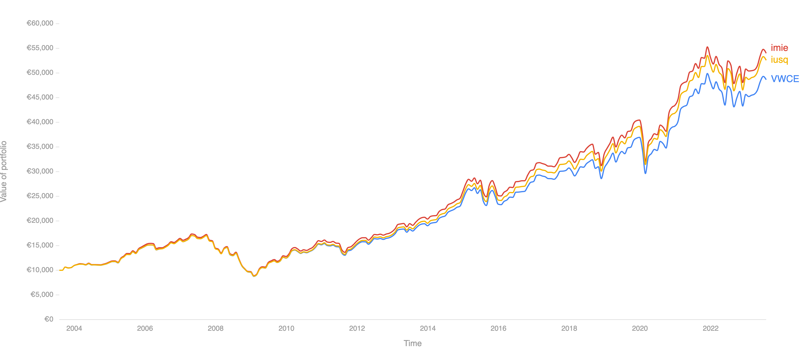
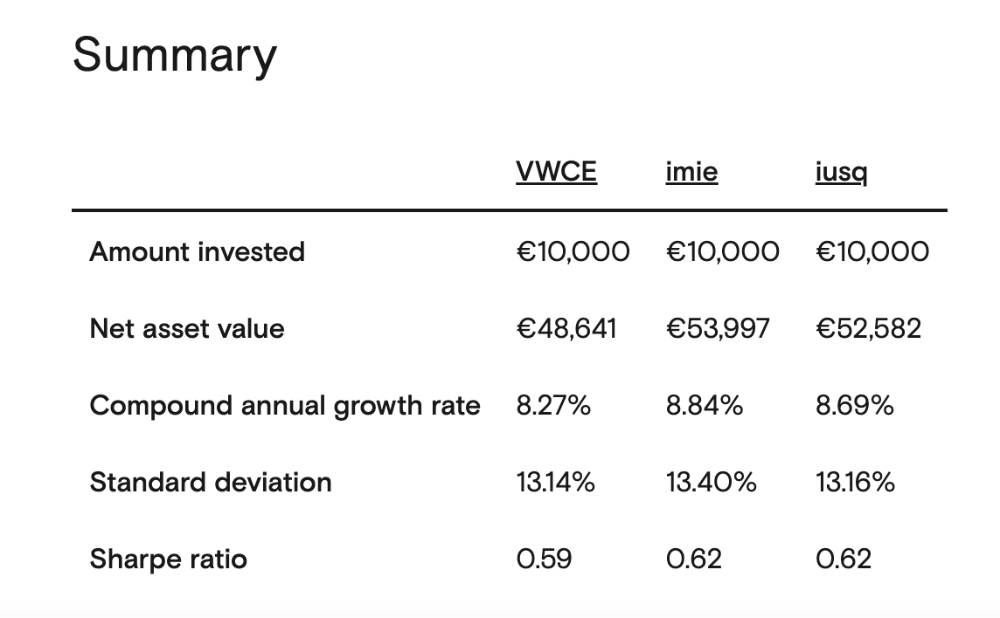

# ETF

## Cos'è un ETF

Gli Exchange Traded Funds sono dei fondi di investimento che investono passivamente in un indice e ne replicano fedelmente la sua composizione.
Appartengono dunque alla famiglia degli Index Funds ma presentano un’importante caratteristica:
il fondo creato dalla raccolta delle liquidità degli investitori è suddiviso in quote che sono scambiate in borsa come delle normali azioni.
Quando dunque si versano dei soldi al gestore, questo si impegna ad investirli nelle aziende e nei titoli che fanno parte dell'indice di riferimento e crea queste azioni dell'ETF.
Gli ETF quindi sono prodotti facilmente acquistabili e gestibili pur mantenendo le caratteristiche positive degli Index Funds come i costi bassi e la trasparenza.

**Vantaggi**

- Costi di gestione bassi. Quasi tutti gli ETF hanno costi di gestione (chiamato anche TER, Total Expense Ratio) inferiore all’1% mentre la maggior parte è tipicamente sotto lo 0.5%.
  Sono prodotti estremamente economici.

- Ottima diversificazione qualora l’indice a cui l’ETF fa riferimento a sua volta lo sia. Esistono anche molti ETF che coprono specifici settori o aree geografiche.
  Sono dunque strumenti adatti a tantissimi tipi di investitori, dai più principianti fino ai più esperti.

- Assolutamente trasparenti. Il contenuto di ogni ETF segue spesso un indice di mercato o, se non lo fa, pubblica sempre le posizioni nella sua scheda informativa.

**Svantaggi**

- Come per gli Index Funds tradizionali, è bene assicurarsi che l’ETF sia nato da sufficiente tempo per potersi assicurare
  che le performance siano state fedelmente in linea con quelle del benchmark di riferimento.

## I principali indici azionari globali

Gli indici azionari globali sono strumenti principali per monitorare la performance del mercato azionario mondiale. 
Tra i principali indici globali, spiccano il **MSCI ACWI IMI**, il **MSCI ACWI** e il **FTSE All-World**.

### MSCI ACWI IMI

Il MSCI ACWI IMI (All Country World Index Investable Market Index) è uno degli indici di riferimento più ampi per il mercato azionario mondiale, 
coprendo circa il 99% della capitalizzazione azionaria globale. 
Include tutte le azioni quotate pubblicamente nei mercati sviluppati ed emergenti, 
compresi i mercati di paesi di piccole e medie dimensioni, per un totale di circa 9.000 titoli azionari. 
L'indice è ponderato in base alla capitalizzazione di mercato, assegnando una maggiore ponderazione alle società con una capitalizzazione di mercato più elevata.

Il MSCI ACWI IMI offre una visione completa del mercato azionario mondiale, incorporando titoli azionari di paesi sviluppati ed emergenti. 
Risulta particolarmente utile per gli investitori desiderosi di ottenere una panoramica completa del mercato azionario globale
e di individuare opportunità di investimento nei mercati emergenti o nelle società mid-cap.

### MSCI ACWI

Il MSCI ACWI (All Country World Index) è simile al MSCI ACWI IMI, ma ha una copertura geografica leggermente più limitata, 
includendo solo le azioni dei mercati sviluppati ed emergenti più grandi, per un totale di circa 2.800 titoli azionari. 
L'indice copre circa l'85% della capitalizzazione azionaria globale ed è ponderato in base alla capitalizzazione di mercato.

Il MSCI ACWI offre una visione generale del mercato azionario mondiale, seppur con una copertura geografica leggermente inferiore rispetto al MSCI ACWI IMI. 
Nonostante ciò, questo indice rimane ampio e fornisce un'ottima indicazione della performance del mercato azionario globale.

## FTSE All-World

Il FTSE All-World è simile al MSCI ACWI, ma presenta una copertura geografica leggermente diversa. 
In particolare, il FTSE All-World include le azioni delle società del Regno Unito, escluse dal MSCI ACWI, ma non copre le azioni dei mercati di frontiera. 
L'indice comprende circa il 90% della capitalizzazione azionaria globale.

Il FTSE All-World rappresenta una buona scelta per gli investitori che cercano un'indicazione generale della performance del mercato azionario globale, 
senza esporsi ai mercati di frontiera.

### Quali ETF replicano questi indici?
I migliori ETF che replicano questi tre indici (scelti principalmente per volumi, TER e tracking error) 
sono **IMIE** (MSCI ACWI IMI), **IUSQ** (MSCI ACWI) e **VWCE** (FTSE All-World).

### Come scegliere un ETF

L'[accademia di JustETF](https://www.justetf.com/it/academy/scegliere-letf-giusto-suggerimenti-e-consigli-utili.html) è un ottimo punto da cui partire.

### Lista degli ETF più famosi e acquistati

[**QUI**](https://docs.google.com/spreadsheets/d/12sCTzI8y7BFbNyvX6a3echmRdsPEnx5wad6ib-2za-E/edit#gid=0) trovi una guida ai principali ETF sul mercato.

### Esempi di portafogli di ETF semplici e diversificati

[**QUI**](https://docs.google.com/spreadsheets/d/13UMz6MaBgKHAha3ZI01CVguHEQj7GaD908eohd-qS9I/edit#gid=0) trovi alcuni esempi tipo di portafogli di ETF con vari orizzonti temporali e diversi livelli rischio.

### Simulatore performance degli ETF

[**QUI**](https://backtest.curvo.eu/) trovi un ottimo simulatore che ti permetterà di creare tutti i portafogli che vorrai e di testarne le performance negli anni passati. **N.B.** Le performance passate non sono garanzia di quelle future.
