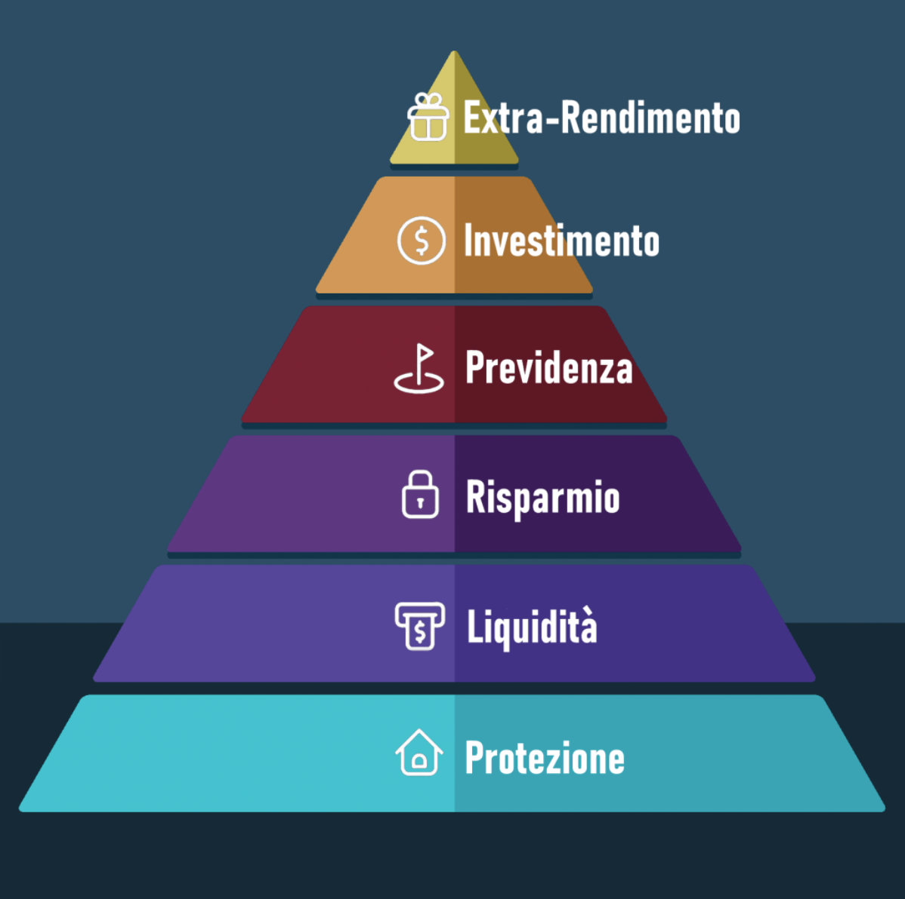

# La piramide dei bisogni finanziari

## Base: Sicurezza

La base della piramide dei bisogni finanziari si concentra sulla protezione di sé e del proprio patrimonio. I rischi da cui difendersi possono variare in intensità.

Esaminiamo come preservarsi da eventi potenzialmente catastrofici come:

- danni agli immobili di proprietà;
- danni a terzi;
- danni alle persone del nucleo familiare;
- morte.

In tutte queste circostanze, la vita del nucleo familiare potrebbe subire un cambiamento significativo, 
ma se ci prepariamo in anticipo, il danno sarà principalmente emotivo, non finanziario. 
Ciò ci permetterà di affrontare la situazione drammatica concentrandoci sulle azioni necessarie senza la paura di gravi perdite finanziarie.

Per gestire questi rischi, sono necessarie precauzioni specifiche:

- stipulare polizze vita per proteggere le persone che contribuiscono al reddito familiare;
- stipulare polizze assicurative sulla casa (se di proprietà);
- stipulare polizze assicurative di responsabilità civile per proteggersi da danni causati ad altri.

In alcune rappresentazioni della piramide, la protezione è posta alla base, ma secondo il mio punto di vista, senza un flusso di cassa costante, 
è difficile assicurarsi contro questi rischi.

Qui un articolo dove parliamo delle polizze:
    <a href='/blog/assicurazioni'>
          <button className='brutal-btn p-4 sanchez' name='button'>
              Assicurazioni
              </button>
          </a>

## Il secondo livello: Liquidità

Una volta che la sicurezza nostra e dei nostri cari è garantita, dobbiamo gestire la nostra liquidità, poiché senza flussi di cassa costanti, 
la piramide dei bisogni finanziari crolla. 
Il nostro obiettivo primario deve quindi essere quello di generare entrate regolari e il più consistenti possibile, che derivino da un impiego lavorativo, sia esso autonomo o dipendente.

Qualsiasi altra entrata aggiuntiva legale che aumenti i redditi mensili è positiva. Avere hobby redditizi è un valore aggiunto considerevole.

## Il terzo livello: Risparmio

Dopo aver stabilito i flussi di cassa e gestito con prudenza possibili imprevisti, è il momento di proteggersi da eventi di entità media. 
Per farlo, è necessario creare una riserva che funga da "cuscinetto" e permetta di affrontare imprevisti senza trovarsi impreparati. 
Questi eventi possono includere, ad esempio, la rottura di un'auto o di un elettrodomestico, 
una bolletta più salata del previsto o altri eventi inattesi e non pianificati che hanno un impatto economico significativo.

L'importo del "cuscinetto" dipende dallo stipendio, dal tenore di vita e dalla tolleranza al rischio. 
Indicativamente, il consiglio è di mantenere almeno 6 mensilità disponibili, ma ci sono persone che si sentono sicure con 3 e altre con 12.

Considerate che questa riserva deve essere immediatamente accessibile, ne parliamo qui:

    <a href='/blog/investimenti-liquidi'>
          <button className='brutal-btn p-4 sanchez' name='button'>
              Il fondo di emergenza
              </button>
          </a>

## Quarto livello: Previdenza
Con i primi tre livelli abbiamo garantito un flusso di cassa continuo e una protezione per beni e persone. 
Arrivati a questo punto della piramide dei bisogni finanziari, è giunto il momento di pensare al futuro. 
Inizialmente, dobbiamo concentrarci sulla previdenza, cioè sul periodo in cui saremo in pensione.

Potete consultare questa pagina del Sole24Ore, che offre un [Calcolatore della pensione pubblica](https://lab24.ilsole24ore.com/calcola-pensione/). 
Tenete presente che se siete lavoratori autonomi, la situazione può essere ancora più critica.

È quindi essenziale cercare di ridurre al massimo la differenza tra il reddito in età lavorativa e quello in età pensionabile, e l'unico modo è ricorrere alla previdenza complementare. 
Fondamentalmente, ci sono due modi per ridurre questo divario:

- Pensione integrativa tramite TFR

- Sottoscrizione di prodotti finalizzati alla previdenza complementare.

Per quanto riguarda il primo punto, sempre sul sito del Sole24Ore, sulla stessa pagina, 
è disponibile un secondo tab dove è possibile calcolare la pensione complementare tramite versamento del proprio TFR all'interno di un fondo pensione. 
Personalmente, con le condizioni attuali, avrei una riduzione del divario precedente del 17% circa, 
ma avrei comunque una differenza di reddito tra età lavorativa e pensionabile del 13%, che non è trascurabile.

Ecco perché è utile sottoscrivere prodotti finalizzati alla previdenza. 
Quando parlo di questi prodotti, mi riferisco principalmente a portafogli che includono gli ETF (Exchange-Traded Funds), 
attualmente i prodotti più efficienti sul mercato (costi di gestione minimi e replica dell'indice di riferimento). 
Gli ETF, uniti a un orizzonte temporale medio-lungo (in base alla differenza tra la vostra età pensionabile e attuale), 
permettono di sfruttare al massimo i rendimenti del mercato azionario e dell'interesse composto, consentendo di ridurre al minimo il divario tra i due redditi precedentemente menzionati.

Qui un approfondimento sui fondi pensione:
    <a href='/blog/fondi-pensione'>
          <button className='brutal-btn p-4 sanchez' name='button'>
              Fondi Pensione
              </button>
          </a>

## Quinto livello: Investimento

In questa sezione della piramide finanziaria, includiamo investimenti con un lungo orizzonte temporale, solitamente più lungo di 5 anni. 
Si tratta di strumenti finanziari che favoriranno l'accrescimento del tuo patrimonio senza compromettere il tuo attuale benessere finanziario. 
Ma non solo, consentiranno anche la pianificazione di vari obiettivi e progetti di vita, come l'acquisto di una nuova casa, 
l'istruzione universitaria dei figli o la serenità di una pensione tranquilla.

Avendo messo in sicurezza, per quanto possibile, il nostro presente e il futuro più lontano (previdenza), possiamo ora concentrarci sui nostri obiettivi a medio-lungo termine, 
che riguardano non solo noi stessi ma anche il nostro nucleo familiare. 
In questo caso, è cruciale partire dalla definizione di una lista di obiettivi, che dovranno essere prioritizzati in base all’importanza che diamo a ciascun obiettivo.

Qui trovate l'inizio della nostra guida al primo investimento:
    <a href='/blog/guida-primo-investimento'>
          <button className='brutal-btn p-4 sanchez' name='button'>
              Guida al primo investimento
              </button>
          </a>

## La cima: Extra-rendimento
Il vertice più elevato della piramide dei bisogni finanziari è caratterizzato dalla ricerca di un rendimento aggiuntivo. 
Non è essenziale raggiungere questa fase, e la quota di capitale destinata a tali attività dovrebbe rappresentare una percentuale marginale del vostro patrimonio.

Un esempio di rendimento aggiuntivo potrebbe consistere nell'investire in prodotti più rischiosi, esplorando nuove opportunità in modo divertente.

Attualmente, esistono diverse modalità per cercare di generare un rendimento aggiuntivo, 
come gli investimenti azionari su singole aziende (magari applicando la metodologia value investing di Warren Buffett), 
gli investimenti in criptovalute, il private equity (investimenti in aziende non quotate, oggi più accessibili rispetto a qualche anno fa) 
o il real estate crowdfunding (partecipazione all'acquisto di immobili a reddito).

Se siete interessati a questo tipo di investimenti, vi consiglio di leggere i nostri articoli sulle criptovalute e sui gli ETF a leva:
    

          <a href='/blog/crypto'>
              <button className='brutal-btn p-4 sanchez' name='button'>
                  Crypto
                  </button>
              </a>
    <a href='/blog/etf-a-leva'>
            <button className='brutal-btn p-4 sanchez' name='button'>
                  ETF a leva
                  </button>
              </a>
          
