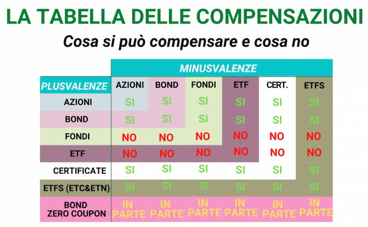

# **Recupero delle minusvalenze**

## Premessa

Questa guida non dà alcun consiglio di investimento ma si limita a spiegare dei metodi semplici per il recupero delle minusvalenze.

## Cos'è una minusvalenza?

Con il termine **minusvalenza** si intende la perdita di valore di un investimento 'chiuso'. 
In parole povere, se acquisto un titolo a 100€ e lo vendo a 90€, ho una minusvalenza di 10€. 
A prescindere da eventuali cedole, dividendi o altri guadagni, la minusvalenza è 
la **differenza tra il prezzo di acquisto** (più eventuali costi, come ad esempio le commissioni) **e il prezzo di vendita**.

## Durata

Le minusvalenze hanno una durata di **4 anni**. 
Questo significa che se oggi realizzo una minusvalenza di 10€, posso recuperarla in questo anno o nei successivi 4. 
Passato questo periodo, la minusvalenza decade.

## Quali strumenti mi permettono di recuperare minusvalenze?

Nella tabella sotto trovate uno schema di quali minusvalenze si possono recuperare e con quali strumenti. 
Gli ETF ad oggi non consentono il recupero delle minusvalenze.

## Quali sono i metodi più semplici?

Ci sono diversi modi per recuperare una minusvalenza, elenchiamo i principali:

### Vendere titoli in guadagno

Se possediamo titoli (non ETF) in guadagno (che tramite la tabella sopra, sono in grado di compensare le minusvalenze realizzate), 
possiamo vendere una parte di questi per recuperare le minusvalenze. Questo metodo è il più semplice, ma non sempre è possibile.

Vendendo titoli in guadagno, avremo la possibilità di non pagare le tasse per l'ammontare delle minusvalenze. 
A quel punto, è possibile eventualmente riacquistare i titoli venduti, se si vuole mantenere la posizione, questa volta però con un prezzo medio di carico maggiore.
Ossia, quando chiuderemo la posizione, avremo una plusvalenza tassata minore.

### Acquistare titoli ad hoc

#### Obbligazioni

    <a href='/blog/obbligazioni'>
          <button className='brutal-btn sanchez p-4' name='button'>
              Obbligazioni
              </button>
          </a>

Molte obbligazioni hanno il vantaggio di avere una scadenza ed un flusso cedolare predeterminato. Questo può essere usato facilmente per il recupero delle minusvalenze.

Dobbiamo differenziare tra due tipi di rendimento, quello nominale (il flusso cedolare) 
e quello effettivo (flussso dedolare diviso prezzo di acquisto + eventuale plusvalenza se portato a scadenza). 
Questo perché il rendimento effettivo tiene conto anche del prezzo di acquisto e del prezzo di vendita che, tipicamente, 
se comprata in emissione e portata a scadenza è identico.

Il rendimento che il mercato vuole da un'obbligazione, non influenza solo il prezzo di emissione di nuove obbligazioni, ma anche il prezzo di quelle già in circolazione. 
Se il rendimento di mercato sale, il prezzo delle obbligazioni già in circolazione scende, e viceversa.

Questo significa che se acquistiamo un'obbligazione in circolazione, con un rendimento nominale maggiore di quello di mercato, 
il prezzo di acquisto sarà inferiore al prezzo di rimborso. Questo ci permette di realizzare una plusvalenza, che compensa la minusvalenza.

##### Tassazione agevolata su titoli di stato in whitelist

Se acquistiamo titoli di stato di Paesi in whitelist, la tassazione è agevolata. 
Ossia, al posto del 26%, pagheremo il 12,5% di tasse sulle plusvalenze e sul flusso cedolare. 
Questo però non consente un recupero totale delle minusvalenze, ma solo parziale: 12,5%/26% = 48,1%.

#### Certificati

I certificati sono strumenti finanziari complessi che possono essere usati per il recupero delle minusvalenze. 
Il loro funzionamento cambia da certificato a certificato, quindi è necessario leggere il prospetto informativo di ognuno per capire come funziona.

Esistono certificati chiamati **Maxi coupon** che sono nati proprio con lo scopo di "allungare" la durata delle minusvalenze.
La base del ragionamento è avere un sottostante, che in base a delle regole proprie del certificato, 
determina un flusso cedolare che entra nel computo dei redditi diversi. 
Ovviamente al momento del pagamento della cedola (il maxi coupon), il certificato perde esattamente il valore erogato.
Il recupero della minusvalenza e l'ipotetica vendita in perdita del certificato, permette di postporre la scadenza delle minusvalenze.

## Conclusioni

Se vuoi avere una panoramica completa delle tassazioni degli investimenti, parti da qui:

    <a href='/blog/tassazione-investimenti'>
          <button className='brutal-btn sanchez p-4' name='button'>
              Tassazione investimenti
              </button>
          </a>
